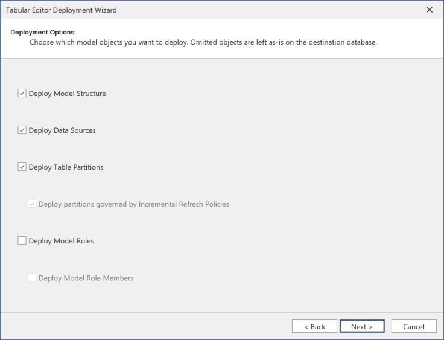

---
uid: deployment
title: Model deployment
author: Daniel Otykier
updated: 2021-09-08
applies_to:
  editions:
    - edition: Desktop
      none: x
    - edition: Business
    - edition: Enterprise
---
# Model deployment

Tabular Editor 3 (Business and Enterprise Edition) can take a copy of the currently loaded semantic model metadata, and deploy it to an Analysis Services instance, or the Power BI / Fabric XMLA endpoint.

To perform a deployment, launch the **Deployment Wizard** through the **Model > Deploy...** menu option.

> [!NOTE]
> Tabular Editor 3 Business Edition has certain [limitations](xref:editions) regarding what type of Analysis Services instance, or Power BI / Fabric workspace is supported for XMLA connectivity. This applies to deployment as well.

## Deployment options

After selecting the destination server and database to deploy, you are presented with a list of **Deployment options**, as shown in the screenshot below.

These are:

- **Deploy Model Structure**: This indicates that the model metadata will be deployed. Unchecking this prevents you from performing the deployment (the option exists for historic reasons).
- **Deploy Data Sources**: For models that use *explicit* data sources, this option indicates whether any such data sources will be included in the deployment. Unchecking this option may be useful, if one or more properties on a data source has been modified, and you do not intend to deploy these modifications. For example, if you are deploying model metadata from a Development environment to a Test environment, you may want to retain any connection strings, etc. on the destination environment as-is. Note that this option is typically not enabled for Power BI / Fabric semantic models, because such models use *implicit* data sources, where credentials are managed by the Power BI service, and connection details are stored in the M queries on partitions or shared expressions in the model.
- **Deploy Table Partitions**: This option indicates whether table partitions should be deployed. In some cases, the destination database may contain partitions that are not present in the model metadata. Unchecking this option will prevent the deployment from modifying any existing partitions on the destination server. If this option is checked, Tabular Editor will synchronize the partitions on the destination server with the model metadata. If any partitions are present on the destination server, but not in the model metadata, they will be removed (including the data contained in them).
  - **Deploy partitions governed by Incremental Refresh Policies**: When the **Deploy Table Partitions** option is enabled, you will have an option to avoid deploying partitions that are governed by Incremental Refresh Policies. This is useful when you have a model with partitions that created automatically by the [Incremental Refresh Policy](xref:incremental-refresh-about), and you want to deploy all partitions except those governed by the policy.
- **Deploy Model Roles**: This option indicates whether roles defined in the model should be deployed. Unchecking this option will retain existing roles on the model as-is. If you are deploying changes to tables or columns in the model, you may have to revisit [RLS or OLS settings](xref:data-security-about), to ensure that they are still valid.
  - **Deploy Model Role Members**: This option indicates whether role members should be deployed. It is common to manage role members directly on the server, rather than in the model metadata. Unchecking this option will prevent the deployment from modifying any existing role members on the destination server.

## Deployment script

During deployment, Tabular Editor generates a [CreateOrReplace TMSL script](https://learn.microsoft.com/en-us/analysis-services/tmsl/createorreplace-command-tmsl?view=asallproducts-allversions), which is then executed against the Analysis Services engine. The CreateOrReplace script contains all the metadata required to recreate the model, including tables, columns, measures, relationships, perspectives, translations, etc. If the model does not already exist on the target server, it will be created. If the model already exists, existing objects will be replaced with the new metadata specified in the script.

If any of the options on the **Deployment options** page were deselected, Tabular Editor will use the original metadata definition of those objects in the generated TMSL script, thus retaining their definitions as-is on the server.

The last page of the deployment wizard lets you export the generated script, so you can review the changes before executing them.

## Deployment impact

> [!WARNING]
> This type of deployment is a **metadata-only deployment**. Depending on the types of changes made to the model, imported data could be lost during deployment. In this case, you may need to execute a refresh operation once the deployment is complete.

As a rule of thumb, the following changes can be made to the model without requiring a subsequent data refresh:

- Adding/editing/removing measures and KPIs, including their DAX expressions.
- Editing properties such as FormatString, Description, DisplayFolder, etc.
- Adding/editing/removing metadata translations, perspectives, OLS and RLS roles.

The following changes may require a **Calculate refresh**, before the objects can be queried:

- Adding/editing calculated column, calculated tables and calculation groups
- Adding/editing relationships
- Adding/editing hierarchies
- Removing columns/tables

The following changes may require a **Full refresh**:

- Adding/editing partitions, tables and columns

> [!WARNING]
> Because of the potential impact of deploying a semantic model this way, we recommend not using this option to perform a deployment against a production environment. It is better to set up a [CI/CD pipeline for deploying models to production environments](https://blog.tabulareditor.com/category/ci-cd/).
