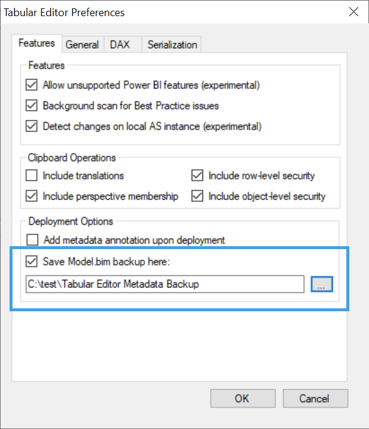

# Metadata Backup
If you wish, Tabular Editor can automatically save a backup copy of the existing model metadata, prior to each save (when connected to an existing database) or deployment. This is useful if you're not using a version control system, but still need to rollback to a previous version of your model.

To enable this setting, go to **Tools > Preferences** (**File > Preferences** in Tabular Editor 2), enable the checkbox and choose a folder to place the metadata backups:

If the setting is enabled, a compressed (zipped) version of the existing model metadata will be saved to this location whenever you use the Deployment Wizard, or when you click the "Save" button while connected to a (workspace) database.