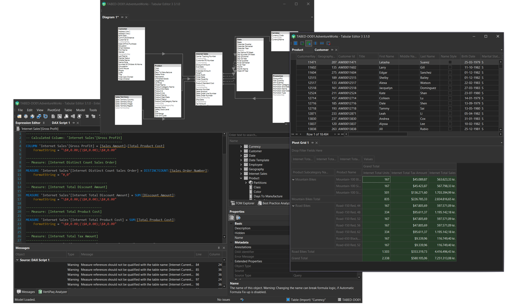

---
uid: index
title: Tabular Editor
author: Daniel Otykier
updated: 2026-06-10
---
# Tabular Editor

Tabular Editor is a tool that lets you easily manipulate and manage measures, calculated columns, display folders, perspectives and translations in Analysis Services Tabular and Power BI Semantic Models.

The tool is available in two different versions:

- Tabular Editor 2.x (free, [MIT license](https://github.com/TabularEditor/TabularEditor/blob/master/LICENSE)) - [GitHub project page](https://github.com/TabularEditor/TabularEditor)
- Tabular Editor 3.x (commercial) - [Home page](https://tabulareditor.com)

## Documentation
This site contains the documentation for both versions. Select your version in the navigation bar at the top of the screen for product specific documentation.

## Choosing between TE3 and TE2

Tabular Editor 3 is the evolution of Tabular Editor 2. It has been designed for those who seek a "one-tool-to-rule-them-all" solution for Tabular data modeling and development.

### [Tabular Editor 3](#tab/TE3) 
Tabular Editor 3 is a more advanced application which offers a premium experience with many convenient features to combine all your data modeling and development needs in one single tool.

**Tabular Editor 3 main features:**

- A highly-customizable and intuitive UI
- High-DPI, multi-monitor and theming support (yes, dark mode is available!)
- World class [DAX editor](xref:dax-editor) with syntax highlighting, semantic checking, auto-complete, context awareness and much, much more
- Table browser, Pivot Grid browser and DAX Query editor
- [Import Table Wizard](xref:importing-tables) with support for Power Query data sources
- [Data Refresh view](xref:data-refresh-view) with [Advanced Refresh dialog](xref:advanced-refresh) for queuing and executing refresh operations in the background
- Diagram editor to easily visualize and edit table relationships
- [DAX Scripting](xref:dax-scripts) capability to edit DAX expressions for multiple objects in a single document
- [DAX User-Defined Functions (UDFs)](xref:udfs) with assistance, code actions and namespaces
- [Calendar Editor](xref:calendars) for creating and managing date tables with enhanced time intelligence
- [DAX Package Manager](xref:dax-package-manager) for installing and managing DAX packages
- [Built-in Best Practice Analyzer rules](xref:built-in-bpa-rules)
- VertiPaq Analyzer integration with [DAX Optimizer](xref:dax-optimizer-integration)
- [DAX debugger](xref:dax-debugger)
- [Code Actions](xref:code-actions) for quick fixes and refactoring
- [Metadata Translation Editor](xref:metadata-translation-editor) and [Perspective Editor](xref:perspective-editor)
- [Save with supporting files](xref:save-with-supporting-files) for Fabric Git integration
- [Localization support](xref:references-application-language) (Chinese, Spanish, Japanese, German, French)

### [Tabular Editor 2.x](#tab/TE2) 

Tabular Editor 2.x is a lightweight application for quickly modifying the TOM (Tabular Object Model) of an Analysis Services or Power BI data model. The tool was originally released in 2016 and receives regular updates and bugfixes.

**Tabular Editor 2.x main features:**

- A very lightweight application with a simple and intuitive interface for navigating the TOM
- DAX Dependency View, and keyboard shortcuts for navigating between DAX objects
- Support for editing model perspectives and metadata translations
- Batch renaming
- Search box for quickly navigating large and complex models
- Deployment Wizard
- Best Practice Analyzer
- Advanced Scripting using C#-style scripts for automating repeated tasks
- Command line interface (can be used to integrate Tabular Editor and DevOps pipelines)
***

### Feature overview

The table below lists all the main features of both tools.

[!include[feature-comparison](includes/feature-comparison.partial.md)]

### Common features

Both tools provide the same features in terms of which data modeling options are available, by basically exposing every object and property of the [Tabular Object Model](https://docs.microsoft.com/en-us/analysis-services/tom/introduction-to-the-tabular-object-model-tom-in-analysis-services-amo?view=asallproducts-allversions), in an intuitive and responsive user interface. You can edit advanced object properties that are not available through the standard tools. The tools can load model metadata from files or from any instance of Analysis Services. Changes are only synchronized when you hit Ctrl+S (save) thus providing an "offline" editing experience which most people consider to be superior to the "always synchronized"-mode of the standard tools. This is especially noticeable when working on large and complex data models.

In addition, both tools enables making multiple model metadata changes in batches, renaming objects in batches, copy/pasting objects, dragging/dropping objects across tables and display folders, etc. The tools even have undo/redo support.

Both tools feature the Best Practice Analyzer, which continuously scans the model metadata for rules that you can define on your own, e.g. to enforce certain naming conventions, make sure non-dimension attribute columns are always hidden, etc.

You can also write and execute C#-style scripts in both tools, for automating repetitive tasks such as generating time-intelligence measures and auto-detecting relationships based on column names.

Lastly, thanks to the "Save-to-folder" functionality, a new file format where every object in the model is saved as an individual file, enables parallel development and version control integration, which is something that is not easy to achieve using only the standard tools. 

## Conclusion

If you are new to tabular modeling in general, we recommend that you use the standard tools until you familiarize yourself with concepts such as calculated tables, measures, relationships, DAX, etc. At that point, try to give Tabular Editor 2.x a spin, and see how much faster it enables you to achieve certain tasks. If you like it and want more, consider Tabular Editor 3.x!

## Next steps

- [Get Started with Tabular Editor 2](xref:getting-started-te2)
- [Get Started with Tabular Editor 3](xref:getting-started)
- [Tabular Editor 3 roadmap](xref:roadmap)

