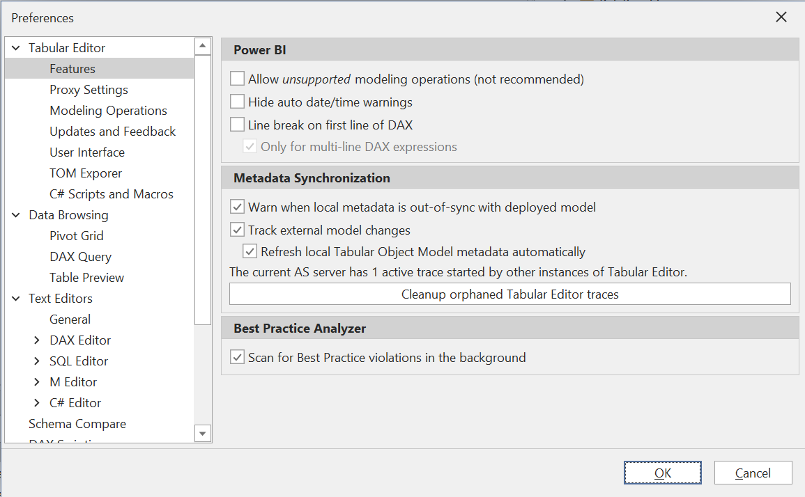
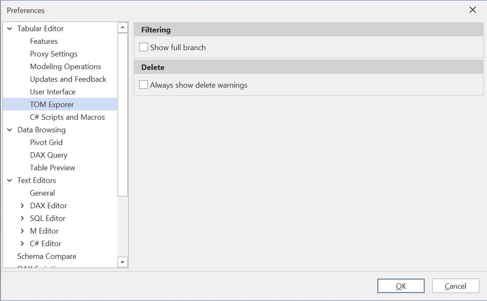
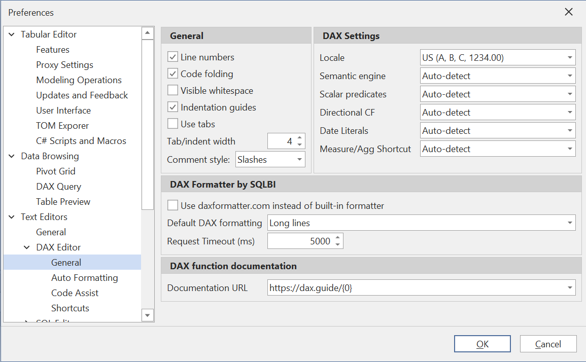
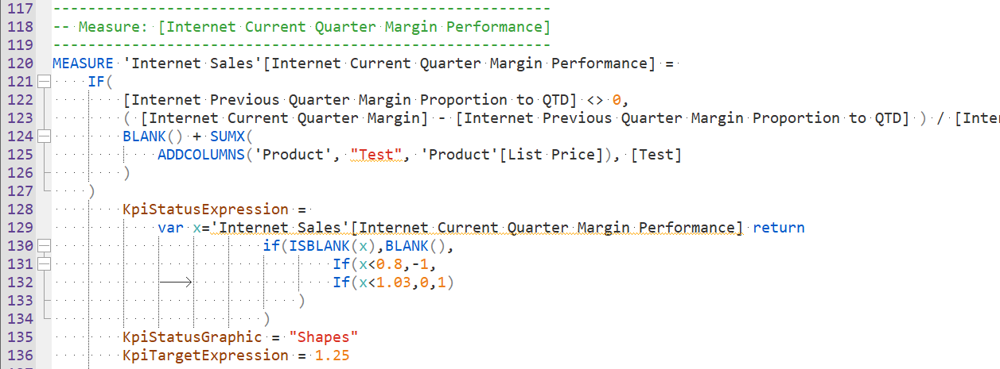
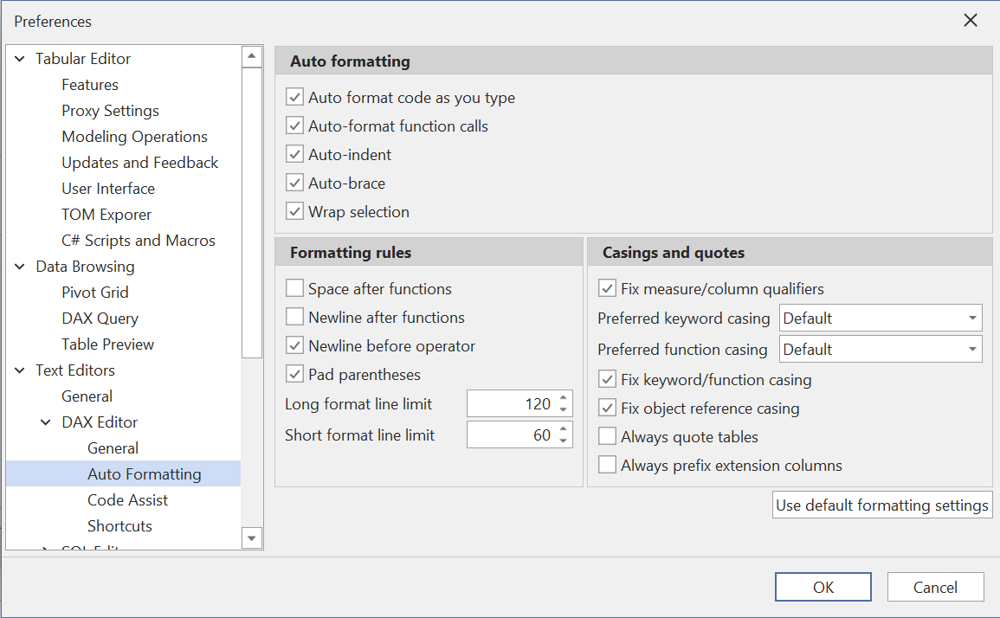

# Personalizing and configuring Tabular Editor 3 to suit your needs

Tabular Editor 3 provides a wide range of configuration options, that allow you to tweak the tool to your specific needs and preferred workflow. In this article, we will guide you through the settings that are most commonly adjusted by individual model developers.

Most of the settings covered in this article are accessed through the **Tools > Preferences** menu option. Throughout the article, we will list individual settings in the following style, for easy reference:

***Name of setting* (default value)**<br/>Description of setting.

# General features

The first page you will encounter within the **Preferences** dialog is the **Tabular Editor > Features** page (see screenshot below). Below is a short description of the features on this page, and what they are commonly used for:



## Power BI

These settings are mostly useful for developers who use Tabular Editor 3 as an [External Tool for Power BI Desktop](https://docs.microsoft.com/en-us/power-bi/transform-model/desktop-external-tools).

##### *Allow unsupported modeling operations* (disabled)

External Tools for Power BI Desktop have some [limitations](xref:desktop-limitations). By default, Tabular Editor 3 will prevent the user from making unsupported changes to the data model. There may be some advanced modeling features which work well, even though they are not supported cf. the previous link. To unlock all Tabular Object Model objects and properties, enable this setting.

##### *Hide auto date/time warnings* (disabled)

When the "Auto date/time" setting in Power BI Desktop is enabled, a number of calculated tables are created automatically. Unfortunately, these tables contain DAX code which trigger a warning message by Tabular Editor 3's built-in DAX analyzer. To hide these warnings, enable this setting.

##### *Line break on first line of DAX* (disabled)

In Power BI Desktop it is common to insert a line break on the first line of a DAX expression, due to the way the formula bar displays the DAX code. If you often switch back and forth between Tabular Editor and Power BI Desktop, consider enabling this option to have Tabular Editor 3 insert the line break automatically, whenever a DAX expression is edited through the tool.

## Metadata Synchronization

These settings controls the behavior of Tabular Editor 3, when model metadata is loaded from a database on an instance of Analysis Services. The settings specify how Tabular Editor 3 should deal with metadata changes applied to the database from outside the application, such as when another user makes a change to the database, or when you make a change to the model through Power BI Desktop while Tabular Editor 3 is used as an external tool.

##### *Warn when local metadata is out-of-sync with deployed model* (enabled)

When this is checked, Tabular Editor displays a warning message when you attempt to save changes, while another user or process has made a change to the database since the model metadata was loaded into your instance of Tabular Editor.

##### *Track external model changes* (enabled)

This option is only relevant for local instances of Analysis Services (i.e. msmdsrv.exe processes running on the same machine as Tabular Editor). When checked, Tabular Editor starts a trace on Analysis Services and notifies you if external changes are made.

##### *Refresh local Tabular Object Model metadata automatically* (enabled)

When the tracing mechanism as described above is enabled, this option allows Tabular Editor to automatically refresh the model metadata when an external change is detected. This is useful if you often switch back and forth between Power BI Desktop and Tabular Editor 3, as this ensures that changes made in Power BI Desktop are automatically sync'ed to Tabular Editor.

##### *Cleanup orphaned Tabular Editor traces*

Normally, Tabular Editor 3 should automatically stop and remove any AS traces started due to the settings above. However, if the application was shut down prematurely, the traces may never be stopped. By clicking this button, all AS traces started by any instance of Tabular Editor, on the current instance of Analysis Services, will be removed.

> [!NOTE]
> The cleanup button is only available when Tabular Editor is connected to an instance of Analysis Services.

# TOM Explorer settings

The settings below control various aspects of the TOM Explorer. You can find these settings under **Tabular Editor > TOM Explorer**:



##### *Show full branch* (disabled)

When filtering the TOM Explorer, by default Tabular Editor 3 shows all items in the hierarchy that matches the filter string, including their parents. If you want to see all child items as well (even though these might not match the filter string), enable this option.

##### *Always show delete warnings* (disabled)

If you prefer Tabular Editor 3 to prompt you to confirm all object deletions, enable this setting. Otherwise, Tabular Editor 3 will only prompt you to confirm multi-object deletions, or deletions of objects that are referenced by other objects.

> [!NOTE]
> All delete operations in Tabular Editor 3 can be undone by hitting CTRL+Z.

# DAX editor general settings

Tabular Editor 3's DAX editor is highly configurable, and it is easy to get overwhelmed by the many settings available. This section highlights the most common and important settings. Locate the general settings under **Text Editors > DAX Editor > General**:



## General

The *Line numbers*, *Code folding*, *Visible whitespace* and *Indentation guides* settings can be used to toggle various visual feature of the editor. In the screenshot below, all four options have been enabled:



##### *Use tabs* (disabled)

When this is checked, a tab character (`\t`) is inserted whenever the TAB button is hit. Otherwise, a number of spaces corresponding to the *Indent width* setting is inserted.

##### *Comment style* (slashes)

DAX supports line comments that use slashes (`//`) or hyphens (`--`). This setting determines which style of comment is used when Tabular Editor 3 generates DAX code, such as when using the DAX script feature.

## DAX Settings

These settings determine certain behavior of the DAX code analyzer. The *Locale* setting is simply a matter of preference. All other settings are relevant only when Tabular Editor 3 cannot determine the version of Analysis Services used, as is the case for example when a Model.bim file is loaded directly. In this case, Tabular Editor tries to guess which version the model will be deployed to, based on the compatibility level specified in the model, but depending on the actual version of the deployment target, there may be various DAX language differences, which Tabular Editor cannot determine. If Tabular Editor reports incorrect semantic/syntax errors, you may need to tweak these settings.

# Auto Formatting

On the **Text Editors > DAX Editor > Auto Formatting** page, you can find a wide range of settings for controlling how your DAX code is formatted.



##### *Auto format code as you type* (enabled)

This option will automatically apply certain formatting rules whenever certain keystrokes occur. For example, when a parenthesis is closed, this feature will ensure that everything within the parentheses is formatted according to the other settings on this page.

##### *Auto-format function calls* (enabled)

This option specifically controls whether automatic formatting of function calls (that is, spacing between arguments and parentheses), should happen when a parenthesis is closed.

##### *Auto-indent* (enabled)

This option automatically indents function arguments when a line break is inserted within a function call.

##### *Auto-brace* (enabled)

This option automatically inserts the closing brace or quote whenever an opening brace or quote is entered.

##### *Wrap selection* (enabled)

When enabled, this option automatically wraps the current selection with the closing brace, when an opening brace is entered.

## Formatting rules

These settings control how DAX code whitespace is formatted, both when auto-formatting occurs, but also when code is manually formatted (using the **Format DAX** menu options).

##### *Space after functions* (disabled)

# [Enabled](#tab/tab1)

```DAX
SUM ( 'Sales'[Amount] )
```

# [Disabled](#tab/tab2)

```DAX
SUM( 'Sales'[Amount] )
```

***

##### *Newline after functions* (disabled)

Applies only when a function call needs to be broken across multiple lines.

# [Enabled](#tab/tab3)

```DAX
SUM
(
    'Sales'[Amount]
)
```

# [Disabled](#tab/tab4)

```DAX
SUM(
    'Sales'[Amount]
)
```

***

##### *Newline before operator* (enabled)

Applies only when a binary operation needs to be broken across multiple lines.

# [Enabled](#tab/tab5)

```DAX
[Internet Total Sales]
    + [Reseller Total Sales]
```

# [Disabled](#tab/tab6)

```DAX
[Internet Total Sales] +
    [Reseller Total Sales]
```

***

##### *Pad parentheses* (enabled)

# [Enabled](#tab/tab7)

```DAX
SUM( Sales[Amount] )
```

# [Disabled](#tab/tab8)

```DAX
SUM(Sales[Amount])
```

***

##### *Long format line limit* (120)

The maximal number of characters to keep on a single line before an expression is broken across multiple lines, when using the **Format DAX (long lines)** option.

##### *Short format line limit* (60)

The maximal number of characters to keep on a single line before an expression is broken across multiple lines, when using the **Format DAX (short lines)** option.

> [!NOTE]
> Most settings above are only in effect when using the (default) built-in DAX formatter.

## Casings and quotes

In addition to formatting the DAX code whitespace, Tabular Editor 3 can also fix object references and function/keyword casings.

##### *Fix measure/column qualifiers* (enabled)

When this is checked, table prefixes are automatically removed from measure references, and automatically inserted on column references.

##### *Preferred keyword casing* (default = UPPER)

This setting allows you to change the casing used for keywords, such as `ORDER BY`, `VAR`, `EVALUATE`, etc. This also applies when a keyword is inserted through the auto-complete feature.

##### *Preferred function casing* (default = UPPER)

This setting allows oyu to change the casing used for functions, such as `CALCULATE(...)`, `SUM(...)`, etc. This also applies when a function is inserted through the auto-complete feature.

##### *Fix keyword/function casing* (enabled)

When this is checked, casing of keywords and functions is automatically corrected whenever code is auto-formatted or manually formatted.

##### *Fix object reference casing* (enabled)

DAX is a case-insensitive language. When this is enabled, references to tables, columns and measures are automatically corrected such that the casing matches the physical name of the referenced objects. This fixup happens whenever code is auto-formatted or manually formatted.

##### *Always quote tables* (disabled)

Referencing certain table names do not require surrounding single quotes in DAX. However, if you prefer table references to always be quoted, regardless of the table name, you can check this option.

##### *Always prefix extension columns* (disabled)

Extension columns can be defined without a table name. When this is checked, the DAX editor will always add the table prefix to an extension column, even if the table name is blank. In that case, the column reference will look like `''[Extension Column]`.

# Next steps

- @boosting-productivity-te3