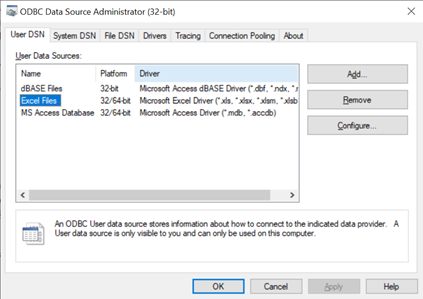
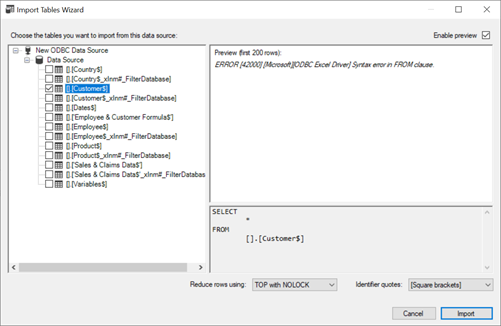
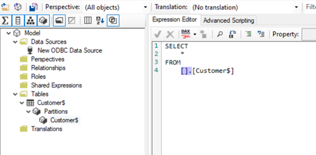
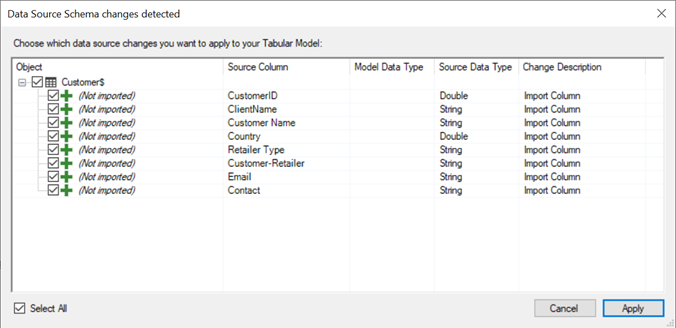

---
uid: importing-tables-from-excel
title: Importing Tables from Excel
author: Daniel Otykier
updated: 2021-11-10
---
# Importing Tables from Excel

If you need to add Excel worksheets as tables to your tabular model, this is possible with Tabular Editor 2.x and the Excel ODBC driver.

# Prerequisites

Tabular Editor 2.x is a 32 bit application, and most people usually have the 64 bit version of Office installed (which includes a 64-bit Excel ODBC driver). Unfortunately, Tabular Editor 2.x can't use the 64-bit driver, and simply downloading and attempting to install the 32-bit driver, will give you an error if you already have a 64-bit version of Office installed. However, it is possible to install the 32 bit Excel ODBC driver next to the 64-bit Office, by using this workaround:

1. Download the 32-bit version of the driver from here: https://www.microsoft.com/en-us/download/details.aspx?id=54920
2. Unzip the AccessDatabaseEngine.exe file
3. Inside, you will find the aceredist.msi file, which should be executed through the command line with the /passive switch:
  ```shell
  aceredist.msi /passive
  ```

4. Confirm the installation by looking in the ODBC Data Sources (32-bit) configuration (Windows start button, search for "ODBC", platform should say "32/64 bit", as in the screenshot below):
  

# Setting up an ODBC data source

After making sure you have the 32-bit ODBC Excel driver installed, as described above, adding a table from an Excel file with Tabular Editor 2.x requires the following steps:

1. In Tabular Editor, right-click on the model, choose "Import tables…", click "Next"
2. In the Connection Properties dialog, click "Change…". Select the "Microsoft ODBC Data Source" option and click "OK".
3. Select "Use connection string" and hit "Build…". Choose "Excel Files" and hit "OK".
  
4. Locate the Excel file you want to load tables from and hit "OK". That should generate a connection string that looks something like this:
  ```connectionstring
  Dsn=Excel Files;dbq=C:\Users\DanielOtykier\Documents\A Beer Dataset Calculation.xlsx;defaultdir=C:\Users\DanielOtykier\Documents;driverid=1046;maxbuffersize=2048;pagetimeout=5
  ```
5. After hitting "OK", Tabular Editor should display the list of worksheets and data areas in the Excel file. Unfortunately, the Import Table Wizard can’t preview the data currently, because it generates an invalid SQL statement:
  
6. You can, however, still put a checkmark on the table you want to import. Hit "Import" when done, ignore the error message.
7. On the newly added table, locate the partition and modify the SQL to remove the empty bracket and the dot in front of the worksheet name. Apply the change (Hit F5).
  
8. Then, right-click on the partition and choose "Refresh Table Metadata…". Tabular Editor now reads the column metadata from the Excel file through the ODBC driver:
  
9. (Optional) If you don’t want to use ODBC for refreshing data into the table, you need to swap out the partition to use an M-based expression that loads the same worksheet data. To do this, add a new Power Query partition to the table (right-click on "Partitions" then choose "New Partition (Power Query")). Delete the legacy partition. Then, set the M expression of the new partition to the following:
  ```M
  let
      Source = Excel.Workbook(File.Contents("<excel file path>"), null, true),
      Customer_Sheet = Source{[Item="<sheet name>",Kind="Sheet"]}[Data],
      #"Promoted Headers" = Table.PromoteHeaders(Customer_Sheet, [PromoteAllScalars=true])
  in
      #"Promoted Headers"
  ```
  Replace the `<excel file path>` and `<sheet name>` placeholders with their actual values.

# Conclusion

Importing tables from Excel files is possible with Tabular Editor 2.x, but it requires the use of the ODBC Excel driver as shown above, which adds some complexity to the process.