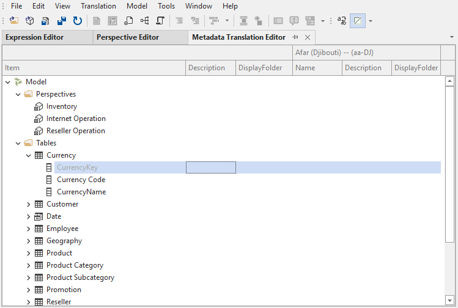
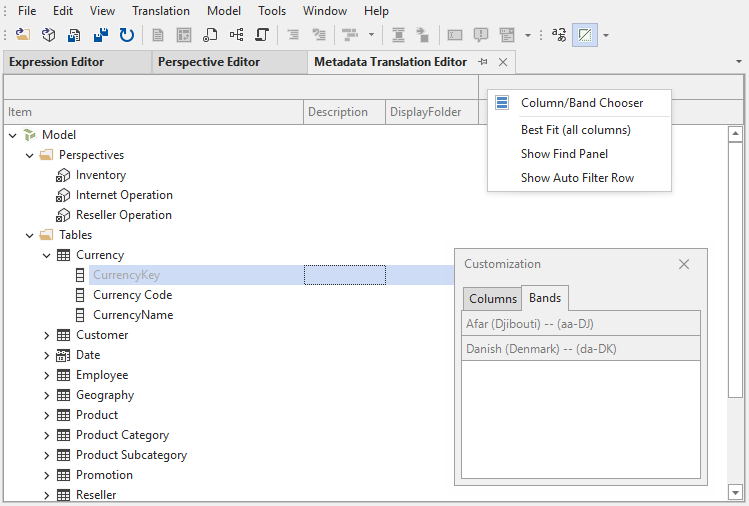

---
uid: metadata-translation-editor
title: Metadata Translation Editor
author: Šarūnas Jučius
updated: 2023-04-18
applies_to:
  editions:
    - edition: Desktop
    - edition: Business
    - edition: Enterprise
---
# Metadata Translation Editor

The **Metadata Translation Editor** provides an overview of the translated names, descriptions and display folders of translatable objects in the model. You can launch the Metadata Translation Editor through the **View** menu. Alternatively, if you only need to edit certain translations, select them in the **TOM Explorer** (hold down CTRL or SHIFT to multi-select), then right-click and choose **Show in metadata translation editor**.

Use the input fields in the metadata translation editor to quickly add/remove or edit translations of object names, descriptions and display folder names for the corresponding language. The first three columns in the editor allow you to change the default names, descriptions and display folder names of objects. You can use Undo (Ctrl+Z) and Redo (Ctrl+Y) the usual way.

## Metadata Translation Editor toolbar

While the Metadata Translation Editor is active, the accompanying toolbar provides the following options:

-  **New translation**: This button adds a new translation to the model. The translation will be displayed in the Metadata Translation Editor.
-  **Show/Hide hidden objects**: Enable this option if you want to see all objects in the Metadata Translation Editor, including hidden objects.
-  **Show/Hide names**: Disable this option if you don't want to see the name translation columns in Metadata Translation Editor.
-  **Show/Hide descriptions**: Disable this option if you don't want to see the description translation columns in Metadata Translation Editor
-  **Show/Hide display folders**: Disable this option if you don't want to see the display folder translation columns in Metadata Translation Editor

## Working with many translations

If you're working on a model with many translations, it may be impractical to display all of them at once. You can rearrange the display order of translations in the Metadata Translation Editor, by dragging the column headers around, making it easier to compare translations side-by-side. Moreover, you can add/remove translations from the editor at any time, through the right-click context menu:

