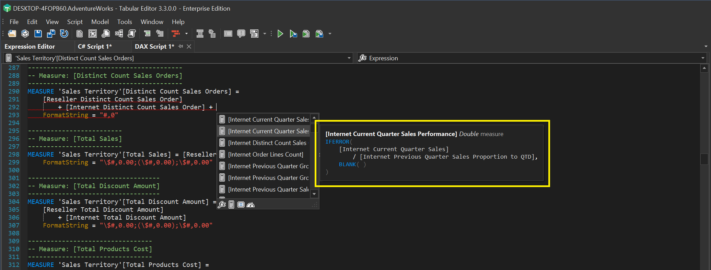
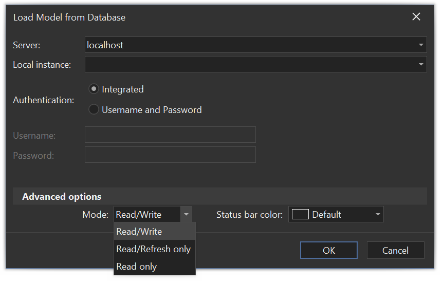

# Tabular Editor 3.3.0

- Download [Tabular Editor 3.3.0 (64 bit)](https://cdn.tabulareditor.com/files/TabularEditor.3.3.0.x64.msi) *(recommended)*
- Download [Tabular Editor 3.3.0](https://cdn.tabulareditor.com/files/TabularEditor.3.3.0.x86.msi)
- Portable versions: [x64](https://cdn.tabulareditor.com/files/TabularEditor.3.3.0.x64.zip), [x86](https://cdn.tabulareditor.com/files/TabularEditor.3.3.0.x86.zip)

*If you haven't used Tabular Editor 3 before, you are eligible to a 30 day trial, which can be requested after installation. You can also [purchase a license](https://tabulareditor.com/licensing).*

## Important!

Tabular Editor 3 is now using [.NET 6](https://docs.microsoft.com/en-us/dotnet/core/whats-new/dotnet-6) (we've been using .NET Framework 4.8.2 until now). With .NET 6, Microsoft has provided a unified and modern application development platform, which includes multiple performance improvements and security updates. As a Tabular Editor 3 user, you shouldn't notice any differences other than a slightly increased download size and possible performance improvements.

**NOTE**: You may have to install the [.NET 6.0 Runtime for Desktop](https://dotnet.microsoft.com/en-us/download/dotnet/6.0/runtime) before you can launch Tabular Editor 3.3.0. Make sure to grab the **Desktop** runtime that matches your version of Tabular Editor 3:

- [.NET Desktop Runtime x64](https://dotnet.microsoft.com/en-us/download/dotnet/thank-you/runtime-desktop-6.0.6-windows-x64-installer)
- [.NET Desktop Runtime x86](https://dotnet.microsoft.com/en-us/download/dotnet/thank-you/runtime-desktop-6.0.6-windows-x86-installer)

## Improvements in 3.3.0

- Updated TOM to [19.39.2.2](https://www.nuget.org/packages/Microsoft.AnalysisServices.NetCore.retail.amd64/)
- Tabular Editor 3 now uses [Roslyn](https://github.com/dotnet/roslyn) for C# script compilation. This means that your C# scripts can now use all the wonderful new language features of [C# 10.0](https://docs.microsoft.com/en-us/dotnet/csharp/whats-new/csharp-10). Moreover, you can define classes and other types directly within your scripts. Last but not least, we finally have Roslyn-powered **code completion** and **calltips** for C# scripts (see screenshot).
  
- On a similar note, make sure to check out our new [Scripting API](xref:api-index) docs site, where you'll find up-to-date documentation for all of the objects and members you can access through Tabular Editor 3's C# scripting feature.
- We also have a great improvement for the auto complete feature in our DAX editors, which will now show tooltips providing more information about the objects in the auto complete list. The tooltip will show the `Description` of measures, columns, etc. If no description is specified, we'll show the first 10 lines of DAX code on the object:
  
- When opening a model from Analysis Services or the Power BI XMLA endpoint, we now provide options to help you avoid making changes to the model by mistake, which is useful when you have multiple instances of Tabular Editor 3 open. The **Mode** dropdown (see screenshot below) lets you open a model in read-only or read/refresh-only mode. The **Status bar color** dropdown lets you set a color for Tabular Editor 3's status bar, so you can easily distinguish for example production, test, and dev models that are simultaneously open in different instances of Tabular Editor. See [#558](https://github.com/TabularEditor/TabularEditor3/issues/558).
  
- We have finally added the "Duplicate object" context menu option (Ctrl+D) in the TOM Explorer, see [#501](https://github.com/TabularEditor/TabularEditor3/issues/501).
- Added support for Snowflake OAuth and ExternalBrowser authentication, see [#546](https://github.com/TabularEditor/TabularEditor3/issues/546).
- Property grid now has a search bar.
- Added more proxy configuration options under **Tools** > **Preferences** > **Proxy Settings**.
- Updated SQL Native Client library to the latest version. Connections to SQL Server now require encryption by default (unless connecting to localhost).
- Added a **Refresh clear** option at the model, table and partition levels, see [#511](https://github.com/TabularEditor/TabularEditor3/issues/511).
- Added checkbox to open data models without workspace database, [#523](https://github.com/TabularEditor/TabularEditor3/issues/523).

## Bugfixes in 3.3.0

- Fixed an issue with how the semantic analyzer handles the `NAMEOF` DAX function, which could sometimes cause a crash, see [#538](https://github.com/TabularEditor/TabularEditor3/issues/538).
- Property grids and collection editors now use the DevExpress com are now skinned and scaled correctly on hi-dpi monitors, see [#548](https://github.com/TabularEditor/TabularEditor3/issues/548).
- Fixed a bug where the **Refresh model** submenu would sometimes disappear from the **Model** menu.
- "**Update table schema...**" will now correctly deal with columns where the name has only changed in casing.
- TE3 Business Edition now prevents adding multiple partitions/perspectives to AS models (which will prevent TE3 from loading the same model later due to edition restrictions).
- Fixed an issue where editor actions would sometimes be disabled, see [#519](https://github.com/TabularEditor/TabularEditor3/issues/519).
- Fixed an issue with the **Cancel** and **Cancel All** buttons not being enabled after starting a refresh operation.
- Fixed an issue where refresh progress would not show when refreshing a Power BI model through the XMLA endpoint.
- Fix typo, see [#553](https://github.com/TabularEditor/TabularEditor3/issues/553).
- Fix issue with calltips appearing despite unticking the "Show parameter info automatically" setting, see [#545](https://github.com/TabularEditor/TabularEditor3/issues/545).
- Fix comment/uncomment bug, see [#536](https://github.com/TabularEditor/TabularEditor3/issues/536).
- Fix issue with wrong return type on CUSTOMDATA(), see [#527](https://github.com/TabularEditor/TabularEditor3/issues/527).
- In the data preview, when filtering a string column for "(Blanks)", we now include both BLANK and "" strings, see [#524](https://github.com/TabularEditor/TabularEditor3/issues/524).
- Fix "Tabular Editor was not able to open the specified file" error when attempting to open a database.json file through the generic open file dialog, while "All files" is selected in the dropdown. See also [#563](https://github.com/TabularEditor/TabularEditor3/issues/563).
- Fix bug with Save feature not respecting serialization settings checkbox choice.
- Fix color of link in status bar. See [#521](https://github.com/TabularEditor/TabularEditor3/issues/521).
- Fix crash when attempting to clear orphaned traces in the preferences dialog.
- Fix false positive semantic error issue when comparing with variants, see [#516](https://github.com/TabularEditor/TabularEditor3/issues/516).
- Fix issue with DAX generation when debugging a variable assignment containing IF/SWITCH function calls, see [#513](https://github.com/TabularEditor/TabularEditor3/issues/513).
- Do not allow WEEK as interval parameter for DATEADD. See [#508](https://github.com/TabularEditor/TabularEditor3/issues/508).
- Show calc item error indicator on the calc group table, see [#506](https://github.com/TabularEditor/TabularEditor3/issues/506).
- Fix issue with c# script method `ImportProperties` not correctly resolving object paths.
- Added link to self-service portal when number of installations exceeded. Updated URLs/links to various places
- Better DAX code generation when debugging USERELATIONSHIP.
- Allow unchecking saving model metadata backup preference. Better error message when model metadata backup fails. Allow cancellation of model metadata backup.
- Fixed an issue with REMOVEFILTERS. See [#562](https://github.com/TabularEditor/TabularEditor3/issues/562).

---
## Coming from Tabular Editor 2.x?

Watch [this video](https://www.youtube.com/watch?v=pt3DdcjfImY) to get an idea of the new features in Tabular Editor 3. Also, make sure to check our [onboarding guide](https://docs.tabulareditor.com/onboarding/index.html).

**Tabular Editor 3 major features overview:**
- Fully customizable IDE, with multi-monitor, Hi-DPI support and themes
- New powerful DAX code editor with auto-complete, syntax checking, code folding and much, much more
- *Workspace mode, allowing you to save your changes to disk and synchronise model metadata to Analysis Services simultaneously
- *Preview table data with infinite scrolling, create PivotGrids or write DAX queries to browse the model or test calculation logic
- *Schedule data refreshes
- Update Table Schemas on both Provider and Structured Data Sources (yes, even for M queries!)
- Create data model diagrams
- Create DAX scripts that allow you to edit multiple measures or other calculated objects in a single document
- Record C# scripts and save as macros (formerly known as "Custom Actions")
- VertiPaq Analyzer integration
- *DAX debugger

*=Only while connected to an instance of Analysis Services or Power BI

---