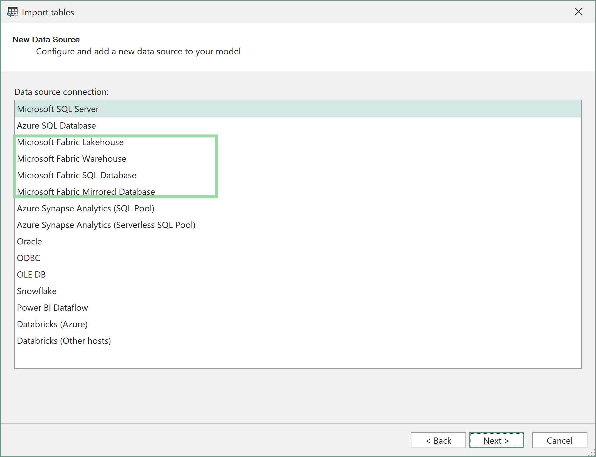
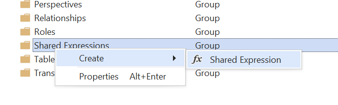
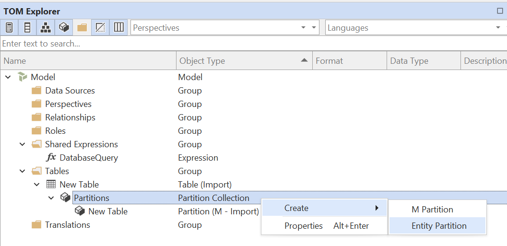
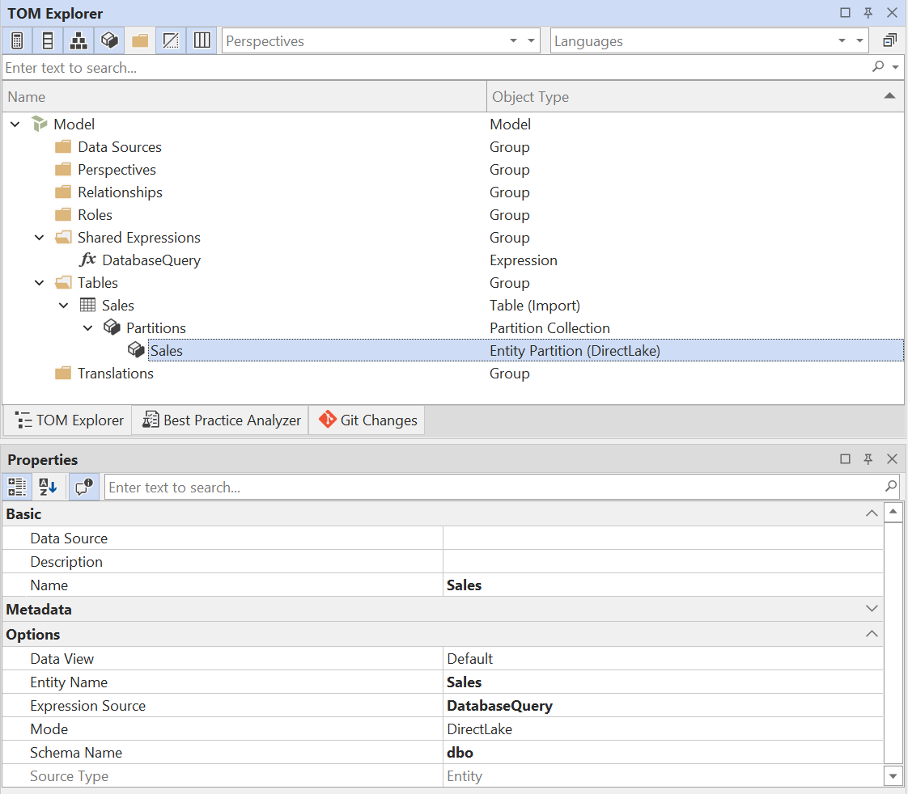
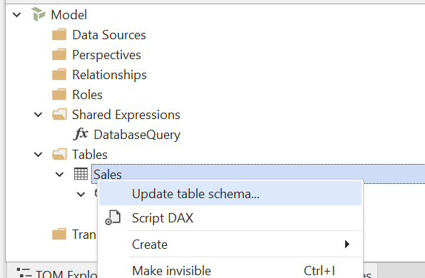

# Direct Lake Guidance

With the release of Tabular Editor 3.22.0, we have added support for Direct Lake on OneLake in addition to Direct Lake on SQL. This article provides a short overview of the differences between these two modes, and how they compare to other storage modes available in Power BI semantic models.

## Storage mode overview

The following table summarizes the storage modes available in Power BI semantic models:

| Storage Mode | Description | Recommended Use Cases |
|--------------|-------------|-----------------------|
| Import       | Data is imported into the semantic model and stored in the model's in-memory cache (VertiPaq). | When you need fast query performance and can afford to refresh the data periodically. |
| DirectQuery  | Data is queried directly from the source at query time, without being imported into the model. Supports various sources, such as SQL, KQL and even other semantic models. | When you need real-time data access or when the data volume is too large to fit in memory. |
| Dual         | A hybrid mode where the engine can choose between returning the imported data or delegating to DirectQuery, depending on the query context. | When your model contains a mix of DirectQuery and Import tables (for example when using aggregations), and you have tables that are related to both. |
| Direct Lake on OneLake | Utilizes the Delta Parquet story format to quickly swap the data into semantic model memory when needed. | When your data is already available as tables or materialized views in a Fabric Warehouse or Lakehouse. |
| Direct Lake on SQL | Older version of Direct Lake which utilizes the SQL Analytics Endpoint of Fabric Warehouses or Lakehouses. | Not recommended for new development (use Direct Lake on OneLake instead). |

> [!NOTE]
> It is also possible to create tables that contain a mix of partitions in **Import** and **DirectQuery** mode (also known as "hybrid tables"). This is commonly done on large fact tables that require incremental refresh while some data is queried directly from the source. See [this article](https://learn.microsoft.com/en-us/power-bi/connect-data/incremental-refresh-xmla) for more information.

## Direct Lake on OneLake vs. Direct Lake on SQL

[Direct Lake on OneLake](https://learn.microsoft.com/en-us/fabric/fundamentals/direct-lake-overview#key-concepts-and-terminology) was introduced in March 2025 as an alternative to Direct Lake on SQL. With Direct Lake on OneLake, there is no dependency on the SQL endpoint and no fallback to DirectQuery mode. This also means that the [usual restrictions that apply to DirectQuery models](https://learn.microsoft.com/en-us/power-bi/connect-data/desktop-directquery-about#modeling-limitations) do not apply to Direct Lake on OneLake models.

However, as with Direct Lake on SQL, there are still some [limitations that *do* apply](https://learn.microsoft.com/en-us/fabric/fundamentals/direct-lake-overview#considerations-and-limitations). The most important limitations are listed below. See the link for a full list of limitations:

- Calculated columns on Direct Lake tables cannot reference columns that are sourced from OneLake.
- Calculated tables on Direct Lake models cannot refer columns on Direct Lake tables that are sourced from OneLake.

One possible workaround for the above limitation, is to create a **composite model** by combining Direct Lake tables with Import tables. This is allowed with Direct Lake on OneLake, but not with Direct Lake on SQL. In this case, you would typically use Import mode for smaller dimension tables, where you may need to add custom groupings, which calculated columns are ideal for, while keeping the larger fact tables in Direct Lake mode.

Alternatively, ensure that your source contains the columns it needs. If you add columns through a view, please note that the view must be materialized in the Fabric Warehouse or Lakehouse, as Direct Lake on OneLake does not support non-materialized views.

## Collation

When using **Direct Lake on OneLake**, the collation of the model is the same as for an Import model, which is case-insensitive by default.

For a **Direct Lake on SQL** model, the collation is case-insensitive for queries that do not fallback to DirectQuery. If the query does fallback, the collation depends on the collation of the source. For a Fabric Warehouse, the collation might be case-sensitive, in which case you should specify a [case-sensitive collation on the model](https://data-goblins.com/power-bi/case-specific).

> [!NOTE]
> You cannot change the collation of a model once the metadata has been deployed to Analysis Services / Power BI. As such, if you plan to use Direct Lake on SQL with a case-sensitive Fabric Warehouse, you must set the collation on the model metadata before it's deployed:
>
> 1. Create a new model in Tabular Editor 3 (File > New > Model...)
> 2. Uncheck "Use workspace database"
> 3. Set the **Collation** property on the model to `Latin1_General_100_BIN2_UTF8`
> 4. Save the model (Ctrl+S).
> 5. Now, open the model from the file you just saved. When prompted to connect to a workspace database, choose "Yes".
>
> With this approach, the model metadata gets deployed with the correct collation from the start, and you can then add tables in Direct Lake on SQL mode without running into collation issues.

## Table Import Wizard

To add Direct Lake tables using Tabular Editor 3's Table Import Wizard, choose **Microsoft Fabric Lakehouse** or **Microsoft Fabric Warehouse** as the source:



After signing in, you will be presented with a list of all available Fabric Lakehouses/Warehouses in workspaces you have access to. Select the one you want to connect to and hit **OK**:


Unless you want to specify a custom SQL query, or configure the tables for DirectQuery mode, simply hit **Next** to select the tables from a list of tables/views in the source:


Select the tables/views you wish to import. Note that **non-materialized views** are not supported in Direct Lake on OneLake mode. Attempting to add such a view to the model will result in an error upon saving the model metadata.


On the last page, choose which mode you want the table partition to be configured with:


The choices are:

- Direct Lake on OneLake
- Direct Lake on SQL
- Import (M)

> [!NOTE]
> If you're working on a model that already contains tables, one or more of the choices mentioned above may not be available, if the model does not support combining tables in different storage modes. For example, if the model contains a table in Direct Lake on SQL mode, you cannot add tables in other modes.

## Power Query (M) expressions

This section contains a more technical description on how the TOM objects and properties need to be configured, in case you want to manually set up tables for Direct Lake mode without using the Table Import Wizard.

### Direct Lake on OneLake

To manually set up a table for **Direct Lake on OneLake** mode, you need to do the following:

1. **Create Shared Expression**: Direct Lake tables use "Entity" partitions, which much reference a Shared Expression in the model. Start out by creating this shared expression, if you don't have it already. Name it `DatabaseQuery`:



2. **Configure Shared Expression**: Set the **Kind** property of the expression you created in step 1 to "M", and set the *Expression** property to the following M query, replacing the IDs in the URL for your Fabric workspace and Lakehouse/Warehouse:

```m
let
    Source = AzureStorage.DataLake("https://onelake.dfs.fabric.microsoft.com/<workspace-id>/<resource-id>", [HierarchicalNavigation=true])
in
    Source
```

3. **Create Table and Entity Partition**: Create a new table in the model (Alt+5), then expand the table partitions in the TOM Explorer, and create new *Entity Partition*:
  
  

  Delete the regular import partition that was automatically created when you created the table.

4. **Configure Entity Partition**: Set the following properties on the Entity Partition:

| Property | Value |
| ----------|-------|
| Name | (Recommended) Set to the same name as the table |
| Entity Name | (Required) Set to the name of the table in the Lakehouse/Warehouse |
| Expression Source | (Required) Set to the Shared Expression you created in step 1, typically `DatabaseQuery` |
| Mode | (Required) `DirectLake` |
| Schema Name | (Optional) Set to the schema name in the Lakehouse/Warehouse, if applicable. If not set, the default schema will be used. |

  The final result should look like this:



5. **Update column metadata**: At this stage, you should be able to use Tabular Editor's **Update Table Schema** feature to update the column metadata for the table. This will automatically retrieve the column names and data types from the Lakehouse/Warehouse:



  Alternatively, manually add Data Columns to the table (Alt+4) and specify the `Name`, `Data Type`, `Source Column` and any other relevant properties for each column.
  

### Direct Lake on SQL


### Import from Lakehouse / Warehouse