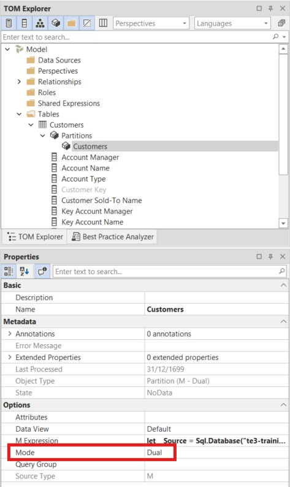
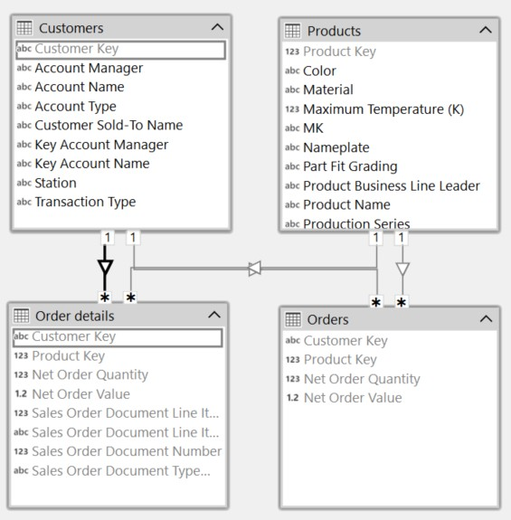

---
uid: user-defined-aggregations
title: User-defined Aggregations
author: Just Blindbæk
updated: 2026-02-19
applies_to:
  products:
    - product: Tabular Editor 2
      full: true
    - product: Tabular Editor 3
      editions:
        - edition: Desktop
          full: true
        - edition: Business
          full: true
        - edition: Enterprise
          full: true
---
# Implementing User-defined Aggregations

A fully imported fact table caches every row in memory — including high-cardinality columns like individual order lines, transaction IDs, and row-level attributes that most report consumers never need. User-defined aggregations address this by splitting the fact table in two: a small, pre-aggregated **Import** table that handles the vast majority of report queries from the in-memory cache, and a **DirectQuery** detail table that holds all the row-level data without consuming memory. Power BI and Analysis Services automatically route each query to whichever table can answer it.

The high-cardinality columns moved to DirectQuery come with a performance trade-off — queries that use them are sent directly to the source database rather than served from the in-memory engine. Hiding those columns from the default field list ensures that report consumers interact with the fast aggregation path by default, while advanced users who build reports that require row-level detail are aware they are working with DirectQuery columns.

In this tutorial, you configure a user-defined aggregation for the `Orders` fact table in the SpaceParts model. You create a detail table that holds the full row-level data in DirectQuery mode, then configure the existing `Orders` table as the aggregation table with the appropriate column mappings.

> [!NOTE]
> The steps in this tutorial apply to both Tabular Editor 2 and Tabular Editor 3. Screenshots show Tabular Editor 3.

## Prerequisites

Before you begin, you should have:

- Tabular Editor 2 or Tabular Editor 3
- A Power BI or Analysis Services semantic model with at least one Import fact table
- Basic familiarity with storage modes (Import, DirectQuery, Dual)

## How Aggregations Work

The aggregation pattern uses two versions of the same fact table:

| Table | Storage mode | Purpose |
|---|---|---|
| **Aggregation table** (`Orders`) | Import | Pre-aggregated data cached in memory. Answers summary queries. |
| **Detail table** (`Order details`) | DirectQuery | Full row-level data queried at source. Used when the aggregation cannot answer the query. |

Dimension tables are set to **Dual** storage mode so they can participate in both Import and DirectQuery query paths.

Setting tables to Dual or DirectQuery storage mode alone does not enable aggregation routing — it only creates a composite model where queries are directed based on storage mode. The **Alternate Of** property is what activates user-defined aggregations: it creates an explicit column-level mapping that tells the engine "when a query asks for this column from the detail table, you can use this pre-aggregated column instead." Without `Alternate Of`, the engine has no basis for substitution and will not route queries to the aggregation table. The engine evaluates every incoming query against these mappings to determine whether the aggregation table can answer it, and falls back to DirectQuery only when it cannot.

> [!IMPORTANT]
> DirectQuery comes with known limitations that affect model design and report functionality. The most relevant for this pattern are: queries against DirectQuery columns depend on source response time; cloud sources have a one-million-row return limit per query; the automatic date/time hierarchy is unavailable for DirectQuery tables; and some DAX functions are not supported in DirectQuery mode. Review the full list before proceeding: [Use DirectQuery in Power BI Desktop](https://learn.microsoft.com/en-us/power-bi/connect-data/desktop-use-directquery).

## Step 1: Set dimension tables to Dual storage mode

Each dimension table that relates to the fact table must be set to **Dual** storage mode. This allows the engine to use dimension attributes in both Import and DirectQuery query paths.

For each dimension table (`Customers`, `Products`):

1. In the **TOM Explorer**, expand the table and then expand **Partitions**.
2. Select the partition.
3. In the **Properties** panel, find the **Mode** field under **Options** and set it to **Dual**.



Repeat this for every dimension table that participates in a relationship with the fact table.

## Step 2: Create the detail table

The detail table is a copy of the original fact table, configured to query the source directly in DirectQuery mode. It is hidden from report consumers — its only purpose is to serve granular queries that the aggregation table cannot answer.

### Duplicate the fact table

Create a copy of the **Orders** table and name it **Order details**. In Tabular Editor, you can do this by selecting the **Orders** table and use the right-click context menu and select **Duplicate 1 table**.

### Set the partition to DirectQuery

1. In the **TOM Explorer**, expand **Order details** and then expand **Partitions**.
2. Select the partition.
3. In the **Properties** panel, set **Mode** to **DirectQuery**.


### Delete the measures

Any DAX measures copied from `Orders` — such as `Quantity` and `Value` — should be deleted from `Order details`. Measures belong on the aggregation table, not the detail table.

### Hide all columns and the table

Select all columns in `Order details` and set **Hidden** to **True** in the **Properties** panel. Then select the `Order details` table itself and also set **Hidden** to **True**.

> [!NOTE]
> Hiding the detail table and all its columns ensures that report consumers always interact with the aggregation table. The detail table is an implementation detail of the aggregation architecture.

## Step 3: Create relationships and set Rely On Referential Integrity

The detail table needs the same relationships to dimension tables as the aggregation table, so the engine can route DirectQuery queries correctly.

Create the following relationships from the `Order details` table:

- `Order details[Customer Key]` → `Customers[Customer Key]`
- `Order details[Product Key]` → `Products[Product Key]`

For each of these new relationships, set **Rely On Referential Integrity** to **True** in the **Properties** panel.


> [!NOTE]
> **Rely On Referential Integrity** tells the engine to use an INNER JOIN instead of an OUTER JOIN when generating DirectQuery SQL. This improves query performance and is safe to enable when every foreign key value in the detail table has a matching row in the dimension table.

## Step 4: Slim down the aggregation table

The aggregation table (`Orders`) should only contain what the engine needs for aggregation routing:

- **Relationship key columns**: `Customer Key`, `Product Key` — used to match dimension filters
- **Numeric base columns**: `Net Order Quantity`, `Net Order Value` — will be mapped to detail table columns in the next step
- **DAX measures**: `Quantity`, `Value`

Delete all other columns from `Orders` — dates, document numbers, status fields, and any other attribute columns. These exist only in `Order details`.

> [!NOTE]
> For aggregation routing to work correctly, any attribute column absent from the aggregation table must exist in the detail table. The engine falls back to DirectQuery when a query references a column that is not in the aggregation table — so the detail table must have a complete copy of the fact data.
>
> This pattern works best for **high-cardinality columns that are rarely used in reports** — individual transaction IDs, document numbers, row-level status fields, and similar attributes. If the fact table also contains low-cardinality columns that appear frequently in reports (such as a region code or a product category flag), consider moving those to a dimension table in Dual mode instead, so they are served from the in-memory cache rather than from DirectQuery.

> [!TIP]
> Also hide the `Orders` table itself by setting **Hidden** to **True** on the table. Like the detail table, the aggregation table is an implementation detail and should not appear in the report field list.

## Step 5: Update measures to reference the detail table

The measures on the aggregation table must reference the **detail table**, not the aggregation table itself. This is what enables the engine to fall back to DirectQuery correctly: when a query cannot be answered from the in-memory cache, the engine follows the measure reference to `Order details` and queries the source.

Update each measure on `Orders` to reference the corresponding column in `Order details`:

```dax
// Quantity
SUM( 'Order details'[Net Order Quantity] )
```

```dax
// Value
SUM( 'Order details'[Net Order Value] )
```

> [!NOTE]
> Measures do not have to reside on the aggregation table. They can be defined on `Order details` or on any other table in the model — for example, a dedicated, empty measures table. In this tutorial they are kept on `Orders` for simplicity.

## Step 6: Configure the Alternate Of property

For each numeric base column in the aggregation table, configure the **Alternate Of** property to tell the engine which column in the detail table it maps to.

1. In the **TOM Explorer**, expand the `Orders` table and select a base column — for example, **Net Order Quantity**.
2. In the **Properties** panel, expand the **Alternate Of** group.
3. Set **Base Column** to the corresponding column in the detail table: `Order details[Net Order Quantity]`.
4. Verify that **Summarization** is set to **Sum**.

![The Net Order Quantity column in Orders selected, with Alternate Of Base Column set to Order details[Net Order Quantity] and Summarization set to Sum](../assets/images/tutorials/user-defined-aggregations/alternate-of.jpg)

Repeat for **Net Order Value**, mapping it to `Order details[Net Order Value]` with **Summarization: Sum**.

## Verifying the Result

The diagram view in Tabular Editor shows the completed aggregation architecture. Both `Orders` and `Order details` connect to the same dimension tables through parallel sets of relationships.



In Power BI Desktop, the model view shows the same structure with storage mode icons and color coding: the dimension tables display the Dual storage mode indicator, `Order details` shows as DirectQuery and hidden, and `Orders` shows as Import and hidden.


## Further Reading

- [Microsoft Docs: User-defined aggregations in Power BI](https://learn.microsoft.com/en-us/power-bi/transform-model/aggregations-advanced)
- [Microsoft Docs: Storage modes in Power BI Desktop](https://learn.microsoft.com/en-us/power-bi/transform-model/desktop-storage-mode)
