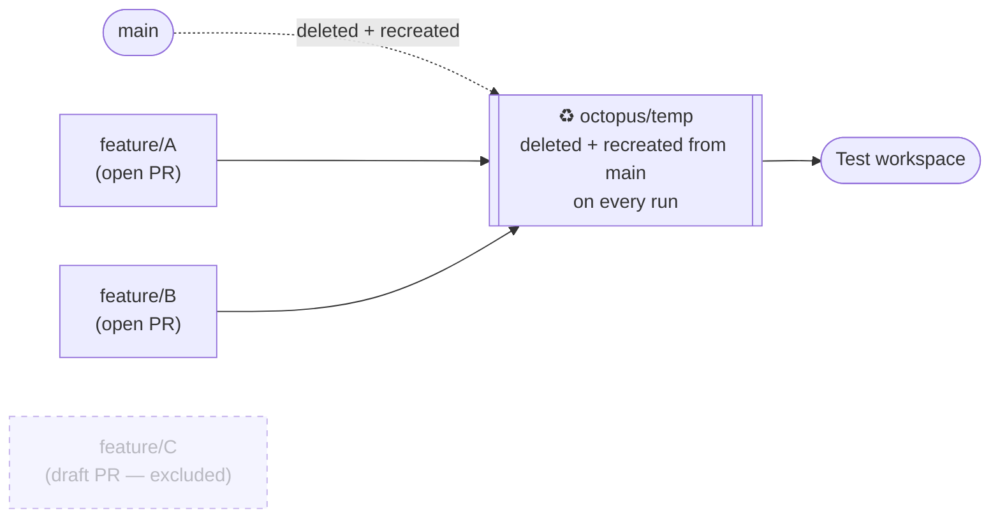
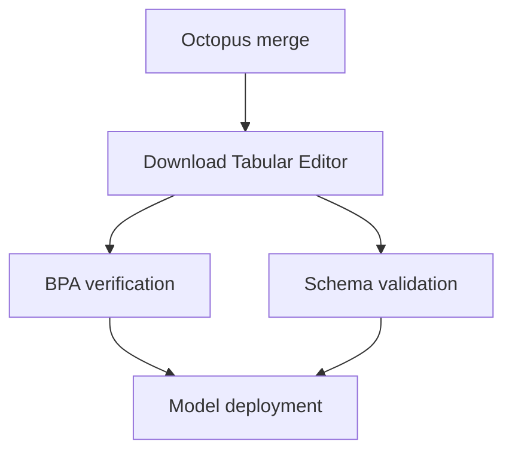
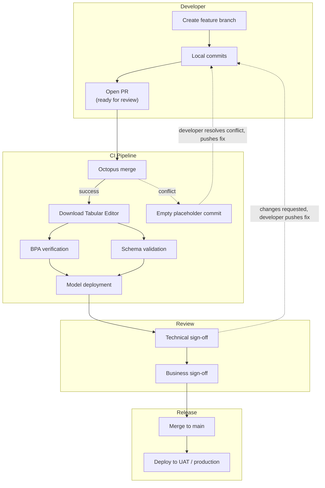

# GitHub Flow and the Octopus Merge pattern

This article covers the day-to-day **GitHub Flow** workflow recommended in [Enabling parallel development using Git and Save to Folder](xref:parallel-development), and the **Octopus Merge** pattern that supports it: a way of keeping a shared test environment continuously up to date with everything currently in progress. The second half of the article walks through a complete reference pipeline that implements this — which, as you'll see, ends up covering considerably more than the merge step alone.

## GitHub Flow in daily use

GitHub Flow's rule is simple — `main` is always deployable, all work happens on short-lived branches off `main` — but a few details are worth making explicit for a semantic model team.

**Creating a feature branch:**

```cmd
git checkout main
git pull
git checkout -b feature/add-tax-calculation
```

**Local development.** The developer works in Tabular Editor 3. Two things happen every time they hit **Ctrl+S**:

- The model metadata is saved to disk in [Save to Folder (database.json) format](xref:parallel-development#what-is-save-to-folder), ready to be staged and committed to the feature branch in Git.
- If [Workspace Mode](xref:workspace-mode) is enabled, the model is simultaneously synced to the developer's personal workspace database in a shared dev workspace — allowing live testing in Tabular Editor, and letting Power BI Desktop connect [directly to the workspace database](xref:workspace-mode#advantages-of-workspace-mode) for report-side validation.

```cmd
git add .
git commit -m "Add tax calculation measure and supporting columns"
git push
```

> [!WARNING]
> Do not enable Fabric Git integration on the workspace hosting your workspace databases. Tabular Editor writes to workspace databases directly through the XMLA endpoint, and those writes have no relationship to your Git branches — enabling Git integration on the same workspace creates conflicting, out-of-band changes to the same database. This is also called out in the [Workspace Mode documentation](xref:workspace-mode).

**Opening a pull request.** When the developer is ready for broader testing, they open a pull request targeting `main`. This is the point where GitHub Flow, on its own, leaves a question open for BI teams: with several developers each having an open PR at once, what should the shared test environment actually reflect? That's what Octopus Merge answers — see below.

**Approval and merge.** Once technical and business reviewers have signed off using the shared test environment, the feature branch is merged into `main` and deleted.

**Deploy to UAT / production.** Either every merge to `main` triggers deployment automatically, or merges accumulate and are deployed on a scheduled cadence (for example, weekly). Both are compatible with GitHub Flow — the branch structure is the same either way, only the release trigger differs.

## Octopus Merge: keeping the test environment current

##### Note — naming disambiguation

"Octopus merge" is used in the Git ecosystem to mean three related but distinct things. It's worth being precise about which one we mean here:

1. **Git's native octopus merge strategy** — the merge strategy Git automatically uses when you run `git merge branch-a branch-b branch-c`, combining more than two branch heads into a single merge commit _as long as there are no conflicts_. If any branch conflicts with the merge in progress, the whole command fails — Git makes no attempt to resolve or isolate conflicts across more than two branches. This is a low-level Git mechanism, not a workflow.
2. **`lesfurets/git-octopus`** — a now-archived open-source command-line tool that wrapped this native strategy into a "continuous merge" workflow: resolve a set of branches by naming pattern, merge them, push the result to a disposable branch, and repeat on every push. It also included tooling to iterate through branches one-by-one to pinpoint which one caused a conflict. The tool itself is no longer maintained and isn't what we recommend implementing directly, but the workflow it pioneered is exactly the pattern described below.
3. **The Octopus Merge pattern described in this article** — a custom CI/CD pipeline that discovers all currently open (non-draft) pull requests targeting `main`, merges their source branches together using Git's native octopus strategy from (1), pushes the result to a disposable branch, and deploys that branch to a shared test environment. The pattern is the same idea as (2), reimplemented as a pipeline script you own — for example a GitHub Actions workflow, or an Azure Pipelines script calling the Azure DevOps REST API — rather than a standalone third-party tool.

When this article says "Octopus Merge," it means (3). Note that (3) _uses_ the native strategy from (1) as its actual merge mechanism — the value it adds is the automation and branch lifecycle around that merge, not an alternative way of merging.

The pattern, in short: **your test environment always reflects the combination of everything currently in progress** — not just one feature in isolation. Every time a developer pushes to any open, non-draft pull request, the pipeline rebuilds the combined branch from scratch and redeploys it.



> [!NOTE]
> Tabular Editor now has a cross-platform CLI (`te`) in Limited Public Preview, purpose-built for CI/CD use — non-interactive mode, native GitHub Actions/Azure DevOps annotations, VSTEST output, and a `te test run` command for running regression tests as part of a pipeline. It's a natural fit for the kind of pipeline described below, and worth watching. As of this writing, Tabular Editor's own documentation advises against using it in production pipelines during preview (the preview build is stated to expire 2026-09-30), so the reference implementation in this article uses the established `TabularEditor.exe` CLI instead. See [CI/CD Integration](xref:te-cli-cicd) for the new CLI's current capabilities and examples.

<!-- FUTURE SPLIT POINT: everything from "Reference implementation" onward is a candidate to become its own page once it grows further (e.g. once release/production deployment past the test environment is added). -->

## Reference implementation

What follows is a complete, working pipeline that implements Octopus Merge — but it's worth being upfront that it does considerably more than the merge step alone. A full run also downloads Tabular Editor, and validates the merged model against your best-practice rules and live data source schema before deploying it to the shared test workspace. Octopus Merge is job 1 of 5; the rest is a general-purpose CI/CD pipeline for semantic models that happens to consume Octopus Merge's output. Deploying reports on top of that model — a separate concern with its own variability by organization — is addressed briefly at the end.

The examples below show both **Azure Pipelines** (calling the Azure DevOps REST API) and **GitHub Actions** (calling the GitHub REST API) for the merge job, since the two platforms differ mainly in how they authenticate and query pull requests — the underlying Git operations and Tabular Editor CLI invocations are identical either way.

### Overview of the pipeline

A full run consists of several jobs, each with explicit dependencies on the ones before it:



Running each stage as its own job — rather than one long script — gives you independent pass/fail signal for each concern (merge conflicts vs. BPA violations vs. schema drift vs. deployment failures), which makes it much faster to diagnose what actually went wrong when a run fails.

##### Note — pipeline agent requirements

Since `TabularEditor.exe` only runs on Windows, every job that invokes it needs a Windows-based agent/runner — this includes the BPA verification, schema validation, and model deployment jobs. A cloud-hosted Windows agent works fine as long as it can reach your test workspace and data source over the network; a self-hosted agent is only necessary if those endpoints aren't reachable from outside your network (an on-premises data source, for example). The Octopus merge job itself has no such constraint, since it only needs Git.

### Triggering the pipeline

The pipeline isn't triggered by a normal Git push trigger. Since it needs to merge _all_ currently open pull requests — not just the one that changed — it's typically set up with no automatic branch trigger, and instead invoked in one of two ways:

- **From a pull request pipeline or branch policy**, so it runs whenever a pull request targeting `main` is created, or whenever a new commit is pushed to any branch with an open pull request.
- **On a schedule** (for example, every few minutes), as a simpler alternative if your CI/CD platform makes "run on any open PR's branch update" awkward to configure directly.

Either approach achieves the same effect: any push to any open pull request causes the combined test environment to be rebuilt.

### Job 1: Octopus merge

This job is responsible for discovering all currently open pull requests, merging them together, and publishing the result to a disposable branch.

**What it does, step by step:**

1. **Authenticate and query pull requests.** The job calls the source-control platform's REST API for open pull requests targeting `main`, authenticated with a token that has permission to list pull requests (including drafts — the filtering happens next, not at the API level).
2. **Filter to non-draft pull requests.** Draft pull requests are excluded — this gives developers a way to push work-in-progress commits without pulling them into the shared test build. Only when a PR is marked ready for review does it join the merge.
3. **Clone the repository fresh.** Rather than reusing a previous checkout, the job clones the repository from scratch on every run, authenticating with the pipeline's own access token. This guarantees the merge always starts from a clean, known state.
4. **Delete and recreate the disposable branch.** Both the remote and local copies of the disposable output branch (for example, `octopus/temp`) are force-deleted if they exist, then recreated fresh from `main`. The branch is never fast-forwarded or reused between runs — it's always rebuilt from scratch.
5. **Merge all qualifying pull request branches in a single command.** Passing more than two branches to `git merge` invokes Git's native octopus merge strategy automatically — this is the point where the pattern uses the underlying Git mechanism described above.
6. **Push the result**, if the merge succeeded.

**Azure Pipelines**, calling the Azure DevOps REST API:

```yaml
- task: PowerShell@2
  displayName: Git octopus merge
  inputs:
    targetType: 'inline'
    script: |
      $prs = Invoke-RestMethod -Uri "https://dev.azure.com/$(Org)/$(Project)/_apis/git/repositories/$(Repo)/pullrequests?api-version=7.0" `
        -Headers @{ Authorization = "Bearer $(System.AccessToken)" }
      $branches = $prs.value | Where-Object { $_.isDraft -eq $false -and $_.targetRefName -eq "refs/heads/main" } |
        ForEach-Object { $_.sourceRefName -replace 'refs/heads', 'origin' }

      git clone $(Build.Repository.Uri) repo --quiet
      cd repo
      git checkout main --quiet
      git push origin --delete octopus/temp --quiet 2>$null
      git checkout -b octopus/temp --quiet
      if ($branches.Count -gt 0) {
        git merge --quiet $branches
      }
      git push --set-upstream origin octopus/temp --quiet
```

**GitHub Actions**, calling the GitHub REST API via the `gh` CLI:

```yaml
- name: Git octopus merge
  env:
    GH_TOKEN: ${{ secrets.GITHUB_TOKEN }}
  run: |
    branches=$(gh pr list --base main --state open --json isDraft,headRefName \
      --jq '.[] | select(.isDraft == false) | .headRefName')

    git clone "$GITHUB_SERVER_URL/$GITHUB_REPOSITORY" repo --quiet
    cd repo
    git checkout main --quiet
    git push origin --delete octopus/temp --quiet || true
    git checkout -b octopus/temp --quiet
    if [ -n "$branches" ]; then
      git merge --quiet $(echo "$branches" | sed 's/^/origin\//')
    fi
    git push --set-upstream origin octopus/temp --quiet
```

Both versions do the same thing: list open, non-draft PRs targeting `main`, resolve them to branch references, and merge them into a freshly recreated `octopus/temp` branch.

**Handling a failed merge:**

If the merge fails — most likely due to a conflict between two or more of the open pull requests — don't just log an error and stop. A well-behaved implementation should reset the working directory and push an **empty placeholder commit** to the disposable branch before failing the pipeline run:

```
git reset --hard --quiet
git checkout main --quiet
git branch -D octopus/temp --quiet
git checkout -b octopus/temp --quiet
git config user.email "octopus-merge@users.noreply.github.com"
git config user.name "Octopus Merge"
git commit --allow-empty -m "init" --quiet
git push origin octopus/temp --quiet
```

This matters because downstream jobs (BPA verification, schema validation, deployment) may depend on the disposable branch existing in _some_ well-defined state. Without this step, a failed merge could leave the branch missing or half-merged, causing confusing secondary failures in later jobs rather than a single clear error at the merge step.

##### Note — diagnosing which branch caused the conflict

A straightforward implementation of this pattern does not automatically identify which pull request caused a merge conflict — it only reports that the merge failed. This is a real limitation compared to the archived `lesfurets/git-octopus` tool, which included tooling to iterate through branches one-by-one to isolate the culprit. In practice, most teams resolve this manually: temporarily unpublish (convert back to draft, or close) the pull requests you suspect, and re-run the pipeline until the merge succeeds again, to narrow down which branch was responsible. If this trial-and-error process becomes a bottleneck for your team, it's worth building an automated one-by-one bisection step into your own pipeline.

### Job 2: Download Tabular Editor

Since the jobs that follow need to invoke the Tabular Editor CLI, and build agents can't be assumed to have it pre-installed, a separate job downloads a portable copy of Tabular Editor at the start of every run:

- Fetches the latest release directly (for example, from Tabular Editor's GitHub releases).
- Unzips it and discards the downloaded archive.
- Makes the extracted `TabularEditor.exe` available to subsequent jobs on the same agent/runner.

Downloading the latest version fresh on every run keeps the pipeline current automatically, without needing to track and update a pinned version number — though if your team wants deterministic, reproducible builds, pinning to a specific release and updating it deliberately is worth considering as an alternative.

### Job 3: BPA verification

This job runs Tabular Editor's [Best Practices Analyzer](xref:best-practice-analyzer) against every semantic model produced by the merge, validating it against your team's central quality rules.

If your repository contains more than one semantic model — common for BI teams serving multiple business areas — each model typically lives in its own subfolder, and the job loops over each one:

```
TabularEditor.exe "<path-to-model>" -A "<path-to-BPARules.json>" -V
```

- `-A` points Tabular Editor at the BPA rules file to check against.
- `-V` verifies the model, reporting the result.

> [!NOTE]
> Decide up front whether a BPA violation should **fail** the pipeline or only **warn**. It's tempting to start with warnings while your rule set is still being tuned, but if that's left in place long-term, violations can silently accumulate without ever blocking a deployment. Treat a warn-only BPA step as a temporary state to graduate out of, not a permanent configuration.

### Job 4: Schema validation

This job compares each model's expected schema against its real, live data source — catching a renamed or missing column, for example, before it causes a broken refresh in the test environment.

```
TabularEditor.exe "<path-to-model>" -S "<path-to-connection-script>.cs" -SC -V -W
```

- `-S` runs a C# script that sets the model's data source connection string — typically reading it from a pipeline environment variable or secret, so the real connection details never need to be committed to source control.
- `-SC` performs the schema check itself, comparing the model's metadata against the live source.
- `-V -W` verify the result and control how warnings are handled.

If your models depend on database objects that are themselves deployed as part of your pipeline — for example, SQL views published from source control — make sure that deployment step runs _before_ schema validation, so the check runs against the exact objects the model will see once everything is deployed to the test environment. This ordering dependency is easy to miss if the two jobs are written independently of each other.

> [!NOTE]
> The specific mechanism for deploying upstream data objects (SQL views, other database artifacts) is going to be specific to your organization's data platform, and isn't part of the Octopus Merge pattern itself. What matters for this pattern is only that schema validation happens after your data source is in its expected state for the test environment — whatever populates that state is up to you.

### Job 5: Model deployment

Once BPA verification and schema validation have both succeeded, this job deploys the merged model to the shared test workspace, using Tabular Editor's Save to Folder (`database.json`) format deployed directly over the XMLA endpoint:

```
TabularEditor.exe "<path-to-model>\database.json" -D "Provider=MSOLAP;Data Source=<XMLA-endpoint>;User ID=app:<app-id>@<tenant-id>;Password=<app-secret>;LocaleIdentifier=1033" "<model-name>" -O -P -R -W -V -E
```

A few things worth calling out:

- Authentication is via a **service principal** (an Azure AD app registration), not a user account — appropriate for an unattended pipeline, and avoiding the need to keep a real user's credentials in your pipeline secrets.
- The model name passed to Tabular Editor typically matches the folder name, so that a repository containing multiple models deploys each one to a correspondingly named dataset.
- The `-O -P -R -W -V -E` flags cover overwrite, processing, roles, warnings, verification, and error handling — see the [Tabular Editor CLI reference](xref:command-line-options) for the full flag list if you need to adjust any of these for your own setup.

> [!NOTE]
> Business reviewers signing off in the shared test environment are validating a report, not a raw XMLA connection — in practice, something still needs to deploy and bind Power BI reports to the freshly deployed test model (and, optionally, update any published Power BI Apps) before that sign-off can happen. Whether every report is redeployed on every run, or only the ones affected by the current changes, is the kind of decision that varies enough by organization to be out of scope here — see @powerbi-cicd for that part of the pipeline.

### Full workflow diagram



## Key principles

- `main` is always in a deployable state; feature branches are short-lived and independent.
- The disposable branch is deleted and recreated from `main` on every run — never fast-forwarded or reused.
- A failed merge should leave the disposable branch in a well-defined (even if empty) state, not a missing or half-merged one.
- Each validation stage (BPA, schema) should be a distinct pipeline job with its own pass/fail signal, not folded into one script.
- Organization-specific steps (like a SQL views deployment) should be clearly separated from the generic pattern, both in your pipeline code and in how you document it internally — so the pattern remains portable if you need to apply it to a different project.

## Siguientes pasos

- [Enabling parallel development using Git and Save to Folder](xref:parallel-development) — the branching strategy this pipeline supports.
- [CI/CD Integration](xref:te-cli-cicd) — the new Tabular Editor CLI's CI/CD patterns, currently in Limited Public Preview.
- @powerbi-cicd
- @as-cicd
