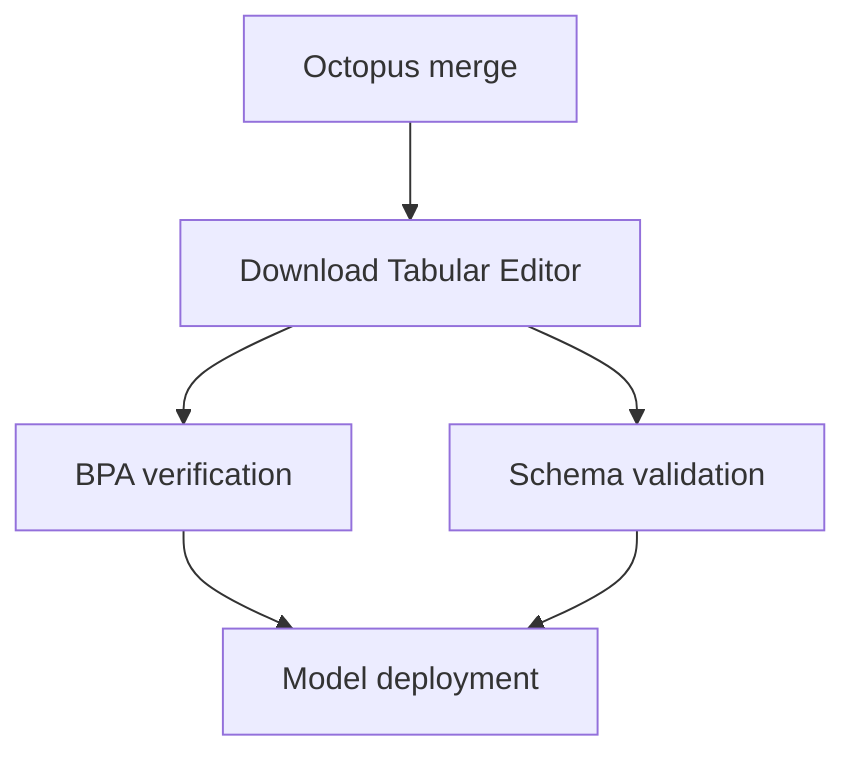
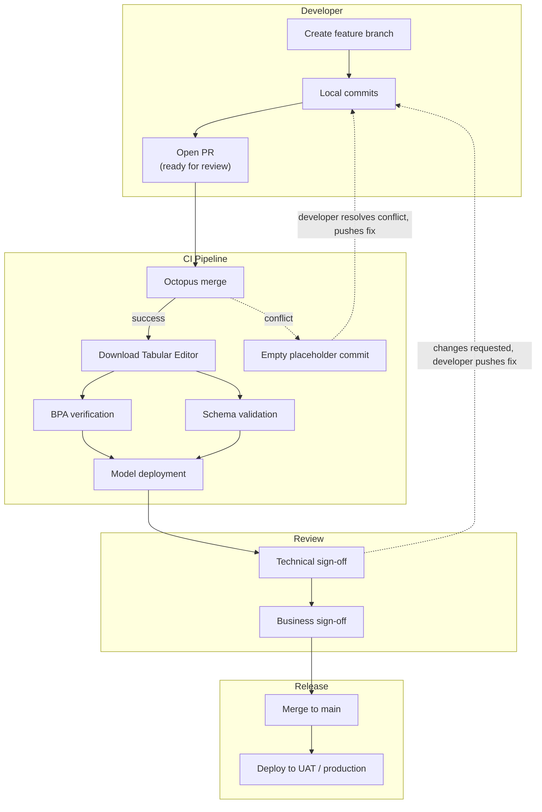

# GitHub Flow y el patrón Octopus Merge

Este artículo explica el flujo de trabajo diario de **GitHub Flow** recomendado en [Habilitar el desarrollo en paralelo con Git y Guardar en carpeta](xref:parallel-development), así como el patrón **Octopus Merge** que lo respalda: una forma de mantener un entorno de prueba compartido continuamente actualizado con todo lo que esté en curso en ese momento. La segunda mitad del artículo recorre una canalización de referencia completa que implementa esto y que, como verás, acaba abarcando bastante más que solo el paso de la fusión.

## GitHub Flow en el día a día

La regla de GitHub Flow es simple: `main` siempre está listo para implementarse y todo el trabajo se realiza en ramas de corta duración que parten de `main`; aun así, conviene dejar explícitos algunos detalles para un equipo encargado de un modelo semántico.

**Crear una rama de funcionalidad:**

```cmd
git checkout main
git pull
git checkout -b feature/add-tax-calculation
```

**Desarrollo local.** El desarrollador trabaja en Tabular Editor 3. Cada vez que pulsa **Ctrl+S** ocurren dos cosas:

- Los metadatos del modelo se guardan en disco en [formato Guardar en carpeta (Database.json)](xref:parallel-development#what-is-save-to-folder), listos para añadirse al área de preparación y hacer commit en la rama de funcionalidad en Git.
- Si el [modo del área de trabajo](xref:workspace-mode) está habilitado, el modelo se sincroniza simultáneamente con la base de datos del Workspace personal del desarrollador dentro de un Workspace de desarrollo compartido, lo que permite hacer pruebas en vivo en Tabular Editor y que Power BI Desktop se conecte [directamente a la base de datos del Workspace](xref:workspace-mode#advantages-of-workspace-mode) para validar el Report.

```cmd
git add .
git commit -m "Add tax calculation measure and supporting columns"
git push
```

> [!WARNING]
> No habilites la integración de Git de Fabric en el Workspace que hospeda tus bases de datos de Workspace. Tabular Editor escribe directamente en las bases de datos de Workspace a través del punto de conexión XMLA, y esas escrituras no tienen ninguna relación con tus ramas de Git; habilitar la integración con Git en ese mismo Workspace genera cambios conflictivos, fuera de Git, en la misma base de datos. Esto también se señala en la [documentación del modo del área de trabajo de Workspace](xref:workspace-mode).

**Abrir una pull request.** Cuando el desarrollador está listo para realizar pruebas más amplias, abre una pull request dirigida a `main`. Este es el punto en el que GitHub Flow, por sí solo, deja una pregunta abierta para los equipos de BI: con varios desarrolladores, cada uno con una PR abierta a la vez, ¿qué debería reflejar realmente el entorno de prueba compartido? Eso es lo que responde Octopus Merge; lo verás más abajo.

**Aprobación y fusión.** Una vez que los revisores técnicos y de negocio han dado su visto bueno tras probar en el entorno de prueba compartido, la rama de funcionalidad se fusiona en `main` y se elimina.

**Despliegue en UAT / producción.** O bien cada fusión en `main` desencadena el despliegue automáticamente, o bien las fusiones se acumulan y se despliegan con una cadencia programada (por ejemplo, semanal). Ambos son compatibles con GitHub Flow: la estructura de ramas es la misma en ambos casos; lo único que cambia es el disparador del lanzamiento.

## Octopus Merge: mantener actualizado el entorno de pruebas

##### Nota: aclaración de nombres

«Octopus merge» se usa en el ecosistema de Git para referirse a tres cosas relacionadas, pero distintas. Conviene precisar a cuál nos referimos aquí:

1. **La estrategia nativa de octopus merge de Git** — la estrategia de fusión que Git usa automáticamente cuando ejecutas `git merge branch-a branch-b branch-c`, combinando más de dos cabezas de rama en un único commit de fusión _siempre que no haya conflictos_. Si alguna rama entra en conflicto con el merge en curso, el comando completo falla: Git no intenta resolver ni aislar conflictos entre más de dos ramas. Este es un mecanismo de bajo nivel de Git, no un flujo de trabajo.
2. **`lesfurets/git-octopus`**: una herramienta de línea de comandos de código abierto, hoy archivada, que convertía esta estrategia nativa en un flujo de trabajo de «continuous merge»: identificaba un conjunto de ramas según un patrón de nombres, las fusionaba, hacía push del resultado a una rama desechable y repetía el proceso con cada push. También incluía herramientas para recorrer las ramas una a una y localizar cuál provocaba un conflicto. La herramienta en sí ya no se mantiene y no es lo que recomendamos implementar directamente, pero el flujo de trabajo que introdujo es exactamente el patrón que se describe a continuación.
3. **El patrón Octopus Merge descrito en este artículo**: un pipeline de CI/CD personalizado que detecta todas las pull requests actualmente abiertas (que no están en borrador) dirigidas a `main`, fusiona sus ramas de origen usando la estrategia nativa de octopus merge de Git del punto (1), hace push del resultado a una rama desechable y despliega esa rama en un entorno de pruebas compartido. El patrón es la misma idea que en (2), reimplementada como un script de pipeline que controlas —por ejemplo, un workflow de GitHub Actions o un script de Azure Pipelines que llama a la API REST de Azure DevOps— en lugar de una herramienta independiente de terceros.

Cuando este artículo dice «Octopus Merge», se refiere a (3). Ten en cuenta que (3) _usa_ la estrategia nativa del punto (1) como mecanismo real de fusión: el valor que aporta está en la automatización y en el ciclo de vida de las ramas alrededor de esa fusión, no en una forma alternativa de fusionar.

En resumen, el patrón es este: **tu entorno de pruebas siempre refleja la combinación de todo lo que está actualmente en curso**; no solo una funcionalidad aislada. Cada vez que un desarrollador hace push a cualquier pull request abierta que no esté en borrador, el pipeline reconstruye desde cero la rama combinada y la vuelve a desplegar.


> [!NOTE]
> Tabular Editor ahora dispone de una CLI multiplataforma (`te`) en versión preliminar pública limitada, diseñada específicamente para CI/CD: modo no interactivo, anotaciones nativas de GitHub Actions/Azure DevOps, salida VSTEST y un comando `te test run` para ejecutar pruebas de regresión como parte de un pipeline. Encaja de forma natural con el tipo de pipeline descrito a continuación, y merece la pena seguirlo de cerca. En el momento de escribir esto, la propia documentación de Tabular Editor desaconseja usarlo en pipelines de producción durante la versión preliminar (se indica que la compilación preliminar caduca el 2026-09-30), por lo que la implementación de referencia de este artículo usa en su lugar la CLI consolidada `TabularEditor.exe`. Consulta [Integración de CI/CD](xref:te-cli-cicd) para conocer las capacidades actuales y ver ejemplos de la nueva CLI.

<!-- FUTURE SPLIT POINT: everything from "Reference implementation" onward is a candidate to become its own page once it grows further (e.g. once release/production deployment past the test environment is added). -->

## Implementación de referencia

Lo que sigue es un pipeline completo y funcional que implementa Octopus Merge, pero conviene dejar claro desde el principio que hace bastante más que solo el paso de merge. Una ejecución completa también descarga Tabular Editor y valida el modelo fusionado con tus reglas de buenas prácticas y con el esquema en vivo de la Data source, antes de desplegarlo en el Workspace de pruebas compartido. Octopus Merge es la tarea 1 de 5; el resto es un pipeline de CI/CD de propósito general para modelos semánticos que, además, consume la salida de Octopus Merge. El despliegue de los Report sobre ese modelo — un aspecto aparte, con su propia variabilidad según la organización — se aborda brevemente al final.

Los ejemplos siguientes muestran tanto **Azure Pipelines** (que invoca la API REST de Azure DevOps) como **GitHub Actions** (que invoca la API REST de GitHub) para el trabajo de fusión, ya que ambas plataformas se diferencian principalmente en cómo se autentican y consultan los pull requests; las operaciones de Git subyacentes y las invocaciones a la CLI de Tabular Editor son idénticas en ambos casos.

### Descripción general del pipeline

Una ejecución completa consta de varios trabajos, cada uno con dependencias explícitas respecto a los anteriores:



Ejecutar cada fase como un trabajo independiente —en lugar de un único script largo— te da un indicador independiente de aprobado/reprobado para cada aspecto (conflictos de fusión frente a infracciones de BPA frente a deriva del esquema frente a errores de despliegue), lo que permite diagnosticar mucho más rápido qué fue lo que salió mal cuando falla una ejecución.

##### Nota: requisitos del agente del pipeline

Como `TabularEditor.exe` solo se ejecuta en Windows, todos los trabajos que lo invoquen necesitan un agente/runner basado en Windows; esto incluye los trabajos de verificación de BPA, validación de esquema y despliegue del modelo. Un agente de Windows hospedado en la nube funciona bien siempre que pueda acceder, a través de la red, a tu Workspace de prueba y a tu Data source; un agente autohospedado solo es necesario si no se puede acceder a esos endpoints desde fuera de tu red (por ejemplo, una Data source local). El propio trabajo de fusión de Octopus no tiene esa limitación, ya que solo necesita Git.

### Cómo se desencadena el pipeline

El pipeline no se activa con un disparador normal por push en Git. Como necesita fusionar _todos_ los pull requests abiertos en ese momento, no solo el que cambió, normalmente se configura sin un disparador automático por rama y se invoca de una de estas dos maneras:

- **Desde un pipeline de pull requests o una política de rama**, para que se ejecute cada vez que se cree un pull request dirigido a `main`, o cada vez que se haga push de un nuevo commit a cualquier rama con un pull request abierto.
- **De forma programada** (por ejemplo, cada pocos minutos), como alternativa más simple si a tu plataforma de CI/CD le resulta incómodo configurar directamente "ejecutar con cualquier actualización de rama de una PR abierta".

Ambos enfoques logran el mismo efecto: cualquier push en cualquier pull request abierto hace que se reconstruya el entorno de prueba combinado.

### Trabajo 1: fusión de Octopus

Este trabajo se encarga de detectar todos los pull requests abiertos en ese momento, fusionarlos y publicar el resultado en una rama desechable.

**Qué hace, paso a paso:**

1. **Autenticarse y consultar los pull requests.** El trabajo invoca la API REST de la plataforma de control de código fuente para listar los pull requests abiertos dirigidos a `main`, autenticándose con un token con permiso para listar pull requests (incluidos los borradores; el filtrado ocurre después, no a nivel de la API).
2. **Filtrar los pull requests no borrador.** Se excluyen los pull requests en borrador; así, los desarrolladores pueden hacer push de commits de trabajo en curso sin incorporarlos a la compilación de prueba compartida. Una PR solo entra en la fusión cuando se marca como lista para revisión.
3. **Clonar el repositorio desde cero.** En lugar de reutilizar un checkout anterior, el trabajo clona el repositorio desde cero en cada ejecución y se autentica con el propio token de acceso del pipeline. Esto garantiza que la fusión siempre parta de un estado limpio y conocido.
4. **Eliminar y recrear la rama desechable.** Tanto la copia remota como la local de la rama de salida desechable (por ejemplo, `octopus/temp`) se eliminan de forma forzada si existen y luego se recrean desde `main`. La rama nunca se actualiza mediante fast-forward ni se reutiliza entre ejecuciones; siempre se reconstruye desde cero.
5. **Fusiona todas las ramas de los pull requests que cumplan los requisitos con un solo comando.** Al pasar más de dos ramas a `git merge`, Git invoca automáticamente su estrategia nativa de fusión octopus — aquí es donde el patrón usa el mecanismo subyacente de Git descrito anteriormente.
6. **Haz push del resultado** si la fusión se completó correctamente.

**Azure Pipelines**, invocando la API REST de Azure DevOps:

```yaml
- task: PowerShell@2
  displayName: Git octopus merge
  inputs:
    targetType: 'inline'
    script: |
      $prs = Invoke-RestMethod -Uri "https://dev.azure.com/$(Org)/$(Project)/_apis/git/repositories/$(Repo)/pullrequests?api-version=7.0" `
        -Headers @{ Authorization = "Bearer $(System.AccessToken)" }
      $branches = $prs.value | Where-Object { $_.isDraft -eq $false -and $_.targetRefName -eq "refs/heads/main" } |
        ForEach-Object { $_.sourceRefName -replace 'refs/heads', 'origin' }

      git clone $(Build.Repository.Uri) repo --quiet
      cd repo
      git checkout main --quiet
      git push origin --delete octopus/temp --quiet 2>$null
      git checkout -b octopus/temp --quiet
      if ($branches.Count -gt 0) {
        git merge --quiet $branches
      }
      git push --set-upstream origin octopus/temp --quiet
```

**GitHub Actions**, invocando la API REST de GitHub mediante la CLI `gh`:

```yaml
- name: Git octopus merge
  env:
    GH_TOKEN: ${{ secrets.GITHUB_TOKEN }}
  run: |
    branches=$(gh pr list --base main --state open --json isDraft,headRefName \
      --jq '.[] | select(.isDraft == false) | .headRefName')

    git clone "$GITHUB_SERVER_URL/$GITHUB_REPOSITORY" repo --quiet
    cd repo
    git checkout main --quiet
    git push origin --delete octopus/temp --quiet || true
    git checkout -b octopus/temp --quiet
    if [ -n "$branches" ]; then
      git merge --quiet $(echo "$branches" | sed 's/^/origin\//')
    fi
    git push --set-upstream origin octopus/temp --quiet
```

Ambas versiones hacen lo mismo: enumeran las PR abiertas que no están en borrador y que apuntan a `main`, las resuelven a referencias de rama y las fusionan en una rama `octopus/temp` recién recreada.

**Cómo gestionar una fusión fallida:**

Si la fusión falla —muy probablemente por un conflicto entre dos o más de las pull requests abiertas—, no te limites a registrar un error y detenerte. Una implementación correcta debería restablecer el directorio de trabajo y hacer push de un **commit vacío de marcador de posición** a la rama desechable antes de marcar como fallida la ejecución del pipeline:

```
git reset --hard --quiet
git checkout main --quiet
git branch -D octopus/temp --quiet
git checkout -b octopus/temp --quiet
git config user.email "octopus-merge@users.noreply.github.com"
git config user.name "Octopus Merge"
git commit --allow-empty -m "init" --quiet
git push origin octopus/temp --quiet
```

Esto importa porque los trabajos posteriores (verificación de BPA, validación de esquema, despliegue) pueden depender de que la rama desechable exista en _algún_ estado bien definido. Sin este paso, una fusión fallida podría dejar la rama ausente o fusionada a medias, y provocar errores secundarios confusos en trabajos posteriores en lugar de un único error claro en el paso de fusión.

##### Nota: cómo diagnosticar qué rama causó el conflicto

Una implementación sencilla de este patrón no identifica automáticamente qué pull request causó un conflicto de fusión; solo genera un **Report** indicando que la fusión falló. Es una limitación real frente a la herramienta archivada `lesfurets/git-octopus`, que incluía utilidades para iterar por las ramas una a una hasta aislar a la culpable. En la práctica, la mayoría de los equipos lo resuelven manualmente: dejan de publicar temporalmente las pull requests que sospechan (las vuelven a marcar como borrador o las cierran) y vuelven a ejecutar el pipeline hasta que la fusión vuelva a completarse correctamente, para acotar qué rama era la responsable. Si este proceso de prueba y error se convierte en un cuello de botella para tu equipo, merece la pena añadir a tu pipeline un paso automatizado de bisección, rama por rama.

### Trabajo 2: Descargar Tabular Editor

Como los trabajos siguientes necesitan invocar la CLI de Tabular Editor, y no puede darse por hecho que los agentes de compilación la tengan preinstalada, un trabajo independiente descarga una copia portátil de Tabular Editor al inicio de cada ejecución:

- Obtiene directamente la versión más reciente (por ejemplo, desde la página de lanzamientos de GitHub de Tabular Editor).
- La descomprime y descarta el archivo descargado.
- Deja el `TabularEditor.exe` extraído disponible para los trabajos posteriores en el mismo agente/runner.

Descargar siempre la versión más reciente en cada ejecución mantiene el pipeline actualizado automáticamente, sin tener que hacer seguimiento ni actualizar un número de versión fijo; aun así, si tu equipo quiere compilaciones deterministas y reproducibles, conviene considerar como alternativa fijar una versión concreta y actualizarla de forma deliberada.

### Trabajo 3: Verificación de BPA

Este trabajo ejecuta el [Best Practices Analyzer](xref:best-practice-analyzer) de Tabular Editor sobre cada modelo semántico generado por la fusión y lo valida frente a las reglas de calidad centrales de tu equipo.

Si tu repositorio contiene más de un modelo semántico —algo habitual en equipos de BI que dan servicio a varias áreas de negocio—, cada modelo suele estar en su propia subcarpeta, y el trabajo recorre cada uno de ellos:

```
TabularEditor.exe "<path-to-model>" -A "<path-to-BPARules.json>" -V
```

- `-A` indica a Tabular Editor qué archivo de reglas de BPA debe usar para la comprobación.
- `-V` verifica el modelo e informa del resultado en un Report.

> [!NOTE]
> Decide desde el principio si una infracción de BPA debe **hacer fallar** la canalización o solo **emitir una advertencia**. Es tentador empezar con advertencias mientras aún ajustas el conjunto de reglas, pero si eso se deja así a largo plazo, las infracciones pueden acumularse silenciosamente sin llegar nunca a bloquear una implementación. Trata un paso de BPA que solo emite advertencias como un estado temporal del que hay que salir, no como una configuración permanente.

### Trabajo 4: Validación del esquema

Este trabajo compara el esquema esperado de cada modelo con su Data source real y en vivo para detectar, por ejemplo, una columna renombrada o ausente antes de que provoque un error de actualización en el entorno de prueba.

```
TabularEditor.exe "<path-to-model>" -S "<path-to-connection-script>.cs" -SC -V -W
```

- `-S` ejecuta un C# Script que establece la cadena de conexión de la Data source del modelo; normalmente la lee de una variable de entorno o de un secreto de la canalización, para que nunca sea necesario confirmar los detalles reales de la conexión en el control de código fuente.
- `-SC` realiza la comprobación del esquema, comparando los metadatos del modelo con el origen activo.
- `-V -W` verifican el resultado y controlan cómo se tratan las advertencias.

Si tus modelos dependen de objetos de base de datos que también se implementan como parte de tu canalización —por ejemplo, vistas SQL publicadas desde el control de código fuente—, asegúrate de que ese paso de implementación se ejecute _antes_ de la validación de esquema, para que la comprobación se haga contra exactamente los objetos que verá el modelo una vez que todo se haya implementado en el entorno de prueba. Es fácil pasar por alto esta dependencia de orden si ambos trabajos se escriben de forma independiente.

> [!NOTE]
> El mecanismo específico para implementar objetos de datos previos (vistas SQL y otros artefactos de base de datos) dependerá de la plataforma de datos de tu organización y no forma parte del patrón Octopus Merge en sí. Lo único que importa para este patrón es que la validación de esquema se realice después de que tu Data source esté en el estado esperado para el entorno de prueba; cómo se llega a ese estado depende de ti.

### Trabajo 5: Implementación del modelo

Una vez que la verificación de BPA y la validación de esquema se han completado correctamente, este trabajo implementa el modelo combinado en el Workspace de prueba compartido mediante el formato Guardar en carpeta (`Database.json`) de Tabular Editor, y lo despliega directamente a través del punto de conexión XMLA:

```
TabularEditor.exe "<path-to-model>\database.json" -D "Provider=MSOLAP;Data Source=<XMLA-endpoint>;User ID=app:<app-id>@<tenant-id>;Password=<app-secret>;LocaleIdentifier=1033" "<model-name>" -O -P -R -W -V -E
```

Algunos puntos que conviene destacar:

- La autenticación se realiza mediante una **entidad de servicio** (un registro de aplicación de Azure AD), no con una cuenta de usuario; es lo adecuado para una canalización desatendida y evita tener que guardar las credenciales de un usuario real en los secretos de la canalización.
- El nombre del modelo que se pasa a Tabular Editor normalmente coincide con el nombre de la carpeta, de modo que un repositorio que contiene varios modelos implementa cada uno en un Dataset con el nombre correspondiente.
- Las opciones `-O -P -R -W -V -E` cubren sobrescritura, procesamiento, roles, advertencias, verificación y gestión de errores; consulta la [referencia de la CLI de Tabular Editor](xref:command-line-options) para ver la lista completa de opciones si necesitas ajustar alguna de ellas para tu propia configuración.

> [!NOTE]
> Los revisores de negocio que dan su visto bueno en el entorno de prueba compartido están validando un Report, no una conexión XMLA directa; en la práctica, aún hace falta que algún paso implemente y vincule los informes de Power BI al modelo de prueba recién implementado (y, opcionalmente, actualice cualquier App de Power BI publicada) antes de que ese visto bueno pueda darse. Que se vuelva a implementar cada Report en cada ejecución, o solo los que se vean afectados por los cambios actuales, es el tipo de decisión que varía lo suficiente según la organización como para quedar fuera del alcance de este patrón; consulta @powerbi-cicd para esa parte de la canalización.

### Diagrama completo del flujo de trabajo



## Principios clave

- `main` siempre está lista para desplegarse; las ramas de características son de corta duración e independientes.
- La rama desechable se elimina y se recrea a partir de `main` en cada ejecución; nunca se hace un fast-forward ni se reutiliza.
- Una fusión fallida debería dejar la rama descartable en un estado bien definido (aunque quede vacía), y no en un estado inexistente o a medio fusionar.
- Cada etapa de validación (BPA, esquema) debería ser un trabajo independiente en el pipeline, con su propio indicador de éxito o fallo, en lugar de integrarse en un único script.
- Los pasos específicos de la organización (como el despliegue de vistas SQL) deben estar claramente separados del patrón genérico, tanto en el código del pipeline como en la documentación interna, para que el patrón siga siendo portable si necesitas aplicarlo a otro proyecto.

## Siguientes pasos

- [Habilitar el desarrollo en paralelo con Git y Guardar en carpeta](xref:parallel-development) — la estrategia de ramificación que admite este pipeline.
- [Integración de CI/CD](xref:te-cli-cicd) — los patrones de CI/CD de la nueva CLI de Tabular Editor, actualmente en vista previa pública limitada.
- @powerbi-cicd
- @as-cicd
