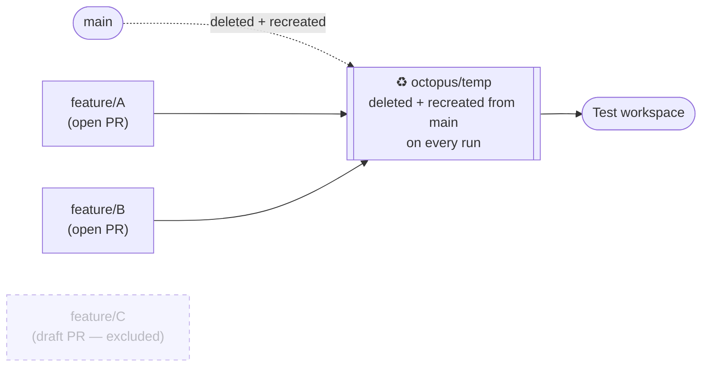
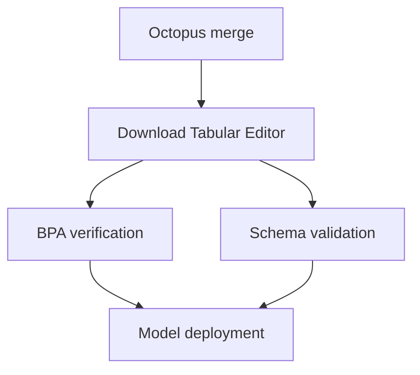
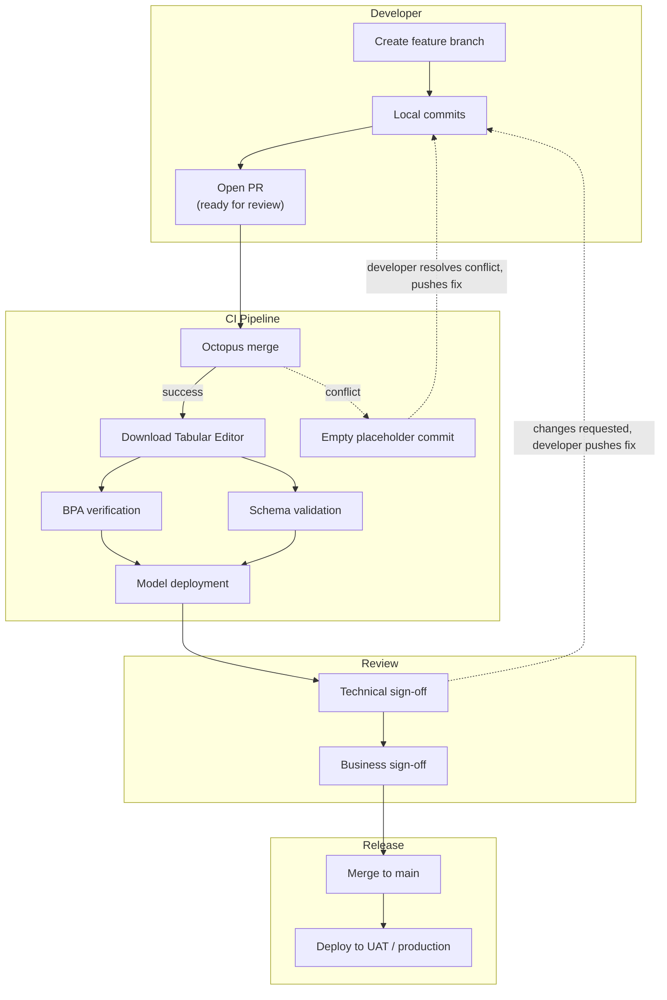

# GitHub Flow y el patrón Octopus Merge

En este artículo se describe el flujo de trabajo diario de **GitHub Flow** recomendado en [Habilitar el desarrollo en paralelo mediante Git y Guardar en carpeta](xref:parallel-development), así como el patrón **Octopus Merge** que lo respalda: una forma de mantener un entorno de prueba compartido actualizado de forma continua con todo lo que esté actualmente en curso. La segunda mitad del artículo repasa una canalización de referencia completa que implementa esto; como verás, acaba abarcando bastante más que el mero paso de fusión.

## GitHub Flow en el día a día

La regla de GitHub Flow es simple: `main` siempre está en un estado desplegable y todo el trabajo se realiza en ramas de corta duración que parten de `main`. Aun así, conviene dejar explícitos algunos detalles para un equipo de modelos semánticos.

**Crear una rama de funcionalidad:**

```cmd
git checkout main
git pull
git checkout -b feature/add-tax-calculation
```

**Desarrollo local.** El desarrollador trabaja en Tabular Editor 3. Cada vez que se pulsa **Ctrl+S**, ocurren dos cosas:

- Los metadatos del modelo se guardan en disco en el [formato Guardar en carpeta (Database.json)](xref:parallel-development#what-is-save-to-folder), listos para pasarlos al área de preparación y confirmarlos en la rama de funcionalidad en Git.
- Si está habilitado el [modo del área de trabajo](xref:workspace-mode), el modelo también se sincroniza con la base de datos del Workspace personal del desarrollador, dentro de un Workspace de desarrollo compartido. Esto permite hacer pruebas en vivo en Tabular Editor y que Power BI Desktop se conecte [directamente a la base de datos del Workspace](xref:workspace-mode#advantages-of-workspace-mode) para validar el Report.

```cmd
git add .
git commit -m "Add tax calculation measure and supporting columns"
git push
```

> [!WARNING]
> No habilite la integración de Git de Fabric en el Workspace donde aloja las bases de datos del Workspace. Tabular Editor escribe directamente en las bases de datos del Workspace a través del punto de conexión XMLA, y esas escrituras no guardan relación con tus ramas de Git. Habilitar la integración con Git en ese mismo Workspace crea cambios en conflicto, al margen del flujo de trabajo, en la misma base de datos. Esto también se señala en la [documentación del modo del área de trabajo](xref:workspace-mode).

**Abrir un pull request.** Cuando el desarrollador está listo para hacer pruebas más amplias, abre un pull request con destino a `main`. Aquí es donde GitHub Flow, por sí solo, deja abierta una pregunta para los equipos de BI: con varios desarrolladores y un PR abierto cada uno al mismo tiempo, ¿qué debería reflejar realmente el entorno de prueba compartido? Eso es lo que resuelve Octopus Merge; mira más abajo.

**Aprobación y fusión.** Una vez que los revisores técnicos y de negocio han dado su aprobación usando el entorno de prueba compartido, la rama de funcionalidad se fusiona en `main` y se elimina.

**Desplegar en UAT/producción.** O bien cada fusión en `main` desencadena el despliegue automáticamente, o bien las fusiones se acumulan y se despliegan según una cadencia programada (por ejemplo, semanal). Ambos son compatibles con GitHub Flow: la estructura de ramas es la misma en ambos casos; lo único que cambia es el disparador del lanzamiento.

## Octopus Merge: mantener al día el entorno de pruebas

##### Nota: aclaración terminológica

«Octopus merge» se usa en el ecosistema de Git para referirse a tres conceptos relacionados, pero distintos. Conviene precisar a cuál nos referimos aquí:

1. **La estrategia nativa de fusión octopus de Git**: la estrategia de fusión que Git usa automáticamente cuando ejecutas `git merge branch-a branch-b branch-c`, y combina más de dos puntas de rama en un único commit de fusión _siempre que no haya conflictos_. Si alguna rama entra en conflicto con la fusión en curso, todo el comando falla: Git no intenta resolver ni aislar conflictos entre más de dos ramas. Este es un mecanismo de bajo nivel de Git, no un flujo de trabajo.
2. **`lesfurets/git-octopus`**: una herramienta de línea de comandos de código abierto, hoy archivada, que envolvía esta estrategia nativa en un flujo de trabajo de «fusión continua»: identifica un conjunto de ramas por un patrón de nombres, las fusiona, hace push del resultado a una rama desechable y repite el proceso con cada push. También incluía herramientas para recorrer las ramas una por una y detectar cuál provocaba un conflicto. La herramienta en sí ya no se mantiene y no es lo que recomendamos implementar directamente, pero el flujo de trabajo que introdujo es exactamente el patrón que se describe a continuación.
3. **El patrón Octopus Merge descrito en este artículo**: una canalización de CI/CD personalizada que detecta todos los pull requests actualmente abiertos (que no están en borrador) dirigidos a `main`, fusiona sus ramas de origen usando la estrategia nativa de fusión octopus de Git del punto (1), hace push del resultado a una rama desechable y despliega esa rama en un entorno de pruebas compartido. El patrón es la misma idea que en (2), reimplementada como un script de canalización que controlas —por ejemplo, un flujo de trabajo de GitHub Actions o un script de Azure Pipelines que llama a la API REST de Azure DevOps— en lugar de una herramienta independiente de terceros.

Cuando este artículo dice «Octopus Merge», se refiere a (3). Ten en cuenta que (3) _usa_ la estrategia nativa de (1) como mecanismo real de fusión: el valor que aporta está en la automatización y el ciclo de vida de las ramas alrededor de esa fusión, no en una forma alternativa de fusionar.

En resumen, el patrón es este: **tu entorno de pruebas siempre refleja la combinación de todo lo que está actualmente en curso**; no solo una funcionalidad aislada. Cada vez que un desarrollador hace push a cualquier pull request abierto que no esté en borrador, la canalización reconstruye la rama combinada desde cero y la vuelve a desplegar.


```mermaid
flowchart LR
    main(["main"]) -.->|"deleted + recreated"| temp
    prA["feature/A<br/>(open PR)"] --> temp
    prB["feature/B<br/>(open PR)"] --> temp
    prC["feature/C<br/>(draft PR — excluded)"]:::draft
    temp[["♻️ octopus/temp<br/>deleted + recreated from main<br/>on every run"]] --> test(["Test workspace"])

    classDef draft stroke-dasharray: 5 5,opacity:0.55;
```

> [!NOTE]
> Tabular Editor ahora cuenta con una CLI multiplataforma (`te`) en vista previa pública limitada, creada específicamente para CI/CD: modo no interactivo, anotaciones nativas de GitHub Actions/Azure DevOps, salida VSTEST y un comando `te test run` para ejecutar pruebas de regresión como parte de una canalización. Encaja de forma natural con el tipo de canalización que se describe a continuación y merece la pena seguirle la pista. En el momento de escribir esto, la propia documentación de Tabular Editor desaconseja usarlo en canalizaciones de producción durante la vista previa (se indica que la compilación de vista previa caduca el 2026-10-31), por lo que la implementación de referencia de este artículo usa en su lugar la CLI consolidada `TabularEditor.exe`. Consulta [Integración de CI/CD](xref:te-cli-cicd) para ver las capacidades actuales y ejemplos de la nueva CLI.

<!-- FUTURE SPLIT POINT: everything from "Reference implementation" onward is a candidate to become its own page once it grows further (e.g. once release/production deployment past the test environment is added). -->

## Implementación de referencia

Lo que sigue es una canalización completa y funcional que implementa Octopus Merge, pero conviene dejar claro desde el principio que hace bastante más que solo el paso de fusión. Una ejecución completa también descarga Tabular Editor y valida el modelo fusionado con tus reglas de mejores prácticas y con el esquema real del Data source antes de desplegarlo en el Workspace de pruebas compartido. Octopus Merge es el trabajo 1 de 5; el resto es una canalización de CI/CD de propósito general para modelos semánticos que consume la salida de Octopus Merge. El despliegue de Report sobre ese modelo —un tema independiente, con variaciones según la organización— se trata brevemente al final.

Los ejemplos siguientes muestran tanto **Azure Pipelines** (llamando a la API REST de Azure DevOps) como **GitHub Actions** (llamando a la API REST de GitHub) para el trabajo de merge, ya que las dos plataformas se diferencian principalmente en cómo se autentican y consultan los pull requests; las operaciones de Git subyacentes y las invocaciones de la CLI de Tabular Editor son idénticas en ambos casos.

### Descripción general del pipeline

Una ejecución completa consta de varios trabajos, cada uno con dependencias explícitas respecto a los anteriores:


```mermaid
flowchart TD
    merge["Octopus merge"] --> dl["Download Tabular Editor"]
    dl --> bpa["BPA verification"]
    dl --> schema["Schema validation"]
    bpa --> deploy["Model deployment"]
    schema --> deploy
```

Ejecutar cada etapa como su propio trabajo —en lugar de un único script largo— te da una señal independiente de éxito o fallo para cada aspecto (conflictos de merge frente a infracciones de BPA frente a deriva del esquema frente a errores de despliegue), lo que facilita mucho más diagnosticar qué fue lo que falló cuando una ejecución no sale bien.

##### Nota — requisitos del agente del pipeline

Como `TabularEditor.exe` solo se ejecuta en Windows, cada trabajo que lo invoque necesita un agente/runner basado en Windows; esto incluye los trabajos de verificación de BPA, validación de esquema y despliegue del modelo. Un agente de Windows hospedado en la nube funciona bien siempre que pueda acceder, a través de la red, a tu Workspace de prueba y a tu Data source; un agente autoalojado solo es necesario si no se puede acceder a esos endpoints desde fuera de tu red (por ejemplo, una Data source local). El propio trabajo de merge de Octopus no tiene esa limitación, ya que solo necesita Git.

### Activación del pipeline

El pipeline no se activa con un desencadenador normal de push de Git. Como necesita hacer merge de _todos_ los pull requests abiertos en ese momento — no solo del que cambió — normalmente se configura sin un desencadenador automático por rama, y en su lugar se invoca de una de estas dos formas:

- **Desde un pipeline de pull requests o una política de rama**, para que se ejecute cada vez que se cree un pull request dirigido a `main`, o cada vez que se haga push de un nuevo commit a cualquier rama con un pull request abierto.
- **De forma programada** (por ejemplo, cada pocos minutos), como alternativa más sencilla si tu plataforma de CI/CD hace que "ejecutar ante cualquier actualización de la rama de una PR abierta" resulte incómodo de configurar directamente.

Cualquiera de los dos enfoques logra el mismo efecto: cualquier push a cualquier pull request abierto hace que el entorno de prueba combinado se reconstruya.

### Trabajo 1: merge de Octopus

Este trabajo se encarga de detectar todos los pull requests abiertos en ese momento, hacer merge de todos ellos y publicar el resultado en una rama desechable.

**Qué hace, paso a paso:**

1. **Autenticarse y consultar pull requests.** El trabajo llama a la API REST de la plataforma de control de código fuente para obtener los pull requests abiertos dirigidos a `main`, autenticándose con un token que tiene permiso para enumerar pull requests (incluidos los borradores; el filtrado se hace en el paso siguiente, no a nivel de API).
2. **Filtrar solo los pull requests que no sean borradores.** Los pull requests en borrador se excluyen; esto da a los desarrolladores una forma de hacer push de commits en curso sin incorporarlos a la compilación de prueba compartida. Solo cuando una PR se marca como lista para revisión entra en el merge.
3. **Clonar el repositorio desde cero.** En lugar de reutilizar un checkout anterior, el trabajo clona el repositorio desde cero en cada ejecución, autenticándose con el propio token de acceso del pipeline. Esto garantiza que el merge siempre comience desde un estado limpio y conocido.
4. **Eliminar y volver a crear la rama desechable.** Tanto la copia remota como la local de la rama de salida desechable (por ejemplo, `octopus/temp`) se eliminan de forma forzada si existen, y luego se vuelven a crear desde `main`. La rama nunca se actualiza con fast-forward ni se reutiliza entre ejecuciones; siempre se reconstruye desde cero.
5. **Fusiona todas las ramas de pull request que cumplan los requisitos con un solo comando.** Pasar más de dos ramas a `git merge` hace que Git invoque automáticamente su estrategia nativa de fusión «octopus»; aquí es donde el patrón aprovecha el mecanismo de Git descrito anteriormente.
6. **Haz push del resultado** si la fusión se completó correctamente.

**Azure Pipelines**, llamando a la API REST de Azure DevOps:

```yaml
- task: PowerShell@2
  displayName: Git octopus merge
  inputs:
    targetType: 'inline'
    script: |
      $prs = Invoke-RestMethod -Uri "https://dev.azure.com/$(Org)/$(Project)/_apis/git/repositories/$(Repo)/pullrequests?api-version=7.0" `
        -Headers @{ Authorization = "Bearer $(System.AccessToken)" }
      $branches = $prs.value | Where-Object { $_.isDraft -eq $false -and $_.targetRefName -eq "refs/heads/main" } |
        ForEach-Object { $_.sourceRefName -replace 'refs/heads', 'origin' }

      git clone $(Build.Repository.Uri) repo --quiet
      cd repo
      git checkout main --quiet
      git push origin --delete octopus/temp --quiet 2>$null
      git checkout -b octopus/temp --quiet
      if ($branches.Count -gt 0) {
        git merge --quiet $branches
      }
      git push --set-upstream origin octopus/temp --quiet
```

**GitHub Actions**, llamando a la API REST de GitHub mediante la CLI `gh`:

```yaml
- name: Git octopus merge
  env:
    GH_TOKEN: ${{ secrets.GITHUB_TOKEN }}
  run: |
    branches=$(gh pr list --base main --state open --json isDraft,headRefName \
      --jq '.[] | select(.isDraft == false) | .headRefName')

    git clone "$GITHUB_SERVER_URL/$GITHUB_REPOSITORY" repo --quiet
    cd repo
    git checkout main --quiet
    git push origin --delete octopus/temp --quiet || true
    git checkout -b octopus/temp --quiet
    if [ -n "$branches" ]; then
      git merge --quiet $(echo "$branches" | sed 's/^/origin\//')
    fi
    git push --set-upstream origin octopus/temp --quiet
```

Ambas versiones hacen lo mismo: enumeran los PR abiertos que no están en borrador y que van dirigidos a `main`, los convierten en referencias de rama y los fusionan en una rama `octopus/temp` recién recreada.

**Gestionar una fusión fallida:**

Si la fusión falla —probablemente por un conflicto entre dos o más de los pull requests abiertos—, no te limites a registrar un error y detenerte. Una implementación correcta debería restablecer el directorio de trabajo y hacer push de un **commit vacío de marcador de posición** a la rama desechable antes de marcar como fallida la ejecución del pipeline:

```
git reset --hard --quiet
git checkout main --quiet
git branch -D octopus/temp --quiet
git checkout -b octopus/temp --quiet
git config user.email "octopus-merge@users.noreply.github.com"
git config user.name "Octopus Merge"
git commit --allow-empty -m "init" --quiet
git push origin octopus/temp --quiet
```

Esto importa porque los trabajos posteriores (verificación de BPA, validación del esquema, despliegue) pueden depender de que la rama desechable exista en _algún_ estado bien definido. Sin este paso, una fusión fallida podría dejar la rama ausente o fusionada a medias, lo que provocaría errores secundarios confusos en trabajos posteriores en lugar de un único error claro en el paso de fusión.

##### Nota: cómo determinar qué rama causó el conflicto

Una implementación sencilla de este patrón no identifica automáticamente qué pull request provocó un conflicto de fusión; solo emite un Report de que la fusión falló. Esta es una limitación real frente a la herramienta archivada `lesfurets/git-octopus`, que incluía utilidades para recorrer las ramas una por una y aislar la causante. En la práctica, la mayoría de los equipos lo resuelven manualmente: despublican temporalmente los pull requests que sospechan (los vuelven a poner como borrador o los cierran) y vuelven a ejecutar el pipeline hasta que la fusión vuelva a tener éxito, para acotar qué rama era la responsable. Si este proceso de prueba y error se convierte en un cuello de botella para tu equipo, merece la pena incorporar a tu pipeline un paso automatizado de bisección, rama por rama.

### Trabajo 2: Descargar Tabular Editor

Como los trabajos siguientes necesitan invocar la CLI de Tabular Editor y no se puede dar por hecho que los agentes de compilación la tengan preinstalada, un trabajo independiente descarga una versión portátil de Tabular Editor al inicio de cada ejecución:

- Obtiene directamente la última versión publicada (por ejemplo, desde los lanzamientos de GitHub de Tabular Editor).
- Lo descomprime y descarta el archivo descargado.
- Deja el `TabularEditor.exe` extraído disponible para los trabajos posteriores en el mismo agente o runner.

Descargar la versión más reciente en cada ejecución mantiene el pipeline actualizado automáticamente, sin tener que rastrear ni actualizar un número de versión fijado; aun así, si tu equipo quiere compilaciones deterministas y reproducibles, merece la pena considerar como alternativa fijar una versión concreta y actualizarla de forma deliberada.

### Trabajo 3: Verificación de BPA

Este trabajo ejecuta el [Best Practices Analyzer](xref:best-practice-analyzer) de Tabular Editor en cada modelo semántico generado por la fusión y lo valida según las reglas de calidad centrales de tu equipo.

Si tu repositorio contiene más de un modelo semántico —algo habitual en equipos de BI que dan servicio a varias áreas de negocio—, cada modelo suele estar en su propia subcarpeta y el trabajo recorre cada uno:

```
TabularEditor.exe "<path-to-model>" -A "<path-to-BPARules.json>" -V
```

- `-A` indica a Tabular Editor qué archivo de reglas de BPA debe usar para la comprobación.
- `-V` verifica el modelo e informa del resultado.

> [!NOTE]
> Decide de antemano si una infracción de BPA debe **hacer fallar** la canalización o solo **generar una advertencia**. Es tentador empezar con advertencias mientras todavía se está ajustando el conjunto de reglas, pero si eso se deja así a largo plazo, las infracciones pueden acumularse silenciosamente sin llegar nunca a bloquear una implementación. Trata un paso de BPA de solo advertencia como un estado temporal del que debes salir, no como una configuración permanente.

### Trabajo 4: Validación de esquema

Este trabajo compara el esquema esperado de cada modelo con su Data source real y activa, y detecta, por ejemplo, una columna renombrada o ausente antes de que provoque una actualización fallida en el entorno de prueba.

```
TabularEditor.exe "<path-to-model>" -S "<path-to-connection-script>.cs" -SC -V -W
```

- `-S` ejecuta un C# Script que establece la cadena de conexión de la Data source del modelo; por lo general, la lee de una variable de entorno o de un secreto de la canalización, de modo que nunca sea necesario confirmar en el control de código fuente los detalles reales de la conexión.
- `-SC` realiza la propia comprobación del esquema y compara los metadatos del modelo con el origen activo.
- `-V -W` verifican el resultado y controlan cómo se tratan las advertencias.

Si tus modelos dependen de objetos de base de datos que, a su vez, se implementan como parte de la canalización —por ejemplo, vistas SQL publicadas desde el control de código fuente—, asegúrate de que ese paso de implementación se ejecute _antes_ de la validación de esquema, para que la comprobación se realice sobre los objetos exactos que verá el modelo una vez que todo se haya implementado en el entorno de prueba. Esta dependencia del orden es fácil de pasar por alto si los dos trabajos se escriben de forma independiente.

> [!NOTE]
> El mecanismo concreto para implementar los objetos de datos previos (vistas SQL, otros artefactos de base de datos) dependerá de la plataforma de datos de tu organización y no forma parte del patrón Octopus Merge en sí. Lo único que importa para este patrón es que la validación de esquema se produzca después de que tu Data source esté en el estado esperado para el entorno de prueba; cómo se llega a ese estado depende de ti.

### Trabajo 5: Implementación del modelo

Una vez que la verificación de BPA y la validación de esquema se han completado correctamente, este trabajo implementa el modelo combinado en el Workspace de prueba compartido, utilizando el formato Guardar en carpeta (`Database.json`) de Tabular Editor, que se implementa directamente sobre el punto de conexión XMLA:

```
TabularEditor.exe "<path-to-model>\database.json" -D "Provider=MSOLAP;Data Source=<XMLA-endpoint>;User ID=app:<app-id>@<tenant-id>;Password=<app-secret>;LocaleIdentifier=1033" "<model-name>" -O -P -R -W -V -E
```

Algunos puntos que conviene destacar:

- La autenticación se realiza mediante una **entidad de servicio** (un registro de aplicación de Azure AD), no una cuenta de usuario; es lo adecuado para una canalización desatendida y evita tener que guardar las credenciales de un usuario real en los secretos de la canalización.
- El nombre del modelo que se pasa a Tabular Editor suele coincidir con el nombre de la carpeta, de modo que un repositorio que contiene varios modelos implementa cada uno en un Dataset con el nombre correspondiente.
- Los modificadores `-O -P -R -W -V -E` cubren la sobrescritura, el procesamiento, los roles, las advertencias, la verificación y el tratamiento de errores; consulta la [referencia de la CLI de Tabular Editor](xref:command-line-options) para ver la lista completa de modificadores si necesitas ajustar alguno de ellos para tu propia configuración.

> [!NOTE]
> Los revisores de negocio que dan su aprobación en el entorno de prueba compartido están validando un Report, no una conexión XMLA sin procesar; en la práctica, sigue siendo necesario algún paso que implemente y vincule los informes de Power BI al modelo de prueba recién implementado (y, opcionalmente, que actualice cualquier App de Power BI publicada) antes de que pueda producirse esa aprobación. Si cada Report se vuelve a implementar en cada ejecución, o solo los afectados por los cambios actuales, es el tipo de decisión que varía tanto según la organización que queda fuera del alcance de este contenido; consulta @powerbi-cicd para esa parte de la canalización.

### Diagrama completo del flujo de trabajo


```mermaid
flowchart TB
    subgraph dev["Developer"]
        direction LR
        d1["Create feature branch"] --> d2["Local commits"] --> d3["Open PR<br/>(ready for review)"]
    end

    subgraph ci["CI Pipeline"]
        direction LR
        c1["Octopus merge"] -->|"success"| c2["Download Tabular Editor"]
        c1 -.->|"conflict"| c1f["Empty placeholder commit"]
        c2 --> c3["BPA verification"]
        c2 --> c4["Schema validation"]
        c3 --> c5["Model deployment"]
        c4 --> c5
    end

    subgraph review["Review"]
        direction LR
        r1["Technical sign-off"] --> r2["Business sign-off"]
    end

    subgraph release["Release"]
        direction LR
        rel1["Merge to main"] --> rel2["Deploy to UAT / production"]
    end

    d3 --> c1
    c5 --> r1
    r2 --> rel1
    c1f -.->|"developer resolves conflict, pushes fix"| d2
    r1 -.->|"changes requested, developer pushes fix"| d2
```

## Principios clave

- `main` siempre está en un estado apto para implementarse; las ramas de funcionalidad duran poco y son independientes.
- La rama desechable se elimina y se vuelve a crear a partir de `main` en cada ejecución; nunca se actualiza mediante fast-forward ni se reutiliza.
- Una fusión fallida debe dejar la rama desechable en un estado bien definido (aunque esté vacía), no en un estado inexistente o a medio fusionar.
- Cada etapa de validación (BPA, esquema) debe ser un trabajo independiente del pipeline, con su propia señal de éxito o de fallo, en lugar de integrarse en un solo script.
- Los pasos específicos de la organización (como el despliegue de vistas SQL) deben separarse claramente del patrón genérico, tanto en el código del pipeline como en cómo se documentan internamente, para que el patrón siga siendo portable si necesitas aplicarlo a otro proyecto.

## Siguientes pasos

- [Habilitar el desarrollo en paralelo con Git y Guardar en carpeta](xref:parallel-development) — la estrategia de ramificación que admite este pipeline.
- [Integración de CI/CD](xref:te-cli-cicd) — los patrones de CI/CD de la nueva CLI de Tabular Editor, actualmente en versión preliminar pública limitada.
- @powerbi-cicd
- @as-cicd
