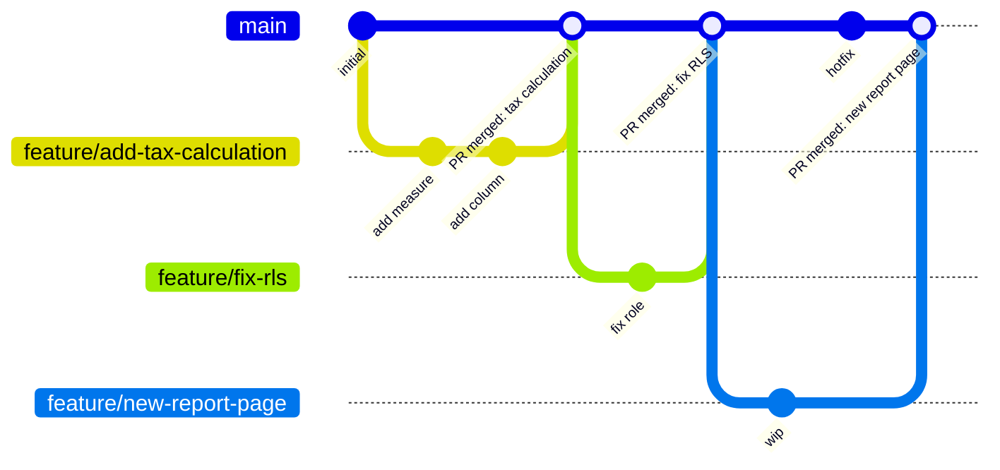

# Habilitar el desarrollo en paralelo con Git y Guardar en carpeta

<!--
<div style="padding:56.25% 0 0 0;position:relative;"><iframe src=https://player.vimeo.com/video/664699623?h=57bde801c7&amp;badge=0&amp;autopause=0&amp;player_id=0&amp;app_id=58479 frameborder="0" allow="autoplay; fullscreen; picture-in-picture" allowfullscreen style="position:absolute;top:0;left:0;width:100%;height:100%;" title="Boosting productivity"></iframe></div><script src=https://player.vimeo.com/api/player.js></script>
-->

Este artículo describe los principios del desarrollo en paralelo de modelos (es decir, la posibilidad de que varios desarrolladores trabajen en paralelo en el mismo Data model) y el rol de Tabular Editor en este contexto.

## Requisitos previos

- El destino de su Data model debe ser uno de los siguientes:
  - SQL Server 2016 (o posterior) Analysis Services Tabular
  - Azure Analysis Services
  - un Workspace de Power BI asignado a una capacidad de Fabric, Power BI Embedded, Premium heredada o a una licencia Premium Per User, con la [lectura y escritura de XMLA habilitada](https://learn.microsoft.com/en-us/fabric/enterprise/powerbi/service-premium-connect-tools#enable-xmla-read-write) (la opción predeterminada desde junio de 2025)
- Repositorio Git accesible para todos los miembros del equipo (en las instalaciones o alojado en Azure DevOps, GitHub, etc.)

## TOM como código fuente

Tradicionalmente, el desarrollo en paralelo ha sido difícil de implementar en modelos tabulares de Analysis Services y Datasets de Power BI (en este artículo, llamaremos a ambos tipos de modelos "modelos tabulares" para abreviar). Con la introducción de los metadatos del modelo basados en JSON que utiliza el [Tabular Object Model (TOM)](https://docs.microsoft.com/en-us/analysis-services/tom/introduction-to-the-tabular-object-model-tom-in-analysis-services-amo?view=asallproducts-allversions), integrar los metadatos del modelo en el control de versiones se ha vuelto, sin duda, más sencillo.

El uso de un formato de archivo basado en texto permite gestionar los cambios en conflicto de forma ordenada, mediante diversas herramientas de comparación diff que a menudo se incluyen con el sistema de control de versiones. Este tipo de resolución de conflictos de cambios es muy habitual en el desarrollo de software tradicional, donde todo el código fuente se distribuye en una gran cantidad de archivos de texto pequeños. Por este motivo, la mayoría de los sistemas de control de versiones más populares están optimizados para este tipo de archivos, con el fin de detectar cambios y resolver conflictos (de forma automática).

Para el desarrollo de modelos tabulares, el "código fuente" son nuestros metadatos de TOM basados en JSON. Al desarrollar modelos tabulares con versiones anteriores de Visual Studio, el archivo JSON Model.bim se complementaba con información sobre quién modificó qué y cuándo. Esta información simplemente se almacenaba como propiedades adicionales en los objetos JSON de todo el archivo. Esto era problemático, porque no solo era redundante (ya que el propio archivo también tiene metadatos que describen quién fue la última persona que lo editó y cuándo se realizó la última edición), sino que, desde la perspectiva del control de versiones, estos metadatos no tienen ningún _significado semántico_. En otras palabras, si eliminaras todos los metadatos de modificación del archivo, seguirías teniendo un archivo TOM JSON perfectamente válido, que podrías implementar en Analysis Services o publicar en Power BI, sin afectar a la funcionalidad ni a la lógica de negocio del modelo.

Al igual que con el código fuente en el desarrollo de software tradicional, no queremos que este tipo de información "contamine" los metadatos de nuestro modelo. De hecho, un sistema de control de versiones ofrece una vista mucho más detallada de los cambios realizados, quién los hizo, cuándo y por qué, así que no hay motivo para incluirlo como parte de los archivos que se versionan.

Cuando se creó Tabular Editor por primera vez, no había ninguna opción para deshacerse de esta información en el archivo Model.bim creado por Visual Studio, pero por suerte eso ha cambiado en versiones más recientes. Sin embargo, seguimos teniendo que lidiar con un único archivo monolítico (el archivo Model.bim) que contiene todo el "código fuente" que define el modelo.

Los desarrolladores de Datasets de Power BI lo tienen mucho peor, ya que ni siquiera tienen acceso a un archivo de texto que contenga los metadatos del modelo. Lo mejor que pueden hacer es exportar su Report de Power BI como un [archivo de plantilla de Power BI (.pbit)](https://docs.microsoft.com/en-us/power-bi/create-reports/desktop-templates#creating-report-templates), que básicamente es un archivo ZIP que contiene las páginas del Report, las definiciones del Data model y las definiciones de las consultas. Desde la perspectiva de un sistema de control de versiones, un archivo zip es un archivo binario, y los archivos binarios no se pueden hacer diff, comparar ni fusionar de la misma forma que los archivos de texto. Esto obliga a los desarrolladores de Power BI a usar herramientas de terceros o a idear scripts o procesos elaborados para versionar correctamente sus Data models, especialmente si quieren poder fusionar ramas de desarrollo paralelas dentro del mismo archivo.

Tabular Editor busca simplificar este proceso ofreciendo una forma sencilla de extraer únicamente los metadatos semánticamente relevantes del Tabular Object Model, independientemente de si ese modelo es un modelo tabular de Analysis Services o un Dataset de Power BI. Además, Tabular Editor puede dividir estos metadatos en varios archivos más pequeños mediante su función Guardar en carpeta.

## ¿Qué es Guardar en carpeta?

Como se mencionó anteriormente, los metadatos de un modelo tabular se almacenan tradicionalmente en un único archivo JSON monolítico, normalmente llamado **Model.bim**, que no es muy adecuado para integrarse con el control de versiones. Dado que el JSON de este archivo representa el [Tabular Object Model (TOM)](https://docs.microsoft.com/en-us/analysis-services/tom/introduction-to-the-tabular-object-model-tom-in-analysis-services-amo?view=asallproducts-allversions), hay una forma sencilla de dividir el archivo en partes más pequeñas: el TOM contiene arrays de objetos en casi todos los niveles, como la lista de tablas de un modelo, la lista de medidas de una tabla, la lista de anotaciones de una medida, etc. Al usar la función **Guardar en carpeta** de Tabular Editor, estos arrays se eliminan sin más del JSON y, en su lugar, se genera una subcarpeta que contiene un archivo por cada objeto del array original. Este proceso puede anidarse. El resultado es una estructura de carpetas, donde cada carpeta contiene un conjunto de archivos JSON más pequeños y subcarpetas, y que, en términos semánticos, contiene exactamente la misma información que el archivo Model.bim original:


Los nombres de cada uno de los archivos que representan objetos TOM individuales se basan simplemente en la propiedad `Name` del propio objeto. El nombre del archivo "raíz" es **Database.json**, por eso a veces nos referimos al formato de almacenamiento basado en carpetas simplemente como **Database.json**.

## Ventajas de usar Guardar en carpeta

A continuación se muestran algunas de las ventajas de almacenar los metadatos del modelo tabular en este formato basado en carpetas:

- **Muchos archivos pequeños funcionan mejor con muchos sistemas de control de versiones que unos pocos archivos grandes.** Por ejemplo, Git almacena instantáneas de los archivos modificados. Solo por este motivo ya tiene sentido que representar el modelo como varios archivos más pequeños sea mejor que almacenarlo como un único archivo grande.
- **Evita conflictos cuando se reordenan los arrays.** Las listas de tablas, medidas, columnas, etc., se representan como arrays en el JSON de Model.bim. Sin embargo, el orden de los objetos dentro del array no importa. No es raro que los objetos se reordenen durante el desarrollo del modelo, por ejemplo, debido a operaciones de cortar y pegar, etc. Con Guardar en carpeta, los objetos del array se almacenan como archivos individuales, por lo que ya no se hace seguimiento de cambios en los arrays y se reduce el riesgo de conflictos de fusión.
- **Distintos desarrolladores rara vez modifican el mismo archivo.** Mientras los desarrolladores trabajen en partes separadas del Data model, rara vez modificarán los mismos archivos, lo que reduce el riesgo de conflictos de fusión.

## Inconvenientes de usar Guardar en carpeta

Tal y como está ahora, la única desventaja de almacenar los metadatos del modelo tabular en un formato basado en carpetas es que este formato solo lo utiliza Tabular Editor. En otras palabras, no puedes cargar directamente los metadatos del modelo en Visual Studio desde el formato basado en carpetas. En su lugar, tendrías que convertir temporalmente el formato basado en carpetas al formato Model.bim, lo cual, por supuesto, puedes hacer con Tabular Editor.

## Configurar Guardar en carpeta

Una misma solución rara vez encaja en todos los casos. Tabular Editor tiene varias opciones de configuración que afectan a cómo se serializa un modelo en la estructura de carpetas. En Tabular Editor 3, puedes encontrar la configuración general en **Herramientas > Preferencia > Guardar en carpeta**. Una vez cargado un modelo en Tabular Editor, puedes encontrar la configuración específica que se aplica a ese modelo en **Modelo > Opciones de serialización...**. La configuración que se aplica a un modelo específico se almacena como una anotación dentro del propio modelo, para garantizar que se use la misma configuración independientemente del usuario que cargue y guarde el modelo.


### Configuración de serialización

- **Usar la configuración recomendada**: (Predeterminado: activado) Cuando esta opción está activada, Tabular Editor usa la configuración predeterminada la primera vez que guarda un modelo como una estructura de carpetas.
- **Serializar relaciones en las tablas de origen**: (Predeterminado: desactivado) Cuando esta opción está activada, Tabular Editor almacena las relaciones como una anotación en la tabla del "lado de origen" (normalmente, la tabla de hechos) de la relación, en lugar de almacenarlas a nivel de modelo. Esto resulta útil en las primeras fases de desarrollo de un modelo, cuando los nombres de las tablas aún cambian con bastante frecuencia.
- **Serializar información de pertenencia a perspectivas en los objetos**: (Predeterminado: desactivado) Cuando esta opción está activada, Tabular Editor almacena la información sobre a qué perspectivas pertenece un objeto (tabla, columna, jerarquía, medida) como una anotación en ese objeto, en lugar de almacenar la información a nivel de perspectiva. Esto resulta útil cuando los nombres de los objetos pueden cambiar, pero los nombres de las perspectivas ya están finalizados.
- **Serializar traducciones en los objetos traducidos**: (Predeterminado: desactivado) Cuando esta opción está activada, Tabular Editor almacena las traducciones de metadatos como una anotación en cada objeto traducible (tabla, columna, jerarquía, nivel, medida, etc.), en lugar de almacenarlas a nivel de configuración regional. Esto resulta útil cuando los nombres de los objetos pueden cambiar.
- **Anteponer números secuenciales a los nombres de archivo**: (Predeterminado: desactivado) En los casos en los que quieras conservar el orden de metadatos de los miembros del array (como el orden de las columnas en una tabla), puedes activar esta opción para que Tabular Editor anteponga a los nombres de archivo un número entero secuencial basado en el índice del objeto en el array. Esto resulta útil si usas la funcionalidad de drillthrough predeterminada de Excel y quieres que [las columnas aparezcan en un orden concreto en el drillthrough](https://github.com/TabularEditor/TabularEditor/issues/46#issuecomment-297932090).

> [!NOTE]
> El propósito principal de las opciones de configuración descritas arriba es reducir el número de conflictos de fusión durante el desarrollo del modelo, ajustando cómo y dónde se almacenan determinados metadatos del modelo. En las primeras fases del desarrollo del modelo, es habitual que los objetos se renombren con frecuencia. Si un modelo ya tiene traducciones de metadatos especificadas, cada cambio de nombre de un objeto provocaría al menos dos cambios: uno en el objeto que se renombra y otro por cada configuración regional que defina una traducción en ese objeto. Cuando se activa **Serializar traducciones en objetos traducidos**, solo habría un cambio en el objeto que se renombra, ya que ese objeto también incluye los valores traducidos (puesto que esta información se almacenaría como una anotación).

### Profundidad de serialización

La lista de verificación te permite especificar qué objetos se serializarán como archivos individuales. Ten en cuenta que algunas opciones (perspectivas, traducciones, relaciones) pueden no estar disponibles, en función de la configuración indicada anteriormente.

En la mayoría de los casos, se recomienda serializar siempre los objetos al nivel más bajo. Sin embargo, puede haber casos especiales en los que no se necesite este nivel de detalle.

## Power BI y control de versiones

Como se mencionó anteriormente, integrar un archivo de Report de Power BI (.pbix) o una plantilla de Power BI (.pbit) en el control de versiones no permite el desarrollo en paralelo ni la resolución de conflictos, ya que estos archivos usan un formato binario. Al mismo tiempo, debemos ser conscientes de las limitaciones actuales al usar Tabular Editor (u otras herramientas de terceros) con Power BI Desktop o con el punto de conexión XMLA de Power BI, respectivamente.

Estas limitaciones son:

- Al usar Tabular Editor como herramienta externa para Power BI Desktop, [no se admiten todas las operaciones de modelado](xref:desktop-limitations).
- Tabular Editor puede extraer metadatos del modelo desde un archivo .pbix cargado en Power BI Desktop o directamente desde un archivo .pbit en disco, pero **no existe ninguna forma compatible de actualizar los metadatos del modelo en un archivo .pbix o .pbit fuera de Power BI Desktop**.
- Una vez que se realiza cualquier cambio en un Dataset de Power BI a través del punto de conexión XMLA, [ese Dataset ya no se puede descargar como archivo .pbix](https://docs.microsoft.com/en-us/power-bi/admin/service-premium-connect-tools#power-bi-desktop-authored-datasets).

Para habilitar el desarrollo en paralelo, debemos poder almacenar los metadatos del modelo en uno de los formatos basados en texto (JSON) mencionados anteriormente (Model.bim o Database.json). No hay forma de "recrear" un archivo .pbix o .pbit a partir del formato basado en texto, así que **una vez que decidamos seguir esta ruta, ya no podremos usar Power BI Desktop para editar el Data model**. En su lugar, tendremos que apoyarnos en herramientas que puedan usar el formato basado en JSON, que es precisamente el propósito de Tabular Editor.

> [!WARNING]
> Si no tiene acceso a un Workspace de Power BI asignado a una capacidad o a una licencia Premium Per User, no podrá publicar los metadatos del modelo almacenados en los archivos JSON, ya que esta operación requiere acceso al [punto de conexión XMLA](https://learn.microsoft.com/en-us/fabric/enterprise/powerbi/service-premium-connect-tools).

> [!NOTE]
> Power BI Desktop sigue siendo necesario para crear la parte Visual del Report. Es una [buena práctica separar siempre los Report de los modelos](https://docs.microsoft.com/en-us/power-bi/guidance/report-separate-from-model). Si tienes un archivo de Power BI existente que incluye ambos, [esta entrada de blog](https://powerbi.tips/2020/06/split-an-existing-power-bi-file-into-a-model-and-report/) ([vídeo](https://www.youtube.com/watch?v=PlrtBm9YN_Q)) describe cómo dividirlo en un archivo de modelo y un archivo de Report.

## Tabular Editor y git

Git es un sistema de control de versiones distribuido, gratuito y de código abierto, diseñado para gestionar desde proyectos pequeños hasta proyectos muy grandes con rapidez y eficiencia. Es el sistema de control de versiones más popular actualmente y está disponible mediante varias opciones alojadas, como [Azure DevOps](https://azure.microsoft.com/en-us/services/devops/repos/), [GitHub](https://github.com/), [GitLab](https://about.gitlab.com/) y otras.

Una descripción detallada de Git queda fuera del alcance de este artículo. Aun así, hay muchos recursos disponibles en Internet si quieres aprender más. Recomendamos el libro [Pro Git](https://git-scm.com/book/en/v2) como referencia.

> [!NOTE]
> Actualmente, Tabular Editor 3 no tiene ninguna integración con Git ni con otros sistemas de control de versiones. Para administrar tu repositorio de Git, realizar commits de cambios de código, crear ramas, etc., tendrás que usar la línea de comandos de Git u otra herramienta, como [Visual Studio Team Explorer](https://docs.microsoft.com/en-us/azure/devops/user-guide/work-team-explorer?view=azure-devops#git-version-control-and-repository) o [TortoiseGit](https://tortoisegit.org/).

Como se mencionó antes, recomendamos usar la opción [Guardar en carpeta](#what-is-save-to-folder) de Tabular Editor al guardar los metadatos del modelo en un repositorio de código de Git.

## Estrategia de ramificación

A continuación, se analiza qué estrategias de ramificación conviene usar al desarrollar modelos tabulares.

La estrategia de ramificación determinará cómo será el flujo de trabajo diario de desarrollo y, en muchos casos, las ramas se alinearán directamente con las metodologías que utilice tu equipo. Por ejemplo, al usar el [proceso ágil en Azure DevOps](https://docs.microsoft.com/en-us/azure/devops/boards/work-items/guidance/agile-process-workflow?view=azure-devops), tu backlog constaría de **Épicas**, **Características**, **Historias de usuario**, **Tareas** y **Defectos**.

En la terminología ágil, una **Historia de usuario** es una unidad de trabajo entregable y comprobable. The User Story may consist of several **Tasks** — smaller pieces of work performed by a developer before the User Story can be delivered. In an ideal world, all User Stories are broken down into manageable tasks, each taking only a couple of hours to complete, adding up to no more than a handful of days for the entire User Story. This makes a User Story an ideal candidate for a short-lived feature branch, where the developer makes one or more commits per task before the branch is merged and the code deployed for testing.

Determining a suitable branching strategy depends on many different factors: team size, release cadence, regulatory constraints, how many semantic models you maintain, and how mature your CI/CD setup already is. This article presents three strategies:

- **[GitHub Flow + Octopus Merge](#github-flow--octopus-merge)** — our recommended approach for most semantic model teams, and the primary focus of this article.
- **[GitFlow](#gitflow-branching-and-deployment-environments)** — a valid alternative, particularly suited to teams with formal, infrequent release cycles or regulatory sign-off requirements.
- **[Plain trunk-based development](#trunk-based-development)** — the simplest approach, worth understanding as a baseline even if most BI teams will want the additional structure GitHub Flow provides.

> [!NOTE]
> Tabular Editor is agnostic to branching strategy. Save to Folder and Workspace Mode work identically regardless of which of the strategies below you choose — the recommendation in this article is based on patterns we've seen succeed across enterprise engagements, not a constraint imposed by the tool.

## GitHub Flow + Octopus Merge

For teams building semantic models with Tabular Editor and Power BI, we recommend **[GitHub Flow](https://docs.github.com/en/get-started/using-github/github-flow)** combined with an **Octopus Merge** pattern for continuous integration testing.

GitHub Flow is a lightweight branching model with a single hard rule: **`main` is always deployable.** All work happens on a short-lived feature branch created off `main`; nobody commits directly to `main`; branches are merged back via pull request after review and automated checks pass. Unlike GitFlow, there's no `develop` branch and no separate branch per environment — environment promotion (dev → test → UAT → production) is handled by the deployment pipeline, not by long-lived branches.



`main` stays on a single line and is always deployable; short feature branches fork off it and merge straight back via pull request. Contrast this with the GitFlow diagram further down the page, which has five parallel, long-lived lines.

On its own, GitHub Flow doesn't answer a question specific to BI teams: what does your shared test environment reflect at any given moment, when several developers each have an open pull request? **Octopus Merge** answers this: a CI pipeline continuously merges every currently open pull request into a disposable branch and deploys the result to a shared test environment — so business users always validate the combination of everything in progress, not just one feature in isolation. See [GitHub Flow and the Octopus Merge pattern](xref:github-flow) for how the pattern works and how to build it.

A few reasons this combination fits semantic model development particularly well:

- **Simpler mental model.** Two branch concepts instead of GitFlow's five means less onboarding overhead, particularly on teams that include report authors and business analysts alongside model developers.
- **`main` is always deployable.** If you need to ship an urgent fix — a broken measure, a security-related RLS change — you don't need to reason about which of several long-lived branches currently reflects production.
- **Environment promotion lives in the pipeline, not the branch structure.** Adding a new environment is a pipeline change, not a new permanent branch every developer has to remember to merge into.
- **Short-lived branches reduce merge conflicts** — important for Octopus Merge, since it merges every open branch together for integration testing. The shorter each branch lives, the smaller the surface area for conflicts.
- **Better fit for continuous delivery of data products** than GitFlow's versioned release-train model, since semantic models tend to evolve incrementally rather than ship in discrete releases.

None of this means GitFlow is wrong — see [GitFlow branching and deployment environments](#gitflow-branching-and-deployment-environments) below for when it's still a good fit.

### Key principles

- `main` is always in a deployable state.
- Feature branches are short-lived and independent.
- The test environment always reflects the combination of everything currently in progress — not just one feature in isolation. See [GitHub Flow and the Octopus Merge pattern](xref:github-flow) for how.
- Fabric Git integration should **not** be enabled on any workspace used for Tabular Editor workspace databases — Tabular Editor writes to workspace databases directly through the XMLA endpoint, and those writes have no relationship to your Git branches. This is also called out in the [Workspace Mode documentation](xref:workspace-mode).

## Ramificación de GitFlow y entornos de despliegue

GitFlow remains a solid choice for teams with a genuine need for the structure it provides — for example, formal versioned releases, regulatory sign-off gates tied to specific branches, or infrequent (e.g. monthly or quarterly) release cycles where a persistent `develop` branch and release branches map naturally onto your process. If that describes your team, the approach below is well worth using.

La estrategia descrita a continuación se basa en [GitFlow de Vincent Driessen](https://nvie.com/posts/a-successful-git-branching-model/).


Implementing a branching strategy similar to this can help solve some of the DevOps problems typically encountered by BI teams, provided you put some thought into how the branches correlate to your deployment environments. En un mundo ideal, necesitarías al menos 4 entornos distintos para dar soporte completo a GitFlow:

- El entorno de **producción**, que siempre debería contener el código del HEAD de la rama master.
- Un entorno **canary**, que siempre debería contener el código del HEAD de la rama develop. Aquí es donde normalmente programas despliegues nocturnos y ejecutas las pruebas de integración para asegurarte de que las funcionalidades que entrarán en la próxima versión para producción funcionen bien juntas.
- Uno o varios entornos de **UAT** donde tú y los usuarios de negocio probáis y validáis nuevas funcionalidades. El despliegue se hace directamente desde la rama de funcionalidad que contiene el código que debe probarse. Necesitarás varios entornos de prueba si quieres probar varias funcionalidades nuevas en paralelo. Con un poco de coordinación, suele bastar con un único entorno de pruebas, siempre que consideres cuidadosamente las dependencias entre tus capas de BI.
- Uno o varios entornos **sandbox** en los que tú y tu equipo pueden desarrollar nuevas funcionalidades sin afectar a ninguno de los entornos anteriores. Al igual que con el entorno de pruebas, normalmente basta con tener un único entorno sandbox compartido.

Tenemos que recalcar que, en realidad, no existe una solución que sirva para todo. Quizá no estés construyendo tu solución en la nube y, por tanto, no tengas la escalabilidad o flexibilidad para aprovisionar nuevos recursos en segundos o minutos. O quizá tus volúmenes de datos sean muy grandes, lo que hace poco práctico replicar entornos por limitaciones de recursos, coste o tiempo.

Aunque necesites dar soporte al desarrollo en paralelo, es posible que varios desarrolladores compartan sin problema el mismo entorno de desarrollo o sandbox, sin demasiadas complicaciones. Specifically for tabular models, though, we recommend that developers still use individual [workspace databases](xref:workspace-mode) to avoid "stepping over each others toes."

> [!NOTE]
> If you're evaluating GitFlow primarily because you need a shared, always-current test environment reflecting in-progress work, consider whether [GitHub Flow + Octopus Merge](#github-flow--octopus-merge) might achieve the same outcome with less branch-management overhead. GitFlow's `develop`/canary branch and Octopus Merge's disposable test branch solve a similar problem in different ways.

## Trunk-based development

Trunk-based development is the simplest possible branching model: developers commit small, frequent changes either directly to `main`, or via very short-lived feature branches that are merged back within hours. Microsoft recommends [trunk-based development](https://docs.microsoft.com/en-us/azure/devops/repos/git/git-branching-guidance?view=azure-devops) ([video](https://youtu.be/t_4lLR6F_yk?t=232)) generally for agile, continuous delivery of small increments.


In its purest form, trunk-based development can run into real friction for BI teams:

- New features often require prolonged testing and validation by business users, which may take several weeks — so you need somewhere for in-progress work to be validated that isn't `main` itself.
- BI solutions are multi-tiered (Data Warehouse/ETL, Master Data Management, semantic layer, reports), with dependencies between layers that complicate testing and deployment.
- A BI team may maintain several semantic models at different maturity stages and paces.
- Data — not just code — has to be loaded, ETL'd, and processed to make a change testable. Including full data refreshes in every build could blow up pipeline runtimes from minutes to hours, and isn't always feasible at all for very large fact tables.

**GitHub Flow + Octopus Merge, described above, is best understood as a refinement of trunk-based development that directly addresses these concerns** — rather than a departure from it. It keeps trunk-based development's core simplicity (one long-lived branch, short-lived feature branches, no release trains) while adding exactly the missing piece BI teams need: a shared test environment, populated by the pipeline rather than by a long-lived branch, that always reflects the current combined state of in-progress work. If you're choosing between the three strategies on this page, GitHub Flow + Octopus Merge is generally where we'd point a team that likes the simplicity of trunk-based development but has run into the limitations above.

## Flujo de trabajo habitual

Suponiendo que ya tienes un repositorio Git configurado y alineado con tu estrategia de ramificación, añadir el "código fuente" de tu modelo tabular al repositorio consiste simplemente en usar Tabular Editor para guardar los metadatos en una nueva rama de un repositorio local. Then, you stage and commit the new files, push your branch to the remote repository, and create a pull request to get your branch merged into the main branch.

The exact commands are the same regardless of which strategy above you choose — what differs is what happens _after_ the pull request is opened (see [GitHub Flow and the Octopus Merge pattern](xref:github-flow) for the GitHub Flow case, or your release/canary process for GitFlow). In general, the workflow looks like this:

1. Before starting work on a new feature, create a new feature branch in git:

   ```cmd
   git checkout main
   git pull
   git checkout -b feature/add-tax-calculation
   ```

2. Abre los metadatos de tu modelo desde el repositorio git local en Tabular Editor. Idealmente, usa una [base de datos de Workspace](xref:workspace-mode) para facilitar las pruebas y la depuración del código DAX.

3. Realiza los cambios necesarios en tu modelo usando Tabular Editor. Guarda los cambios de forma continua (CTRL+S). Haz commit de los cambios de código en git con regularidad después de guardar, para evitar perder trabajo y mantener un historial completo de todos los cambios realizados:

   ```cmd
   git add .
   git commit -m "Description of what was changed and why since last commit"
   git push
   ```

4. Si no usas una base de datos de Workspace, utiliza la opción **Model > Deploy...** de Tabular Editor para desplegar en un entorno sandbox o de desarrollo, y así probar los cambios realizados en los metadatos del modelo.

5. Cuando hayas terminado y todo el código se haya confirmado y enviado al repositorio remoto, envía una solicitud de incorporación de cambios para que tu código quede integrado con la rama principal. Si se produce un conflicto de fusión, tendrás que resolverlo localmente; por ejemplo, con Visual Studio Team Explorer o simplemente abriendo los archivos .json en un editor de texto para resolver los conflictos (Git inserta marcadores de conflicto para indicar qué partes del código tienen conflictos).

6. Once all conflicts are resolved, there may be a process of code review and automated build/test execution — including, if you're using the GitHub Flow approach above, the Octopus Merge test deployment — before the pull request can be completed.

We present more details about how to configure git branch policies, set up automated build and deployment pipelines, etc. using Azure DevOps and GitHub Actions in the following articles. Similar techniques can be used in other automated build and git hosting environments, such as TeamCity, GitLab, etc.

## Siguientes pasos

- @powerbi-cicd
- @as-cicd
- @optimizing-workflow-workspace-mode