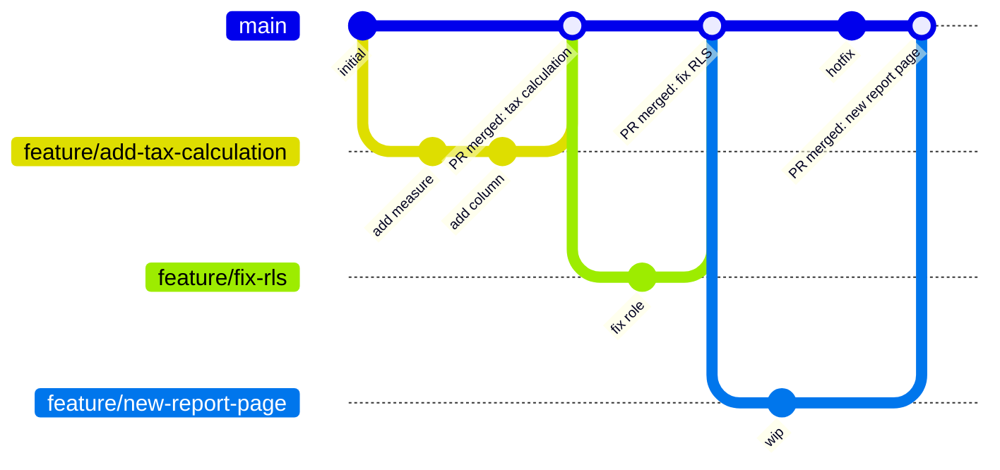

# Habilitar el desarrollo en paralelo con Git y Guardar en carpeta

<!--
<div style="padding:56.25% 0 0 0;position:relative;"><iframe src=https://player.vimeo.com/video/664699623?h=57bde801c7&amp;badge=0&amp;autopause=0&amp;player_id=0&amp;app_id=58479 frameborder="0" allow="autoplay; fullscreen; picture-in-picture" allowfullscreen style="position:absolute;top:0;left:0;width:100%;height:100%;" title="Boosting productivity"></iframe></div><script src=https://player.vimeo.com/api/player.js></script>
-->

Este artículo describe los principios del desarrollo en paralelo de modelos (es decir, la posibilidad de que varios desarrolladores trabajen en paralelo en el mismo Data model) y el rol de Tabular Editor en este contexto.

## Requisitos previos

- El destino de su Data model debe ser uno de los siguientes:
  - SQL Server 2016 (o posterior) Analysis Services Tabular
  - Azure Analysis Services
  - un Workspace de Power BI asignado a una capacidad de Fabric, a una capacidad de Power BI Embedded, a una capacidad Premium heredada o a una licencia Premium Per User, con [lectura/escritura XMLA habilitada](https://learn.microsoft.com/en-us/fabric/enterprise/powerbi/service-premium-connect-tools#enable-xmla-read-write) (la opción predeterminada desde junio de 2025)
- Repositorio Git accesible para todos los miembros del equipo (en las instalaciones o alojado en Azure DevOps, GitHub, etc.)

## TOM como código fuente

Tradicionalmente, el desarrollo en paralelo ha sido difícil de implementar en modelos tabulares de Analysis Services y Datasets de Power BI (en este artículo, llamaremos a ambos tipos de modelos "modelos tabulares" para abreviar). Con la introducción de los metadatos del modelo basados en JSON que utiliza el [Tabular Object Model (TOM)](https://docs.microsoft.com/en-us/analysis-services/tom/introduction-to-the-tabular-object-model-tom-in-analysis-services-amo?view=asallproducts-allversions), integrar los metadatos del modelo en el control de versiones se ha vuelto, sin duda, más sencillo.

El uso de un formato de archivo basado en texto permite gestionar los cambios en conflicto de forma ordenada, mediante diversas herramientas de comparación diff que a menudo se incluyen con el sistema de control de versiones. Este tipo de resolución de conflictos de cambios es muy habitual en el desarrollo de software tradicional, donde todo el código fuente se distribuye en una gran cantidad de archivos de texto pequeños. Por este motivo, la mayoría de los sistemas de control de versiones más populares están optimizados para este tipo de archivos, con el fin de detectar cambios y resolver conflictos (de forma automática).

Para el desarrollo de modelos tabulares, el "código fuente" son nuestros metadatos de TOM basados en JSON. Al desarrollar modelos tabulares con versiones anteriores de Visual Studio, el archivo JSON Model.bim se complementaba con información sobre quién modificó qué y cuándo. Esta información simplemente se almacenaba como propiedades adicionales en los objetos JSON de todo el archivo. Esto era problemático, porque no solo era redundante (ya que el propio archivo también tiene metadatos que describen quién fue la última persona que lo editó y cuándo se realizó la última edición), sino que, desde la perspectiva del control de versiones, estos metadatos no tienen ningún _significado semántico_. En otras palabras, si eliminaras todos los metadatos de modificación del archivo, seguirías teniendo un archivo TOM JSON perfectamente válido, que podrías implementar en Analysis Services o publicar en Power BI, sin afectar a la funcionalidad ni a la lógica de negocio del modelo.

Al igual que con el código fuente en el desarrollo de software tradicional, no queremos que este tipo de información "contamine" los metadatos de nuestro modelo. De hecho, un sistema de control de versiones ofrece una vista mucho más detallada de los cambios realizados, quién los hizo, cuándo y por qué, así que no hay motivo para incluirlo como parte de los archivos que se versionan.

Cuando se creó Tabular Editor por primera vez, no había ninguna opción para deshacerse de esta información en el archivo Model.bim creado por Visual Studio, pero por suerte eso ha cambiado en versiones más recientes. Sin embargo, seguimos teniendo que lidiar con un único archivo monolítico (el archivo Model.bim) que contiene todo el "código fuente" que define el modelo.

Los desarrolladores de Datasets de Power BI lo tienen mucho peor, ya que ni siquiera tienen acceso a un archivo de texto que contenga los metadatos del modelo. Lo mejor que pueden hacer es exportar su Report de Power BI como un [archivo de plantilla de Power BI (.pbit)](https://docs.microsoft.com/en-us/power-bi/create-reports/desktop-templates#creating-report-templates), que básicamente es un archivo ZIP que contiene las páginas del Report, las definiciones del Data model y las definiciones de las consultas. Desde la perspectiva de un sistema de control de versiones, un archivo zip es un archivo binario, y los archivos binarios no se pueden hacer diff, comparar ni fusionar de la misma forma que los archivos de texto. Esto obliga a los desarrolladores de Power BI a usar herramientas de terceros o a idear scripts o procesos elaborados para versionar correctamente sus Data models, especialmente si quieren poder fusionar ramas de desarrollo paralelas dentro del mismo archivo.

Tabular Editor busca simplificar este proceso ofreciendo una forma sencilla de extraer únicamente los metadatos semánticamente relevantes del Tabular Object Model, independientemente de si ese modelo es un modelo tabular de Analysis Services o un Dataset de Power BI. Además, Tabular Editor puede dividir estos metadatos en varios archivos más pequeños mediante su función Guardar en carpeta.

## ¿Qué es Guardar en carpeta?

Como se mencionó anteriormente, los metadatos de un modelo tabular se almacenan tradicionalmente en un único archivo JSON monolítico, normalmente llamado **Model.bim**, que no es muy adecuado para integrarse con el control de versiones. Dado que el JSON de este archivo representa el [Tabular Object Model (TOM)](https://docs.microsoft.com/en-us/analysis-services/tom/introduction-to-the-tabular-object-model-tom-in-analysis-services-amo?view=asallproducts-allversions), hay una forma sencilla de dividir el archivo en partes más pequeñas: el TOM contiene arrays de objetos en casi todos los niveles, como la lista de tablas de un modelo, la lista de medidas de una tabla, la lista de anotaciones de una medida, etc. Al usar la función **Guardar en carpeta** de Tabular Editor, estos arrays se eliminan sin más del JSON y, en su lugar, se genera una subcarpeta que contiene un archivo por cada objeto del array original. Este proceso puede anidarse. El resultado es una estructura de carpetas, donde cada carpeta contiene un conjunto de archivos JSON más pequeños y subcarpetas, y que, en términos semánticos, contiene exactamente la misma información que el archivo Model.bim original:


Los nombres de cada uno de los archivos que representan objetos TOM individuales se basan simplemente en la propiedad `Name` del propio objeto. El nombre del archivo "raíz" es **Database.json**, por eso a veces nos referimos al formato de almacenamiento basado en carpetas simplemente como **Database.json**.

Tabular Editor separa las [funciones DAX definidas por el usuario](xref:udfs) de la misma manera y las coloca en una carpeta `functions` en la raíz del modelo. Activa esta opción en cuanto haya más de una persona escribiendo funciones: hasta que lo hagas, todas las funciones estarán dentro de **Database.json**. Consulta [Guardar en carpeta](xref:save-to-folder#user-defined-functions-udfs).

## Ventajas de usar Guardar en carpeta

A continuación se muestran algunas de las ventajas de almacenar los metadatos del modelo tabular en este formato basado en carpetas:

- **Muchos archivos pequeños funcionan mejor con muchos sistemas de control de versiones que unos pocos archivos grandes.** Por ejemplo, Git almacena instantáneas de los archivos modificados. Solo por este motivo ya tiene sentido que representar el modelo como varios archivos más pequeños sea mejor que almacenarlo como un único archivo grande.
- **Evita conflictos cuando se reordenan los arrays.** Las listas de tablas, medidas, columnas, etc., se representan como arrays en el JSON de Model.bim. Sin embargo, el orden de los objetos dentro del array no importa. No es raro que los objetos se reordenen durante el desarrollo del modelo, por ejemplo, debido a operaciones de cortar y pegar, etc. Con Guardar en carpeta, los objetos del array se almacenan como archivos individuales, por lo que ya no se hace seguimiento de cambios en los arrays y se reduce el riesgo de conflictos de fusión.
- **Distintos desarrolladores rara vez modifican el mismo archivo.** Mientras los desarrolladores trabajen en partes separadas del Data model, rara vez modificarán los mismos archivos, lo que reduce el riesgo de conflictos de fusión.

## Inconvenientes de usar Guardar en carpeta

Tal y como está ahora, la única desventaja de almacenar los metadatos del modelo tabular en un formato basado en carpetas es que este formato solo lo utiliza Tabular Editor. En otras palabras, no puedes cargar directamente los metadatos del modelo en Visual Studio desde el formato basado en carpetas. En su lugar, tendrías que convertir temporalmente el formato basado en carpetas al formato Model.bim, lo cual, por supuesto, puedes hacer con Tabular Editor.

## Configurar Guardar en carpeta

Una misma solución rara vez encaja en todos los casos. Tabular Editor tiene varias opciones de configuración que afectan a cómo se serializa un modelo en la estructura de carpetas. En Tabular Editor 3, puedes encontrar la configuración general en **Herramientas > Preferencia > Guardar en carpeta**. Una vez cargado un modelo en Tabular Editor, puedes encontrar la configuración específica que se aplica a ese modelo en **Modelo > Opciones de serialización...**. La configuración que se aplica a un modelo específico se almacena como una anotación dentro del propio modelo, para garantizar que se use la misma configuración independientemente del usuario que cargue y guarde el modelo.


### Configuración de serialización

- **Usar la configuración recomendada**: (Predeterminado: activado) Cuando esta opción está activada, Tabular Editor usa la configuración predeterminada la primera vez que guarda un modelo como una estructura de carpetas.
- **Serializar relaciones en las tablas de origen**: (Predeterminado: desactivado) Cuando esta opción está activada, Tabular Editor almacena las relaciones como una anotación en la tabla del "lado de origen" (normalmente, la tabla de hechos) de la relación, en lugar de almacenarlas a nivel de modelo. Esto resulta útil en las primeras fases de desarrollo de un modelo, cuando los nombres de las tablas aún cambian con bastante frecuencia.
- **Serializar información de pertenencia a perspectivas en los objetos**: (Predeterminado: desactivado) Cuando esta opción está activada, Tabular Editor almacena la información sobre a qué perspectivas pertenece un objeto (tabla, columna, jerarquía, medida) como una anotación en ese objeto, en lugar de almacenar la información a nivel de perspectiva. Esto resulta útil cuando los nombres de los objetos pueden cambiar, pero los nombres de las perspectivas ya están finalizados.
- **Serializar traducciones en los objetos traducidos**: (Predeterminado: desactivado) Cuando esta opción está activada, Tabular Editor almacena las traducciones de metadatos como una anotación en cada objeto traducible (tabla, columna, jerarquía, nivel, medida, etc.), en lugar de almacenarlas a nivel de configuración regional. Esto resulta útil cuando los nombres de los objetos pueden cambiar.
- **Anteponer números secuenciales a los nombres de archivo**: (Predeterminado: desactivado) En los casos en los que quieras conservar el orden de metadatos de los miembros del array (como el orden de las columnas en una tabla), puedes activar esta opción para que Tabular Editor anteponga a los nombres de archivo un número entero secuencial basado en el índice del objeto en el array. Esto resulta útil si usas la funcionalidad de drillthrough predeterminada de Excel y quieres que [las columnas aparezcan en un orden concreto en el drillthrough](https://github.com/TabularEditor/TabularEditor/issues/46#issuecomment-297932090).

> [!NOTE]
> El propósito principal de las opciones de configuración descritas arriba es reducir el número de conflictos de fusión durante el desarrollo del modelo, ajustando cómo y dónde se almacenan determinados metadatos del modelo. En las primeras fases del desarrollo del modelo, es habitual que los objetos se renombren con frecuencia. Si un modelo ya tiene traducciones de metadatos especificadas, cada cambio de nombre de un objeto provocaría al menos dos cambios: uno en el objeto que se renombra y otro por cada configuración regional que defina una traducción en ese objeto. Cuando se activa **Serializar traducciones en objetos traducidos**, solo habría un cambio en el objeto que se renombra, ya que ese objeto también incluye los valores traducidos (puesto que esta información se almacenaría como una anotación).

### Profundidad de serialización

La lista de verificación te permite especificar qué objetos se serializarán como archivos individuales. Ten en cuenta que algunas opciones (perspectivas, traducciones, relaciones) pueden no estar disponibles, en función de la configuración indicada anteriormente.

En la mayoría de los casos, se recomienda serializar siempre los objetos al nivel más bajo. Sin embargo, puede haber casos especiales en los que no se necesite este nivel de detalle.

## Power BI y control de versiones

Como se mencionó anteriormente, integrar un archivo de Report de Power BI (.pbix) o una plantilla de Power BI (.pbit) en el control de versiones no permite el desarrollo en paralelo ni la resolución de conflictos, ya que estos archivos usan un formato binario. Al mismo tiempo, debemos ser conscientes de las limitaciones actuales al usar Tabular Editor (u otras herramientas de terceros) con Power BI Desktop o con el punto de conexión XMLA de Power BI, respectivamente.

Estas limitaciones son:

- Al usar Tabular Editor como herramienta externa para Power BI Desktop, [no se admiten todas las operaciones de modelado](xref:desktop-limitations).
- Tabular Editor puede extraer metadatos del modelo desde un archivo .pbix cargado en Power BI Desktop o directamente desde un archivo .pbit en disco, pero **no existe ninguna forma compatible de actualizar los metadatos del modelo en un archivo .pbix o .pbit fuera de Power BI Desktop**.
- Una vez que se realiza cualquier cambio en un Dataset de Power BI a través del punto de conexión XMLA, [ese Dataset ya no se puede descargar como archivo .pbix](https://docs.microsoft.com/en-us/power-bi/admin/service-premium-connect-tools#power-bi-desktop-authored-datasets).

Para habilitar el desarrollo en paralelo, debemos poder almacenar los metadatos del modelo en uno de los formatos basados en texto (JSON) mencionados anteriormente (Model.bim o Database.json). No hay forma de "recrear" un archivo .pbix o .pbit a partir del formato basado en texto, así que **una vez que decidamos seguir esta ruta, ya no podremos usar Power BI Desktop para editar el Data model**. En su lugar, tendremos que apoyarnos en herramientas que puedan usar el formato basado en JSON, que es precisamente el propósito de Tabular Editor.

> [!WARNING]
> Si no tienes acceso a un Workspace asignado a una capacidad o a una licencia Premium Per User, no podrás publicar los metadatos del modelo almacenados en los archivos JSON, ya que esta operación requiere acceso al [punto de conexión XMLA](https://learn.microsoft.com/en-us/fabric/enterprise/powerbi/service-premium-connect-tools).

> [!NOTE]
> Power BI Desktop sigue siendo necesario para crear la parte Visual del Report. Es una [buena práctica separar siempre los Report de los modelos](https://docs.microsoft.com/en-us/power-bi/guidance/report-separate-from-model). Si tienes un archivo de Power BI existente que incluye ambos, [esta entrada de blog](https://powerbi.tips/2020/06/split-an-existing-power-bi-file-into-a-model-and-report/) ([vídeo](https://www.youtube.com/watch?v=PlrtBm9YN_Q)) describe cómo dividirlo en un archivo de modelo y un archivo de Report.

## Tabular Editor y git

Git es un sistema de control de versiones distribuido, gratuito y de código abierto, diseñado para gestionar desde proyectos pequeños hasta proyectos muy grandes con rapidez y eficiencia. Es el sistema de control de versiones más popular actualmente y está disponible mediante varias opciones alojadas, como [Azure DevOps](https://azure.microsoft.com/en-us/services/devops/repos/), [GitHub](https://github.com/), [GitLab](https://about.gitlab.com/) y otras.

Una descripción detallada de Git queda fuera del alcance de este artículo. Aun así, hay muchos recursos disponibles en Internet si quieres aprender más. Recomendamos el libro [Pro Git](https://git-scm.com/book/en/v2) como referencia.

> [!NOTE]
> Actualmente, Tabular Editor 3 no tiene ninguna integración con Git ni con otros sistemas de control de versiones. Para administrar tu repositorio de Git, realizar commits de cambios de código, crear ramas, etc., tendrás que usar la línea de comandos de Git u otra herramienta, como [Visual Studio Team Explorer](https://docs.microsoft.com/en-us/azure/devops/user-guide/work-team-explorer?view=azure-devops#git-version-control-and-repository) o [TortoiseGit](https://tortoisegit.org/).

Como se mencionó antes, recomendamos usar la opción [Guardar en carpeta](#what-is-save-to-folder) de Tabular Editor al guardar los metadatos del modelo en un repositorio de código de Git.

## Estrategia de ramificación

A continuación, se analiza qué estrategias de ramificación conviene usar al desarrollar modelos tabulares.

La estrategia de ramificación determinará cómo será el flujo de trabajo diario de desarrollo y, en muchos casos, las ramas se alinearán directamente con las metodologías que utilice tu equipo. Por ejemplo, al usar el [proceso ágil en Azure DevOps](https://docs.microsoft.com/en-us/azure/devops/boards/work-items/guidance/agile-process-workflow?view=azure-devops), tu backlog constaría de **Épicas**, **Características**, **Historias de usuario**, **Tareas** y **Defectos**.

En la terminología ágil, una **Historia de usuario** es una unidad de trabajo entregable y comprobable. La historia de usuario puede constar de varias **tareas**: unidades de trabajo más pequeñas que realiza un desarrollador antes de poder entregar la historia de usuario. En un mundo ideal, todas las historias de usuario se desglosan en tareas manejables; cada una tarda solo un par de horas en completarse, y en total suman, como mucho, unos pocos días para toda la historia de usuario. Esto convierte una historia de usuario en una candidata ideal para una rama de funcionalidad de corta duración, en la que el desarrollador realiza uno o varios commits por tarea antes de que la rama se integre y el código se despliegue para pruebas.

Determinar una estrategia de ramas adecuada depende de muchos factores: el tamaño del equipo, la cadencia de lanzamiento, las restricciones normativas, cuántos modelos semánticos mantienes y el grado de madurez de tu configuración de CI/CD. Este artículo presenta tres estrategias:

- **[GitHub Flow + Octopus Merge](#github-flow--octopus-merge)** — nuestro enfoque recomendado para la mayoría de los equipos de modelos semánticos y el foco principal de este artículo.
- **[GitFlow](#gitflow-branching-and-deployment-environments)** — una alternativa válida, especialmente adecuada para equipos con ciclos de lanzamiento formales y poco frecuentes o con requisitos de aprobación normativa.
- **[Plain trunk-based development](#trunk-based-development)** — el enfoque más sencillo; merece la pena entenderlo como referencia, aunque la mayoría de los equipos de BI querrán la estructura adicional que ofrece GitHub Flow.

> [!NOTE]
> Tabular Editor es agnóstico respecto a la estrategia de ramas. Guardar en carpeta y el modo del área de trabajo funcionan de forma idéntica, independientemente de cuál de las estrategias siguientes elijas — la recomendación de este artículo se basa en patrones que hemos visto tener éxito en implementaciones empresariales, no en una limitación impuesta por la herramienta.

## GitHub Flow + Octopus Merge

Para los equipos que crean modelos semánticos con Tabular Editor y Power BI, recomendamos **[GitHub Flow](https://docs.github.com/en/get-started/using-github/github-flow)** combinado con un patrón de **Octopus Merge** para las pruebas de integración continua.

GitHub Flow es un modelo ligero de ramas con una única regla innegociable: **`main` siempre es desplegable.** Todo el trabajo se realiza en una rama de funcionalidad de corta duración creada a partir de `main`; nadie hace commits directamente en `main`; las ramas se integran mediante una pull request, después de la revisión y de que se superen las comprobaciones automatizadas. A diferencia de GitFlow, no hay una rama `develop` ni una rama independiente por entorno: la promoción entre entornos (dev → test → UAT → producción) la gestiona el pipeline de despliegue, no las ramas de larga duración.


```mermaid
gitGraph
    commit id: "initial"
    branch "feature/add-tax-calculation"
    commit id: "add measure"
    commit id: "add column"
    checkout main
    merge "feature/add-tax-calculation" id: "PR merged: tax calculation"
    branch "feature/fix-rls"
    commit id: "fix role"
    checkout main
    merge "feature/fix-rls" id: "PR merged: fix RLS"
    branch "feature/new-report-page"
    commit id: "wip"
    checkout main
    commit id: "hotfix"
    merge "feature/new-report-page" id: "PR merged: new report page"
```

`main` se mantiene en una sola línea y siempre está listo para desplegarse; las ramas de características de corta duración salen de ella y se fusionan de vuelta directamente mediante una pull request. Compáralo con el diagrama de GitFlow que aparece más abajo en la página, que tiene cinco líneas paralelas y de larga duración.

Por sí solo, GitHub Flow no responde a una pregunta específica de los equipos de BI: ¿qué refleja tu entorno de pruebas compartido en un momento dado, cuando varios desarrolladores tienen cada uno una pull request abierta? **Octopus Merge** responde a esto: un pipeline de CI fusiona continuamente todas las pull requests abiertas en ese momento en una rama desechable y despliega el resultado en un entorno de pruebas compartido, de modo que los usuarios de negocio siempre validan la combinación de todo lo que está en curso, no solo una funcionalidad de forma aislada. Consulta [GitHub Flow y el patrón Octopus Merge](xref:github-flow) para ver cómo funciona el patrón y cómo implementarlo.

Algunas razones por las que esta combinación encaja especialmente bien con el desarrollo de modelos semánticos:

- **Modelo mental más simple.** Tener dos conceptos de ramas en lugar de los cinco de GitFlow reduce la carga de incorporación, sobre todo en equipos que incluyen autores de Report y analistas de negocio, además de desarrolladores de modelos.
- **`main` siempre se puede desplegar.** Si necesitas publicar una corrección urgente —una medida rota, un cambio de RLS relacionado con la seguridad—, no tienes que pensar en cuál de varias ramas de larga duración refleja en ese momento el entorno de producción.
- **La promoción entre entornos está en la canalización, no en la estructura de ramas.** Agregar un entorno nuevo es un cambio en la canalización, no una nueva rama permanente en la que todos los desarrolladores tengan que recordar fusionar sus cambios.
- **Las ramas de corta duración reducen los conflictos de fusión** —algo importante para Octopus Merge, ya que fusiona entre sí todas las ramas abiertas para las pruebas de integración. Cuanto menos tiempo viva cada rama, menor será la superficie expuesta a conflictos.
- **Encaja mejor con la entrega continua de productos de datos** que el modelo de lanzamientos versionados de GitFlow, ya que los modelos semánticos suelen evolucionar de forma incremental en lugar de publicarse en versiones discretas.

Nada de esto significa que GitFlow esté mal: consulta [Ramificación de GitFlow y entornos de despliegue](#gitflow-branching-and-deployment-environments) más abajo para ver cuándo sigue siendo una buena opción.

### Principios clave

- `main` siempre está listo para desplegarse.
- Las ramas de características son de corta duración e independientes.
- El entorno de pruebas siempre refleja la combinación de todo lo que está actualmente en curso, no solo una característica de forma aislada. Consulta [GitHub Flow y el patrón Octopus Merge](xref:github-flow) para ver cómo hacerlo.
- La integración de Git de Fabric **no** debe habilitarse en ningún Workspace que se use para las bases de datos de Workspace de Tabular Editor: Tabular Editor escribe directamente en las bases de datos de Workspace a través del punto de conexión XMLA, y esas escrituras no tienen ninguna relación con tus ramas de Git. Esto también se señala en la [documentación del modo del área de trabajo](xref:workspace-mode).

## Ramificación de GitFlow y entornos de despliegue

GitFlow sigue siendo una opción sólida para los equipos que realmente necesitan la estructura que proporciona; por ejemplo, lanzamientos formales versionados, puntos de aprobación regulatoria vinculados a ramas específicas o ciclos de lanzamiento poco frecuentes (por ejemplo, mensuales o trimestrales) en los que una rama `develop` persistente y ramas de lanzamiento encajan de forma natural en tu proceso. Si eso describe a tu equipo, vale mucho la pena usar el enfoque que aparece a continuación.

La estrategia descrita a continuación se basa en [GitFlow de Vincent Driessen](https://nvie.com/posts/a-successful-git-branching-model/).


Implementar una estrategia de ramificación como esta puede ayudar a resolver algunos de los problemas de DevOps habituales en equipos de BI, siempre que dediques algo de tiempo a definir cómo se correlacionan las ramas con tus entornos de despliegue. En un mundo ideal, necesitarías al menos 4 entornos distintos para dar soporte completo a GitFlow:

- El entorno de **producción**, que siempre debería contener el código del HEAD de la rama master.
- Un entorno **canary**, que siempre debería contener el código del HEAD de la rama develop. Aquí es donde normalmente programas despliegues nocturnos y ejecutas las pruebas de integración para asegurarte de que las funcionalidades que entrarán en la próxima versión para producción funcionen bien juntas.
- Uno o varios entornos de **UAT** donde tú y los usuarios de negocio probáis y validáis nuevas funcionalidades. El despliegue se hace directamente desde la rama de funcionalidad que contiene el código que debe probarse. Necesitarás varios entornos de prueba si quieres probar varias funcionalidades nuevas en paralelo. Con un poco de coordinación, suele bastar con un único entorno de pruebas, siempre que consideres cuidadosamente las dependencias entre tus capas de BI.
- Uno o varios entornos **sandbox** en los que tú y tu equipo pueden desarrollar nuevas funcionalidades sin afectar a ninguno de los entornos anteriores. Al igual que con el entorno de pruebas, normalmente basta con tener un único entorno sandbox compartido.

Tenemos que recalcar que, en realidad, no existe una solución que sirva para todo. Quizá no estés construyendo tu solución en la nube y, por tanto, no tengas la escalabilidad o flexibilidad para aprovisionar nuevos recursos en segundos o minutos. O quizá tus volúmenes de datos sean muy grandes, lo que hace poco práctico replicar entornos por limitaciones de recursos, coste o tiempo.

Aunque necesites dar soporte al desarrollo en paralelo, es posible que varios desarrolladores compartan sin problema el mismo entorno de desarrollo o sandbox, sin demasiadas complicaciones. En particular, para los modelos tabulares, recomendamos que los desarrolladores sigan usando [bases de datos de Workspace](xref:workspace-mode) individuales para evitar "estorbarse" entre sí.

> [!NOTE]
> Si estás evaluando GitFlow principalmente porque necesitas un entorno de pruebas compartido y siempre actualizado que refleje el trabajo en curso, considera si [GitHub Flow + Octopus Merge](#github-flow--octopus-merge) podría lograr el mismo resultado con menos sobrecarga de gestión de ramas. La rama `develop`/canary de GitFlow y la rama de pruebas desechable de Octopus Merge resuelven un problema similar de formas distintas.

## Desarrollo basado en trunk

El desarrollo basado en trunk es el modelo de ramificación más simple posible: los desarrolladores hacen commits de cambios pequeños y frecuentes directamente en `main` o mediante ramas de funcionalidad de muy corta vida, que se fusionan de vuelta en cuestión de horas. En general, Microsoft recomienda [trunk-based development](https://docs.microsoft.com/en-us/azure/devops/repos/git/git-branching-guidance?view=azure-devops) ([vídeo](https://youtu.be/t_4lLR6F_yk?t=232)) para la entrega ágil y continua de incrementos pequeños.


En su forma más pura, el desarrollo basado en trunk puede generar fricción real para los equipos de BI:

- Las nuevas funcionalidades suelen requerir pruebas y validación prolongadas por parte de los usuarios de negocio, lo que puede llevar varias semanas; por tanto, necesitas algún lugar donde validar el trabajo en curso que no sea `main`.
- Las soluciones de BI son multicapa (Data Warehouse/ETL, Master Data Management, capa semántica, Report), con dependencias entre capas que complican las pruebas y el despliegue.
- Un equipo de BI puede mantener varios modelos semánticos en distintas fases y ritmos de madurez.
- Los datos —no solo el código— deben cargarse, pasar por procesos ETL y procesarse para que un cambio se pueda probar. Incluir actualizaciones completas de datos en cada build podría hacer que los tiempos de ejecución del pipeline pasen de minutos a horas, y no siempre es viable para tablas de hechos muy grandes.

**GitHub Flow + Octopus Merge, descrito arriba, se entiende mejor como un refinamiento del desarrollo basado en trunk que aborda directamente estas preocupaciones** —más que como una desviación. Conserva la simplicidad esencial del desarrollo basado en trunk (una rama de larga duración, ramas de funcionalidad de vida corta, sin release trains) y añade justo lo que les falta a los equipos de BI: un entorno de pruebas compartido, creado por el pipeline en lugar de por una rama de larga duración, que siempre refleja el estado combinado actual del trabajo en curso. Si estás eligiendo entre las tres estrategias de esta página, GitHub Flow + Octopus Merge es, por lo general, la opción que recomendaríamos a un equipo al que le gusta la simplicidad de trunk-based development, pero que se ha topado con las limitaciones anteriores.

## Flujo de trabajo habitual

Suponiendo que ya tienes un repositorio Git configurado y alineado con tu estrategia de ramificación, añadir el "código fuente" de tu modelo tabular al repositorio consiste simplemente en usar Tabular Editor para guardar los metadatos en una nueva rama de un repositorio local. Luego, añades los archivos nuevos al stage y haces commit, haces push de tu rama al repositorio remoto y creas un pull request para que tu rama se fusione en la rama principal.

Los comandos exactos son los mismos, independientemente de cuál de las estrategias anteriores elijas; lo que cambia es lo que ocurre _después_ de abrir el pull request (consulta [GitHub Flow and the Octopus Merge pattern](xref:github-flow) para el caso de GitHub Flow, o tu proceso de release/canary en GitFlow). En general, el flujo de trabajo es este:

1. Antes de empezar a trabajar en una nueva funcionalidad, crea una nueva rama de funcionalidad en Git:

   ```cmd
   git checkout main
   git pull
   git checkout -b feature/add-tax-calculation
   ```

2. Abre los metadatos de tu modelo desde el repositorio git local en Tabular Editor. Idealmente, usa una [base de datos de Workspace](xref:workspace-mode) para facilitar las pruebas y la depuración del código DAX.

3. Realiza los cambios necesarios en tu modelo usando Tabular Editor. Guarda los cambios de forma continua (CTRL+S). Haz commit de los cambios de código en git con regularidad después de guardar, para evitar perder trabajo y mantener un historial completo de todos los cambios realizados:

   ```cmd
   git add .
   git commit -m "Description of what was changed and why since last commit"
   git push
   ```

4. Si no usas una base de datos de Workspace, utiliza la opción **Model > Deploy...** de Tabular Editor para desplegar en un entorno sandbox o de desarrollo, y así probar los cambios realizados en los metadatos del modelo.

5. Cuando hayas terminado y todo el código se haya confirmado y enviado al repositorio remoto, envía una solicitud de incorporación de cambios para que tu código quede integrado con la rama principal. Si se produce un conflicto de fusión, tendrás que resolverlo localmente; por ejemplo, con Visual Studio Team Explorer o simplemente abriendo los archivos .json en un editor de texto para resolver los conflictos (Git inserta marcadores de conflicto para indicar qué partes del código tienen conflictos).

6. Una vez resueltos todos los conflictos, puede haber un proceso de revisión de código y la ejecución automatizada de compilaciones y pruebas —incluido, si usas el enfoque de GitHub Flow anterior, el despliegue de prueba de Octopus Merge— antes de poder completar el pull request.

En los siguientes artículos presentamos más detalles sobre cómo configurar las políticas de rama de Git, configurar canalizaciones automatizadas de compilación y despliegue, etc., con Azure DevOps y GitHub Actions. Se pueden usar técnicas similares en otros entornos de compilación automatizada y de alojamiento de Git, como TeamCity, GitLab, etc.

## Pasos a seguir

- @sharing-macros-bpa-rules
- @powerbi-cicd
- @as-cicd
- @optimizing-workflow-Workspace-mode