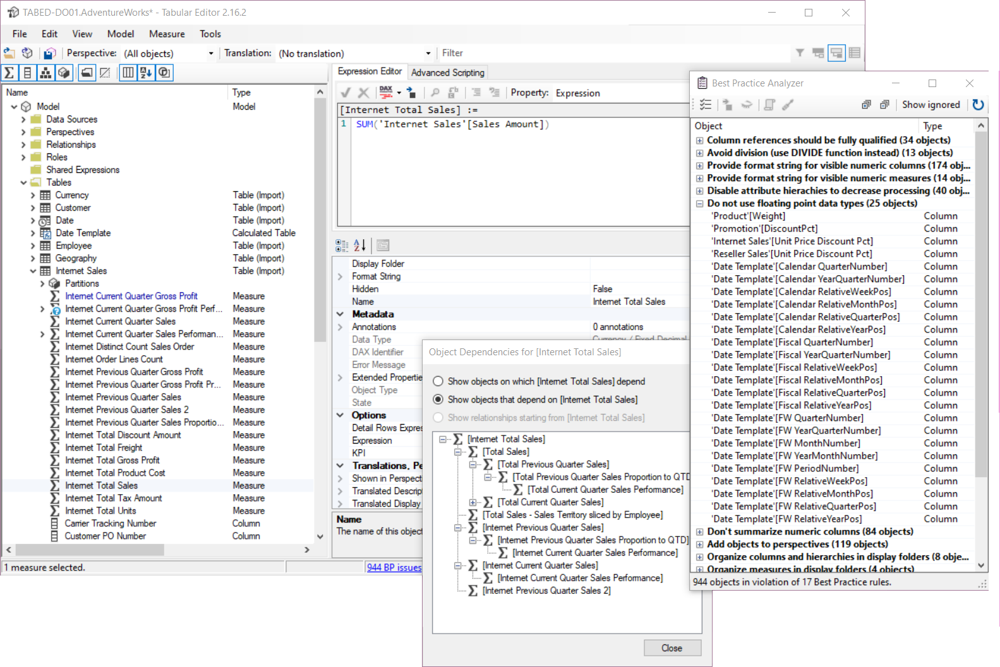

# Tabular Editor

Tabular Editor es una herramienta que te permite manipular y administrar fácilmente medidas, columnas calculadas, carpetas de visualización, perspectivas y traducciones en Analysis Services Tabular y en los modelos semánticos de Power BI.

La herramienta está disponible en dos versiones diferentes:

- Tabular Editor 2.x (gratis, [licencia MIT](https://github.com/TabularEditor/TabularEditor/blob/master/LICENSE)) - [página del proyecto en GitHub](https://github.com/TabularEditor/TabularEditor)
- Tabular Editor 3.x (comercial) - [Página principal](https://tabulareditor.com)

## Documentación

Este sitio contiene la documentación de ambas versiones. Selecciona tu versión en la barra de navegación en la parte superior de la pantalla para ver la documentación específica del producto.

## Cómo elegir entre TE3 y TE2

Tabular Editor 3 es la evolución de Tabular Editor 2. Se ha diseñado para quienes buscan una solución "todo en uno" para el modelado y el desarrollo de datos tabulares.

### [Tabular Editor 3](#tab/TE3)

Tabular Editor 3 es una aplicación más avanzada que ofrece una experiencia premium con muchas funcionalidades prácticas para reunir todas tus necesidades de modelado y desarrollo de datos en una sola herramienta.

**Funciones principales de Tabular Editor 3:**

- Una interfaz de usuario muy personalizable e intuitiva
- Compatibilidad con High-DPI, varios monitores y temas (¡sí, hay modo oscuro!)
- Un [editor DAX](xref:dax-editor) de primer nivel con resaltado de sintaxis, comprobación semántica, autocompletado, conocimiento del contexto y mucho, mucho más
- Explorador de tablas, explorador de Pivot Grid y editor de Consulta DAX
- [Asistente para importar tablas](xref:importing-tables) con compatibilidad con orígenes de datos de Power Query
- [Vista de actualización de datos](xref:data-refresh-view) con el [cuadro de diálogo de actualización avanzada](xref:advanced-refresh) para poner en cola y ejecutar operaciones de actualización en segundo plano
- Editor de diagramas para visualizar y editar fácilmente las relaciones entre tablas
- Funcionalidad de [Script DAX](xref:dax-scripts) para editar expresiones DAX de varios objetos en un único documento
- [Funciones DAX definidas por el usuario (UDFs)](xref:udfs) con ayuda, acciones de código y espacios de nombres
- [Editor de calendario](xref:calendars) para crear y administrar tablas de fechas con inteligencia temporal mejorada
- [Administrador de paquetes de DAX](xref:dax-package-manager) para instalar y administrar paquetes de DAX
- [Reglas integradas del Best Practice Analyzer](xref:built-in-bpa-rules)
- Integración del Analizador VertiPaq con [Optimizador de DAX](xref:dax-optimizer-integration)
- [Depurador de DAX](xref:dax-debugger)
- [Acciones de código](xref:code-actions) para correcciones rápidas y refactorización
- [Editor de traducción de metadatos](xref:metadata-translation-editor) y [Editor de perspectivas](xref:perspective-editor)
- [Guardar con archivos auxiliares](xref:save-with-supporting-files) para la integración con Git de Fabric
- [Compatibilidad con la localización](xref:references-application-language) (chino, español, japonés, alemán, francés)

### [Tabular Editor 2.x](#tab/TE2)

Tabular Editor 2.x es una aplicación ligera para modificar rápidamente el TOM (Tabular Object Model) de un modelo de datos de Analysis Services o Power BI. La herramienta se publicó originalmente en 2016 y recibe actualizaciones y correcciones de errores con regularidad.

**Características principales de Tabular Editor 2.x:**

- Una aplicación muy ligera, con una interfaz sencilla e intuitiva para navegar por el TOM
- Vista de dependencias de DAX y atajos de teclado para navegar entre objetos DAX
- Soporte para la edición de perspectivas de modelo y traducciones de metadatos
- Cambio de nombre por lotes
- Cuadro de búsqueda para navegar rápidamente por modelos grandes y complejos
- Asistente de implementación
- Best Practice Analyzer
- Scripting avanzado con secuencias de comandos de estilo C# para automatizar tareas repetitivas
- Interfaz de línea de comandos (se puede usar para integrar Tabular Editor y canalizaciones de DevOps)

***

### Resumen de características

En la tabla siguiente se enumeran las principales características de ambas herramientas.

|                                                                                                                                                                                                    | TE2 (Gratis)                         | TE3 (Comercial)                        |
| -------------------------------------------------------------------------------------------------------------------------------------------------------------------------------------------------- | ------------------------------------------------------- | --------------------------------------------------------- |
| Editar todos los objetos y propiedades del TOM                                                                                                                                                     | &#10004; | &#10004;   |
| Edición y cambio de nombre por lotes                                                                                                                                                               | &#10004; | &#10004;   |
| Compatibilidad con copiar/pegar y arrastrar/soltar                                                                                                                                                 | &#10004; | &#10004;   |
| Deshacer/rehacer operaciones de modelado de datos                                                                                                                                                  | &#10004; | &#10004;   |
| Cargar/guardar metadatos del modelo en disco                                                                                                                                                       | &#10004; | &#10004;\* |
| Guardar en carpeta                                                                                                                                                                                 | &#10004; | &#10004;\* |
| Integración con [daxformatter.com](https://daxformatter.com)                                                                                                                       | &#10004; | &#10004;   |
| Modelado de datos avanzado (OLS, perspectivas, grupos de cálculo, traducciones de metadatos, etc.)                                                              | &#10004; | &#10004;\* |
| Resaltado de sintaxis y corrección automática de fórmulas                                                                                                                                          | &#10004; | &#10004;   |
| Ver dependencias de DAX entre objetos                                                                                                                                                              | &#10004; | &#10004;   |
| Asistente para importar tablas                                                                                                                                                                     | &#10004; | &#10004;   |
| Asistente de implementación                                                                                                                                                                        | &#10004; | &#10004;\* |
| Best Practice Analyzer                                                                                                                                                                             | &#10004; | &#10004;   |
| Secuencias de comandos y automatización en C#                                                                                                                                                      | &#10004; | &#10004;   |
| Usar como herramienta externa para Power BI Desktop                                                                                                                                                | &#10004; | &#10004;   |
| Conectarse a SSAS/Azure AS/Power BI Premium                                                                                                                                                        | &#10004; | &#10004;\* |
| Interfaz de línea de comandos                                                                                                                                                                      | &#10004; |                                                           |
| Interfaz de usuario prémium y personalizable, con compatibilidad con DPI altos, varios monitores y temas                                                                                           |                                                         | &#10004;   |
| Editor DAX de primer nivel con funciones tipo IntelliSenseTM, formato sin conexión y más                                                                                                |                                                         | &#10004;   |
| Comprobación sin conexión de la sintaxis DAX e inferencia de tipos de columna y de datos                                                                                                           |                                                         | &#10004;   |
| Asistente de importación de tablas mejorado y comprobación de actualización del esquema de tablas con compatibilidad con Power Query                                                               |                                                         | &#10004;   |
| Consulta DAX, vista previa de tabla y Pivot Grid                                                                                                                                                   |                                                         | &#10004;   |
| Crear diagrama para visualizar y editar las relaciones entre tablas                                                                                                                                |                                                         | &#10004;   |
| Ejecutar operaciones de actualización de datos en segundo plano                                                                                                                                    |                                                         | &#10004;\* |
| Grabador de macros en C#                                                                                                                                                                           |                                                         | &#10004;   |
| Editar varias expresiones DAX en un solo documento mediante [Script DAX](xref:dax-scripts)                                                                                                         |                                                         | &#10004;   |
| Integración con [Analizador VertiPaq](https://www.sqlbi.com/tools/vertipaq-analyzer/)                                                                                                              |                                                         | &#10004;   |
| [Depurador de DAX](xref:dax-debugger)                                                                                                                                                              |                                                         | &#10004;   |
| [Editor de traducción de metadatos](xref:metadata-translation-editor)                                                                                                                              |                                                         | &#10004;   |
| [Editor de perspectivas](xref:perspective-editor)                                                                                                                                                  |                                                         | &#10004;   |
| [Grupos de tablas](xref:table-groups)                                                                                                                                                              |                                                         | &#10004;   |
| [Integración del Optimizador de DAX](xref:dax-optimizer-integration)                                                                                                                               |                                                         | &#10004;   |
| [Acciones de código](xref:code-actions)                                                                                                                                                            |                                                         | &#10004;   |
| [Funciones DAX definidas por el usuario (UDFs)](xref:udfs) Asistencia, acciones de código y espacios de nombres                                                                 |                                                         | &#10004;   |
| [Editor de calendario](xref:calendars) para una inteligencia temporal mejorada                                                                                                                     |                                                         | &#10004;   |
| [Administrador de paquetes DAX](xref:dax-package-manager)                                                                                                                                          |                                                         | &#10004;   |
| [Reglas integradas de Best Practice Analyzer](xref:built-in-bpa-rules)                                                                                                                             |                                                         | &#10004;   |
| [Cuadro de diálogo de actualización avanzada](xref:advanced-refresh) con [perfiles de anulación de actualización](xref:refresh-overrides) (Edición Business/Edición Enterprise) |                                                         | &#10004;\* |
| [Guardar con archivos auxiliares para Fabric](xref:save-with-supporting-files)                                                                                                                     |                                                         | &#10004;   |
| Puente semántico para Metric Views de Databricks (Edición Enterprise)                                                                                                           |                                                         | &#10004;\* |
| [Soporte de localización](xref:references-application-language) (chino, español, japonés, alemán y francés)                                                                     |                                                         | &#10004;   |

\***Nota:** Se aplican limitaciones según la [edición](xref:editions) de Tabular Editor 3 que estés usando.

### Características comunes

Ambas herramientas ofrecen las mismas funcionalidades en cuanto a las opciones de modelado de datos disponibles, ya que básicamente exponen todos los objetos y propiedades del [Tabular Object Model](https://docs.microsoft.com/en-us/analysis-services/tom/introduction-to-the-tabular-object-model-tom-in-analysis-services-amo?view=asallproducts-allversions) en una interfaz de usuario intuitiva y ágil. Puedes editar propiedades avanzadas de los objetos que no están disponibles en las herramientas estándar. Las herramientas pueden cargar metadatos del modelo desde archivos o desde cualquier instancia de Analysis Services. Los cambios solo se sincronizan cuando pulsas Ctrl+S (guardar), lo que ofrece una experiencia de edición "sin conexión" que la mayoría considera superior al modo "siempre sincronizado" de las herramientas estándar. Esto se nota especialmente al trabajar con modelos de datos grandes y complejos.

Además, ambas herramientas permiten realizar en lote múltiples cambios en los metadatos del modelo, cambiar el nombre de objetos en lote, copiar y pegar objetos, arrastrar y soltar objetos entre tablas y carpetas de visualización, etc. Incluso admiten deshacer y rehacer.

Ambas herramientas incluyen el Best Practice Analyzer, que analiza continuamente los metadatos del modelo según reglas que puedes definir tú mismo; por ejemplo, para aplicar ciertas convenciones de nomenclatura, asegurarte de que las columnas de atributos que no son de dimensión estén siempre ocultas, etc.

También puedes escribir y ejecutar scripts al estilo C# en ambas herramientas para automatizar tareas repetitivas, como generar medidas de inteligencia temporal y detectar automáticamente relaciones a partir de nombres de columnas.

Por último, gracias a la funcionalidad "Save-to-folder", un nuevo formato de archivo en el que cada objeto del modelo se guarda como un archivo individual, es posible el desarrollo en paralelo y la integración con el control de versiones, algo que no es fácil de lograr usando solo las herramientas estándar.

## Conclusión

Si eres nuevo en el modelado tabular en general, te recomendamos que uses las herramientas estándar hasta que te familiarices con conceptos como tablas calculadas, medidas, relaciones, DAX, etc. Llegado ese punto, prueba Tabular Editor 2.x y comprueba cuánto más rápido te permite lograr ciertas tareas. Si te gusta y quieres más, considera Tabular Editor 3.x!

## Siguientes pasos

- [Primeros pasos con Tabular Editor 2](xref:getting-started-te2)
- [Primeros pasos con Tabular Editor 3](xref:getting-started)
- [Hoja de ruta de Tabular Editor 3](xref:roadmap)

