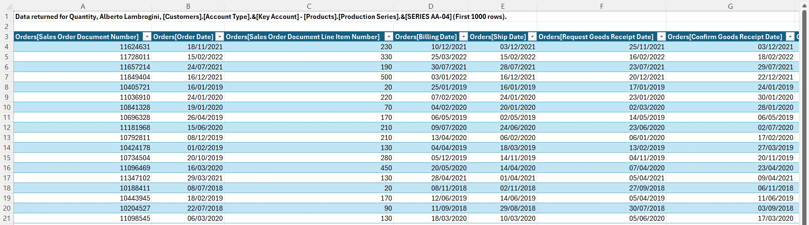
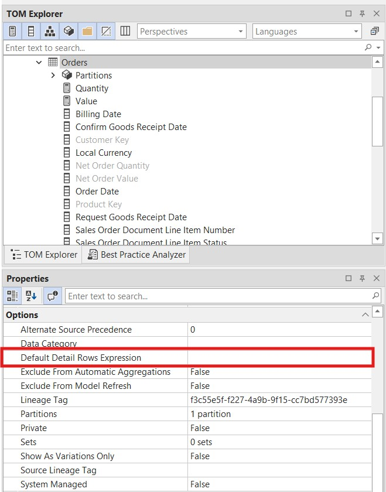

# Implementación de expresiones de filas de detalle

Cuando un usuario hace doble clic en un valor de una tabla dinámica de Excel conectada a un modelo de Power BI o Analysis Services, inicia un **drillthrough**: se abre una hoja que muestra las filas subyacentes de ese valor agregado. De forma predeterminada, el modelo devuelve todas las columnas de la tabla que contiene la medida, lo que rara vez resulta útil para los usuarios finales.

Una **Expresión de filas de detalle** permite definir exactamente qué columnas aparecen en ese resultado de drillthrough. Escribes una expresión de tabla DAX que devuelve la forma de los datos que quieres que vea el usuario, combinando columnas de la tabla de hechos con atributos relacionados de las tablas de dimensiones.

También conviene tener en cuenta que, aunque una tabla dinámica de Excel normalmente consulta el modelo mediante MDX, una acción de drillthrough con doble clic se ejecuta como una **consulta DAX**. Esto hace que las Expresiones de filas de detalle sean especialmente eficaces para recuperar datos de alta cardinalidad, como identificadores de transacción o líneas de pedido individuales, donde DAX supera claramente a MDX.

En este tutorial, configurarás una Expresión de filas de detalle **a nivel de tabla** en la tabla `Orders`, de modo que el mismo resultado de drillthrough, más fácil de usar, se aplique a todas las medidas de esa tabla. Luego verás cómo reemplazarla en una medida específica.

> [!NOTE]
> Los pasos de este tutorial se aplican tanto a Tabular Editor 2 como a Tabular Editor 3. Las capturas de pantalla corresponden a Tabular Editor 3.

## Requisitos previos

Antes de empezar, deberías tener:

- Tabular Editor 2 o Tabular Editor 3
- Un modelo semántico con al menos una tabla que contenga medidas
- Conocimientos básicos de DAX
- Excel conectado a tu modelo para probar el drillthrough

## Comportamiento predeterminado del drillthrough

Antes de agregar una expresión de filas de detalle, conviene ver qué experimentan los usuarios finales de forma predeterminada.

Cuando un usuario hace doble clic en un valor agregado de una tabla dinámica, el modelo devuelve todas las columnas de la tabla de hechos —con nombres internos de columna en bruto, sin atributos de las dimensiones y sin control sobre qué columnas se muestran.



El resultado es técnicamente correcto, pero no es útil: se exponen los nombres de columnas internos, faltan atributos de dimensión relacionados, como nombres de productos y cuentas de clientes, y no hay control sobre el orden ni la selección de las columnas.

## Expresiones de filas de detalle: nivel de tabla vs. nivel de medida

Una expresión de filas de detalle se puede definir en dos niveles:

| Nivel      | Nombre de la propiedad                       | Ámbito                                                                  |
| ---------- | -------------------------------------------- | ----------------------------------------------------------------------- |
| **Tabla**  | Expresión de filas de detalle predeterminada | Se aplica a todas las medidas de la tabla                               |
| **Medida** | Expresión de filas de detalle                | Se aplica solo a esa medida; sobrescribe la expresión de nivel de tabla |

Empezar con una expresión a nivel de tabla es el enfoque más práctico: una sola expresión cubre todas las medidas de la tabla. Si una medida específica necesita columnas de detalle distintas, puedes sobrescribirla con una expresión de nivel de medida, que tiene prioridad.

## Crear una expresión de filas de detalle a nivel de tabla

### Paso 1: Selecciona la tabla y encuentra la propiedad

En el **Explorador TOM**, selecciona la tabla que quieras configurar; en este caso, la tabla `Orders`. En el panel de **Propiedades**, busca el campo **Expresión de filas de detalle predeterminada** en el grupo **Opciones**.



### Paso 2: Abre el Editor de expresiones

Haz clic en el campo **Default Detail Rows Expression** para abrirlo en el **Editor de expresiones**.

### Paso 3: Escribe la expresión SELECTCOLUMNS

Escribe una expresión DAX con `SELECTCOLUMNS` para definir las columnas que se devolverán. Usa `RELATED()` para traer columnas de tablas de dimensiones.

```dax
SELECTCOLUMNS(
    Orders,
    "Order Date", Orders[Order Date],
    "Product Name", RELATED( Products[Product Name] ),
    "Account Name", RELATED( Customers[Account Name] ),
    "Sales Order Document Number", Orders[Sales Order Document Number],
    "Quantity", [Quantity],
    "Value", [Value]
)
```


`SELECTCOLUMNS` toma la tabla de origen como su primer argumento y, a continuación, pares de `"Nombre de columna", expresión`:

- Las columnas de la tabla de hechos `Orders` se referencian directamente: `Orders[Order Date]`, `Orders[Sales Order Document Number]`
- Las columnas de tablas de dimensiones relacionadas se recuperan con `RELATED()`: `Products[Product Name]`, `Customers[Account Name]`
- También puedes incluir medidas: `[Quantity]`, `[Value]`

> [!NOTE]
> `RELATED()` funciona aquí porque `SELECTCOLUMNS` itera sobre las filas de la tabla `Orders`, dando a cada fila un contexto de fila que permite navegar a tablas relacionadas mediante las relaciones existentes.

> [!TIP]
> Aunque `SELECTCOLUMNS` es el patrón estándar, puedes usar cualquier expresión de tabla DAX válida. Por ejemplo, puedes encapsular la expresión en `CALCULATETABLE` para aplicar filtros adicionales, usar `ADDCOLUMNS` para incluir valores derivados o llamar a `DETAILROWS` para reutilizar la expresión Detail Rows Expression de otra medida y evitar duplicaciones.

### Paso 4: Guarda el modelo

Guarda con **Ctrl+S** y despliega o publica el modelo en tu entorno de destino.

## Prueba el resultado

Abre o actualiza tu tabla dinámica de Excel y haz doble clic en cualquier valor agregado. La hoja de desglose ahora muestra las columnas que definiste —con nombres descriptivos e incluyendo atributos de dimensión.


Compáralo con el resultado predeterminado: en lugar de los nombres internos de columna en bruto, los usuarios ven encabezados significativos y valores extraídos de tablas de dimensiones relacionadas.

## Sobrescritura con una expresión a nivel de medida

Si una medida concreta requiere un conjunto distinto de columnas de detalle, puedes definir una **Detail Rows Expression** directamente en esa medida. Esto sobrescribe la expresión a nivel de tabla solo para esa medida.

1. En el **Explorador TOM**, expande la tabla y selecciona la medida —por ejemplo, `Quantity` en `Orders`.
2. En el panel **Propiedades**, busca el campo **Detail Rows Expression**.
3. Escribe una expresión `SELECTCOLUMNS` específica para esa medida.

```dax
SELECTCOLUMNS(
    Orders,
    "Order Date", Orders[Order Date],
    "Billing Date", Orders[Billing Date],
    "Confirm Goods Receipt Date", Orders[Confirm Goods Receipt Date],
    "Product Name", RELATED( Products[Product Name] ),
    "Product MK", RELATED( Products[MK] ),
    "Account Name", RELATED( Customers[Account Name] ),
    "Sales Order Document Number", Orders[Sales Order Document Number],
    "Quantity", [Quantity]
)
```


Cuando una herramienta cliente solicita drillthrough para esta medida, se usa la expresión a nivel de medida en lugar de la predeterminada de la tabla.

## Solución de problemas

**El drillthrough sigue mostrando columnas sin procesar**
Puede que el modelo no se haya guardado ni implementado después de agregar la expresión. Guarda el modelo, vuelve a implementarlo y reconecta Excel antes de realizar la prueba.

**La expresión no se aplica a una medida específica**
Si has definido tanto una expresión a nivel de tabla como una a nivel de medida, prevalece la de nivel de medida. Comprueba qué expresión está activa seleccionando la medida en el panel **Propiedades** y revisando el campo **Expresión de filas de detalle**.

**`RELATED()` devuelve un error**
`RELATED()` requiere una relación activa de varios a uno desde la tabla de origen hacia la tabla de dimensiones referenciada. Comprueba que la relación exista y esté activa en tu modelo.

## Lecturas adicionales

- [DAX Guide: SELECTCOLUMNS](https://dax.guide/selectcolumns/)
- [DAX Guide: RELATED](https://dax.guide/related/)
- [Microsoft Docs: Expresiones de filas de detalle](https://learn.microsoft.com/en-us/analysis-services/tabular-models/detail-rows-expressions)
- [SQLBI: Controlling drillthrough in Excel PivotTables](https://www.sqlbi.com/articles/controlling-drillthrough-in-excel-pivottables-connected-to-power-bi-or-analysis-services/)
