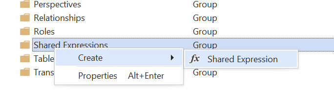
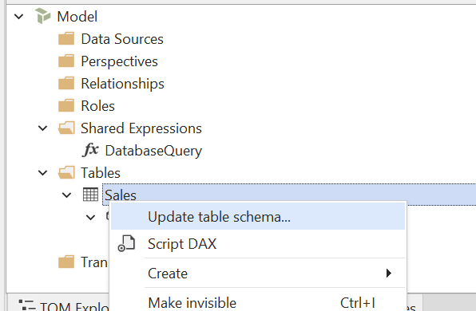
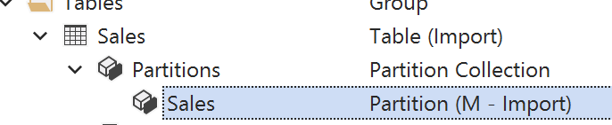

# Guía de Direct Lake

Con el lanzamiento de Tabular Editor 3.22.0, hemos añadido compatibilidad con Direct Lake en OneLake, además de con Direct Lake en SQL. Este artículo ofrece una breve descripción de las diferencias entre estos dos modos y de cómo se comparan con otros modos de almacenamiento disponibles en modelos semánticos de Power BI.

## Resumen de los modos de almacenamiento

La siguiente tabla resume los modos de almacenamiento disponibles en modelos semánticos de Power BI:

| Modo de almacenamiento | Descripción                                                                                                                                                                                                           | Casos de uso recomendados                                                                                                                                                          |
| ---------------------- | --------------------------------------------------------------------------------------------------------------------------------------------------------------------------------------------------------------------- | ---------------------------------------------------------------------------------------------------------------------------------------------------------------------------------- |
| Import                 | Los datos se importan al modelo semántico y se almacenan en la caché en memoria del modelo (VertiPaq).                                                                             | Cuando necesite un rendimiento de consulta rápido y pueda permitirse actualizar los datos periódicamente.                                                          |
| DirectQuery            | Los datos se consultan directamente desde el origen en el momento de la consulta, sin importarse al modelo. Admite varios orígenes, como SQL, KQL e incluso otros modelos semánticos. | Cuando necesite acceso a datos en tiempo real o cuando el volumen de datos sea demasiado grande para caber en memoria.                                             |
| Dual                   | Un modo híbrido en el que el motor puede elegir entre devolver los datos importados o delegar en DirectQuery, según el contexto de la consulta.                                                       | Cuando tu modelo contiene una mezcla de tablas DirectQuery e Import (por ejemplo, al usar agregaciones) y tienes tablas relacionadas con ambas. |
| Direct Lake en OneLake | Utiliza el formato de almacenamiento Delta Parquet para cargar rápidamente los datos en la memoria del modelo semántico cuando sea necesario.                                                         | Cuando tus datos ya están disponibles como tablas o vistas materializadas en un Warehouse o Lakehouse de Fabric.                                                   |
| Direct Lake en SQL     | Versión anterior de Direct Lake que utiliza el punto de conexión de análisis SQL de un Warehouse o un Lakehouse de Fabric.                                                                            | No se recomienda para nuevos desarrollos (utilice Direct Lake en OneLake en su lugar).                                                          |

> [!NOTE]
> También es posible crear tablas que contengan una combinación de particiones en modo **Import** y **DirectQuery** (también conocidas como "tablas híbridas"). Esto se suele hacer en tablas de hechos grandes que requieren actualización incremental, mientras que parte de los datos se consulta directamente desde el origen. Consulta [este artículo](https://learn.microsoft.com/en-us/power-bi/connect-data/incremental-refresh-xmla) para más información.

## Direct Lake en OneLake vs. Direct Lake en SQL

[Direct Lake en OneLake](https://learn.microsoft.com/en-us/fabric/fundamentals/direct-lake-overview#key-concepts-and-terminology) se presentó en marzo de 2025 como alternativa a Direct Lake en SQL. Con Direct Lake en OneLake, no hay dependencia del punto de conexión SQL ni se recurre al modo DirectQuery. Esto también significa que las [restricciones habituales que se aplican a los modelos DirectQuery](https://learn.microsoft.com/en-us/power-bi/connect-data/desktop-directquery-about#modeling-limitations) no se aplican a los modelos Direct Lake en OneLake.

Sin embargo, igual que con Direct Lake en SQL, aún hay algunas [limitaciones que _sí_ se aplican](https://learn.microsoft.com/en-us/fabric/fundamentals/direct-lake-overview#considerations-and-limitations). A continuación se enumeran las limitaciones más importantes. Consulta el enlace para ver la lista completa de limitaciones:

- Las columnas calculadas en tablas Direct Lake no pueden hacer referencia a columnas cuyo origen sea OneLake.
- Las tablas calculadas en modelos Direct Lake no pueden hacer referencia a columnas de tablas Direct Lake cuyo origen sea OneLake.

Una posible solución para la limitación anterior es crear un **modelo compuesto** combinando tablas Direct Lake con tablas Import. Esto está permitido con Direct Lake en OneLake, pero no con Direct Lake en SQL. En este caso, normalmente se usaría Import mode para las tablas de dimensiones más pequeñas, donde quizá necesite agregar agrupaciones personalizadas, para lo cual las columnas calculadas son ideales, mientras se mantienen las tablas de hechos más grandes en modo Direct Lake.

Como alternativa, asegúrese de que el origen contenga las columnas necesarias. Si agregas columnas a través de una vista, ten en cuenta que la vista debe estar materializada en el Warehouse o el Lakehouse de Fabric, ya que Direct Lake en OneLake no admite las vistas no materializadas.

<a name="collation"></a>

## Intercalación

Al usar **Direct Lake en OneLake**, la intercalación del modelo es la misma que la de un modelo en modo Import mode, que de forma predeterminada no distingue mayúsculas de minúsculas.

En un modelo **Direct Lake en SQL**, la intercalación no distingue mayúsculas de minúsculas para las consultas que no recurren a DirectQuery. Si la consulta necesita recurrir a DirectQuery, la intercalación depende de la intercalación del origen. En un Warehouse de Fabric, la intercalación puede distinguir mayúsculas de minúsculas; en ese caso, deberías especificar una [intercalación que distinga mayúsculas de minúsculas en el modelo](https://data-goblins.com/power-bi/case-specific).

> [!NOTE]
> No puedes cambiar la intercalación de un modelo una vez que los metadatos se han desplegado en Analysis Services / Power BI. Por lo tanto, si piensas usar Direct Lake en SQL con un Warehouse de Fabric con distinción de mayúsculas y minúsculas, debes establecer la intercalación en los metadatos del modelo antes de desplegarlos:
>
> 1. Crea un nuevo modelo en Tabular Editor 3 (Archivo > Nuevo > Modelo...)
> 2. Desmarca "Use Workspace database"
> 3. Establece la propiedad **Collation** del modelo en `Latin1_General_100_BIN2_UTF8`
> 4. Guarda el modelo (Ctrl+S).
> 5. Ahora, abre el modelo desde el archivo que acabas de guardar. Cuando se te solicite conectarte a una base de datos del Workspace, elige "Sí".
>
> Con este enfoque, los metadatos del modelo se implementan desde el inicio con la intercalación correcta, y luego puedes agregar tablas en modo Direct Lake en SQL sin encontrarte con problemas de intercalación.

## Asistente para importar tablas

Para agregar tablas Direct Lake con el Asistente para importar tablas de Tabular Editor 3, elige **Microsoft Fabric Lakehouse**, **Microsoft Fabric Warehouse**, **Microsoft Fabric SQL Database** o **Microsoft Fabric Mirrored Database** como origen:


Tras iniciar sesión, se te mostrará una lista de todos los Lakehouses y Warehouses de Fabric disponibles en los Workspaces a los que tengas acceso. Selecciona el que quieras para conectarte y pulsa **Aceptar**:


A menos que quieras especificar una consulta SQL personalizada o configurar las tablas para el modo DirectQuery, simplemente pulsa **Siguiente** para seleccionar las tablas desde una lista de tablas/vistas en el origen:


Selecciona las tablas/vistas que quieras importar. Ten en cuenta que las **vistas no materializadas** no se admiten en el modo Direct Lake en OneLake. Al intentar agregar una vista de este tipo al modelo, se producirá un error al guardar los metadatos del modelo.


En la última página, elige con qué modo quieres que se configure la partición de la tabla:


Las opciones son:

- Direct Lake en OneLake
- Direct Lake en SQL
- Importación (M)

> [!NOTE]
> Si estás trabajando en un modelo que ya contiene tablas, es posible que una o varias de las opciones mencionadas anteriormente no estén disponibles si el modelo no admite combinar tablas con distintos modos de almacenamiento. Por ejemplo, si el modelo contiene una tabla en modo Direct Lake en SQL, no puedes agregar tablas en otros modos.

## Expresiones de Power Query (M)

Esta sección incluye una descripción más técnica de cómo deben configurarse los objetos y las propiedades de TOM, en caso de que quieras configurar manualmente tablas para el modo Direct Lake sin usar el Asistente para importar tablas.

### Direct Lake en OneLake

Para configurar manualmente una tabla en el modo **Direct Lake en OneLake**, debes hacer lo siguiente:

1. **Crear expresión compartida**: las tablas de Direct Lake usan particiones de tipo "Entity", que deben hacer referencia a una expresión compartida en el modelo. Empieza por crear esta expresión compartida, si todavía no la tienes. Asígnale el nombre `DatabaseQuery`:



2. **Configurar la expresión compartida**: establece la propiedad **Kind** de la expresión que creaste en el paso 1 en "M" y la propiedad **Expression** en la siguiente consulta M, sustituyendo los ID de la URL por los de tu Workspace de Fabric y los de tu Lakehouse/Warehouse:

```m
let
    Source = AzureStorage.DataLake("https://onelake.dfs.fabric.microsoft.com/<workspace-id>/<resource-id>", [HierarchicalNavigation=true])
in
    Source
```

3. **Crear tabla y partición de entidad**: crea una nueva tabla en el modelo (Alt+5), luego expande las particiones de la tabla en el Explorador TOM y crea una nueva _Entity Partition_:


Elimina la partición de importación estándar que se creó automáticamente al crear la tabla.

4. **Configurar la partición de entidad**: establece las siguientes propiedades en la partición de entidad:

| Propiedad              | Valor                                                                                                                                                                                                   |
| ---------------------- | ------------------------------------------------------------------------------------------------------------------------------------------------------------------------------------------------------- |
| Nombre                 | (Recomendado) Establécelo con el mismo nombre que la tabla                                                                                                                           |
| Nombre de entidad      | (Obligatorio) Establécelo con el nombre de la tabla en el Lakehouse/Warehouse                                                                                                        |
| Origen de la expresión | (Obligatorio) Establécelo en la expresión compartida que creaste en el paso 1; normalmente `DatabaseQuery`                                                                           |
| Modo                   | (Obligatorio) `DirectLake`                                                                                                                                                           |
| Nombre del esquema     | (Opcional) Establécelo con el nombre del esquema en el Lakehouse/Warehouse, si corresponde. Si no lo configuras, se usará el esquema predeterminado. |

El resultado final debería verse así:


5. **Actualizar metadatos de columnas**: En este punto, deberías poder usar la función **Update Table Schema** de Tabular Editor para actualizar los metadatos de las columnas de la tabla. Esto recuperará automáticamente los nombres de las columnas y los tipos de datos desde el Lakehouse/Warehouse:



Como alternativa, agrega manualmente columnas de datos a la tabla (Alt+4) y especifica `Name`, `Data Type`, `Source Column` y cualquier otra propiedad relevante para cada columna.

> [!NOTE]
> Cuando se agrega una tabla de Direct Lake al modelo, es necesario "actualizarla" manualmente después de la primera implementación de metadatos. De lo contrario, la tabla no contendrá datos cuando se consulte. Esta actualización solo debe realizarse una vez. Tabular Editor 3 actualizará automáticamente la tabla al guardar los metadatos del modelo, si está activada la opción **Actualizar automáticamente al guardar nuevas tablas** en **Herramientas > Preferencias > Implementación del modelo > Actualización de datos**.

### Direct Lake en SQL

Para configurar manualmente una tabla en modo **Direct Lake en SQL**, sigue los pasos de la sección anterior para Direct Lake en OneLake, pero usa en su lugar la siguiente consulta M en la expresión compartida:

```m
let
    database = Sql.Database("<sql-endpoint>", "<warehouse/lakehouse name>")
in
    database
```

Reemplaza `<sql-endpoint>` por la cadena de conexión del [punto de conexión de análisis SQL del Warehouse de Fabric](https://learn.microsoft.com/en-us/fabric/data-warehouse/query-warehouse) o del [Lakehouse](https://learn.microsoft.com/en-us/fabric/data-engineering/lakehouse-sql-analytics-endpoint), y `<warehouse/lakehouse name>` por el nombre del Warehouse o del Lakehouse.

### Importar desde Lakehouse / Warehouse

Si quieres configurar una tabla en modo **Import** y obtener los datos de un Lakehouse o Warehouse de Fabric, sigue estos pasos:

1. **Crear tabla**: Crea una tabla nueva en el modelo (Alt+5) y, después, expande las particiones de la tabla en el Explorador TOM. De forma predeterminada, deberías ver una única partición de tipo "Import" creada automáticamente:



2. **Configurar la partición Import**: Establece la siguiente consulta M en la partición Import:

```m
let
    Source = Sql.Database("<sql-endpoint>","<warehouse/lakehouse name>"),
    Data = Source{[Schema="<schema-name>",Item="<table/view-name>"]}[Data]
in
    Data
```

Reemplaza `<sql-endpoint>` por la cadena de conexión del [punto de conexión de análisis SQL del Warehouse de Fabric](https://learn.microsoft.com/en-us/fabric/data-warehouse/query-warehouse) o del [Lakehouse](https://learn.microsoft.com/en-us/fabric/data-engineering/lakehouse-sql-analytics-endpoint), y `<warehouse/lakehouse name>` por el nombre del Warehouse o del Lakehouse.

Reemplaza `<schema-name>` por el nombre del esquema en el Warehouse/Lakehouse y `<table/view-name>` por el nombre de la tabla o vista que quieras importar. Ten en cuenta que las tablas en Import mode pueden usar vistas no materializadas como Data source, ya que los datos se consultan a través del punto de conexión de análisis SQL durante las operaciones de actualización.

3. **Actualizar metadatos de columnas**: Usa la función **Update Table Schema** de Tabular Editor para actualizar los metadatos de columnas de la tabla. Esto recuperará automáticamente los nombres de columna y los tipos de datos del Lakehouse/Warehouse. Como alternativa, crea columnas de datos manualmente (Alt+4) y especifica `Name`, `Data Type`, `Source Column` y cualquier otra propiedad relevante para cada columna.

## Conversión entre modos de almacenamiento

Es sencillo convertir entre Direct Lake en SQL y Direct Lake en OneLake usando la información de este artículo, porque solo necesitas modificar la consulta M de la expresión compartida a la que hacen referencia las particiones de Direct Lake.

Si quieres convertir de Import a Direct Lake, es un poco más complicado debido a los distintos tipos de partición implicados.

Para ponértelo más fácil, hemos preparado un conjunto de C# Scripts que pueden ayudarte a convertir entre distintos modos de almacenamiento:

- [Convertir Direct Lake en SQL a Direct Lake en OneLake](xref:script-convert-dlsql-to-dlol)
- [Convertir Import a Direct Lake en OneLake](xref:script-convert-import-to-dlol)