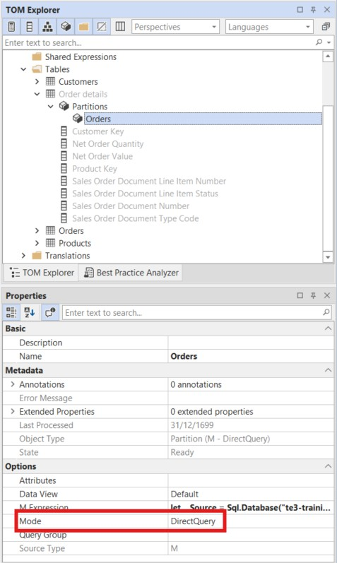

# Implementación de agregaciones definidas por el usuario

Una tabla de hechos completamente importada mantiene en caché en memoria cada fila —incluidas columnas de alta cardinalidad, como líneas de pedido individuales, identificadores de transacción y atributos a nivel de fila que la mayoría de los usuarios del Report nunca necesitan. Las agregaciones definidas por el usuario resuelven esto dividiendo la tabla de hechos en dos: una tabla pequeña y preagregada en modo **Import** que atiende la gran mayoría de las consultas de Report desde la caché en memoria, y una tabla de detalle **DirectQuery** que contiene todos los datos a nivel de fila sin consumir memoria. Power BI y Analysis Services enrutan automáticamente cada consulta a la tabla que pueda responderla.

Las columnas de alta cardinalidad que se mueven a DirectQuery implican una contrapartida de rendimiento: las consultas que las usan se envían directamente a la base de datos de origen, en lugar de atenderse desde el motor en memoria. Ocultar esas columnas de la lista de campos predeterminada garantiza que los usuarios del Report interactúen de forma predeterminada con la ruta rápida de agregación, mientras que los usuarios avanzados que crean Report que requieren detalle a nivel de fila sean conscientes de que están trabajando con columnas de DirectQuery.

En este tutorial, configurarás una agregación definida por el usuario para la tabla de hechos `Orders` en el modelo SpaceParts. Crearás una tabla de detalle que contenga todos los datos a nivel de fila en modo DirectQuery y, a continuación, configurarás la tabla `Orders` existente como tabla de agregación con las asignaciones de columnas adecuadas.

> [!NOTE]
> Los pasos de este tutorial se aplican tanto a Tabular Editor 2 como a Tabular Editor 3. Las capturas de pantalla corresponden a Tabular Editor 3.

## Requisitos previos

Antes de empezar, debes tener:

- Tabular Editor 2 o Tabular Editor 3
- Un modelo semántico de Power BI o Analysis Services con al menos una tabla de hechos en modo Import
- Conocimientos básicos de los modos de almacenamiento (Import, DirectQuery, Dual)

## Cómo funcionan las agregaciones

El patrón de agregación utiliza dos versiones de la misma tabla de hechos:

| Tabla                                                     | Modo de almacenamiento | Propósito                                                                                                                                               |
| --------------------------------------------------------- | ---------------------- | ------------------------------------------------------------------------------------------------------------------------------------------------------- |
| **Tabla de agregación** (`Orders`)     | Import                 | Datos preagregados almacenados en caché en memoria. Responde a consultas resumidas.                                     |
| **Tabla de detalle** (`Order details`) | DirectQuery            | Datos completos a nivel de fila consultados en el origen. Se usa cuando la agregación no puede responder a la consulta. |

Las tablas de dimensiones se configuran en modo de almacenamiento **Dual** para que puedan participar en las rutas de consulta de Import y DirectQuery.

Configurar tablas en modo de almacenamiento Dual o DirectQuery por sí solo no habilita el enrutamiento de agregaciones; solo crea un modelo compuesto en el que las consultas se dirigen en función del modo de almacenamiento. La propiedad **Alternate Of** es la que activa las agregaciones definidas por el usuario: crea una asignación explícita a nivel de columna que le indica al motor: "cuando una consulta solicita esta columna de la tabla de detalle, puedes usar esta columna preagregada en su lugar". Sin `Alternate Of`, el motor no tiene fundamento para realizar la sustitución y no enrutará las consultas a la tabla de agregación. El motor evalúa cada consulta entrante con estas asignaciones para determinar si la tabla de agregación puede responderla, y recurre a DirectQuery solo cuando no puede.

> [!IMPORTANT]
> DirectQuery tiene limitaciones conocidas que afectan al diseño del modelo y a la funcionalidad de los Report. Las más relevantes para este patrón son: las consultas contra columnas DirectQuery dependen del tiempo de respuesta del origen; los orígenes en la nube tienen un límite de devolución de un millón de filas por consulta; la jerarquía automática de fecha/hora no está disponible para las tablas DirectQuery; y algunas funciones DAX no se admiten en modo DirectQuery. Revisa la lista completa antes de continuar: [Usar DirectQuery en Power BI Desktop](https://learn.microsoft.com/en-us/power-bi/connect-data/desktop-use-directquery).

## Paso 1: Configura las tablas de dimensiones en modo de almacenamiento Dual

Cada tabla de dimensiones relacionada con la tabla de hechos debe configurarse en modo de almacenamiento **Dual**. Esto permite que el motor use atributos de dimensión en las rutas de consulta de Import y DirectQuery.

Para cada tabla de dimensiones (`Customers`, `Products`):

1. En el **Explorador TOM**, expande la tabla y, a continuación, expande **particiones**.
2. Selecciona la partición.
3. En el panel **Properties**, busca el campo **Mode** en **Options** y establécelo en **Dual**.


Repite esto para cada tabla de dimensión que participe en una relación con la tabla de hechos.

## Paso 2: Crear la tabla de detalle

La tabla de detalle es una copia de la tabla de hechos original, configurada para consultar el origen directamente en modo DirectQuery. Está oculta para los consumidores del Report; su único propósito es atender consultas granulares que la tabla de agregación no puede responder.

### Duplicar la tabla de hechos

Crea una copia de la tabla **Orders** y asígnale el nombre **Order details**. En Tabular Editor, puedes hacerlo seleccionando la tabla **Orders** y usando el menú contextual con clic con el botón derecho para elegir **Duplicate 1 table**.

### Configurar la partición en DirectQuery

1. En el **Explorador TOM**, expande **Order details** y luego expande **Particiones**.
2. Selecciona la partición.
3. En el panel **Properties**, establece **Mode** en **DirectQuery**.



### Eliminar las medidas

Elimina de `Order details` cualquier medida DAX copiada de `Orders`, como `Quantity` y `Value`. Las medidas deben estar en la tabla de agregación, no en la tabla de detalle.

### Ocultar todas las columnas y la tabla

Selecciona todas las columnas de `Order details` y establece **Hidden** en **True** en el panel **Properties**. Después, selecciona la propia tabla `Order details` y también establece **Hidden** en **True**.

> [!NOTE]
> Ocultar la tabla de detalle y todas sus columnas garantiza que los consumidores del Report siempre interactúen con la tabla de agregación. La tabla de detalle es un detalle de implementación de la arquitectura de agregación.

## Paso 3: Crear relaciones y establecer la opción Rely On Referential Integrity

La tabla de detalle necesita las mismas relaciones con las tablas de dimensión que la tabla de agregación para que el motor pueda enrutar correctamente las consultas DirectQuery.

Crea las siguientes relaciones a partir de la tabla `Order details`:

- `Order details[Customer Key]` → `Customers[Customer Key]`
- `Order details[Product Key]` → `Products[Product Key]`

Para cada una de estas nuevas relaciones, establece **Rely On Referential Integrity** como **True** en el panel **Properties**.


> [!NOTE]
> **Rely On Referential Integrity** le indica al motor que use un INNER JOIN en lugar de un OUTER JOIN al generar el SQL de DirectQuery. Esto mejora el rendimiento de las consultas y es seguro activarlo cuando todos los valores de clave externa de la tabla de detalle tienen una fila coincidente en la tabla de dimensiones.

## Paso 4: Reducir la tabla de agregación

La tabla de agregación (`Orders`) solo debería contener lo que el motor necesita para el enrutamiento de agregaciones:

- **Columnas clave de relación**: `Customer Key`, `Product Key` — se usan para hacer coincidir los filtros de las dimensiones
- **Columnas base numéricas**: `Net Order Quantity`, `Net Order Value` — se asignarán a las columnas de la tabla de detalle en el siguiente paso
- **Medidas DAX**: `Quantity`, `Value`

Elimina todas las demás columnas de `Orders` — fechas, números de documento, campos de estado y cualquier otra columna de atributo. Estas columnas solo existen en `Order details`.

> [!NOTE]
> Para que el enrutamiento de agregaciones funcione correctamente, cualquier columna de atributo ausente en la tabla de agregación debe existir en la tabla de detalle. El motor recurre a DirectQuery cuando una consulta hace referencia a una columna que no está en la tabla de agregación; por lo que la tabla de detalle debe tener una copia completa de los datos de la tabla de hechos.
>
> Este patrón funciona mejor para **columnas de alta cardinalidad que rara vez se usan en un Report**: identificadores de transacción individuales, números de documento, campos de estado a nivel de fila y atributos similares. Si la tabla de hechos también contiene columnas de baja cardinalidad que aparecen con frecuencia en un Report (como un código de región o un indicador de categoría de producto), plantéate moverlas a una tabla de dimensiones en modo Dual, para que se sirvan desde la caché en memoria en lugar de desde DirectQuery.

> [!TIP]
> Además, oculta la tabla `Orders` estableciendo **Hidden** en **True**. Al igual que la tabla de detalle, la tabla de agregación es un detalle de implementación y no debería aparecer en la lista de campos del Report.

## Paso 5: Actualizar las medidas para que hagan referencia a la tabla de detalle

Las medidas de la tabla de agregación deben hacer referencia a la **tabla de detalle**, no a la propia tabla de agregación. Esto es lo que permite al motor recurrir a DirectQuery correctamente: cuando una consulta no se puede resolver desde la caché en memoria, el motor sigue la referencia de la medida a `Order details` y consulta el origen.

Actualiza cada medida de `Orders` para que haga referencia a la columna correspondiente en `Order details`:

```dax
// Quantity
SUM( 'Order details'[Net Order Quantity] )
```

```dax
// Valor
SUM( 'Order details'[Net Order Value] )
```

> [!NOTE]
> Las medidas no tienen por qué residir en la tabla de agregación. Se pueden definir en `Order details` o en cualquier otra tabla del modelo; por ejemplo, en una tabla de medidas dedicada y vacía. En este tutorial se mantienen en `Orders` por simplicidad.

## Paso 6: Configura la propiedad Alternate Of

Para cada columna base numérica de la tabla de agregación, configura la propiedad **Alternate Of** para indicarle al motor a qué columna de la tabla de detalle se asigna.

1. En el **Explorador TOM**, expande la tabla `Orders` y selecciona una columna base; por ejemplo, **Net Order Quantity**.
2. En el panel de **Propiedades**, expande el grupo **Alternate Of**.
3. Establece **Base Column** en la columna correspondiente de la tabla de detalle: `Order details[Net Order Quantity]`.
4. Comprueba que **Summarization** esté configurado como **Sum**.

![La columna Net Order Quantity seleccionada en Orders, con Alternate Of Base Column establecido en Order details[Net Order Quantity] y Summarization configurado como Sum](../assets/images/tutorials/user-defined-aggregations/alternate-of.jpg)

Repite el proceso para **Net Order Value**, asignándolo a `Order details[Net Order Value]` con **Summarization: Sum**.

## Verificación del resultado

En Tabular Editor, la vista de diagrama muestra la arquitectura de agregación ya completada. Tanto `Orders` como `Order details` se conectan a las mismas tablas de dimensión mediante conjuntos paralelos de relaciones.


En Power BI Desktop, la vista de modelo muestra la misma estructura con iconos del modo de almacenamiento y codificación por colores: las tablas de dimensión muestran el indicador de modo de almacenamiento Dual; `Order details` aparece como DirectQuery y oculto; y `Orders` aparece como Import y oculto.


## Más información

- [Microsoft Docs: Agregaciones definidas por el usuario en Power BI](https://learn.microsoft.com/en-us/power-bi/transform-model/aggregations-advanced)
- [Microsoft Docs: Modos de almacenamiento en Power BI Desktop](https://learn.microsoft.com/en-us/power-bi/transform-model/desktop-storage-mode)
