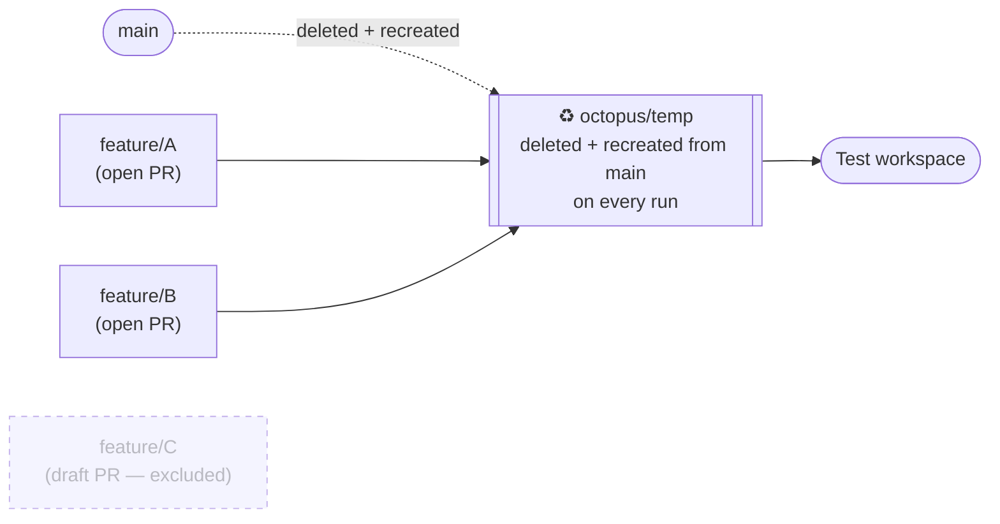
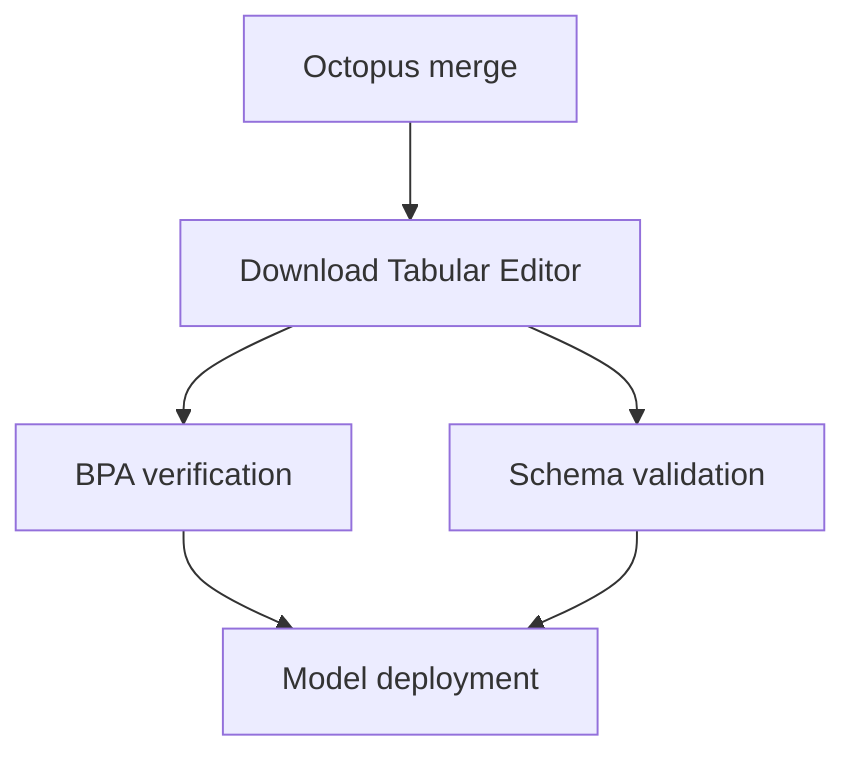
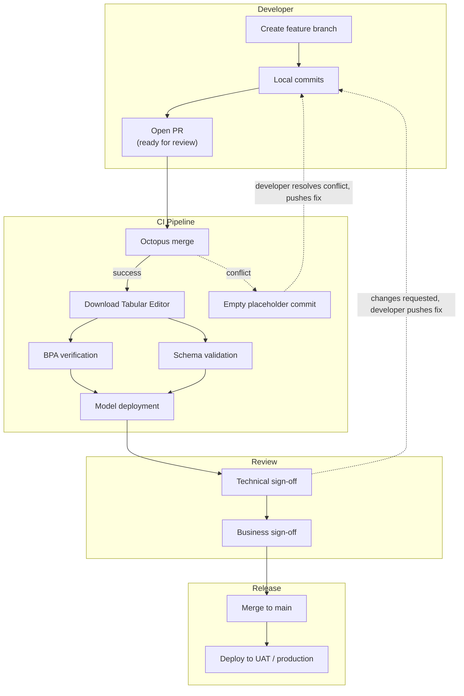

# GitHub Flow 与 Octopus Merge 合并模式

本文介绍在[使用 Git 和保存到文件夹启用并行开发](xref:parallel-development)中推荐的日常 **GitHub Flow** 工作流，以及支持该流程的 **Octopus Merge** 模式：用于让共享测试环境持续与当前所有进行中的工作保持同步。 本文后半部分将逐步介绍一个实现这一点的完整参考管道——正如你将看到的，它涵盖的内容远不止合并步骤本身。

## GitHub Flow 的日常实践

GitHub Flow 的规则很简单——`main` 始终可部署，所有工作都在从 `main` 分出的短期分支上进行——但对语义模型团队来说，有几个细节值得明确说明。

**创建功能分支：**

```cmd
git checkout main
git pull
git checkout -b feature/add-tax-calculation
```

**本地开发。** 开发者在 Tabular Editor 3 中进行开发。 开发者每次按下 **Ctrl+S** 时，都会发生两件事：

- 模型元数据会以 [保存到文件夹 (Database.json) 格式](xref:parallel-development#what-is-save-to-folder) 保存到磁盘，可直接在 Git 中暂存并提交到功能分支。
- 如果启用了 [工作区模式](xref:workspace-mode)，模型会同时同步到共享开发 Workspace 中你个人的 Workspace 数据库——这样你既可以在 Tabular Editor 中进行实时测试，也可以让 Power BI Desktop [直接连接到 Workspace 数据库](xref:workspace-mode#advantages-of-workspace-mode) 进行 Report 端验证。

```cmd
git add .
git commit -m "Add tax calculation measure and supporting columns"
git push
```

> [!WARNING]
> 不要在托管 Workspace 数据库的 Fabric Workspace 上启用 Fabric Git 集成。 Tabular Editor 通过 XMLA endpoint 直接写入 Workspace 数据库，这些写入与 Git 分支没有任何关系——在同一个 Workspace 中启用 Git 集成，会对同一个数据库产生相互冲突、绕过流程的更改。 这一点也在[工作区模式文档](xref:workspace-mode)中有所说明。

**发起拉取请求。** 当开发者准备好进行更广泛的测试时，会创建一个以 `main` 为目标分支的拉取请求。 这也是 GitHub Flow 单独使用时给 BI 团队留下的一个问题：当多个开发者同时都提交了尚未关闭的拉取请求时，共享测试环境到底应该反映什么状态？ 这正是 Octopus Merge 要回答的问题——见下文。

**批准并合并。** 一旦技术和业务审核人员都基于共享测试环境完成签核，功能分支就会合并到 `main` 并删除。

**部署到 UAT / 生产环境。** 要么每次合并到 `main` 都自动触发部署，要么累积若干次合并后按固定节奏部署（例如每周一次）。 两种方式都与 GitHub Flow 兼容——无论采用哪种方式，分支结构都相同，区别只在于发布触发方式。

## Octopus Merge：让测试环境保持实时更新

##### 注：命名消歧

“Octopus merge” 在 Git 生态中用来指代三个彼此相关但又不同的概念。 这里有必要明确我们指的是哪一种：

1. **Git 原生的 octopus merge 策略**——当你运行 `git merge branch-a branch-b branch-c` 时，Git 会自动使用这种合并策略，将两个以上的分支头合并为一个合并提交，_前提是没有冲突_。 只要有任一分支与当前合并发生冲突，整个命令就会失败——Git 不会尝试在两个以上分支之间解决或隔离冲突。 这是 Git 的底层机制，不是工作流。
2. **`lesfurets/git-octopus`**——一个现已归档的开源命令行工具，它将这种原生策略封装成了“持续合并”工作流：按命名模式匹配出一组分支，将它们合并，把结果推送到一个临时分支，并在每次推送时重复这一过程。 它还包含了逐个遍历分支的工具，用来精确找出是哪一个分支导致了冲突。 这个工具本身已不再维护，也不是我们建议直接采用的方案；但它开创的工作流，正是下文要介绍的模式。
3. **本文所说的 Octopus Merge 模式**——一个自定义 CI/CD 管道，用于发现当前所有目标分支为 `main`、处于打开状态（非草稿）的拉取请求，使用 (1) 中 Git 原生的 octopus 策略将它们的源分支合并在一起，把结果推送到一个临时分支，并将该分支部署到共享测试环境。 这个模式与 (2) 的思路相同，但它被重新实现为由你自己掌控的管道脚本——例如 GitHub Actions 工作流，或调用 Azure DevOps REST API 的 Azure Pipelines 脚本——而不是一个独立的第三方工具。

本文提到“Octopus Merge”时，指的是 (3)。 注意，(3) _使用_ (1) 中的原生策略作为实际的合并机制——它增加的价值在于围绕这次合并的自动化和分支生命周期管理，而不是提供另一种合并方式。

简而言之，这个模式就是：**你的测试环境始终反映当前所有进行中工作的组合**——而不是只单独反映某一个功能。 每当开发者向任一打开的、非草稿的拉取请求推送代码时，管道都会从头重新构建这个组合分支，并重新部署它。



> [!NOTE]
> Tabular Editor 现已提供跨平台 CLI（`te`），目前处于有限公开预览阶段，专为 CI/CD 场景打造——支持非交互模式、原生 GitHub Actions/Azure DevOps 注解、VSTEST 输出，以及用于在管道中运行回归测试的 `te test run` 命令。 它与下文描述的这类管道天然契合，值得关注。 在撰写本文时，Tabular Editor 自身的文档仍建议不要在预览期间将其用于生产管道（文档说明该预览版本会于 2026-09-30 过期），因此本文中的参考实现改用已成熟的 `TabularEditor.exe` CLI。 有关这个新 CLI 当前具备的能力和示例，可以查看 [CI/CD 集成](xref:te-cli-cicd)。

<!-- FUTURE SPLIT POINT: everything from "Reference implementation" onward is a candidate to become its own page once it grows further (e.g. once release/production deployment past the test environment is added). -->

## 参考实现

下面给出的是一个完整且可运行的管道，实现了 Octopus Merge——但需要先说明，它做的事情远不止合并这一步。 一次完整运行还会下载 Tabular Editor，并在把合并后的模型部署到共享测试工作区之前，按你的最佳实践规则和线上数据源架构对其进行验证。 Octopus Merge 是 5 个作业中的第 1 个；其余部分是一个通用的语义模型 CI/CD 管道，只是恰好以 Octopus Merge 的输出作为输入。 至于在该模型之上部署报表——这是另一个议题，且会因组织而异——文末会简要说明。

下面的示例分别展示了用于合并作业的 **Azure Pipelines**（调用 Azure DevOps REST API）和 **GitHub Actions**（调用 GitHub REST API），因为这两个平台的主要差异在于它们如何进行身份验证以及如何查询拉取请求——无论使用哪一种，底层的 Git 操作和 Tabular Editor CLI 调用都是相同的。

### 管道概览

一次完整运行由多个作业组成，每个作业都明确依赖于前面的作业：



把每个阶段作为独立作业运行，而不是写成一段很长的脚本——这样就能为每个关注点提供独立的通过/失败信号（合并冲突、BPA 违规、架构漂移、部署失败等），从而在运行失败时更快定位究竟哪里出了问题。

##### 注意：管道代理要求

由于 `TabularEditor.exe` 只能在 Windows 上运行，因此每个调用它的作业都需要基于 Windows 的代理/运行器，这包括 BPA 验证、架构验证和模型部署作业。 只要云托管的 Windows 代理能通过网络访问你的测试 Workspace 和数据源，就没问题；只有当这些端点无法从外网访问时（例如本地数据源），才需要自托管代理。 Octopus 合并作业本身没有这个限制，因为它只需要 Git。

### 触发管道

该管道不会由常规的 Git 推送触发器触发。 由于它需要合并当前 _所有_ 打开的拉取请求——而不只是发生变更的那一个——因此通常不配置自动分支触发器，而是通过以下两种方式之一调用：

- **通过拉取请求管道或分支策略**，这样每当创建指向 `main` 的拉取请求时，或向任何存在打开拉取请求的分支推送新提交时，它都会运行。
- **按计划运行**（例如每隔几分钟一次），如果你的 CI/CD 平台不便直接配置“在任意打开的拉取请求分支更新时运行”，这会是一个更简单的替代方案。

两种方式的效果相同：只要向任何存在打开拉取请求的分支推送，组合测试环境就会重新构建。

### 作业 1：Octopus 合并

这个作业负责发现当前所有打开的拉取请求，将它们合并在一起，并将结果发布到一个临时分支。

**具体步骤如下：**

1. **进行身份验证并查询拉取请求。** 该作业会调用源代码管理平台的 REST API，获取所有以 `main` 为目标的打开拉取请求，并使用具有列出拉取请求权限的令牌进行身份验证（包括草稿拉取请求——过滤会在下一步进行，而不是在 API 层完成）。
2. **筛选出非草稿拉取请求。** 草稿拉取请求会被排除——这样开发者就可以推送尚在开发中的提交，而不会将其纳入共享测试构建。 只有当 PR 被标记为“准备好评审”时，才会参与合并。
3. **全新克隆 repository。** 该作业不会复用之前的检出结果，而是在每次运行时都从头克隆 repository，并使用管道自身的访问令牌进行身份验证。 这可确保合并始终从干净、已知的状态开始。
4. **删除并重新创建临时分支。** 临时输出分支（例如 `octopus/temp`）的远程和本地副本如果存在，都会被强制删除，然后再从 `main` 全新创建。 这个分支绝不会在不同运行之间快进或复用——每次都会从头重建。
5. **用一条命令合并所有符合条件的拉取请求分支。** 向 `git merge` 传入两个以上的分支时，会自动调用 Git 的原生 octopus 合并策略——这正是这种模式使用上文所述底层 Git 机制的地方。
6. **推送结果**，如果合并成功。

**Azure Pipelines**，调用 Azure DevOps REST API：

```yaml
- task: PowerShell@2
  displayName: Git octopus merge
  inputs:
    targetType: 'inline'
    script: |
      $prs = Invoke-RestMethod -Uri "https://dev.azure.com/$(Org)/$(Project)/_apis/git/repositories/$(Repo)/pullrequests?api-version=7.0" `
        -Headers @{ Authorization = "Bearer $(System.AccessToken)" }
      $branches = $prs.value | Where-Object { $_.isDraft -eq $false -and $_.targetRefName -eq "refs/heads/main" } |
        ForEach-Object { $_.sourceRefName -replace 'refs/heads', 'origin' }

      git clone $(Build.Repository.Uri) repo --quiet
      cd repo
      git checkout main --quiet
      git push origin --delete octopus/temp --quiet 2>$null
      git checkout -b octopus/temp --quiet
      if ($branches.Count -gt 0) {
        git merge --quiet $branches
      }
      git push --set-upstream origin octopus/temp --quiet
```

**GitHub Actions**，通过 `gh` CLI 调用 GitHub REST API：

```yaml
- name: Git octopus merge
  env:
    GH_TOKEN: ${{ secrets.GITHUB_TOKEN }}
  run: |
    branches=$(gh pr list --base main --state open --json isDraft,headRefName \
      --jq '.[] | select(.isDraft == false) | .headRefName')

    git clone "$GITHUB_SERVER_URL/$GITHUB_REPOSITORY" repo --quiet
    cd repo
    git checkout main --quiet
    git push origin --delete octopus/temp --quiet || true
    git checkout -b octopus/temp --quiet
    if [ -n "$branches" ]; then
      git merge --quiet $(echo "$branches" | sed 's/^/origin\//')
    fi
    git push --set-upstream origin octopus/temp --quiet
```

两个版本做的都是同一件事：列出所有面向 `main` 的开放且非草稿 PR，将它们解析为分支引用，然后把它们合并到一个重新创建的 `octopus/temp` 分支中。

**处理合并失败：**

如果合并失败——最可能的原因是两个或多个开放的拉取请求之间发生冲突——不要只是记录错误然后停止。 更稳妥的实现方式应当先重置工作目录，并在这个临时分支上推送一个**空占位提交**，然后再让流水线运行失败：

```
git reset --hard --quiet
git checkout main --quiet
git branch -D octopus/temp --quiet
git checkout -b octopus/temp --quiet
git config user.email "octopus-merge@users.noreply.github.com"
git config user.name "Octopus Merge"
git commit --allow-empty -m "init" --quiet
git push origin octopus/temp --quiet
```

这一步很重要，因为下游作业（BPA 验证、架构验证、部署）可能依赖这个临时分支以某种明确定义的状态存在。 如果没有这一步，合并失败可能会导致该分支缺失，或处于合并到一半的状态，从而让后续作业出现令人困惑的连带故障，而不是在合并步骤中报出一个明确的错误。

##### 注意——如何诊断是哪个分支引发了冲突

这种模式的直接实现方式不会自动识别到底是哪一个拉取请求导致了合并冲突——它只会 Report：合并失败。 与已归档的 `lesfurets/git-octopus` 工具相比，这是一个真实存在的限制；后者内置了逐个遍历分支以定位问题来源的工具。 在实践中，大多数团队都会手动处理：先暂时撤下你怀疑有问题的拉取请求（改回草稿状态，或直接关闭），然后反复运行流水线，直到合并再次成功，以缩小范围并找出是哪个分支导致了问题。 如果这种反复试错的过程成了团队的瓶颈，那就值得在你自己的流水线中加入一个自动逐个排查的步骤。

### 作业 2：下载 Tabular Editor

由于后续作业需要调用 Tabular Editor CLI，而又不能假定构建代理已预装它，因此会有一个单独的作业在每次运行开始时下载一份 Tabular Editor 便携版：

- 直接获取最新发布版本（例如从 Tabular Editor 的 GitHub Releases）。
- 将其解压，并删除下载的压缩包。
- 让解压得到的 `TabularEditor.exe` 可供同一代理/运行器上的后续作业使用。

每次运行都重新下载最新版本，可以让流水线自动保持最新，而不必跟踪并更新锁定的版本号——不过，如果你的团队更看重确定性和可复现的构建，那么将版本锁定到某个特定发布版，并有计划地进行更新，也值得作为替代方案考虑。

### 作业 3：BPA 验证

这个作业会对合并产出的每个语义模型运行 Tabular Editor 的 [Best Practices Analyzer](xref:best-practice-analyzer)，并根据团队统一的质量规则进行验证。

如果你的 repository 中包含多个语义模型——这在服务多个业务领域的 BI 团队中很常见——那么每个模型通常都会位于各自的子文件夹中，而这个作业会依次遍历它们：

```
TabularEditor.exe "<path-to-model>" -A "<path-to-BPARules.json>" -V
```

- `-A` 会让 Tabular Editor 使用指定的 BPA 规则文件进行检查。
- `-V` 会验证模型，并生成 Report 以输出结果。

> [!NOTE]
> 先决定好：BPA 违规是要让流水线 **失败**，还是只给出 **警告**。 当规则集仍在调优时，先从警告模式开始确实很诱人；但如果长期保持这样，违规项可能会在从未阻止部署的情况下悄然累积。 应将仅警告的 BPA 步骤视为过渡状态，后续要“升级”退出，而不是永久配置。

### 作业 4：架构验证

这个作业会将每个模型的预期架构与其真实在线的数据源进行比较——例如，它能在列被重命名或缺失导致测试环境刷新失败之前发现问题。

```
TabularEditor.exe "<path-to-model>" -S "<path-to-connection-script>.cs" -SC -V -W
```

- `-S` 会运行一个 C# Script 来设置模型的数据源连接字符串——通常从管道环境变量或机密中读取，从而无需将真实连接信息提交到源代码管理中。
- `-SC` 会执行架构检查，将模型的元数据与实时数据源进行比较。
- `-V -W` 用于验证结果并控制警告的处理方式。

如果你的模型依赖于数据库对象，而这些对象本身也是作为管道的一部分部署的——例如从源代码管理发布的 SQL 视图——要确保该部署步骤在架构验证之前运行，这样检查针对的就是所有内容都部署到测试环境后模型实际会看到的那些对象。 如果这两个作业是彼此独立编写的，这种顺序依赖关系就很容易被忽略。

> [!NOTE]
> 部署上游数据对象（SQL 视图及其他数据库工件）的具体机制因组织的数据平台而异，也不属于 Octopus Merge 模式本身的一部分。 对这一模式来说，唯一重要的是：架构验证必须在你的数据源处于测试环境预期状态之后进行——至于由什么来让它达到这个状态，由你决定。

### 作业 5：模型部署

当 BPA 验证和架构验证都成功后，此作业会将合并后的模型部署到共享测试 Workspace，使用 Tabular Editor 的“保存到文件夹”（`Database.json`）格式，并通过 XMLA endpoint 直接部署：

```
TabularEditor.exe "<path-to-model>\database.json" -D "Provider=MSOLAP;Data Source=<XMLA-endpoint>;User ID=app:<app-id>@<tenant-id>;Password=<app-secret>;LocaleIdentifier=1033" "<model-name>" -O -P -R -W -V -E
```

有几点值得特别说明：

- 身份验证通过 **服务主体**（Azure AD 应用注册）完成，而不是用户账户——这更适合无人值守的管道，也避免了必须在管道机密中保存真实用户凭据。
- 传递给 Tabular Editor 的模型名称通常与文件夹名称一致，因此包含多个模型的 repository 会将每个模型部署到名称对应的 Dataset。
- `-O -P -R -W -V -E` 标志分别涵盖覆盖、处理、角色、警告、验证和错误处理——如果你需要根据自己的设置调整其中任何一项，请参阅 [Tabular Editor CLI 参考](xref:command-line-options) 获取完整的标志列表。

> [!NOTE]
> 业务评审人员在共享测试环境中签署确认时，验证的是 Report，而不是原始的 XMLA 连接——实际上，在他们签署之前，仍需要有步骤部署 Power BI Report 并将其绑定到刚部署的测试模型上（并可选择更新任何已发布的 Power BI Apps）。 每次运行是重新部署所有 Report，还是只部署受本次更改影响的 Report，这类决策因组织而异，本文不作展开——该部分管道请参阅 @powerbi-cicd。

### 完整工作流图



## 关键原则

- `main` 始终处于可部署状态；功能分支生命周期短，且彼此独立。
- 一次性分支会在每次运行时删除，并基于 `main` 重新创建——绝不会 fast-forward，也不会复用。
- 合并失败后，一次性分支应保持在明确的状态中（即使是空的），而不是处于缺失或半合并状态。
- 每个验证阶段（BPA、架构）都应是管道中独立的作业，拥有各自的通过/失败信号，而不是揉进一个脚本里。
- 组织特定的步骤（例如部署 SQL 视图）应与通用模式清晰区分开，无论在管道代码中还是在内部文档里都应如此——这样即使需要将该模式应用到其他项目，它也仍然便于移植。

## 后续步骤

- [借助 Git 和“保存到文件夹”实现并行开发](xref:parallel-development)——本管道所支持的分支策略。
- [CI/CD 集成](xref:te-cli-cicd)——新版 Tabular Editor CLI 的 CI/CD 模式，目前处于有限公开预览阶段。
- @powerbi-cicd
- @as-cicd
