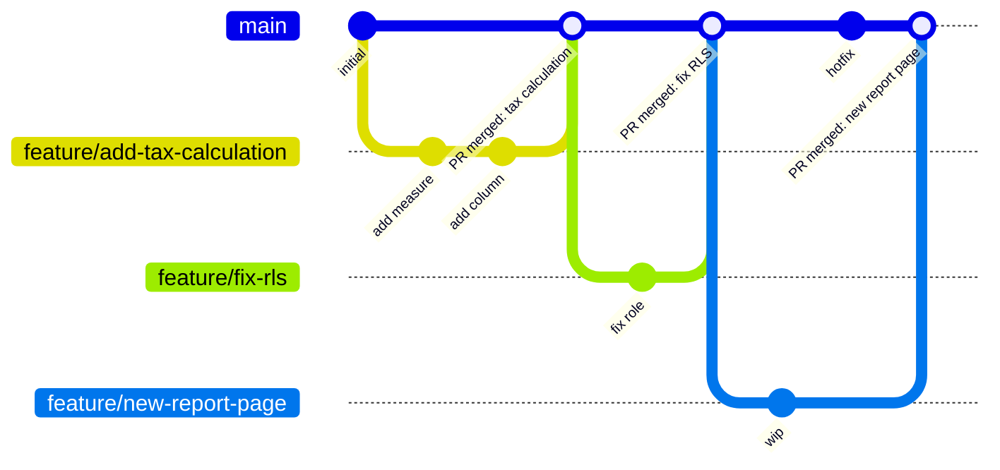

# 通过 Git 和“保存到文件夹”实现并行开发

<!--
<div style="padding:56.25% 0 0 0;position:relative;"><iframe src=https://player.vimeo.com/video/664699623?h=57bde801c7&amp;badge=0&amp;autopause=0&amp;player_id=0&amp;app_id=58479 frameborder="0" allow="autoplay; fullscreen; picture-in-picture" allowfullscreen style="position:absolute;top:0;left:0;width:100%;height:100%;" title="Boosting productivity"></iframe></div><script src=https://player.vimeo.com/api/player.js></script>
-->

本文介绍并行模型开发的原则（也就是让多个开发者同时在同一个 Data model 上工作），以及 Tabular Editor 在其中的角色。

## 先决条件

- 你的 Data model 的目标位置必须是以下之一：
  - SQL Server 2016（或更高版本）的 Analysis Services Tabular
  - Azure Analysis Services
  - 已分配到 Fabric capacity、Power BI Embedded capacity、旧版 Premium capacity 或 Premium Per User 许可证，并已[启用 XMLA 读/写](https://learn.microsoft.com/en-us/fabric/enterprise/powerbi/service-premium-connect-tools#enable-xmla-read-write)（自 2025 年六月起默认为启用）的 Power BI Workspace
- 所有团队成员都能访问的 Git repository（本地部署或托管在 Azure DevOps、GitHub 等）

## 将 TOM 视为源代码

在 Analysis Services 表格模型和 Power BI Dataset 上实现并行开发，传统上一直很难（为简洁起见，本文将这两类模型统称为“表格模型”）。 随着 [Tabular Object Model (TOM)](https://docs.microsoft.com/en-us/analysis-services/tom/introduction-to-the-tabular-object-model-tom-in-analysis-services-amo?view=asallproducts-allversions) 采用基于 JSON 的模型元数据，将模型元数据纳入版本控制确实变得更容易了。

使用基于文本的文件格式，可以借助版本控制系统中常见的各种差异对比工具，更优雅地处理冲突变更。 这种变更冲突解决方式在传统软件开发中非常常见，因为所有源代码都分散在大量的小型文本文件中。 因此，大多数主流版本控制系统都针对这类文件做了优化，用于变更检测和（自动）冲突解决。

对于表格模型开发而言，“源代码”就是我们基于 JSON 的 TOM 元数据。 在较早版本的 Visual Studio 中开发表格模型时，Model.bim 这个 JSON 文件中会额外包含关于谁在何时修改了哪些内容的信息。 这些信息只是作为附加属性，存储在文件中各处的 JSON 对象里。 这会带来问题：这些信息不仅是冗余的（因为文件本身也有元数据，用来描述最后一次编辑它的人是谁，以及最后一次编辑发生在什么时候），而且从版本控制的透视来看，这些元数据并没有任何语义意义。 换句话说，即使你把文件中的所有修改元数据都移除，得到的仍然是一个完全有效的 TOM JSON 文件；你可以将其部署到 Analysis Services 或发布到 Power BI，而不会影响模型的功能和业务逻辑。

就像传统软件开发的源代码一样，我们不希望这类信息“污染”我们的模型元数据。 事实上，版本控制系统能更细致地展示改了什么、谁改的、何时改的以及为何改，因此没有理由把这些信息作为被版本控制的文件内容之一。

Tabular Editor 刚诞生时，还没法从 Visual Studio 生成的 Model.bim 文件中去除这些信息，不过在较新的版本里这点终于改了。 不过，我们仍然要面对一个单一的、庞大的文件（Model.bim），其中包含定义模型的全部“源代码”。

Power BI Dataset 开发者的处境更糟，因为他们甚至无法访问包含模型元数据的文本文件。 他们能做的最好办法，是把 Power BI Report 导出为 [Power BI 模板（.pbit）文件](https://docs.microsoft.com/en-us/power-bi/create-reports/desktop-templates#creating-report-templates)；它本质上是一个 ZIP 文件，里面包含 Report 页面、Data model 定义以及查询定义。 从版本控制系统的透视来看，zip 文件是二进制文件，而二进制文件无法像文本文件那样进行 diff、比较和合并。 这就迫使 Power BI 开发者借助第三方工具，或编写复杂的脚本/流程，才能对 Data model 进行规范的版本管理——尤其是当你希望在同一个文件里合并并行的开发分支时。

Tabular Editor 的目标是简化这一过程：无论模型是 Analysis Services 表格模型还是 Power BI Dataset，都能以一种简单的方式从 Tabular Object Model 中仅提取具有语义意义的元数据。 此外，Tabular Editor 还能通过“保存到文件夹”功能，把这些元数据拆分成多个更小的文件。

## 什么是保存到文件夹？

如上所述，表格模型的元数据传统上存放在一个单一的大型 JSON 文件中，通常名为 **Model.bim**，这并不适合与版本控制集成。 由于此文件中的 JSON 表示 [Tabular Object Model (TOM)](https://docs.microsoft.com/en-us/analysis-services/tom/introduction-to-the-tabular-object-model-tom-in-analysis-services-amo?view=asallproducts-allversions)，因此可以用一种简单直接的方法将该文件拆分成更小的部分：TOM 在几乎所有层级都包含对象数组，例如模型中的表列表、表中的度量值列表、度量值中的注释列表等。 使用 Tabular Editor 的 **保存到文件夹** 功能时，这些数组会从 JSON 中直接移除，取而代之的是生成一个子文件夹，其中为原数组中的每个对象创建一个文件。 这个过程可以进行嵌套。 最终会得到一个文件夹结构：每个文件夹都包含一组更小的 JSON 文件和子文件夹；从语义上看，它与原始的 Model.bim 文件包含完全相同的信息：


每个表示单个 TOM 对象的文件名，直接取自该对象的 `Name` 属性。 “根”文件名为 **Database.json**，因此我们有时也会把这种基于文件夹的存储格式简称为 **Database.json**。

## 使用“保存到文件夹”的优点

以下是以这种基于文件夹的格式存储表格模型元数据的一些优势：

- **多个小文件通常比少数大文件更适合多数版本控制系统。** 例如，Git 会存储已修改文件的快照。 仅凭这一点，就足以说明把模型表示为多个小文件，比存成一个大型文件更合理。
- **避免在数组重新排序时产生冲突。** 表、度量值、列等的列表在 Model.bim JSON 中以数组表示。 不过，数组中对象的顺序并不重要。 在模型开发过程中，对象被重新排序并不少见，例如剪切/粘贴等操作就可能导致这种情况。 使用“保存到文件夹”功能时，数组中的对象会以单独的文件存储，因此数组不再作为整体进行变更跟踪，从而降低合并冲突的风险。
- **不同开发者很少会修改同一个文件。** 只要开发者分别负责 Data model 的不同部分，就很少会修改到同一份文件，从而降低合并冲突的风险。

## 使用保存到文件夹的缺点

目前，将表格模型元数据以基于文件夹的格式存储，唯一的缺点是这种格式仅 Tabular Editor 支持。 换句话说，你没法直接把基于文件夹格式的模型元数据加载到 Visual Studio 里。 你得先临时把基于文件夹格式转换成 Model.bim 格式。当然，这可以用 Tabular Editor 来完成。

## 配置保存到文件夹

通用方案很少能适配所有情况。 Tabular Editor 提供了一些配置选项，用于控制如何将模型序列化为文件夹结构。 在 Tabular Editor 3 中，你可以在 **工具 > 偏好 > 保存到文件夹** 下找到常规设置。 在 Tabular Editor 中加载模型后，你可以在 **模型 > 序列化选项...** 下找到适用于该模型的具体设置。 适用于特定模型的设置会作为注释存到模型本身里，以确保不管是谁加载并保存模型，都用同一套设置。


### 序列化设置

- **使用推荐设置**：（默认：选中）选中后，Tabular Editor 在首次将模型保存为文件夹结构时会使用默认设置。
- **在“from”表上序列化关系**：（默认：未选中）选中后，Tabular Editor 会将关系作为注释存储在关系的“from 侧”（通常是事实表）的表上，而不是存储在模型级别。 这在模型开发早期阶段很有用，因为此时表名往往还会频繁变更。
- **在对象上序列化透视归属信息**：（默认：未选中）选中后，Tabular Editor 会将对象（表、列、层次结构、度量值）属于哪些透视的信息作为注释存储在该对象上，而不是存储在透视级别。 当对象名称可能变更，但透视名称已最终确定时，这会很有用。
- **在已翻译的对象上序列化翻译**：（默认：未选中）选中后，Tabular Editor 会将元数据的翻译作为注释存储在每个可翻译对象（表、列、层次结构、级别、度量值等）上，而不是存储在区域设置级别。 当对象名称可能变更时，这会很有用。
- **按顺序为文件名添加前缀**：（默认：未选中）如果你希望保留数组成员的元数据顺序（例如表中列的顺序），可以选中此项，让 Tabular Editor 基于对象在数组中的索引，在文件名前加上按顺序递增的整数前缀。 如果你在 Excel 中使用默认的钻取功能，并希望[在钻取结果中让列按特定顺序显示](https://github.com/TabularEditor/TabularEditor/issues/46#issuecomment-297932090)，这会很有用。

> [!NOTE]
> 上述设置的主要目的在于通过调整某些模型元数据的存储方式和位置，减少模型开发过程中出现的合并冲突。 在模型开发的早期阶段，对象频繁被重命名并不少见。 如果模型已经指定了元数据翻译，那么每次重命名对象至少会带来两处变更：一处发生在被重命名的对象上，另一处发生在为该对象定义了翻译的每个区域设置中。 选中 **Serialize translations on translated objects** 后，只会在被重命名的对象上产生变更，因为该对象也会包含翻译后的值（由于这些信息将作为注释存储）。

### 序列化深度

该清单允许你指定哪些对象将被序列化为单独的文件。 请注意，某些选项（透视、翻译、关系）可能不可用，具体取决于上面指定的设置。

在大多数情况下，建议始终将对象序列化到最低层级。 不过，在某些特殊场景下，可能不需要这么细的粒度。

## Power BI 与版本控制

如上所述，将 Power BI Report（.pbix）或 Power BI 模板（.pbit）文件纳入版本控制，并不能实现并行开发或冲突解决，因为这些文件采用二进制文件格式。 同时，我们也必须了解当前将 Tabular Editor（或其他第三方工具）与 Power BI Desktop 或 Power BI XMLA 端点分别配合使用时的限制。

这些限制包括：

- 当将 Tabular Editor 作为 Power BI Desktop 的外部工具使用时，[并非所有建模操作都受支持](xref:desktop-limitations)。
- Tabular Editor 可以从 Power BI Desktop 中已加载的 .pbix 文件提取模型元数据，或直接从磁盘上的 .pbit 文件提取，但**在 Power BI Desktop 之外，没有受支持的方法来更新 .pbix 或 .pbit 文件中的模型元数据**。
- 一旦通过 XMLA endpoint 对某个 Power BI Dataset 做出任何更改，[该 Dataset 就无法再以 .pbix 文件形式下载](https://docs.microsoft.com/en-us/power-bi/admin/service-premium-connect-tools#power-bi-desktop-authored-datasets)。

要实现并行开发，我们必须能够将模型元数据存储为上述某种基于文本的（JSON）格式（Model.bim 或 Database.json）。 无法从这种基于文本的格式“重建” .pbix 或 .pbit 文件，因此**一旦决定走这条路线，就无法再使用 Power BI Desktop 来编辑 Data model**。 取而代之的是，我们必须依赖能够使用基于 JSON 的格式的工具——这正是 Tabular Editor 的用途所在。

> [!WARNING]
> 如果你无法访问分配给容量或 Premium Per User 许可证的 Workspace，则无法发布存储在 JSON 文件中的模型元数据，因为此操作需要访问 [XMLA endpoint](https://learn.microsoft.com/en-us/fabric/enterprise/powerbi/service-premium-connect-tools)。

> [!NOTE]
> 创建 Report 的 Visual 部分仍然需要 Power BI Desktop。 始终将 Report 与模型分离是一项[最佳实践](https://docs.microsoft.com/en-us/power-bi/guidance/report-separate-from-model)。 如果你现有的 Power BI 文件同时包含两者，[这篇博客](https://powerbi.tips/2020/06/split-an-existing-power-bi-file-into-a-model-and-report/)（[视频](https://www.youtube.com/watch?v=PlrtBm9YN_Q)）介绍了如何将其拆分为一个模型文件和一个 Report 文件。

## Tabular Editor 与 Git

Git 是一个免费开源的分布式版本控制系统，旨在以高速高效的方式处理从小型到超大型的各类项目。 它目前是最受欢迎的版本控制系统，并且可通过多种托管服务使用，例如 [Azure DevOps](https://azure.microsoft.com/en-us/services/devops/repos/)、[GitHub](https://github.com/)、[GitLab](https://about.gitlab.com/) 等。

本文不会详细介绍 Git。 不过，如果你想进一步了解，网上有大量资源可供参考。 我们推荐《[Pro Git](https://git-scm.com/book/en/v2)》一书作为参考。

> [!NOTE]
> Tabular Editor 3 目前尚未与 Git 或其他版本控制系统集成。 要管理你的 Git repository、提交代码更改、创建分支等，你需要使用 Git 命令行或其他工具，例如 [Visual Studio Team Explorer](https://docs.microsoft.com/en-us/azure/devops/user-guide/work-team-explorer?view=azure-devops#git-version-control-and-repository) 或 [TortoiseGit](https://tortoisegit.org/)。

如前所述，我们建议在将模型元数据保存到 Git repository 时，使用 Tabular Editor 的 [保存到文件夹](#what-is-save-to-folder) 选项。

## 分支策略

下文将讨论在开发表格模型时可采用的分支策略。

分支策略会决定日常开发工作流的具体方式；很多时候，分支还会与团队采用的项目管理方法直接对应。 例如，在 Azure DevOps 中使用[敏捷过程](https://docs.microsoft.com/en-us/azure/devops/boards/work-items/guidance/agile-process-workflow?view=azure-devops)时，你的待办项通常由 **史诗**、**功能**、**用户故事**、**任务** 和 **缺陷** 组成。

在敏捷术语中，**用户故事** 是一项可交付、可测试的工作成果。 The User Story may consist of several **Tasks** — smaller pieces of work performed by a developer before the User Story can be delivered. In an ideal world, all User Stories are broken down into manageable tasks, each taking only a couple of hours to complete, adding up to no more than a handful of days for the entire User Story. This makes a User Story an ideal candidate for a short-lived feature branch, where the developer makes one or more commits per task before the branch is merged and the code deployed for testing.

Determining a suitable branching strategy depends on many different factors: team size, release cadence, regulatory constraints, how many semantic models you maintain, and how mature your CI/CD setup already is. This article presents three strategies:

- **[GitHub Flow + Octopus Merge](#github-flow--octopus-merge)** — our recommended approach for most semantic model teams, and the primary focus of this article.
- **[GitFlow](#gitflow-branching-and-deployment-environments)** — a valid alternative, particularly suited to teams with formal, infrequent release cycles or regulatory sign-off requirements.
- **[Plain trunk-based development](#trunk-based-development)** — the simplest approach, worth understanding as a baseline even if most BI teams will want the additional structure GitHub Flow provides.

> [!NOTE]
> Tabular Editor is agnostic to branching strategy. Save to Folder and Workspace Mode work identically regardless of which of the strategies below you choose — the recommendation in this article is based on patterns we've seen succeed across enterprise engagements, not a constraint imposed by the tool.

## GitHub Flow + Octopus Merge

For teams building semantic models with Tabular Editor and Power BI, we recommend **[GitHub Flow](https://docs.github.com/en/get-started/using-github/github-flow)** combined with an **Octopus Merge** pattern for continuous integration testing.

GitHub Flow is a lightweight branching model with a single hard rule: **`main` is always deployable.** All work happens on a short-lived feature branch created off `main`; nobody commits directly to `main`; branches are merged back via pull request after review and automated checks pass. Unlike GitFlow, there's no `develop` branch and no separate branch per environment — environment promotion (dev → test → UAT → production) is handled by the deployment pipeline, not by long-lived branches.



`main` stays on a single line and is always deployable; short feature branches fork off it and merge straight back via pull request. Contrast this with the GitFlow diagram further down the page, which has five parallel, long-lived lines.

On its own, GitHub Flow doesn't answer a question specific to BI teams: what does your shared test environment reflect at any given moment, when several developers each have an open pull request? **Octopus Merge** answers this: a CI pipeline continuously merges every currently open pull request into a disposable branch and deploys the result to a shared test environment — so business users always validate the combination of everything in progress, not just one feature in isolation. See [GitHub Flow and the Octopus Merge pattern](xref:github-flow) for how the pattern works and how to build it.

A few reasons this combination fits semantic model development particularly well:

- **Simpler mental model.** Two branch concepts instead of GitFlow's five means less onboarding overhead, particularly on teams that include report authors and business analysts alongside model developers.
- **`main` is always deployable.** If you need to ship an urgent fix — a broken measure, a security-related RLS change — you don't need to reason about which of several long-lived branches currently reflects production.
- **Environment promotion lives in the pipeline, not the branch structure.** Adding a new environment is a pipeline change, not a new permanent branch every developer has to remember to merge into.
- **Short-lived branches reduce merge conflicts** — important for Octopus Merge, since it merges every open branch together for integration testing. The shorter each branch lives, the smaller the surface area for conflicts.
- **Better fit for continuous delivery of data products** than GitFlow's versioned release-train model, since semantic models tend to evolve incrementally rather than ship in discrete releases.

None of this means GitFlow is wrong — see [GitFlow branching and deployment environments](#gitflow-branching-and-deployment-environments) below for when it's still a good fit.

### Key principles

- `main` is always in a deployable state.
- Feature branches are short-lived and independent.
- The test environment always reflects the combination of everything currently in progress — not just one feature in isolation. See [GitHub Flow and the Octopus Merge pattern](xref:github-flow) for how.
- Fabric Git integration should **not** be enabled on any workspace used for Tabular Editor workspace databases — Tabular Editor writes to workspace databases directly through the XMLA endpoint, and those writes have no relationship to your Git branches. This is also called out in the [Workspace Mode documentation](xref:workspace-mode).

## GitFlow 分支与部署环境

GitFlow remains a solid choice for teams with a genuine need for the structure it provides — for example, formal versioned releases, regulatory sign-off gates tied to specific branches, or infrequent (e.g. monthly or quarterly) release cycles where a persistent `develop` branch and release branches map naturally onto your process. If that describes your team, the approach below is well worth using.

下面介绍的策略基于 [Vincent Driessen 的 GitFlow](https://nvie.com/posts/a-successful-git-branching-model/)。


Implementing a branching strategy similar to this can help solve some of the DevOps problems typically encountered by BI teams, provided you put some thought into how the branches correlate to your deployment environments. 在理想情况下，要完整支持 GitFlow，你至少需要 4 套不同的环境：

- **生产**环境，应始终包含 master 分支 HEAD 上的代码。
- **金丝雀**环境，应始终包含 develop 分支 HEAD 上的代码。 你通常会在这里安排每晚部署并运行集成测试，确保将进入下一次生产发布的各项功能能够相互兼容、协同工作。
- 一套或多套 **UAT** 环境，用于你和业务用户测试并验证新功能。 部署直接从包含待测代码的 feature 分支发起。 如果你希望并行测试多个新功能，就需要多个测试环境。 只要稍作协调，并仔细考虑各个 BI 层级之间的依赖关系，通常一个测试环境就足够了。
- 一个或多个 **沙盒** 环境，你和团队可以在其中开发新功能，而不会影响上述任何环境。 和测试环境一样，通常只需要一个共享的沙盒环境就足够了。

我们要强调：这些考量并不存在真正“放之四海皆准”的方案。 也许你并不是在云端构建解决方案，因此无法利用可扩展性或灵活性，在数秒或数分钟内快速创建新资源。 又或者你的数据量非常大，受限于资源/成本/时间，复制多套环境并不现实。

即使你确实需要支持并行开发，你也可能会发现：多个开发者通常可以轻松共享同一个开发或沙盒环境，而不会遇到太多麻烦。 Specifically for tabular models, though, we recommend that developers still use individual [workspace databases](xref:workspace-mode) to avoid "stepping over each others toes."

> [!NOTE]
> If you're evaluating GitFlow primarily because you need a shared, always-current test environment reflecting in-progress work, consider whether [GitHub Flow + Octopus Merge](#github-flow--octopus-merge) might achieve the same outcome with less branch-management overhead. GitFlow's `develop`/canary branch and Octopus Merge's disposable test branch solve a similar problem in different ways.

## Trunk-based development

Trunk-based development is the simplest possible branching model: developers commit small, frequent changes either directly to `main`, or via very short-lived feature branches that are merged back within hours. Microsoft recommends [trunk-based development](https://docs.microsoft.com/en-us/azure/devops/repos/git/git-branching-guidance?view=azure-devops) ([video](https://youtu.be/t_4lLR6F_yk?t=232)) generally for agile, continuous delivery of small increments.


In its purest form, trunk-based development can run into real friction for BI teams:

- New features often require prolonged testing and validation by business users, which may take several weeks — so you need somewhere for in-progress work to be validated that isn't `main` itself.
- BI solutions are multi-tiered (Data Warehouse/ETL, Master Data Management, semantic layer, reports), with dependencies between layers that complicate testing and deployment.
- A BI team may maintain several semantic models at different maturity stages and paces.
- Data — not just code — has to be loaded, ETL'd, and processed to make a change testable. Including full data refreshes in every build could blow up pipeline runtimes from minutes to hours, and isn't always feasible at all for very large fact tables.

**GitHub Flow + Octopus Merge, described above, is best understood as a refinement of trunk-based development that directly addresses these concerns** — rather than a departure from it. It keeps trunk-based development's core simplicity (one long-lived branch, short-lived feature branches, no release trains) while adding exactly the missing piece BI teams need: a shared test environment, populated by the pipeline rather than by a long-lived branch, that always reflects the current combined state of in-progress work. If you're choosing between the three strategies on this page, GitHub Flow + Octopus Merge is generally where we'd point a team that likes the simplicity of trunk-based development but has run into the limitations above.

## 常见工作流

假设你已经建好了 Git repository，并且与分支策略对齐，把表格模型“源代码”加入该 repository 其实很简单：用 Tabular Editor 将元数据保存到本地 repository 的新分支上。 Then, you stage and commit the new files, push your branch to the remote repository, and create a pull request to get your branch merged into the main branch.

The exact commands are the same regardless of which strategy above you choose — what differs is what happens _after_ the pull request is opened (see [GitHub Flow and the Octopus Merge pattern](xref:github-flow) for the GitHub Flow case, or your release/canary process for GitFlow). In general, the workflow looks like this:

1. Before starting work on a new feature, create a new feature branch in git:

   ```cmd
   git checkout main
   git pull
   git checkout -b feature/add-tax-calculation
   ```

2. 在 Tabular Editor 中从本地 Git repository 打开你的模型元数据。 理想情况下，使用 [Workspace 数据库](xref:workspace-mode)，以便更轻松地测试和调试 DAX 代码。

3. 使用 Tabular Editor 对模型进行必要的更改。 及时保存更改（CTRL+S）。 每次保存后就定期把代码更改提交到 Git，避免丢失工作，并保留所有更改的完整历史记录：

   ```cmd
   git add .
   git commit -m "Description of what was changed and why since last commit"
   git push
   ```

4. 如果你没有使用 Workspace 数据库，请使用 Tabular Editor 的 **Model > Deploy...** 选项部署到沙盒/开发环境，以便测试对模型元数据所做的更改。

5. 完成后，当所有代码都已提交并推送到远程 repository 时，你需要提交一个拉取请求，以便将你的代码集成到主分支。 如果遇到合并冲突，你得在本地解决。比如可以使用 Visual Studio Team Explorer，或者直接用文本编辑器打开 .json 文件来解决冲突（Git 会插入冲突标记，用于指示代码中哪些部分存在冲突）。

6. Once all conflicts are resolved, there may be a process of code review and automated build/test execution — including, if you're using the GitHub Flow approach above, the Octopus Merge test deployment — before the pull request can be completed.

We present more details about how to configure git branch policies, set up automated build and deployment pipelines, etc. using Azure DevOps and GitHub Actions in the following articles. Similar techniques can be used in other automated build and git hosting environments, such as TeamCity, GitLab, etc.

## 后续步骤

- @powerbi-cicd
- @as-cicd
- @optimizing-workflow-workspace-mode