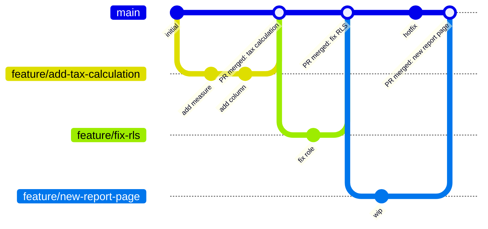

# 通过 Git 和“保存到文件夹”实现并行开发

<!--
<div style="padding:56.25% 0 0 0;position:relative;"><iframe src=https://player.vimeo.com/video/664699623?h=57bde801c7&amp;badge=0&amp;autopause=0&amp;player_id=0&amp;app_id=58479 frameborder="0" allow="autoplay; fullscreen; picture-in-picture" allowfullscreen style="position:absolute;top:0;left:0;width:100%;height:100%;" title="Boosting productivity"></iframe></div><script src=https://player.vimeo.com/api/player.js></script>
-->

本文介绍并行模型开发的原则（也就是让多个开发者同时在同一个 Data model 上工作），以及 Tabular Editor 在其中的角色。

## 先决条件

- 你的 Data model 的目标位置必须是以下之一：
  - SQL Server 2016（或更高版本）的 Analysis Services Tabular
  - Azure Analysis Services
  - a Power BI workspace assigned to a Fabric capacity, Power BI Embedded capacity, legacy Premium capacity or Premium Per User license, with [XMLA read/write enabled](https://learn.microsoft.com/en-us/fabric/enterprise/powerbi/service-premium-connect-tools#enable-xmla-read-write) (the default since June 2025)
- 所有团队成员都能访问的 Git repository（本地部署或托管在 Azure DevOps、GitHub 等）

## 将 TOM 视为源代码

在 Analysis Services 表格模型和 Power BI Dataset 上实现并行开发，传统上一直很难（为简洁起见，本文将这两类模型统称为“表格模型”）。 With the introduction of the JSON-based model metadata used by the [Tabular Object Model (TOM)](https://docs.microsoft.com/en-us/analysis-services/tom/introduction-to-the-tabular-object-model-tom-in-analysis-services-amo?view=asallproducts-allversions), integrating model metadata in version control has certainly become easier.

使用基于文本的文件格式，可以借助版本控制系统中常见的各种差异对比工具，更优雅地处理冲突变更。 This type of change conflict resolution is very common in traditional software development, where all of the source code resides in a large number of small text files. For this reason, most popular version control systems are optimized for these types of files, for purposes of change detection and (automatic) conflict resolution.

For tabular model development, the "source code" is our JSON-based TOM metadata. 在较早版本的 Visual Studio 中开发表格模型时，Model.bim 这个 JSON 文件中会额外包含关于谁在何时修改了哪些内容的信息。 This information was simply stored as additional properties on the JSON objects throughout the file. 这会带来问题：这些信息不仅是冗余的（因为文件本身也有元数据，用来描述最后一次编辑它的人是谁，以及最后一次编辑发生在什么时候），而且从版本控制的透视来看，这些元数据并没有任何语义意义。 In other words, if you were to remove all of the modification metadata from the file, you would still end up with a perfectly valid TOM JSON-file, that you could deploy to Analysis Services or publish to Power BI, without affecting the functionality and business logic of the model.

Just like source code for traditional software development, we do not want this kind of information to "contaminate" our model metadata. Indeed, a version control system gives a much more detailed view of the changes that were made, who made them, when and why, so there is no reason to include it as part of the files being versioned.

Tabular Editor 刚诞生时，还没法从 Visual Studio 生成的 Model.bim 文件中去除这些信息，不过在较新的版本里这点终于改了。 However, we still need to deal with a single, monolithic file (the Model.bim file) containing all of the "source code" that defines the model.

Power BI dataset developers have it much worse, since they do not even have access to a text-based file containing the model metadata. 他们能做的最好办法，是把 Power BI Report 导出为 [Power BI 模板（.pbit）文件](https://docs.microsoft.com/en-us/power-bi/create-reports/desktop-templates#creating-report-templates)；它本质上是一个 ZIP 文件，里面包含 Report 页面、Data model 定义以及查询定义。 From the perspective of a version control system, a zip file is a binary file, and binary files cannot be diff'ed, compared and merged, the same way text files can. This forces Power BI developers to use 3rd party tools or come up with elaborate scripts or processes for properly versioning their data models - especially, if they want to be able to merge parallel tracks of development within the same file.

Tabular Editor 的目标是简化这一过程：无论模型是 Analysis Services 表格模型还是 Power BI Dataset，都能以一种简单的方式从 Tabular Object Model 中仅提取具有语义意义的元数据。 Moreover, Tabular Editor can split up this metadata into several smaller files using its Save to Folder feature.

## 什么是保存到文件夹？

As mentioned above, the model metadata for a tabular model is traditionally stored in a single, monolithic JSON file, typically named **Model.bim**, which is not well suited for version control integration. 由于此文件中的 JSON 表示 [Tabular Object Model (TOM)](https://docs.microsoft.com/en-us/analysis-services/tom/introduction-to-the-tabular-object-model-tom-in-analysis-services-amo?view=asallproducts-allversions)，因此可以用一种简单直接的方法将该文件拆分成更小的部分：TOM 在几乎所有层级都包含对象数组，例如模型中的表列表、表中的度量值列表、度量值中的注释列表等。 When using Tabular Editor's **Save to Folder** feature, these arrays are simply removed from the JSON, and instead, a subfolder is generated containing one file for each object in the original array. This process can be nested. The result is a folder structure, where each folder contains a set of smaller JSON files and subfolders, which semantically contains exactly the same information as the original Model.bim file:


The names of each of the files representing individual TOM objects are simply based on the `Name` property of the object itself. “根”文件名为 **Database.json**，因此我们有时也会把这种基于文件夹的存储格式简称为 **Database.json**。

Tabular Editor splits [DAX User-Defined Functions](xref:udfs) out the same way, into a `functions` folder at the model root. Turn this on as soon as more than one person writes functions: until you do, every function lives inside **Database.json**/ See [Save to folder](xref:save-to-folder#user-defined-functions-udfs).

## 使用“保存到文件夹”的优点

以下是以这种基于文件夹的格式存储表格模型元数据的一些优势：

- **多个小文件通常比少数大文件更适合多数版本控制系统。** 例如，Git 会存储已修改文件的快照。 For this reason alone, it makes sense why representing the model as multiple smaller files is better than storing it as a single, large file.
- **避免在数组重新排序时产生冲突。** 表、度量值、列等的列表在 Model.bim JSON 中以数组表示。 However, the order of objects within the array does not matter. It is not uncommon for objects to be reordered during model development, for example due to cut/paste operations, etc. With Save to Folder, array objects are stored as individual files, so the arrays are no longer change tracked, reducing the risk of merge conflicts.
- **不同开发者很少会修改同一个文件。** 只要开发者分别负责 Data model 的不同部分，就很少会修改到同一份文件，从而降低合并冲突的风险。

## 使用保存到文件夹的缺点

As it stands, the only disadvantage of storing the tabular model metadata in the folder based format, is that this format is used exclusively by Tabular Editor. In other words, you can not directly load the model metadata into Visual Studio from the folder based format. 你得先临时把基于文件夹格式转换成 Model.bim 格式。当然，这可以用 Tabular Editor 来完成。

## 配置保存到文件夹

One size rarely fits all. Tabular Editor has a few configuration options that affect how a model is serialized into the folder structure. In Tabular Editor 3, you can find the general settings under **Tools > Preferences > Save-to-folder**. Once a model is loaded in Tabular Editor, you can find the specific settings that apply to that model under **Model > Serialization options...**. The settings that apply to a specific model are stored as an annotation within the model itself, to ensure that the same settings are used regardless of which user loads and saves the model.


### 序列化设置

- **使用推荐设置**：（默认：选中）选中后，Tabular Editor 在首次将模型保存为文件夹结构时会使用默认设置。
- **在“from”表上序列化关系**：（默认：未选中）选中后，Tabular Editor 会将关系作为注释存储在关系的“from 侧”（通常是事实表）的表上，而不是存储在模型级别。 This is useful when in the early development phase of a model, where table names are still subject to change quite often.
- **在对象上序列化透视归属信息**：（默认：未选中）选中后，Tabular Editor 会将对象（表、列、层次结构、度量值）属于哪些透视的信息作为注释存储在该对象上，而不是存储在透视级别。 This is useful when object names are subject to change, but perspective names are finalised.
- **在已翻译的对象上序列化翻译**：（默认：未选中）选中后，Tabular Editor 会将元数据的翻译作为注释存储在每个可翻译对象（表、列、层次结构、级别、度量值等）上，而不是存储在区域设置级别。 This is useful when object names are subject to change.
- **按顺序为文件名添加前缀**：（默认：未选中）如果你希望保留数组成员的元数据顺序（例如表中列的顺序），可以选中此项，让 Tabular Editor 基于对象在数组中的索引，在文件名前加上按顺序递增的整数前缀。 This is useful if you use the default drillthrough feature in Excel, and would like [columns to appear in a certain order in the drillthrough](https://github.com/TabularEditor/TabularEditor/issues/46#issuecomment-297932090).

> [!NOTE]
> The main purpose of the settings described above, is to reduce the number of merge conflicts encountered during model development, by adjusting how and where certain model metadata is stored. In the early phases of model development, it is not uncommon for objects to be renamed often. If a model already has metadata translations specified, every object rename would cause at least two changes: One change on the object being renamed, and one change for every culture that defines a translation on that object. When **Serialize translations on translated objects** is checked, there would only be a change on the object being renamed, as that object also includes the translated values (since this information would be stored as an annotation).

### 序列化深度

该清单允许你指定哪些对象将被序列化为单独的文件。 Note that some options (perspectives, translations, relationships) may not be available, depending on the settings specified above.

在大多数情况下，建议始终将对象序列化到最低层级。 However, there may be special cases where this level of detail is not needed.

## Power BI 与版本控制

如上所述，将 Power BI Report（.pbix）或 Power BI 模板（.pbit）文件纳入版本控制，并不能实现并行开发或冲突解决，因为这些文件采用二进制文件格式。 At the same time, we have to be aware of the current limitations of using Tabular Editor (or other third party tools) with Power BI Desktop or the Power BI XMLA endpoint respectively.

这些限制包括：

- 当将 Tabular Editor 作为 Power BI Desktop 的外部工具使用时，[并非所有建模操作都受支持](xref:desktop-limitations)。
- Tabular Editor 可以从 Power BI Desktop 中已加载的 .pbix 文件提取模型元数据，或直接从磁盘上的 .pbit 文件提取，但**在 Power BI Desktop 之外，没有受支持的方法来更新 .pbix 或 .pbit 文件中的模型元数据**。
- 一旦通过 XMLA endpoint 对某个 Power BI Dataset 做出任何更改，[该 Dataset 就无法再以 .pbix 文件形式下载](https://docs.microsoft.com/en-us/power-bi/admin/service-premium-connect-tools#power-bi-desktop-authored-datasets)。

To enable parallel development, we must be able to store the model metadata in one of the text-based (JSON) formats mentioned above (Model.bim or Database.json). 无法从这种基于文本的格式“重建” .pbix 或 .pbit 文件，因此**一旦决定走这条路线，就无法再使用 Power BI Desktop 来编辑 Data model**。 Instead, we will have to rely on tools that can use the JSON-based format, which is exactly the purpose of Tabular Editor.

> [!WARNING]
> If you do not have access to a workspace assigned to a capacity or Premium Per User license, you will not be able to publish the model metadata stored in the JSON files, since this operation requires access to the [XMLA endpoint](https://learn.microsoft.com/en-us/fabric/enterprise/powerbi/service-premium-connect-tools).

> [!NOTE]
> Power BI Desktop is still needed for purpose of creating the visual part of the report. It is a [best practice to always separate reports from models](https://docs.microsoft.com/en-us/power-bi/guidance/report-separate-from-model). 如果你现有的 Power BI 文件同时包含两者，[这篇博客](https://powerbi.tips/2020/06/split-an-existing-power-bi-file-into-a-model-and-report/)（[视频](https://www.youtube.com/watch?v=PlrtBm9YN_Q)）介绍了如何将其拆分为一个模型文件和一个 Report 文件。

## Tabular Editor 与 Git

Git is a free and open source distributed version control system designed to handle everything from small to very large projects with speed and efficiency. 它目前是最受欢迎的版本控制系统，并且可通过多种托管服务使用，例如 [Azure DevOps](https://azure.microsoft.com/en-us/services/devops/repos/)、[GitHub](https://github.com/)、[GitLab](https://about.gitlab.com/) 等。

A detailed description of git is outside the scope of this article. There are, however, many resources available online if you want to learn more. 我们推荐《[Pro Git](https://git-scm.com/book/en/v2)》一书作为参考。

> [!NOTE]
> Tabular Editor 3 does not currently have any integration with git or other version control systems. 要管理你的 Git repository、提交代码更改、创建分支等，你需要使用 Git 命令行或其他工具，例如 [Visual Studio Team Explorer](https://docs.microsoft.com/en-us/azure/devops/user-guide/work-team-explorer?view=azure-devops#git-version-control-and-repository) 或 [TortoiseGit](https://tortoisegit.org/)。

如前所述，我们建议在将模型元数据保存到 Git repository 时，使用 Tabular Editor 的 [保存到文件夹](#what-is-save-to-folder) 选项。

## 分支策略

下文将讨论在开发表格模型时可采用的分支策略。

The branching strategy will dictate what the daily development workflow will be like, and in many cases, branches will tie directly into the project methods used by your team. For example, using the [agile process within Azure DevOps](https://docs.microsoft.com/en-us/azure/devops/boards/work-items/guidance/agile-process-workflow?view=azure-devops), your backlog would consist of **Epics**, **Features**, **User Stories**, **Tasks** and **Bugs**.

In the agile terminology, a **User Story** is a deliverable, testable piece of work. The User Story may consist of several **Tasks** — smaller pieces of work performed by a developer before the User Story can be delivered. In an ideal world, all User Stories are broken down into manageable tasks, each taking only a couple of hours to complete, adding up to no more than a handful of days for the entire User Story. This makes a User Story an ideal candidate for a short-lived feature branch, where the developer makes one or more commits per task before the branch is merged and the code deployed for testing.

Determining a suitable branching strategy depends on many different factors: team size, release cadence, regulatory constraints, how many semantic models you maintain, and how mature your CI/CD setup already is. This article presents three strategies:

- **[GitHub Flow + Octopus Merge](#github-flow--octopus-merge)** — our recommended approach for most semantic model teams, and the primary focus of this article.
- **[GitFlow](#gitflow-branching-and-deployment-environments)** — a valid alternative, particularly suited to teams with formal, infrequent release cycles or regulatory sign-off requirements.
- **[Plain trunk-based development](#trunk-based-development)** — the simplest approach, worth understanding as a baseline even if most BI teams will want the additional structure GitHub Flow provides.

> [!NOTE]
> Tabular Editor is agnostic to branching strategy. Save to Folder and Workspace Mode work identically regardless of which of the strategies below you choose — the recommendation in this article is based on patterns we've seen succeed across enterprise engagements, not a constraint imposed by the tool.

## GitHub Flow + Octopus Merge

For teams building semantic models with Tabular Editor and Power BI, we recommend **[GitHub Flow](https://docs.github.com/en/get-started/using-github/github-flow)** combined with an **Octopus Merge** pattern for continuous integration testing.

GitHub Flow is a lightweight branching model with a single hard rule: **`main` is always deployable.** All work happens on a short-lived feature branch created off `main`; nobody commits directly to `main`; branches are merged back via pull request after review and automated checks pass. Unlike GitFlow, there's no `develop` branch and no separate branch per environment — environment promotion (dev → test → UAT → production) is handled by the deployment pipeline, not by long-lived branches.


```mermaid
gitGraph
    commit id: "initial"
    branch "feature/add-tax-calculation"
    commit id: "add measure"
    commit id: "add column"
    checkout main
    merge "feature/add-tax-calculation" id: "PR merged: tax calculation"
    branch "feature/fix-rls"
    commit id: "fix role"
    checkout main
    merge "feature/fix-rls" id: "PR merged: fix RLS"
    branch "feature/new-report-page"
    commit id: "wip"
    checkout main
    commit id: "hotfix"
    merge "feature/new-report-page" id: "PR merged: new report page"
```

`main` stays on a single line and is always deployable; short feature branches fork off it and merge straight back via pull request. Contrast this with the GitFlow diagram further down the page, which has five parallel, long-lived lines.

On its own, GitHub Flow doesn't answer a question specific to BI teams: what does your shared test environment reflect at any given moment, when several developers each have an open pull request? **Octopus Merge** answers this: a CI pipeline continuously merges every currently open pull request into a disposable branch and deploys the result to a shared test environment — so business users always validate the combination of everything in progress, not just one feature in isolation. See [GitHub Flow and the Octopus Merge pattern](xref:github-flow) for how the pattern works and how to build it.

A few reasons this combination fits semantic model development particularly well:

- **Simpler mental model.** Two branch concepts instead of GitFlow's five means less onboarding overhead, particularly on teams that include report authors and business analysts alongside model developers.
- **`main` is always deployable.** If you need to ship an urgent fix — a broken measure, a security-related RLS change — you don't need to reason about which of several long-lived branches currently reflects production.
- **Environment promotion lives in the pipeline, not the branch structure.** Adding a new environment is a pipeline change, not a new permanent branch every developer has to remember to merge into.
- **Short-lived branches reduce merge conflicts** — important for Octopus Merge, since it merges every open branch together for integration testing. The shorter each branch lives, the smaller the surface area for conflicts.
- **Better fit for continuous delivery of data products** than GitFlow's versioned release-train model, since semantic models tend to evolve incrementally rather than ship in discrete releases.

None of this means GitFlow is wrong — see [GitFlow branching and deployment environments](#gitflow-branching-and-deployment-environments) below for when it's still a good fit.

### Key principles

- `main` is always in a deployable state.
- Feature branches are short-lived and independent.
- The test environment always reflects the combination of everything currently in progress — not just one feature in isolation. See [GitHub Flow and the Octopus Merge pattern](xref:github-flow) for how.
- Fabric Git integration should **not** be enabled on any workspace used for Tabular Editor workspace databases — Tabular Editor writes to workspace databases directly through the XMLA endpoint, and those writes have no relationship to your Git branches. This is also called out in the [Workspace Mode documentation](xref:workspace-mode).

## GitFlow 分支与部署环境

GitFlow remains a solid choice for teams with a genuine need for the structure it provides — for example, formal versioned releases, regulatory sign-off gates tied to specific branches, or infrequent (e.g. monthly or quarterly) release cycles where a persistent `develop` branch and release branches map naturally onto your process. If that describes your team, the approach below is well worth using.

下面介绍的策略基于 [Vincent Driessen 的 GitFlow](https://nvie.com/posts/a-successful-git-branching-model/)。


Implementing a branching strategy similar to this can help solve some of the DevOps problems typically encountered by BI teams, provided you put some thought into how the branches correlate to your deployment environments. In an ideal world, you would need at least 4 different environments to fully support GitFlow:

- **生产**环境，应始终包含 master 分支 HEAD 上的代码。
- A **canary** environment, which should always contain the code at the HEAD of the develop branch. This is where you typically schedule nightly deployments and run your integration testing, to make sure that the features going into the next release to production play nicely together.
- One or more **UAT** environments where you and your business users test and validate new features. Deployment happens directly from the feature branch containing the code that needs to be tested. You will need multiple test environments if you want to test multiple new features in parallel. With some coordination effort, a single test environment is usually enough, as long as you carefully consider the dependencies between your BI tiers.
- 一个或多个 **沙盒** 环境，你和团队可以在其中开发新功能，而不会影响上述任何环境。 As with the test environment, it is usually enough to have a single, shared, sandbox environment.

We must emphasize that there is really no "one-size-fits-all" solution to these considerations. Maybe you are not building your solution in the Cloud, and therefore do not have the scalability or flexibility to spin up new resources in seconds or minutes. Or maybe your data volumes are very large, making it impractical to replicate environments due to resource/economy/time constraints.

Even if you do need to support parallel development, you may find that multiple developers can easily share the same development or sandbox environment, without encountering too much trouble. Specifically for tabular models, though, we recommend that developers still use individual [workspace databases](xref:workspace-mode) to avoid "stepping over each others toes."

> [!NOTE]
> If you're evaluating GitFlow primarily because you need a shared, always-current test environment reflecting in-progress work, consider whether [GitHub Flow + Octopus Merge](#github-flow--octopus-merge) might achieve the same outcome with less branch-management overhead. GitFlow's `develop`/canary branch and Octopus Merge's disposable test branch solve a similar problem in different ways.

## Trunk-based development

Trunk-based development is the simplest possible branching model: developers commit small, frequent changes either directly to `main`, or via very short-lived feature branches that are merged back within hours. Microsoft recommends [trunk-based development](https://docs.microsoft.com/en-us/azure/devops/repos/git/git-branching-guidance?view=azure-devops) ([video](https://youtu.be/t_4lLR6F_yk?t=232)) generally for agile, continuous delivery of small increments.


In its purest form, trunk-based development can run into real friction for BI teams:

- New features often require prolonged testing and validation by business users, which may take several weeks — so you need somewhere for in-progress work to be validated that isn't `main` itself.
- BI solutions are multi-tiered (Data Warehouse/ETL, Master Data Management, semantic layer, reports), with dependencies between layers that complicate testing and deployment.
- A BI team may maintain several semantic models at different maturity stages and paces.
- Data — not just code — has to be loaded, ETL'd, and processed to make a change testable. Including full data refreshes in every build could blow up pipeline runtimes from minutes to hours, and isn't always feasible at all for very large fact tables.

**GitHub Flow + Octopus Merge, described above, is best understood as a refinement of trunk-based development that directly addresses these concerns** — rather than a departure from it. It keeps trunk-based development's core simplicity (one long-lived branch, short-lived feature branches, no release trains) while adding exactly the missing piece BI teams need: a shared test environment, populated by the pipeline rather than by a long-lived branch, that always reflects the current combined state of in-progress work. If you're choosing between the three strategies on this page, GitHub Flow + Octopus Merge is generally where we'd point a team that likes the simplicity of trunk-based development but has run into the limitations above.

## 常见工作流

假设你已经建好了 Git repository，并且与分支策略对齐，把表格模型“源代码”加入该 repository 其实很简单：用 Tabular Editor 将元数据保存到本地 repository 的新分支上。 Then, you stage and commit the new files, push your branch to the remote repository, and create a pull request to get your branch merged into the main branch.

The exact commands are the same regardless of which strategy above you choose — what differs is what happens _after_ the pull request is opened (see [GitHub Flow and the Octopus Merge pattern](xref:github-flow) for the GitHub Flow case, or your release/canary process for GitFlow). In general, the workflow looks like this:

1. Before starting work on a new feature, create a new feature branch in git:

   ```cmd
   git checkout main
   git pull
   git checkout -b feature/add-tax-calculation
   ```

2. 在 Tabular Editor 中从本地 Git repository 打开你的模型元数据。 Ideally, use a [workspace database](xref:workspace-mode), to make it easier to test and debug DAX code.

3. Make the necessary changes to your model using Tabular Editor. Continuously save the changes (CTRL+S). 每次保存后就定期把代码更改提交到 Git，避免丢失工作，并保留所有更改的完整历史记录：

   ```cmd
   git add .
   git commit -m "Description of what was changed and why since last commit"
   git push
   ```

4. 如果你没有使用 Workspace 数据库，请使用 Tabular Editor 的 **Model > Deploy...** 选项部署到沙盒/开发环境，以便测试对模型元数据所做的更改。

5. When done, and all code has been committed and pushed to the remote repository, you submit a pull request in order to get your code integrated with the main branch. 如果遇到合并冲突，你得在本地解决。比如可以使用 Visual Studio Team Explorer，或者直接用文本编辑器打开 .json 文件来解决冲突（Git 会插入冲突标记，用于指示代码中哪些部分存在冲突）。

6. Once all conflicts are resolved, there may be a process of code review and automated build/test execution — including, if you're using the GitHub Flow approach above, the Octopus Merge test deployment — before the pull request can be completed.

We present more details about how to configure git branch policies, set up automated build and deployment pipelines, etc. using Azure DevOps and GitHub Actions in the following articles. Similar techniques can be used in other automated build and git hosting environments, such as TeamCity, GitLab, etc.

## 后续步骤

- @sharing-macros-bpa-rules
- @powerbi-cicd
- @as-cicd
- @在工作区模式下优化工作流程