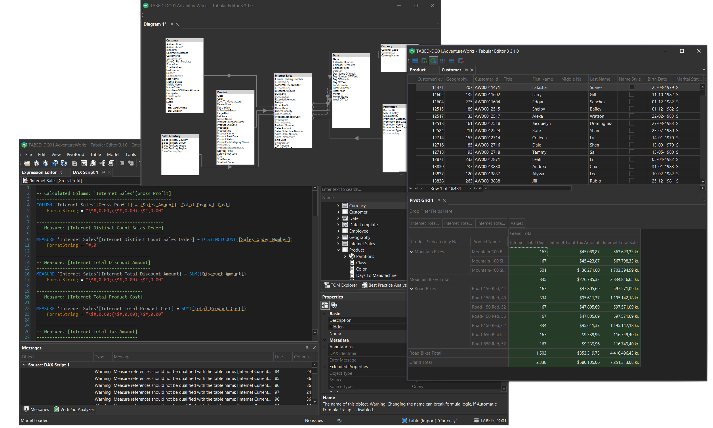
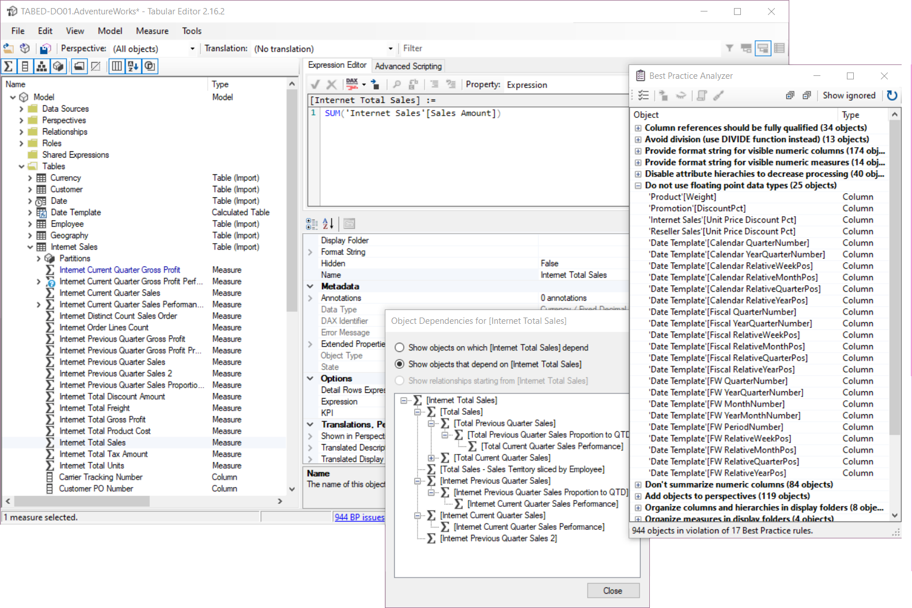

# Tabular Editor

Tabular Editor 是一款工具，可让你在 Analysis Services 表格和 Power BI 语义模型中轻松操作和管理度量值、计算列、显示文件夹、透视和翻译。

该工具提供两种不同的版本：

- Tabular Editor 2.x（免费，[MIT 许可证](https://github.com/TabularEditor/TabularEditor/blob/master/LICENSE)）- [GitHub 项目主页](https://github.com/TabularEditor/TabularEditor)
- Tabular Editor 3.x（商业版）- [主页](https://tabulareditor.com)

## 文档

本网站包含两个版本的文档。 Select your version in the navigation bar at the top of the screen for product specific documentation.

## 如何在 TE3 和 TE2 之间做选择

Tabular Editor 3 是 Tabular Editor 2 的演进版本。 It has been designed for those who seek a "one-tool-to-rule-them-all" solution for Tabular data modeling and development.

### [Tabular Editor 3](#tab/TE3)

Tabular Editor 3 是一款更高级的应用，提供高端体验和众多便捷功能，可将你的数据建模与开发需求整合到一款工具中。

**Tabular Editor 3 主要功能：**

- 高度可自定义、直观的 UI
- 支持高 DPI、多显示器和主题（是的，支持深色模式！）
- 一流的 [DAX 编辑器](xref:dax-editor)，提供语法高亮、语义检查、自动补全、上下文感知等功能，远不止这些
- 表浏览器、Pivot Grid 浏览器和 DAX 查询编辑器
- [导入表向导](xref:importing-tables)，支持 Power Query 数据源
- [数据刷新视图](xref:data-refresh-view) 和 [高级刷新对话框](xref:advanced-refresh)，用于在后台将刷新操作排队并执行
- 关系图编辑器，轻松可视化并编辑表关系
- [DAX脚本](xref:dax-scripts) 功能，可在一个文档中编辑多个对象的 DAX 表达式
- 提供辅助功能、代码操作和命名空间支持的 [DAX 用户自定义函数 (UDFs)](xref:udfs)
- 用于创建和管理日期表，并增强时间智能能力的 [日历编辑器](xref:calendars)
- 用于安装和管理 DAX 组件的 [DAX 组件管理器](xref:dax-package-manager)
- [内置的 Best Practice Analyzer 规则](xref:built-in-bpa-rules)
- VertiPaq分析器与 [DAX优化器](xref:dax-optimizer-integration) 的集成
- [DAX调试器](xref:dax-debugger)
- 用于快速修复和重构的 [代码操作](xref:code-actions)
- [元数据翻译编辑器](xref:metadata-translation-editor) 和 [透视编辑器](xref:perspective-editor)
- 用于 Fabric Git 集成的 [连同支持文件一起保存](xref:save-with-supporting-files)
- [本地化支持](xref:references-application-language)（中文、西班牙语、日语、德语、法语）

### [Tabular Editor 2.x](#tab/TE2)

Tabular Editor 2.x 是一款轻量级应用程序，可快速修改 Analysis Services 或 Power BI 数据模型的 TOM（Tabular Object Model）。 The tool was originally released in 2016 and receives regular updates and bugfixes.

**Tabular Editor 2.x 主要功能：**

- 一款非常轻量的应用，界面简单直观，可用于浏览 TOM
- DAX 依赖关系视图，以及用于在 DAX 对象之间导航的键盘快捷键
- 支持编辑模型透视和元数据翻译
- 批量重命名
- 通过搜索框快速定位大型且复杂的模型
- Deployment Wizard
- 最佳实践分析器
- 使用类 C# 脚本进行高级脚本编写，用于自动化重复任务
- 命令行界面（可用于将 Tabular Editor 集成到 DevOps 流水线中）

***

### 功能概览

下表列出了两款工具的所有主要功能。

[!include[feature-comparison](includes/feature-comparison.partial.md)]

### 常见功能

在可用的数据建模选项方面，两款工具提供的功能相同：它们通过直观且响应迅速的用户界面，基本上公开了 [Tabular Object Model](https://docs.microsoft.com/en-us/analysis-services/tom/introduction-to-the-tabular-object-model-tom-in-analysis-services-amo?view=asallproducts-allversions) 的所有对象和属性。 You can edit advanced object properties that are not available through the standard tools. The tools can load model metadata from files or from any instance of Analysis Services. Changes are only synchronized when you hit Ctrl+S (save) thus providing an "offline" editing experience which most people consider to be superior to the "always synchronized"-mode of the standard tools. This is especially noticeable when working on large and complex data models.

此外，两款工具都支持批量修改模型元数据、批量重命名对象、复制/粘贴对象，以及在表和显示文件夹之间拖放对象等。 The tools even have undo/redo support.

两款工具都提供 Best Practice Analyzer，它会持续扫描模型元数据，并按你自行定义的规则进行检查，例如强制特定的命名规范、确保非维度属性列始终隐藏等。

你还可以在两款工具中编写并执行 C# 风格的脚本，用于自动化重复性任务，例如生成时间智能度量值，以及根据列名自动检测关系。

最后，得益于“Save-to-folder”功能——一种会将模型中的每个对象保存为独立文件的新文件格式——你可以实现并行开发并集成版本控制；这仅靠标准工具很难做到。

## 结论

If you are new to tabular modeling in general, we recommend that you use the standard tools until you familiarize yourself with concepts such as calculated tables, measures, relationships, DAX, etc. At that point, try to give Tabular Editor 2.x a spin, and see how much faster it enables you to achieve certain tasks. If you like it and want more, consider Tabular Editor 3.x!

## 后续步骤

- [开始使用 Tabular Editor 2](xref:getting-started-te2)
- [Install and activate Tabular Editor 3](xref:getting-started)
- [Tabular Editor 3 路线图](xref:roadmap)

