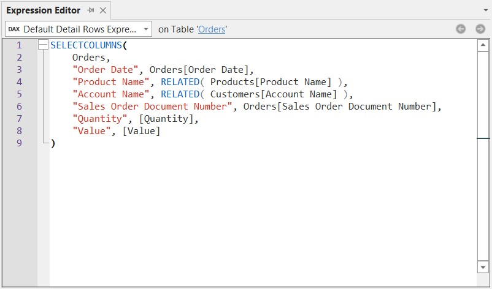
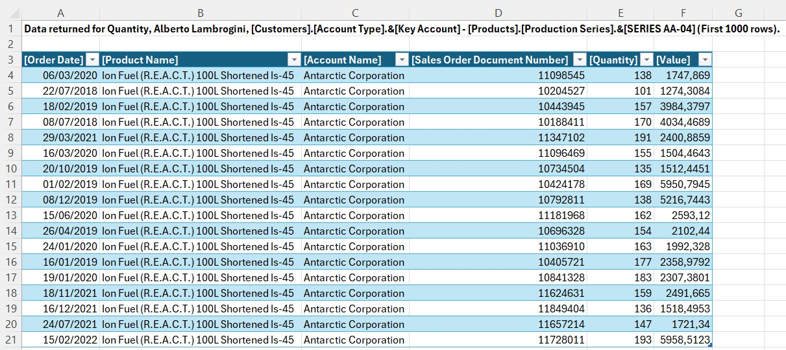
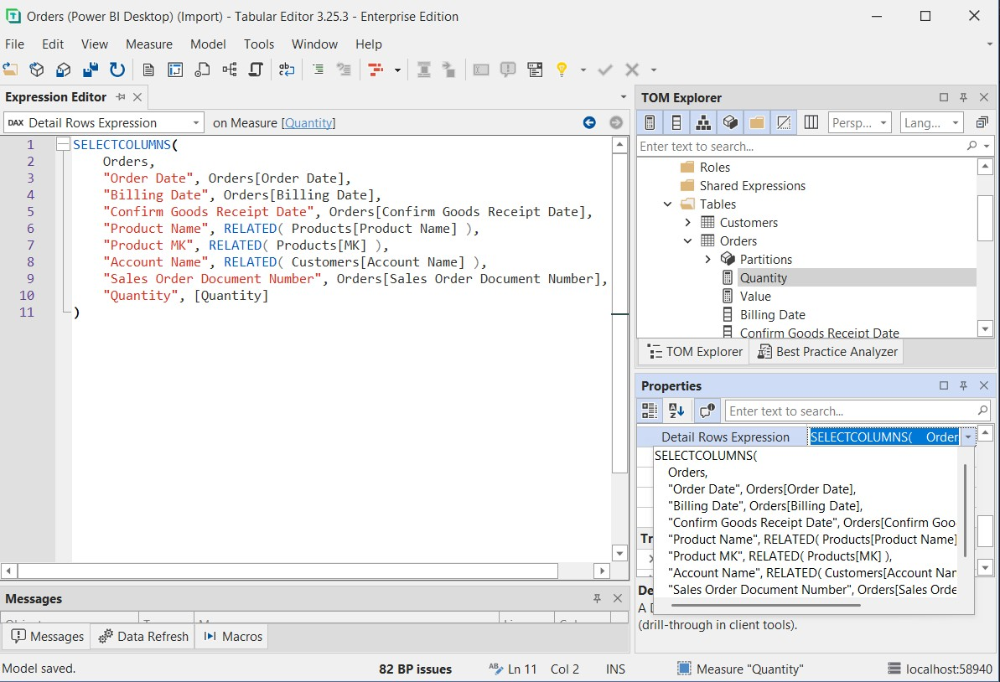

# 实现明细行表达式

当用户在连接到 Power BI 或 Analysis Services 模型的 Excel 数据透视表中双击某个值时，会触发 **钻取** 操作——系统会打开一个工作表，显示该汇总值背后的底层明细行。 默认情况下，模型会返回该度量值所在表中的所有列，这对最终用户通常没有太大帮助。

**明细行表达式**可让你精确定义钻取结果中显示哪些列。 你需要编写一个 DAX 表表达式，返回你希望用户看到的数据形状——把事实表中的列与维度表中的相关属性组合在一起。

另外值得注意的是：虽然 Excel 数据透视表通常使用 MDX 查询模型，但双击触发的钻取操作会以 **DAX 查询** 的形式执行。 因此，明细行表达式在获取高基数数据 — 例如交易 ID 或单条订单行 — 时尤其有效，因为在这类场景下 DAX 的性能明显优于 MDX。

在本教程中，你将在 `Orders` 表上配置一个**表级**的明细行表达式，使该表上的所有度量值都使用同一套更友好的钻取结果。 然后，你会看到如何为某个特定度量值覆盖该设置。

> [!NOTE]
> 本教程中的步骤同时适用于 Tabular Editor 2 和 Tabular Editor 3。 屏幕截图以 Tabular Editor 3 为例。

## 先决条件

开始之前，你需要具备：

- Tabular Editor 2 或 Tabular Editor 3
- 一个语义模型，其中至少有一张表包含度量值
- 对 DAX 有基本了解
- 将 Excel 连接到模型以测试钻取功能

## 默认钻取行为

在添加“详细信息行表达式”之前，先了解最终用户默认会看到的内容会很有帮助。

当用户在数据透视表中双击某个聚合值时，模型会返回事实表中的所有列——使用未经处理的内部列名，不包含任何维度属性，也无法控制显示哪些列。


这个结果在技术上是正确的，但并不实用：内部列名被直接暴露；产品名称、客户账号等相关维度属性缺失；也无法控制列的顺序或取舍。

## 表级与度量值级的详细信息行表达式

详细信息行表达式可以在两个层级定义：

| 级别      | 属性名称       | 作用范围             |
| ------- | ---------- | ---------------- |
| **表**   | 默认详细信息行表达式 | 适用于该表上的所有度量值     |
| **度量值** | 详细信息行表达式   | 仅应用于该度量值；覆盖表级表达式 |

从表级表达式入手最实用——一条表达式就能覆盖该表上的每个度量值。 如果某个特定度量值需要不同的明细列，你可以用度量值级表达式来覆盖它，且该表达式具有更高优先级。

## 创建表级详细信息行表达式

### 步骤 1：选择表并定位该属性

在 **TOM Explorer** 中，选择你要配置的表——本例中是 `Orders` 表。 在 **Properties** 面板中，在 **Options** 组下找到 **Default Detail Rows Expression** 字段。


### 步骤 2：打开表达式编辑器

单击 **Default Detail Rows Expression** 字段，在 **表达式编辑器** 中将其打开。

### 步骤 3：编写 SELECTCOLUMNS 表达式

输入一个使用 `SELECTCOLUMNS` 的 DAX 表达式，用来定义要返回的列。 使用 `RELATED()` 引入来自维度表的列。

```dax
SELECTCOLUMNS(
    Orders,
    "Order Date", Orders[Order Date],
    "Product Name", RELATED( Products[Product Name] ),
    "Account Name", RELATED( Customers[Account Name] ),
    "Sales Order Document Number", Orders[Sales Order Document Number],
    "Quantity", [Quantity],
    "Value", [Value]
)
```



`SELECTCOLUMNS` 将源表作为第一个参数，后面跟着成对的 `"列名", 表达式`：

- 来自 `Orders` 事实表的列可直接引用：`Orders[Order Date]`、`Orders[Sales Order Document Number]`
- 通过 `RELATED()` 获取相关维度表中的列：`Products[Product Name]`、`Customers[Account Name]`
- 也可以包含度量值：`[Quantity]`、`[Value]`

> [!NOTE]
> `RELATED()` 在这里之所以可用，是因为 `SELECTCOLUMNS` 会迭代 `Orders` 表的各行，为每一行提供行语境，从而可通过现有关系导航到相关表。

> [!TIP]
> 虽然 `SELECTCOLUMNS` 是标准模式，但你也可以用任何有效的 DAX 表表达式。 例如，你可以用 `CALCULATETABLE` 将该表达式包起来以应用额外筛选，用 `ADDCOLUMNS` 添加派生值，或调用 `DETAILROWS` 复用其他度量值的 Detail Rows Expression，以避免重复编写。

### 步骤 4：保存模型

按 **Ctrl+S** 保存，然后将模型部署或发布到目标环境。

## 测试结果

打开或刷新 Excel 数据透视表，然后双击任意汇总值。 现在，下钻明细工作表会显示你定义的列——以更友好的名称呈现，并包含维度属性。



对比默认结果：用户看到的是有意义的标题，而不是内部的原始列名；同时还会显示从相关维度表中获取的值。

## 用度量值级别的表达式进行覆盖

如果某个特定度量值需要不同的一组明细列，你可以直接在该度量值上定义 **Detail Rows Expression**。 这会仅对该度量值生效，从而覆盖表级表达式。

1. 在 **TOM Explorer** 中，展开表并选择该度量值——例如 `Orders` 下的 `Quantity`。
2. 在 **Properties** 面板中，找到 **Detail Rows Expression** 字段。
3. 输入一个为该度量值量身定制的 `SELECTCOLUMNS` 表达式。

```dax
SELECTCOLUMNS(
    Orders,
    "Order Date", Orders[Order Date],
    "Billing Date", Orders[Billing Date],
    "Confirm Goods Receipt Date", Orders[Confirm Goods Receipt Date],
    "Product Name", RELATED( Products[Product Name] ),
    "Product MK", RELATED( Products[MK] ),
    "Account Name", RELATED( Customers[Account Name] ),
    "Sales Order Document Number", Orders[Sales Order Document Number],
    "Quantity", [Quantity]
)
```



当客户端工具对该度量值发起钻取明细请求时，将使用度量值级表达式，而不是表级默认表达式。

## 故障排除

**钻取仍显示原始列**
添加表达式后，模型可能尚未保存并重新部署。 保存模型，重新部署，并在测试前重新连接 Excel。

**表达式未应用到特定度量值**
如果你同时定义了表级和度量值级表达式，则以度量值级为准。 在 **属性** 面板中选中该度量值，然后查看 **Detail Rows Expression** 字段，确认当前生效的是哪个表达式。

**`RELATED()` 返回错误**
`RELATED()` 需要从源表到所引用维度表存在一条活动的多对一关系。 检查你的模型中该关系是否存在且处于活动状态。

## 延伸阅读

- [DAX Guide：SELECTCOLUMNS](https://dax.guide/selectcolumns/)
- [DAX Guide：RELATED](https://dax.guide/related/)
- [Microsoft Docs：Detail Rows Expressions](https://learn.microsoft.com/en-us/analysis-services/tabular-models/detail-rows-expressions)
- [SQLBI：在 Excel 数据透视表中控制钻取](https://www.sqlbi.com/articles/controlling-drillthrough-in-excel-pivottables-connected-to-power-bi-or-analysis-services/)
