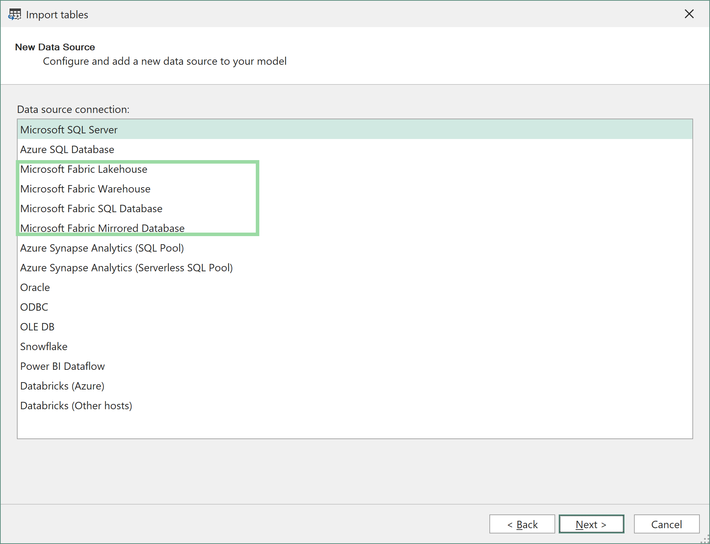
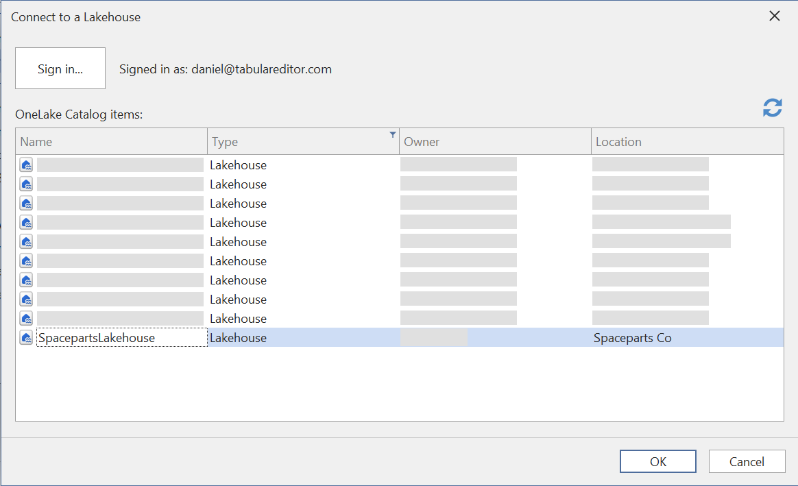
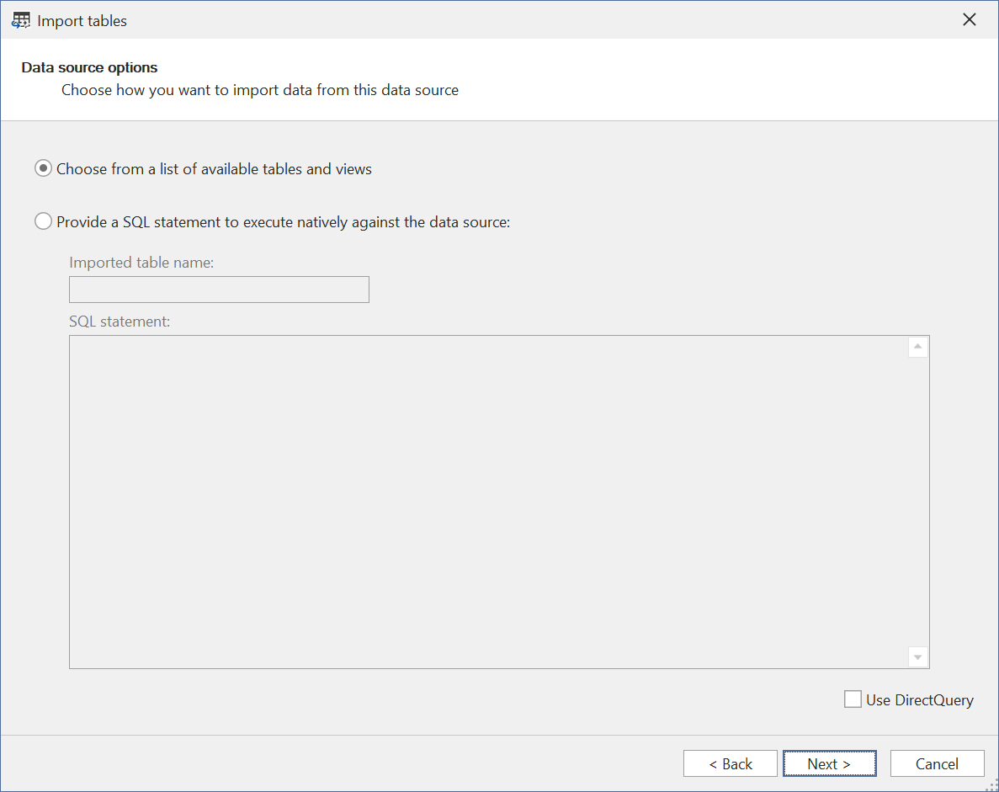
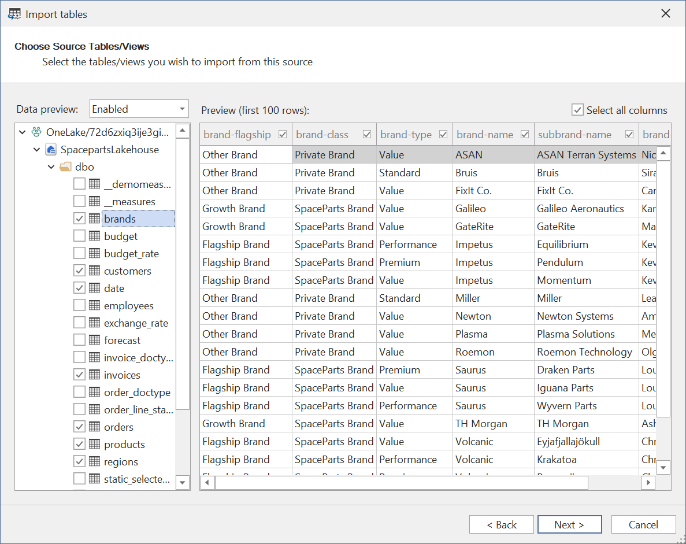
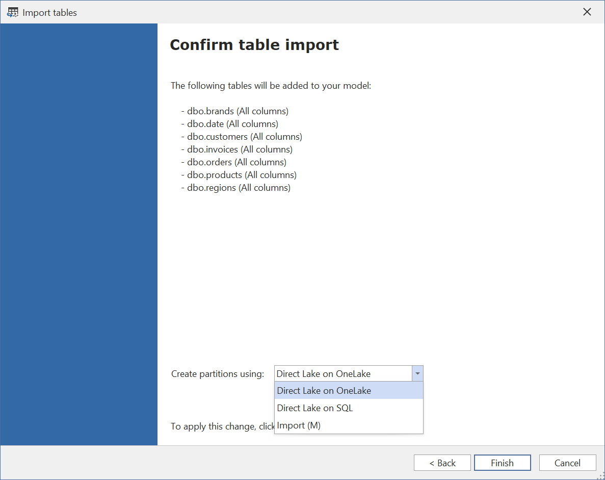
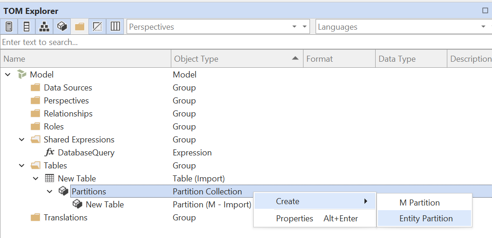
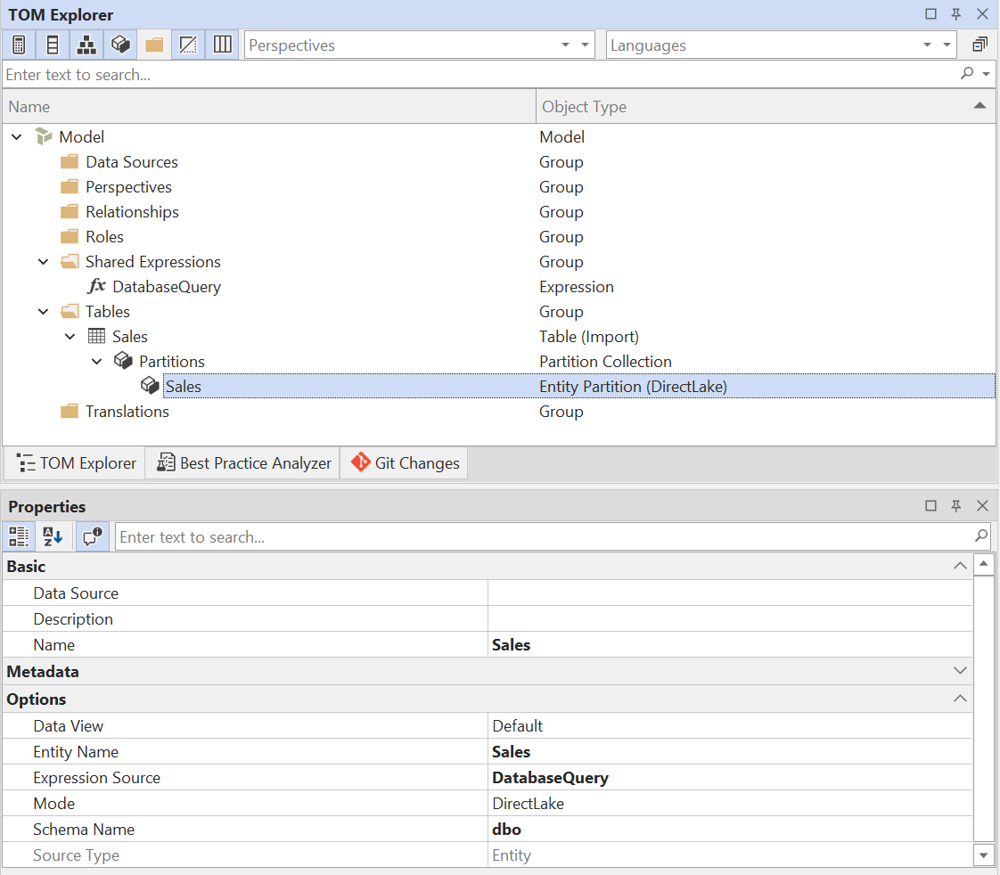

# Direct Lake 指南

随着 Tabular Editor 3.22.0 的发布，我们在支持 SQL 上的 Direct Lake 的基础上，新增了对 OneLake 上的 Direct Lake 的支持。 本文将简要概述这两种模式的差异，并说明它们与 Power BI 语义模型中其他可用存储模式相比有何不同。 本文将简要概述这两种模式的差异，并说明它们与 Power BI 语义模型中其他可用存储模式相比有何不同。

## 存储模式概览

下表汇总了 Power BI 语义模型中可用的存储模式：

| 存储模式                     | 说明                                                                                      | 推荐使用场景                                                |
| ------------------------ | --------------------------------------------------------------------------------------- | ----------------------------------------------------- |
| 导入                       | 数据将导入语义模型，并存储在模型的内存缓存（VertiPaq）中。                                                       | 适用于需要快速查询性能，且可以定期刷新数据的场景。                             |
| DirectQuery              | 数据会在查询时直接从数据源中获取，而不会导入到模型中。 支持多种数据源，例如 SQL、KQL，甚至是其他语义模型。 支持多种数据源，例如 SQL、KQL，甚至是其他语义模型。 | 适用于需要实时访问数据，或数据量过大而无法装入内存的场景。                         |
| 双重                       | 一种混合模式：引擎会根据查询上下文，在返回已导入的数据与将查询委派给 DirectQuery 之间进行选择。                                  | 当你的模型同时包含 DirectQuery 表和导入表（例如使用聚合时），并且存在同时与两者相关联的表时。 |
| 在 OneLake 上的 Direct Lake | 利用 Delta Parquet 存储格式，在需要时可快速将数据换入语义模型内存。                                               | 当你的数据已以表或物化视图的形式存在于 Fabric Warehouse 或 Lakehouse 中时。  |
| 在 SQL 上的 Direct Lake     | Direct Lake 的旧版本，使用 Fabric Warehouse 或 Lakehouse 的 SQL analytics endpoint。              | 不建议用于新开发（改用在 OneLake 上的 Direct Lake）。                 |

> [!NOTE]
> 还可以创建同时包含 **Import** 和 **DirectQuery** 模式分区的表（也称为“混合表格”）。 这通常用于大型事实表：既需要增量刷新，又希望部分数据直接从源进行查询。 更多信息，请参阅[这篇文章](https://learn.microsoft.com/en-us/power-bi/connect-data/incremental-refresh-xmla)。

## 在 OneLake 上的 Direct Lake 与在 SQL 上的 Direct Lake

[OneLake 上的 Direct Lake](https://learn.microsoft.com/en-us/fabric/fundamentals/direct-lake-overview#key-concepts-and-terminology) 于 2025 年三月推出，作为 SQL 上的 Direct Lake 的替代方案。 使用在 OneLake 上的 Direct Lake 时，不依赖 SQL 端点，也不会回退到 DirectQuery 模式。 这也意味着，适用于 DirectQuery 模型的[常见限制](https://learn.microsoft.com/en-us/power-bi/connect-data/desktop-directquery-about#modeling-limitations)不适用于在 OneLake 上的 Direct Lake 模型。 使用在 OneLake 上的 Direct Lake 时，不依赖 SQL 端点，也不会回退到 DirectQuery 模式。 这也意味着，适用于 DirectQuery 模型的[常见限制](https://learn.microsoft.com/en-us/power-bi/connect-data/desktop-directquery-about#modeling-limitations)不适用于在 OneLake 上的 Direct Lake 模型。

> [!NOTE]
> Direct Lake on OneLake 目前处于公共预览版。 [!NOTE]
> Direct Lake on OneLake 目前处于公共预览版。 在使用此表存储模式创建语义模型之前，你必须先在 Fabric 管理门户中启用租户设置 **User can create Direct Lake on OneLake semantic models (preview)**。

不过，与 SQL 上的 Direct Lake 一样，仍然存在一些[确实适用的限制](https://learn.microsoft.com/en-us/fabric/fundamentals/direct-lake-overview#considerations-and-limitations)。 主要限制包括： 主要限制包括：

- 两种 Direct Lake 模式都不支持计算列。
- 计算表格不能引用 Direct Lake 存储模式中的列或表。 计算表格不能引用 Direct Lake 存储模式中的列或表。 支持计算组、What-if 参数和字段参数，因为它们会创建不引用 Direct Lake 列的隐式计算表格。
- 不支持将非物化 SQL 视图用作 OneLake 上的 Direct Lake 表的数据源。 请使用物化视图，或确保源 Delta 表包含所需的列。 请使用物化视图，或确保源 Delta 表包含所需的列。
- 在 Direct Lake on OneLake 公开预览期间，不支持将 Lakehouse 中的快捷方式用作数据源。

有关完整且最新的限制列表，请参阅 [Microsoft 的 Direct Lake 注意事项和限制文档](https://learn.microsoft.com/en-us/fabric/fundamentals/direct-lake-overview#considerations-and-limitations)。

### 复合模型

针对计算列限制，一种变通方案是将 Direct Lake 表与导入表组合起来，创建一个 **复合模型**。 Direct Lake on OneLake 支持这种做法，但 Direct Lake on SQL 不支持。 在复合模型中，通常会将较大的事实数据表保留为 Direct Lake 模式，而对需要计算列或自定义分组的较小维度表使用导入模式。 Direct Lake on OneLake 支持这种做法，但 Direct Lake on SQL 不支持。 在复合模型中，通常会将较大的事实数据表保留为 Direct Lake 模式，而对需要计算列或自定义分组的较小维度表使用导入模式。

OneLake 上的 Direct Lake 还支持通过 Tabular Editor 等基于 XMLA 的工具与 DirectQuery 表组合使用。 可通过 Power BI 网页建模、Power BI Desktop（实时编辑）或 XMLA 工具添加导入表。 可通过 Power BI 网页建模、Power BI Desktop（实时编辑）或 XMLA 工具添加导入表。

> [!NOTE]
> SQL 上的 Direct Lake 不支持复合模型。 在同一语义模型中，不能将 Direct Lake on SQL 表与 Import、DirectQuery 或 Dual 存储模式的表组合使用。 不过，你可以使用 Power BI Desktop 在 Direct Lake on SQL 语义模型 _之上_ 创建复合模型，并用新表对其进行扩展。 更多信息见 [在语义模型之上构建复合模型](https://learn.microsoft.com/en-us/power-bi/transform-model/desktop-composite-models#building-a-composite-model-on-a-semantic-model-or-model)。 在同一语义模型中，不能将 Direct Lake on SQL 表与 Import、DirectQuery 或 Dual 存储模式的表组合使用。 不过，你可以使用 Power BI Desktop 在 Direct Lake on SQL 语义模型 _之上_ 创建复合模型，并用新表对其进行扩展。 更多信息见 [在语义模型之上构建复合模型](https://learn.microsoft.com/en-us/power-bi/transform-model/desktop-composite-models#building-a-composite-model-on-a-semantic-model-or-model)。

<a name="collation"></a>

## 排序规则

使用 **OneLake 上的 Direct Lake** 时，模型的排序规则和导入模式一样，默认不区分大小写。

对于 **SQL 上的 Direct Lake** 模型，如果查询不会回退到 DirectQuery，则排序规则不区分大小写。 如果查询发生回退，排序规则取决于数据源的排序规则。 对于 Fabric Warehouse，排序规则可能区分大小写；在这种情况下，你应该在模型上指定一个[区分大小写的排序规则](https://data-goblins.com/power-bi/case-specific)。 如果查询发生回退，排序规则取决于数据源的排序规则。 对于 Fabric Warehouse，排序规则可能区分大小写；在这种情况下，你应该在模型上指定一个[区分大小写的排序规则](https://data-goblins.com/power-bi/case-specific)。

> [!NOTE]
> 一旦元数据已部署到 Analysis Services / Power BI，你就无法更改模型的排序规则。 [!NOTE]
> 一旦元数据已部署到 Analysis Services / Power BI，你就无法更改模型的排序规则。 因此，如果你打算将 SQL 上的 Direct Lake 与区分大小写的 Fabric Warehouse 搭配使用，则必须在部署前先在模型元数据中设置排序规则：
>
> 1. 在 Tabular Editor 3 中创建一个新模型（File > New > Model...）
> 2. 取消选中“使用 Workspace 数据库”
> 3. 将模型的 **Collation** 属性设置为 `Latin1_General_100_BIN2_UTF8`
> 4. 保存模型（Ctrl+S）。
> 5. 现在，从你刚保存的文件中打开该模型。 现在，从你刚保存的文件中打开该模型。 当系统提示连接到 Workspace 数据库时，请选择“Yes”。
>
> 采用这种方式，模型元数据会从一开始就以正确的排序规则部署。之后你就可以在 SQL 上的 Direct Lake 模式下添加表，而不会遇到排序规则问题。

## 表导入向导

要使用 Tabular Editor 3 的表导入向导添加 Direct Lake 表，请选择 **Microsoft Fabric Lakehouse**、**Microsoft Fabric Warehouse**、**Microsoft Fabric SQL Database** 或 **Microsoft Fabric Mirrored Database** 作为数据源：



登录后，系统会显示一个列表，列出你有权访问的各个 Workspace 中所有可用的 Fabric Lakehouse/Warehouse。 选择你要连接的项，然后点击 **OK**： 选择你要连接的项，然后点击 **OK**：



除非你想指定自定义 SQL 查询，或将表配置为 DirectQuery 模式，否则直接点击 **Next**，从数据源的表/视图列表中选择：



选择你要导入的表/视图。 请注意，OneLake 上的 Direct Lake 模式不支持 **非物化视图**。 尝试将这类视图添加到模型中，保存模型元数据时会报错。



在最后一页，选择要用哪种模式来配置表分区：



可选项包括：

- OneLake 上的 Direct Lake
- SQL 上的 Direct Lake
- 导入 (M)

> [!NOTE]
> 如果你正在处理的模型已经包含表，而该模型又不支持组合不同存储模式的表，那么上述一个或多个选项可能不可用。 例如，如果模型里有一张使用“SQL 上的 Direct Lake”模式的表，你就不能再添加其他模式的表。 例如，如果模型里有一张使用“SQL 上的 Direct Lake”模式的表，你就不能再添加其他模式的表。

## Power Query (M) 表达式

本节会更偏技术性地说明：如果你想在不使用“表导入向导”的情况下，手动将表设置为 Direct Lake 模式，需要如何配置 TOM 对象和属性。

### OneLake 上的 Direct Lake

要手动将表设置为 **OneLake 上的 Direct Lake** 模式，需要执行以下操作：

1. **创建共享表达式**：Direct Lake 表使用“Entity”分区，该分区必须引用模型中的共享表达式。 如果尚未创建此共享表达式，请先创建它。 将其命名为 `DatabaseQuery`： 如果尚未创建此共享表达式，请先创建它。 将其命名为 `DatabaseQuery`：


2. **配置共享表达式**：将你在步骤 1 中创建的表达式的 **Kind** 属性设为“ M ”，并将 **Expression** 属性设置为以下 M 查询，同时将 URL 中的 ID 替换为你的 Fabric Workspace 和 Lakehouse/Warehouse 对应的 ID：

```m
let
    Source = AzureStorage.DataLake("https://onelake.dfs.fabric.microsoft.com/<workspace-id>/<resource-id>", [HierarchicalNavigation=true])
in
    Source
```

3. **创建表和 Entity 分区**：在模型中创建一个新表（Alt+5），然后在 TOM Explorer 中展开该表的分区，并创建一个新的 _Entity 分区_：



删除你创建表时自动生成的常规导入分区。

4. **配置 Entity 分区**：为 Entity 分区设置以下属性：

| 属性    | 值                                                                       |
| ----- | ----------------------------------------------------------------------- |
| 名称    | （推荐）设置为与表相同的名称                                                          |
| 实体名称  | （必填）设置为 Lakehouse/Warehouse 中该表的名称                                      |
| 表达式来源 | （必填）设置为在步骤 1 中创建的共享表达式，通常为 `DatabaseQuery`                              |
| 模式    | （必填）`DirectLake`                                                        |
| 架构名称  | （可选）如适用，将其设置为 Lakehouse/Warehouse 中的架构名称。 如果未设置，将使用默认架构。 如果未设置，将使用默认架构。 |

最终结果应如下所示：



5. **更新列元数据**：在此阶段，你应该可以使用 Tabular Editor 的 **Update Table Schema** 功能来更新该表的列元数据。 这会自动从 Lakehouse/Warehouse 检索列名和数据类型： 这会自动从 Lakehouse/Warehouse 检索列名和数据类型：


或者，手动向表中添加数据列（Alt+4），并为每一列指定 `Name`、`Data Type`、`Source Column` 以及其他相关属性。

> [!NOTE]
> 将 Direct Lake 表添加到模型后，在首次部署元数据后需要手动“刷新”一次。 否则，查询时该表将不包含任何数据。 此刷新只需执行一次。 如果在 **工具 > 偏好 > 模型部署 > 数据刷新** 下启用 **保存新表时自动刷新**，Tabular Editor 3 会在保存模型元数据时自动刷新该表。 否则，查询时该表将不包含任何数据。 此刷新只需执行一次。 如果在 **工具 > 偏好 > 模型部署 > 数据刷新** 下启用 **保存新表时自动刷新**，Tabular Editor 3 会在保存模型元数据时自动刷新该表。

### SQL 上的 Direct Lake

要手动将表设置为 **SQL 上的 Direct Lake** 模式，请按照上文“在 OneLake 上使用 Direct Lake”一节的步骤操作，但在共享表达式中改用以下 M 查询：

```m
let
    database = Sql.Database("<sql-endpoint>", "<warehouse/lakehouse name>")
in
    database
```

将 `<sql-endpoint>` 替换为 [Fabric Warehouse 的 SQL analytics endpoint](https://learn.microsoft.com/en-us/fabric/data-warehouse/query-warehouse) 或 [Lakehouse 的 SQL analytics endpoint](https://learn.microsoft.com/en-us/fabric/data-engineering/lakehouse-sql-analytics-endpoint) 的连接字符串；将 `<warehouse/lakehouse name>` 替换为相应的 Warehouse 或 Lakehouse 名称。

### 从 Lakehouse / Warehouse 导入

如果你希望在从 Fabric Lakehouse 或 Warehouse 获取数据的同时，将表配置为 **导入** 模式，可按以下步骤操作：

1. **创建表**：在模型中创建一个新表（Alt+5），然后在 TOM Explorer 中展开该表的分区。 默认情况下，你应该会看到系统自动创建的一个“Import”类型分区： 默认情况下，你应该会看到系统自动创建的一个“Import”类型分区：


2. **配置 Import 分区**：在 Import 分区上设置以下 M 查询：

```m
let
    Source = Sql.Database("<sql-endpoint>","<warehouse/lakehouse name>"),
    Data = Source{[Schema="<schema-name>",Item="<table/view-name>"]}[Data]
in
    Data
```

将 `<sql-endpoint>` 替换为 [Fabric Warehouse 的 SQL analytics endpoint](https://learn.microsoft.com/en-us/fabric/data-warehouse/query-warehouse) 或 [Lakehouse 的 SQL analytics endpoint](https://learn.microsoft.com/en-us/fabric/data-engineering/lakehouse-sql-analytics-endpoint) 的连接字符串；将 `<warehouse/lakehouse name>` 替换为相应的 Warehouse 或 Lakehouse 名称。

将 `<schema-name>` 替换为 Warehouse/Lakehouse 中的架构名称，并将 `<table/view-name>` 替换为你要导入的表或视图名称。 注意：导入模式下的表可以使用非物化视图作为数据源，因为刷新时会通过 SQL 端点查询数据。 注意：导入模式下的表可以使用非物化视图作为数据源，因为刷新时会通过 SQL 端点查询数据。

3. **更新列元数据**：使用 Tabular Editor 的 **Update Table Schema** 功能更新该表的列元数据。 此操作会自动从 Lakehouse/Warehouse 获取列名和数据类型。 或者，手动创建数据列（Alt+4），并为每一列指定 `Name`、`Data Type`、`Source Column` 以及其他相关属性。

## 在不同存储模式之间转换

根据本文中的信息，在 Direct Lake on SQL 与 Direct Lake on OneLake 之间转换很简单，因为你只需要修改 Direct Lake 分区所引用的共享表达式的 M 查询。

如果你想从导入模式转换为 Direct Lake，会稍微复杂一些，因为涉及不同的分区类型。

为简化操作，我们准备了一组 C# Script，可帮助你在不同存储模式之间进行转换：

- [将 Direct Lake on SQL 转换为 Direct Lake on OneLake](xref:script-convert-dlsql-to-dlol)
- [将导入模式转换为 Direct Lake on OneLake](xref:script-convert-import-to-dlol)