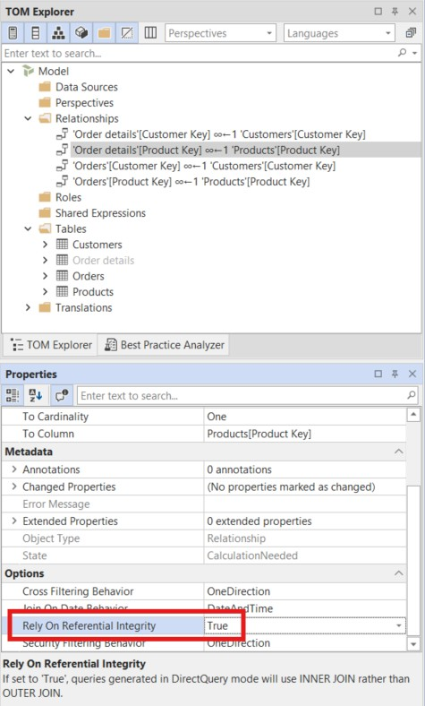
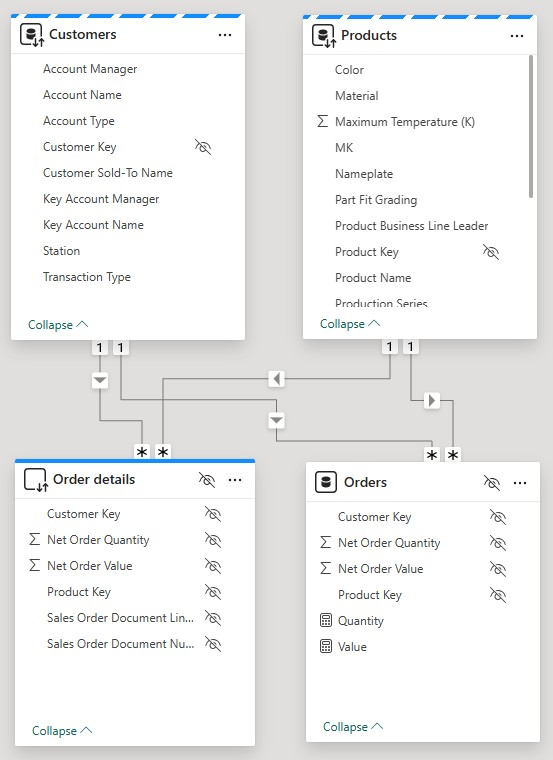

# 实现用户自定义聚合

完全导入的事实表会将每一行都缓存在内存中——包括高基数列，例如单个订单行、交易 ID，以及大多数 Report 使用者根本用不到的行级属性。 完全导入的事实表会将每一行都缓存在内存中——包括高基数列，例如单个订单行、交易 ID，以及大多数 Report 使用者根本用不到的行级属性。 用户自定义聚合通过将事实表拆分为两部分来解决这一问题：一个小型的预聚合 **Import** 表，可从内存缓存中处理绝大多数 Report 查询；以及一个 **DirectQuery** 明细表，用于保存所有行级数据且不占用内存。 Power BI 和 Analysis Services 会自动将每个查询路由到能够回答它的那张表。 Power BI 和 Analysis Services 会自动将每个查询路由到能够回答它的那张表。

迁移到 DirectQuery 的高基数列会带来性能取舍——使用这些列的查询会直接发送到源数据库，而不是由内存引擎提供。 从默认字段列表中隐藏这些列，可确保 Report 使用者默认走更快的聚合路径；同时也让需要行级明细来构建 Report 的高级用户明确自己正在使用 DirectQuery 列。 从默认字段列表中隐藏这些列，可确保 Report 使用者默认走更快的聚合路径；同时也让需要行级明细来构建 Report 的高级用户明确自己正在使用 DirectQuery 列。

在本教程中，你将为 SpaceParts 模型中的 `Orders` 事实表配置一个用户定义的聚合。 你将先创建一张以 DirectQuery 模式保存完整行级数据的明细表，然后把现有的 `Orders` 表配置为聚合表，并设置相应的列映射。 你将先创建一张以 DirectQuery 模式保存完整行级数据的明细表，然后把现有的 `Orders` 表配置为聚合表，并设置相应的列映射。

> [!NOTE]
> 本教程中的步骤同时适用于 Tabular Editor 2 和 Tabular Editor 3。 屏幕截图展示的是 Tabular Editor 3。 屏幕截图展示的是 Tabular Editor 3。

## 先决条件

开始之前，你需要具备：

- Tabular Editor 2 或 Tabular Editor 3
- 一个 Power BI 或 Analysis Services 语义模型，且至少包含一张 Import 事实表
- 对存储模式（Import、DirectQuery、Dual）有基本了解

## 聚合的工作原理

聚合模式使用同一张事实表的两个版本：

| 表                        | 存储模式        | 用途                                            |
| ------------------------ | ----------- | --------------------------------------------- |
| **聚合表**（`Orders`）        | 导入          | 预聚合数据缓存在内存中。 用于回答汇总查询。                        |
| **明细表**（`Order details`） | DirectQuery | 在数据源端查询完整的行级数据。 当聚合无法满足该查询时使用。 当聚合无法满足该查询时使用。 |

维度表设置为 **Dual** 存储模式，以便同时参与 Import 和 DirectQuery 两种查询路径。

只把表设置为 Dual 或 DirectQuery 存储模式并不会启用聚合路由——它只会创建一个复合模型，查询会根据存储模式被路由。 **Alternate Of** 属性用于激活用户定义的聚合：它会创建一个显式的列级映射，告诉引擎“当查询从明细表请求此列时，可以改用这个预聚合列”。 如果没有 `Alternate Of`，引擎就没有替换依据，也不会将查询路由到聚合表。 引擎会根据这些映射评估每个传入查询，以确定聚合表是否能够回答；只有在无法回答时才会回退到 DirectQuery。 **Alternate Of** 属性用于激活用户定义的聚合：它会创建一个显式的列级映射，告诉引擎“当查询从明细表请求此列时，可以改用这个预聚合列”。 如果没有 `Alternate Of`，引擎就没有替换依据，也不会将查询路由到聚合表。 引擎会根据这些映射评估每个传入查询，以确定聚合表是否能够回答；只有在无法回答时才会回退到 DirectQuery。

> [!IMPORTANT]
> DirectQuery 存在一些已知限制，会影响模型设计和 Report 功能。 [!IMPORTANT]
> DirectQuery 存在一些已知限制，会影响模型设计和 Report 功能。 与此模式最相关的包括：针对 DirectQuery 列的查询依赖数据源响应时间；云数据源每个查询最多返回一百万行；DirectQuery 表无法使用自动日期/时间层次结构；并且部分 DAX 函数在 DirectQuery 模式下不受支持。 继续之前先查看完整列表：[在 Power BI Desktop 中使用 DirectQuery](https://learn.microsoft.com/en-us/power-bi/connect-data/desktop-use-directquery)。 继续之前先查看完整列表：[在 Power BI Desktop 中使用 DirectQuery](https://learn.microsoft.com/en-us/power-bi/connect-data/desktop-use-directquery)。

## 步骤 1：将维度表设置为 Dual 存储模式

每个与事实表相关联的维度表都必须设置为 **Dual** 存储模式。 每个与事实表相关联的维度表都必须设置为 **Dual** 存储模式。 这使引擎能够在 Import 和 DirectQuery 两种查询路径中使用维度属性。

对每个维度表（`Customers`、`Products`）：

1. 在 **TOM Explorer** 中展开该表，然后展开 **Partitions**。
2. 选择该分区。
3. 在 **Properties** 面板中，找到 **Options** 下的 **Mode** 字段，并将其设置为 **Dual**。


对每个与事实表存在关系的维度表重复上述操作。

## 步骤 2：创建明细表

明细表是原始事实表的副本，配置为在 DirectQuery 模式下直接向数据源发起查询。 它会对 Report 使用者隐藏——唯一用途是处理聚合表无法解答的明细级查询。 它会对 Report 使用者隐藏——唯一用途是处理聚合表无法解答的明细级查询。

### 复制事实表

创建 **Orders** 表的副本，并将其命名为 **Order details**。 在 Tabular Editor 中，你可以选中 **Orders** 表，然后在右键菜单中选择 **Duplicate 1 table**。 在 Tabular Editor 中，你可以选中 **Orders** 表，然后在右键菜单中选择 **Duplicate 1 table**。

### 将分区设置为 DirectQuery

1. 在 **TOM Explorer** 中，展开 **Order details**，然后展开 **分区**。
2. 选择该分区。
3. 在 **Properties** 面板中，将 **Mode** 设置为 **DirectQuery**。


### 删除度量值

从 `Orders` 复制过来的任何 DAX 度量值——比如 `Quantity` 和 `Value`——都应该从 `Order details` 里删掉。 度量值应该放在聚合表上，而不是明细表上。 度量值应该放在聚合表上，而不是明细表上。

### 隐藏所有列和该表

选中 `Order details` 中的所有列，并在 **Properties** 面板中将 **Hidden** 设置为 **True**。 然后选中 `Order details` 表本身，也将 **Hidden** 设置为 **True**。 然后选中 `Order details` 表本身，也将 **Hidden** 设置为 **True**。

> [!NOTE]
> 隐藏明细表及其所有列，可确保 Report 使用者始终只与聚合表交互。 明细表是聚合架构的实现细节。 明细表是聚合架构的实现细节。

## 步骤 3：创建关系并设置“Rely On Referential Integrity”

明细表需要与聚合表相同的维度表关系，这样引擎才能正确路由 DirectQuery 查询。

在 `Order details` 表中创建以下关系：

- `Order details[Customer Key]` → `Customers[Customer Key]`
- `Order details[Product Key]` → `Products[Product Key]`

对于上述每条新建关系，请在“属性”窗格中将 **Rely On Referential Integrity** 设置为 **True**。



> [!NOTE]
> **Rely On Referential Integrity** 用于指示引擎在生成 DirectQuery SQL 时使用 INNER JOIN，而非 OUTER JOIN。 这能提升查询性能；当明细表中的每个外键值在维度表中都有匹配行时，启用它是安全的。 这能提升查询性能；当明细表中的每个外键值在维度表中都有匹配行时，启用它是安全的。

## 步骤 4：精简聚合表

聚合表（`Orders`）应只包含引擎进行聚合路由所需的内容：

- **关系键列**：`Customer Key`、`Product Key` — 用于匹配维度筛选条件
- **基础数值列**：`Net Order Quantity`、`Net Order Value` — 下一步将映射到明细表中的列
- **DAX 度量值**：`Quantity`、`Value`

删除 `Orders` 中所有其他列——日期、单据号、状态字段，以及任何其他属性列。 这些只应存在于 `Order details` 中。 这些只应存在于 `Order details` 中。

> [!NOTE]
> 为确保聚合路由正常工作，聚合表中缺失的任何属性列都必须存在于明细表中。 [!NOTE]
> 为确保聚合路由正常工作，聚合表中缺失的任何属性列都必须存在于明细表中。 当查询引用了聚合表中不存在的列时，引擎会回退到 DirectQuery，因此明细表必须完整保留一份事实数据的副本。
>
> 这种模式最适用于**基数高但在 Report 中很少用的列**——单笔交易 ID、单据号、行级状态字段，以及类似属性。 这种模式最适用于**基数高但在 Report 中很少用的列**——单笔交易 ID、单据号、行级状态字段，以及类似属性。 如果事实表里还有在 Report 中经常出现的低基数列（例如区域代码或产品类别标记），可以考虑把这些列移到 Dual 模式的维度表中，这样这些列将由内存缓存提供，而不是通过 DirectQuery 获取。

> [!TIP]
> 另外，也可以通过在该表上将 **Hidden** 设置为 **True** 来隐藏 `Orders` 表本身。 和明细表一样，聚合表属于实现细节，不该出现在 Report 字段列表中。

## 步骤 5：更新度量值，使其引用明细表

聚合表上的度量值必须引用**明细表**，而不是聚合表本身。 聚合表上的度量值必须引用**明细表**，而不是聚合表本身。 这正是引擎能够正确回退到 DirectQuery 的原因：当查询无法从内存缓存中得到结果时，引擎会根据度量值的引用转到 `Order details` 并查询数据源。

将 `Orders` 上的每个度量值更新为引用 `Order details` 中对应的列：

```dax
// Quantity
SUM( 'Order details'[Net Order Quantity] )
```

```dax
// 值
SUM( 'Order details'[Net Order Value] )
```

> [!NOTE]
> 度量值不一定要放在聚合表中。 它们可以定义在 `Order details` 上，也可以定义在模型中的任何其他表上——例如，专门的空白度量值表。 为简单起见，本教程将它们放在 `Orders` 上。

## 步骤 6：配置 Alternate Of 属性

对于聚合表中的每个数值型基础列，配置 **Alternate Of** 属性，以告诉引擎它对应明细表中的哪一列。

1. 在 **TOM Explorer** 中，展开 `Orders` 表并选择一个基础列——例如 **Net Order Quantity**。
2. 在 **属性** 面板中，展开 **Alternate Of** 分组。
3. 将 **Base Column** 设置为明细表中对应的列：`Order details[Net Order Quantity]`。
4. 确认 **Summarization** 设置为 **Sum**。

![在 Orders 表中选中 Net Order Quantity 列，将 Alternate Of Base Column 设置为 Order details[Net Order Quantity]，并将 Summarization 设置为 Sum](../assets/images/tutorials/user-defined-aggregations/alternate-of.jpg)

对 **Net Order Value** 重复上述操作，将其映射到 `Order details[Net Order Value]`，并设置 **Summarization: Sum**。

## 验证结果

Tabular Editor 中的图表视图显示已完成的聚合架构。 `Orders` 和 `Order details` 都通过并行的关系集连接到同一组维度表。 `Orders` 和 `Order details` 都通过并行的关系集连接到同一组维度表。


在 Power BI Desktop 中，模型视图会以存储模式图标和颜色编码显示相同的结构：维度表显示 Dual 存储模式指示器，`Order details` 显示为 DirectQuery 且已隐藏，`Orders` 显示为 Import 且已隐藏。



## 延伸阅读

- [Microsoft 文档：Power BI 中的用户定义聚合](https://learn.microsoft.com/en-us/power-bi/transform-model/aggregations-advanced)
- [Microsoft 文档：Power BI Desktop 中的存储模式](https://learn.microsoft.com/en-us/power-bi/transform-model/desktop-storage-mode)
