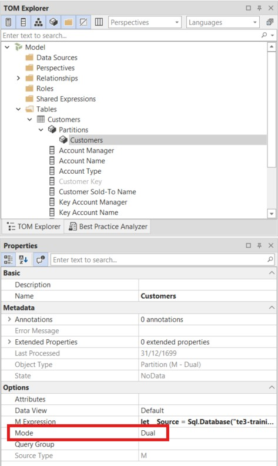
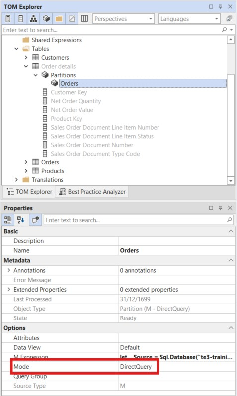
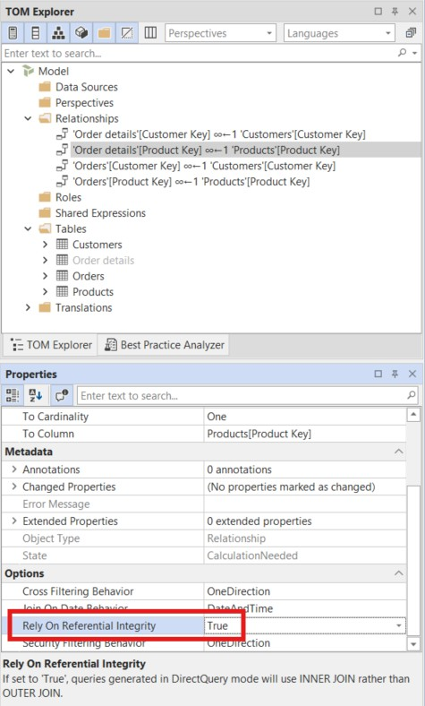
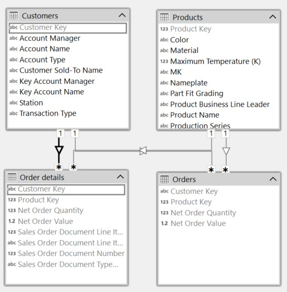
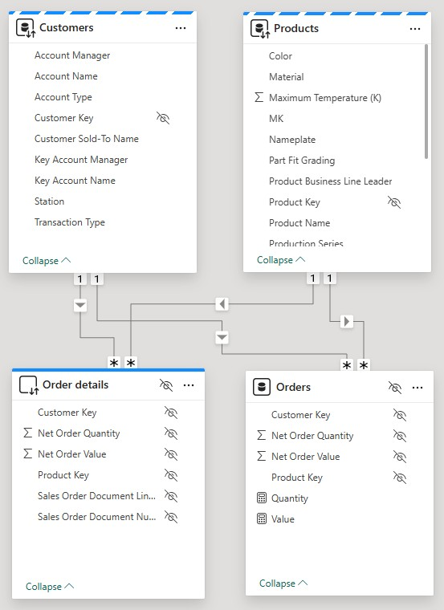

# 实现用户自定义聚合

A fully imported fact table caches every row in memory — including high-cardinality columns like individual order lines, transaction IDs, and row-level attributes that most report consumers never need. 用户自定义聚合通过将事实表拆分为两部分来解决这一问题：一个小型的预聚合 **Import** 表，可从内存缓存中处理绝大多数 Report 查询；以及一个 **DirectQuery** 明细表，用于保存所有行级数据且不占用内存。 Power BI and Analysis Services automatically route each query to whichever table can answer it.

迁移到 DirectQuery 的高基数列会带来性能取舍——使用这些列的查询会直接发送到源数据库，而不是由内存引擎提供。 Hiding those columns from the default field list ensures that report consumers interact with the fast aggregation path by default, while advanced users who build reports that require row-level detail are aware they are working with DirectQuery columns.

在本教程中，你将为 SpaceParts 模型中的 `Orders` 事实表配置一个用户定义的聚合。 You create a detail table that holds the full row-level data in DirectQuery mode, then configure the existing `Orders` table as the aggregation table with the appropriate column mappings.

> [!NOTE]
> 本教程中的步骤同时适用于 Tabular Editor 2 和 Tabular Editor 3。 Screenshots show Tabular Editor 3.

## 先决条件

开始之前，你需要具备：

- Tabular Editor 2 或 Tabular Editor 3
- 一个 Power BI 或 Analysis Services 语义模型，且至少包含一张 Import 事实表
- 对存储模式（Import、DirectQuery、Dual）有基本了解

## How Aggregations Work

聚合模式使用同一张事实表的两个版本：

| 表                        | 存储模式        | 用途                                                                                             |
| ------------------------ | ----------- | ---------------------------------------------------------------------------------------------- |
| **聚合表**（`Orders`）        | 导入          | Pre-aggregated data cached in memory. Answers summary queries. |
| **明细表**（`Order details`） | DirectQuery | 在数据源端查询完整的行级数据。 Used when the aggregation cannot answer the query.             |

维度表设置为 **Dual** 存储模式，以便同时参与 Import 和 DirectQuery 两种查询路径。

只把表设置为 Dual 或 DirectQuery 存储模式并不会启用聚合路由——它只会创建一个复合模型，查询会根据存储模式被路由。 The **Alternate Of** property is what activates user-defined aggregations: it creates an explicit column-level mapping that tells the engine "when a query asks for this column from the detail table, you can use this pre-aggregated column instead." Without `Alternate Of`, the engine has no basis for substitution and will not route queries to the aggregation table. The engine evaluates every incoming query against these mappings to determine whether the aggregation table can answer it, and falls back to DirectQuery only when it cannot.

> [!IMPORTANT]
> DirectQuery comes with known limitations that affect model design and report functionality. 与此模式最相关的包括：针对 DirectQuery 列的查询依赖数据源响应时间；云数据源每个查询最多返回一百万行；DirectQuery 表无法使用自动日期/时间层次结构；并且部分 DAX 函数在 DirectQuery 模式下不受支持。 Review the full list before proceeding: [Use DirectQuery in Power BI Desktop](https://learn.microsoft.com/en-us/power-bi/connect-data/desktop-use-directquery).

## 步骤 1：将维度表设置为 Dual 存储模式

Each dimension table that relates to the fact table must be set to **Dual** storage mode. 这使引擎能够在 Import 和 DirectQuery 两种查询路径中使用维度属性。

对每个维度表（`Customers`、`Products`）：

1. 在 **TOM Explorer** 中展开该表，然后展开 **Partitions**。
2. 选择该分区。
3. 在 **Properties** 面板中，找到 **Options** 下的 **Mode** 字段，并将其设置为 **Dual**。



对每个与事实表存在关系的维度表重复上述操作。

## 步骤 2：创建明细表

明细表是原始事实表的副本，配置为在 DirectQuery 模式下直接向数据源发起查询。 It is hidden from report consumers — its only purpose is to serve granular queries that the aggregation table cannot answer.

### 复制事实表

创建 **Orders** 表的副本，并将其命名为 **Order details**。 In Tabular Editor, you can do this by selecting the **Orders** table and using the right-click context menu to select **Duplicate 1 table**.

### 将分区设置为 DirectQuery

1. 在 **TOM Explorer** 中，展开 **Order details**，然后展开 **分区**。
2. 选择该分区。
3. 在 **Properties** 面板中，将 **Mode** 设置为 **DirectQuery**。



### 删除度量值

从 `Orders` 复制过来的任何 DAX 度量值——比如 `Quantity` 和 `Value`——都应该从 `Order details` 里删掉。 Measures belong on the aggregation table, not the detail table.

### 隐藏所有列和该表

选中 `Order details` 中的所有列，并在 **Properties** 面板中将 **Hidden** 设置为 **True**。 Then select the `Order details` table itself and also set **Hidden** to **True**.

> [!NOTE]
> 隐藏明细表及其所有列，可确保 Report 使用者始终只与聚合表交互。 The detail table is an implementation detail of the aggregation architecture.

## 步骤 3：创建关系并设置“Rely On Referential Integrity”

明细表需要与聚合表相同的维度表关系，这样引擎才能正确路由 DirectQuery 查询。

在 `Order details` 表中创建以下关系：

- `Order details[Customer Key]` → `Customers[Customer Key]`
- `Order details[Product Key]` → `Products[Product Key]`

对于上述每条新建关系，请在“属性”窗格中将 **Rely On Referential Integrity** 设置为 **True**。



> [!NOTE]
> **Rely On Referential Integrity** 用于指示引擎在生成 DirectQuery SQL 时使用 INNER JOIN，而非 OUTER JOIN。 This improves query performance and is safe to enable when every foreign key value in the detail table has a matching row in the dimension table.

## 步骤 4：精简聚合表

聚合表（`Orders`）应只包含引擎进行聚合路由所需的内容：

- **关系键列**：`Customer Key`、`Product Key` — 用于匹配维度筛选条件
- **基础数值列**：`Net Order Quantity`、`Net Order Value` — 下一步将映射到明细表中的列
- **DAX 度量值**：`Quantity`、`Value`

删除 `Orders` 中所有其他列——日期、单据号、状态字段，以及任何其他属性列。 These exist only in `Order details`.

> [!NOTE]
> For aggregation routing to work correctly, any attribute column absent from the aggregation table must exist in the detail table. 当查询引用了聚合表中不存在的列时，引擎会回退到 DirectQuery，因此明细表必须完整保留一份事实数据的副本。
>
> This pattern works best for **high-cardinality columns that are rarely used in reports** — individual transaction IDs, document numbers, row-level status fields, and similar attributes. 如果事实表里还有在 Report 中经常出现的低基数列（例如区域代码或产品类别标记），可以考虑把这些列移到 Dual 模式的维度表中，这样这些列将由内存缓存提供，而不是通过 DirectQuery 获取。

> [!TIP]
> Also hide the `Orders` table itself by setting **Hidden** to **True** on the table. Like the detail table, the aggregation table is an implementation detail and should not appear in the report field list.

## 步骤 5：更新度量值，使其引用明细表

The measures on the aggregation table must reference the **detail table**, not the aggregation table itself. 这正是引擎能够正确回退到 DirectQuery 的原因：当查询无法从内存缓存中得到结果时，引擎会根据度量值的引用转到 `Order details` 并查询数据源。

将 `Orders` 上的每个度量值更新为引用 `Order details` 中对应的列：

```dax
// Quantity
SUM( 'Order details'[Net Order Quantity] )
```

```dax
// Value
SUM( 'Order details'[Net Order Value] )
```

> [!NOTE]
> Measures do not have to reside on the aggregation table. They can be defined on `Order details` or on any other table in the model — for example, a dedicated, empty measures table. In this tutorial they are kept on `Orders` for simplicity.

## 步骤 6：配置 Alternate Of 属性

对于聚合表中的每个数值型基础列，配置 **Alternate Of** 属性，以告诉引擎它对应明细表中的哪一列。

1. 在 **TOM Explorer** 中，展开 `Orders` 表并选择一个基础列——例如 **Net Order Quantity**。
2. 在 **属性** 面板中，展开 **Alternate Of** 分组。
3. 将 **Base Column** 设置为明细表中对应的列：`Order details[Net Order Quantity]`。
4. 确认 **Summarization** 设置为 **Sum**。

![在 Orders 表中选中 Net Order Quantity 列，将 Alternate Of Base Column 设置为 Order details[Net Order Quantity]，并将 Summarization 设置为 Sum](../assets/images/tutorials/user-defined-aggregations/alternate-of.jpg)

对 **Net Order Value** 重复上述操作，将其映射到 `Order details[Net Order Value]`，并设置 **Summarization: Sum**。

## 验证结果

Tabular Editor 中的图表视图显示已完成的聚合架构。 Both `Orders` and `Order details` connect to the same dimension tables through parallel sets of relationships.



在 Power BI Desktop 中，模型视图会以存储模式图标和颜色编码显示相同的结构：维度表显示 Dual 存储模式指示器，`Order details` 显示为 DirectQuery 且已隐藏，`Orders` 显示为 Import 且已隐藏。



## 延伸阅读

- [Microsoft 文档：Power BI 中的用户定义聚合](https://learn.microsoft.com/en-us/power-bi/transform-model/aggregations-advanced)
- [Microsoft 文档：Power BI Desktop 中的存储模式](https://learn.microsoft.com/en-us/power-bi/transform-model/desktop-storage-mode)
