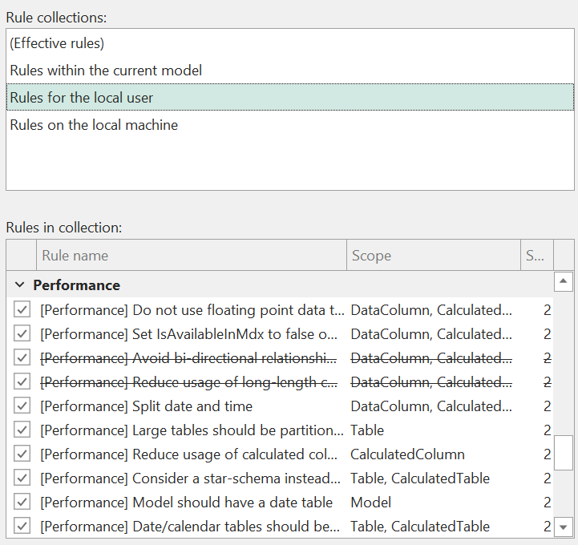
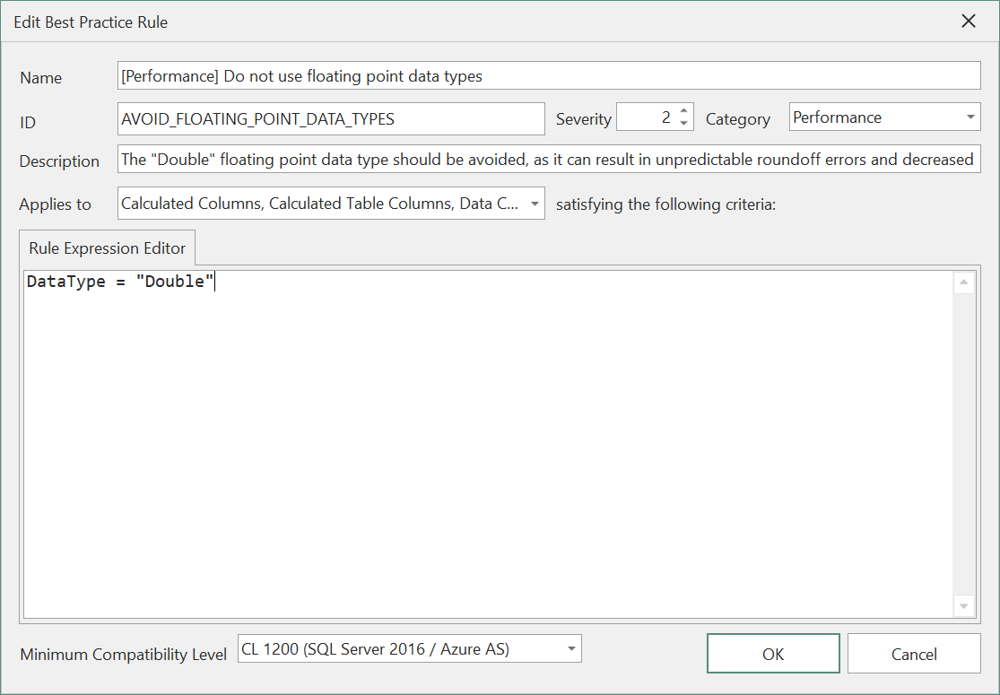

# ベストプラクティスアナライザーでコード品質を向上させる

ここまでで、Tabular Object Model（TOM）が比較的複雑なデータ構造であり、多くの異なるタイプのオブジェクトとプロパティを持つことはすでにご存じでしょう。これらのプロパティに割り当てるべき最適な値は必ずしも明確でなく、多くの場合、特定のユースケースやモデル設計に依存します。Tabular Editorの**Best Practice Analyzer**はTOMを継続的にスキャンし、定義可能なベストプラクティスルールに違反がないかどうかを調べます。これにより、オブジェクトのプロパティが常に理想的な値に設定されているかどうかを確認できます。

ベストプラクティス・アナライザーで確認できること。

- **DAX式** 特定のDAX関数または構成要素が使用されたときに警告するルールを作成します。
- **書式設定** 書式文字列や説明などを指定するよう促すルールを作成します。
- **命名規則** 特定のタイプのオブジェクト（キー列、隠し列など）が特定の名前パターンにしたがっているかどうかをチェックするルールを作成します。
- **パフォーマンス** 計算列の数を減らすことを推奨するなど、モデルのパフォーマンスに関連するさまざまな側面をチェックするルールを作成します。

Best Practice Analyzerは、モデルの完全なメタデータにアクセスでき、より高度なシナリオのためにVertiPaq Analyzerの統計にもアクセスできます。

> [!NOTE]。
> Tabular EditorにはBPAルールが付属していません。最初に独自のルールを定義するか、[Power BI CAT Team が推奨するルール](https://powerbi.microsoft.com/en-ca/blog/best-practice-rules-to-improve-your-models-performance/) のような標準的なルールセットを使用する必要があります。

## ベストプラクティスルールの管理

モデルに適用するルールを追加、削除、または修正するには、「ツール > BPAルールの管理...」メニュー オプションを使用します。

このUIには2つのリストがあります。一番上のリストは、現在ロードされているルールの**コレクション**を表します。このリストでコレクションを選択すると、そのコレクション内で定義されているすべてのルールが下のリストに表示されます。モデルがロードされると、以下の3つのルール・コレクションが表示されます。

* **現在のモデル内のルール** **Rules within the current model**: 名前が示すように、これは、現在のモデル内で定義されたルールのコレクションです。ルール定義は、Modelオブジェクトのアノテーションとして保存されます。
* **ローカルユーザーのルール** **Rules for local user**: これらは `%LocalAppData%TabularEditor3 FilterBPARules.json` ファイルに格納されているルールです。これらのルールは、現在ログインしているWindowsユーザーがTabular Editorにロードするすべてのモデルに適用されます。
* **Rules on the local machine**: これらのルールは `%ProgramData%TabularEditorTabularPARules.json` に格納されます。これらのルールは、現在のマシンでTabular Editorにロードされるすべてのモデルに適用されます。

同じルール（IDによる）が複数のコレクションにある場合、優先順位は上から下になります。つまり、モデル内で定義されたルールは、ローカルマシンで定義された同じIDのルールよりも優先されます。これにより、たとえば、モデル特有の慣習を考慮に入れて、既存のルールを上書きできます。

リストの上部には、**(Effective rules)**という特別なコレクションが表示されます。このコレクションを選択すると、現在ロードされているモデルに実際に適用されるルールのリストが表示され、前述のように、同一のIDを持つルールの優先順位が尊重されます。下のリストには、ルールがどのコレクションに属しているかが表示されます。また、より高い優先順位のコレクションに同じIDのルールが存在する場合、そのルールの名前は打ち消されることに注意してください。

## コレクションの追加

ルールコレクションは、特定のモデルに追加できます。ネットワーク共有にルールファイルがある場合、そのファイルをルールコレクションとして現在のモデルに含めることができます。ファイルの場所への書き込み権限があれば、そのファイルからルールを追加/変更/削除することもできます。この方法で追加されたルール・コレクションは、モデル内で定義されたルールよりも優先されます。このようなコレクションを複数追加した場合、それらを上下に移動して、相互の優先順位を制御できます。

「追加...」ボタンをクリックすると、新しいルール・コレクションをモデルに追加できます。これには、以下のオプションがあります。

* **Create new Rule File** **Create new Rule File**: 指定された場所に新しい空の .jsonファイルが作成され、その後ルールを追加できます。ファイルを選択する際、相対的なファイルパスを使用するオプションがあることに注意してください。これは、現在のモデルと同じコードリポジトリにルールファイルを保存したい場合に便利です。ただし、相対的なルール・ファイルの参照は、モデルがディスクからロードされたときにのみ機能することに注意してください（Analysis Servicesのインスタンスからモデルをロードするときには作業ディレクトリが存在しないため）。
* **ローカル・ルール・ファイルを含める** **Include local Rule File**: ルールを含む .jsonファイルをすでに持っていて、それをモデルに含めたい場合はこのオプションを使用します。ここでも、相対ファイルパスを使用するオプションがあり、ファイルがモデルのメタデータへ近い場所にある場合は有効です。ファイルがネットワーク共有（または一般に、現在ロードされているモデル・メタデータが存在する場所とは異なるドライブ）にある場合、絶対パスを使用してのみインクルードできます。
* **Include Rule File from URL**: このオプションでは、有効なルールセット（json形式）を返すHTTP/HTTPS URLを指定できます。これは、オンラインソースのルール、たとえば [BestPracticeRules GitHub サイト](https://github.com/TabularEditor/BestPracticeRules) の [標準 BPA ルール](https://raw.githubusercontent.com/TabularEditor/BestPracticeRules/master/BPARules-standard.json) を含めたい場合に便利です。オンラインソースから追加されたルールコレクションは、読み取り専用になります。

## コレクション内のルールを修正する

画面の下部では、現在選択されているコレクション内のルールを追加、編集、クローン、削除できます（コレクションが保存されている場所への書き込み権限がある場合）。さらに、"Move to... "ボタンを使用すると、選択したルールを別のコレクションに移動またはコピーすることができ、複数のルールのコレクションを簡単に管理できます。

## ルールの追加

コレクションに新しいルールを追加するには、**New rule...**ボタンをクリックします。これにより、ベストプラクティスルールエディターが表示されます（以下のスクリーンショットを参照）。

新しいルールを作成する場合、以下の詳細を指定する必要があります。

- **名前**: ルールの名前。Tabular Editorのユーザーに表示されます。
- **ID**：ルールの内部ID。ルールの内部ID。ルールコレクション内で一意である必要があります。異なるコレクション間で複数のルールが同じIDを持つ場合、最も優先順位の高いコレクション内のルールのみが適用されます。
- 重要度**。厳しさはTabular EditorのUIでは使用されませんが、[Tabular Editorのコマンドラインインターフェース](xref:command-line-options)でベストプラクティス分析を実行する場合、ルール違反がどのくらい「厳しい」かをこの数値で決定します。
  - 1 = 情報のみ
  - 2 = 警告
  - 3（またはそれ以上）= エラー
- **カテゴリ**。ルールを論理的にグループ化し、ルール管理を容易にするため、使用されます。
- **説明** (オプション): ルールの目的を説明するために使用します。ベストプラクティス・アナライザーのビューにツールチップとして表示されます。説明フィールドでは、以下のプレースホルダー値を使用して、より文脈に沿ったメッセージを提供できます。
  - object%` は、現在のオブジェクトへの完全修飾されたDAXリファレンスを返します（該当する場合）。
  - objectname%` は、現在のオブジェクトの名前のみを返します。
  - objecttype%` は現在のオブジェクトのタイプを返します。
- **Applies to**: ルールを適用するオブジェクトの種類を選択します。
- **Expression**: Dynamic LINQ](https://dynamic-linq.net/expression-language) 検索式を入力します。（**Applies to** ドロップダウンで選択したオブジェクト タイプのうち）ルールに違反するオブジェクトに対して `true` と評価されるはずの式です。Dynamic LINQ式は、選択されたオブジェクトタイプで利用可能なTOMプロパティだけでなく、幅広い標準.NETメソッドとプロパティにアクセスできます。
- **最小限の互換性レベル**。一部のTOMプロパティは、すべての互換性レベルでは使用できません。汎用ルールを作成する場合は、このドロップダウンを使用して、ルールが適用されるべきモデルの最小互換性レベルを指定します。

ルールがディスク上のルールコレクションに保存されると、上記のすべてのプロパティが JSON 形式で保存されます。JSONファイルを編集することで、ルールの追加・編集・削除を行うことができます。また、ルールに `FixExpression` プロパティを指定することも可能です。これは、ルール違反修正するため、モデルに適用される[C#スクリプト](xref:cs-scripts-and-macros)を生成するために使用される文字列です。

## ベストプラクティス・アナライザー・ビューの使用

Tabular Editorは、ベストプラクティスルール違反を**Best Practice Analyzer**ビューに表示します。また、メインウィンドウの下部にあるステータスバーでルール違反の件数を確認できます。ビューにフォーカスを当てるには、**表示 > ベストプラクティス アナライザー** メニューオプションを使用するか、ステータスバーの「# BP issues」ボタンをクリックします。

ベストプラクティス・アナライザー・ビュー](~/images/best-practice-analyzer-view.png)

ベストプラクティス アナライザー ビュー**には、違反のオブジェクトを持つすべてのルールのリストが表示されます。各ルールの下には、違反しているオブジェクトのリストが表示されます。リスト内のオブジェクトをダブルクリックすると、**TOM Explorer**でそのオブジェクトに移動できます。

オブジェクトを右クリックすると、上記のようないくつかのオプションが表示されます。これらは以下の通りです。

- オブジェクトに移動する**。オブジェクトへ移動**：オブジェクトをダブルクリックして、**TOM Explorer**でそのオブジェクトに移動するのと同じです。
- オブジェクトを無視する**。オブジェクトに注釈が追加され、ベストプラクティス・アナライザーがそのオブジェクトの特定のルールを無視するように指示します。無視されるルールはIDで指定します。
- 修正スクリプトを生成する**。このオプションは、ルールに `FixExpression` プロパティが指定されている場合にのみ利用可能です。このオプションを選択すると、Tabular Editorは選択されたルールの `FixExpression` に基づいて新しいC#スクリプトを作成します。
- **Apply fix**: このオプションは、ルールに `FixExpression` プロパティが指定されている場合にのみ利用可能です。このオプションを選択すると、Tabular Editorはルール違反を自動的に修正するために、選択されたルールの `FixExpression` を実行します。

> [!注意]。
> ベストプラクティス・アナライザーのビューでは、ShiftキーまたはCtrlキーを押しながらオブジェクトを複数選択することができます。

上記のオプションは、**Best Practice Analyzerビュー**の上部にあるツールバーボタンとしても利用可能です。さらに、すべてのアイテムの拡大/縮小、無視されたルール/オブジェクトの表示、手動更新（バックグラウンドスキャンが無効な場合に必要、下記参照）を行うためのボタンも用意されています。

## ベストプラクティス・アナライザーを無効にする

場合によっては、ベストプラクティス・アナライザーのバックグラウンドスキャンを無効にできます。たとえば、評価に比較的長い時間のかかるルールがある場合や、非常に大きなモデルを扱っている場合などです。

バックグラウンドスキャンは、**Tools > Preferences > Features > Best Practice Analyzer** で、**Scan for Best Practice violations in the background** のチェックを外して無効にできます。

なお、バックグラウンドスキャンを無効にしていても、上記のように **Best Practice Analyzer ビュー** の **Refresh** ボタンを使って手動でスキャンを実行することは可能です。
