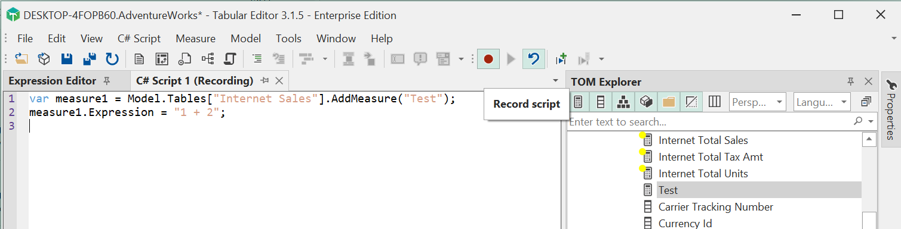

# C#スクリプトとマクロの紹介

生産性の向上を謳うソフトウェアであれば、ユーザーとのやりとりを**自動化する手段を提供する必要があります。Tabular Editorでは、まさにこの目的のためにC#スクリプトを書くことができます。Tabular EditorのC#スクリプトを使用すると、例えば次のようなことができます。

- メジャー、テーブル、計算項目などのTOMオブジェクトの作成を自動化する。
- TOMエクスプローラーで現在選択されているオブジェクトとのインタラクション
- 複数のオブジェクトに自動的にプロパティを割り当てる
- 監査や文書化のために、さまざまなフォーマットでメタデータをインポートおよびエクスポートする。

スクリプトによってモデルのメタデータが変更された場合、TOM ExplorerとPropertiesビューで変更内容をすぐに確認できます。さらに、**スクリプトの変更を取り消す**ことができ、効果的にモデル・メタデータをスクリプト実行前のポイントにロールバックできます。スクリプトの実行に失敗した場合、デフォルトで自動的に変更がロールバックされます。

Tabular Editor 3にはシンプルな**script recorder**があり、モデルに変更を加える際にスクリプトコードの行を徐々に追加することで、使用する構文の習得に役立ちます。

スクリプトはスタンドアロンファイル（拡張子 `.csx`）として保存でき、Tabular Editorのユーザー間で共有できます。さらに、スクリプトは再利用可能な**マクロ**として保存することができ、スクリプトをTabular Editorのユーザーインターフェイスとより密接に統合させることができます。

## スクリプトの作成

新しいC#スクリプトを作成するには、**File > New > C# Script** メニューオプションを使用します。このオプションは、Tabular Editorにモデルがロードされていない場合でも利用できることに注意してください。

最初のスクリプトには、次のコードを入力します。

```csharp
Info("Hello world!");
```

F5キーを押して、コードを実行します。

あなたの最初のスクリプト](~/images/first-script.png)

もし、コードを入力するときに間違えた場合は、シンタックスエラーが **Messages ビュー** に表示されます。

- スクリプトをファイルとして保存するには、**ファイル > 保存** (Ctrl+S)を押すだけです。
- ファイルからスクリプトを開くには、**ファイル > 開く > ファイル...** (Ctrl+O)オプションを使用します。ファイルを開くダイアログは、デフォルトで `.cs` または `.csx` の拡張子を持つファイルを探します。

## スクリプトレコーダーの使用

C#スクリプトにフォーカスがあるとき、Tabular Editorの**C# Script > Record script** メニューオプションを使用すると、スクリプトレコーダーを起動できます。スクリプトが記録されている間、モデルのメタデータに変更を加えると、スクリプトに追加のコード行が追加されます。記録を停止するまで、スクリプトを手動で編集することはできないので注意してください。



## モデルのメタデータにアクセスする

現在ロードされているモデル内の特定のオブジェクトにアクセスするためには、Tabular Object Model (TOM) 階層をナビゲートするためのC# 構文を使用する必要があります。この階層のルートは `Model` オブジェクトです。

以下のスクリプトは、現在ロードされているモデルの名前を出力します。もし、モデルがロードされていない場合は、警告が表示されます。

```csharp
if(Model != null)
    Info("現在のモデルの名前は: " + Model.Name);
else
    Warning("No model is currently loaded!");
```

`Model` オブジェクトは [Microsoft.AnalysisServices.Tabular.Model](https://msdn.microsoft.com/en-us/library/microsoft.analysisservices.tabular.model.aspx) クラスのラッパーであり、そのプロパティのサブセットを公開し、便宜上いくつかのメソッドとプロパティを追加しています。

特定のメジャーにアクセスするには、そのメジャーの名前と、そのメジャーが存在するテーブルの名前を知っている必要があります。

```csharp
var myMeasure = Model.Tables["Internet Sales"].Measures["Internet Total Sales"];
myMeasure.Description = "The formula for this measure is:" + myMeasure.Expression;
```

上記のスクリプトの行1は、"Internet Sales" テーブルの "Internet Total Sales" メジャーを特定し、そのメジャーへの参照を `myMeasure` 変数に格納します。

スクリプトの2行目では、ハードコードされた文字列とメジャーの (DAX) 式に基づいて、メジャーの説明を設定しています。

Tabular Editorは、TOM ExplorerからC#スクリプトビューにオブジェクトをドラッグ＆ドロップすることで、特定のオブジェクトを参照するコードを自動生成できます。

ドラッグでオブジェクト参照を生成](~/images/generate-csharp-code.gif)

Tabular EditorのほとんどのTOMオブジェクト（テーブル、カラム、メジャーなど）は、AMO/TOMクライアントライブラリを直接使用するときに利用できるのと同じプロパティのセットを公開しています。このため、どのプロパティが利用できるかは、[Microsoft's AMO/TOM documentation](https://docs.microsoft.com/en-us/dotnet/api/microsoft.analysisservices.tabular?view=analysisservices-dotnet) を参照するとよいでしょう。例えば、[こちら](https://docs.microsoft.com/en-us/dotnet/api/microsoft.analysisservices.tabular.measure?view=analysisservices-dotnet#properties) は、利用可能なメジャープロパティのドキュメントです。

## 現在の TOM Explorer の選択にアクセスする

スクリプトを再利用可能にするには、上記のように、モデル内のオブジェクトを名前で直接参照できるだけでは不十分なことがあります。その代わりに、Tabular Editorの**TOM Explorerビュー**で現在選択されているオブジェクトを参照することが有効です。これは `Selected` オブジェクトを使用することで可能になります。

```csharp
Info("現在、選択されています。" + Selected.Measures.Count + " メジャー(s).");
```

`Selected` オブジェクトは、それ自体、現在選択されているすべてのオブジェクトのコレクションで、選択されたディスプレイフォルダー内のオブジェクトも含まれます。さらに、`Selected` オブジェクトは複数のプロパティを含んでおり、上記の例で示した `.Measures` プロパティのような特定のオブジェクトタイプを簡単に参照できます。一般的に、これらのプロパティは、複数形（`.Measures`）と単数形（`.Measure`）の両方が存在します。一方、後者は現在選択されているオブジェクトへの参照であり、そのオブジェクトの種類が1つだけ選択されている場合にのみ使用できます。

usful-script-snippetsの記事には、`Selected`オブジェクトを使用してさまざまなタスクを実行するスクリプトの例が多数掲載されています。

## ユーザーとのインタラクション

上記の例では、`Info(...)` と `Warning(...)` グローバルメソッドを使って、さまざまなフレーバーでユーザーへのメッセージを表示させることができました。Tabular Editorはこれらのグローバルメソッドに加え、情報を表示したり収集したりするための拡張メソッドや、その他さまざまな一般的なタスクのためのメソッドを多数提供しています。もっともよく使われるものを以下にリストアップします。

* `void Output(object value)` - スクリプトの実行を停止し、提供されたオブジェクトに関する詳細な情報を表示する。提供されたオブジェクトがTOMオブジェクトまたはTOMオブジェクトのコレクションである場合、すべてのプロパティの詳細なビューが表示されます。
* `void SaveFile(string filePath, string content)` - テキストデータをファイルに保存するための便利な方法です。
* `string ReadFile(string filePath)` - ファイルからテキストデータをロードする便利な方法です。
* `string ExportProperties(IEnumerable<ITabularNamedObject> objects, string properties = "...")` - 複数のオブジェクトからプロパティのセットをTSV文字列としてエクスポートするための便利な方法です。
* `void ImportProperties(string tsvData)` - 複数のオブジェクトに、TSV文字列からプロパティをロードする便利な方法です。
* `string ConvertDax(dax, useSemicolons)` - DAX式をUS/UKと非US/UKロケールの間で変換します。`useSemicolons` がtrueの場合（デフォルト）、 `dax` 文字列はネイティブのUS/UKフォーマットからnon-US/UKフォーマットに変換されます。つまり、カンマ (リストセパレーター) はセミコロンに、ピリオド (小数点以下のセパレーター) はカンマに変換されます。UseSemicolons` がfalseに設定されている場合は、その逆となります。
* `void FormatDax(IEnumerable<IDaxDependantObject> objects, bool shortFormat, bool? skipSpace)` - 与えられたコレクション内のすべてのオブジェクトに対してDAX式をフォーマットします。
* `void FormatDax(IDaxDependantObject obj)` - スクリプトの実行が完了したとき、あるいは `CallDaxFormatter` メソッドが呼ばれたときに、DAX式のフォーマット用にオブジェクトをキューに入れます。
* `void CallDaxFormatter(bool shortFormat, bool? skipSpace)` - これまでにキューイングされたオブジェクトに対して、すべてのDAX式をフォーマットします。
* `void Info(string message)` - 情報メッセージを表示します。
* `void Warning(string message)` - 警告メッセージを表示する。
* `void Error(string message)` - エラーメッセージを表示します。
* `measure SelectMeasure(Measure preselect = null, string label = "...")` - すべてのメジャーのリストを表示し、ユーザが1つを選択するように促します。
* `T SelectObject<T>(this IEnumerable<T> objects, T preselect = null, string label = "...") ここでT: TabularNamedObject` - 指定されたオブジェクトのリストを表示し、ユーザーに1つを選択するように促します。
* `IList<T> SelectObjects<T>(this IEnumerable<T> objects, IEnumerable<T> preselect = null, string label = "...") where T: TabularNamedObject` - 提供されたオブジェクトのリストを表示し、ユーザーに任意の数のオブジェクトを選択するように促し、選択されたオブジェクトのリスト（またはキャンセルボタンが押された場合はnull）を返します。

## スクリプトをマクロとして保存する

よく使うスクリプトは再利用可能なマクロとして保存でき、Tabular Editorを起動すると常に利用可能です。さらに、マクロは**TOM Explorerビュー**のコンテキストメニューに自動的に統合され、**Tools > Customize...**オプションを使用して既存またはカスタムのメニューやツールバーにマクロを追加することも可能です。

スクリプトをマクロとして保存するには、**C# Script > Save as Macro...** オプションを使用します。

新しいマクロを保存](../../images/save-new-macro.png)

マクロの名前を指定します。たとえば、"My MacrosTest "という名前を付けると、TOM Explorerのコンテキストメニューに "My Macros "というサブメニューができ、このサブメニューの中にスクリプトを呼び出す "Test "というメニューオプションができます。

また、マクロによって作成されたメニューオプションの上にカーソルを置くと表示されるツールチップをオプションで指定できます。

また、マクロのコンテキストを指定する必要があります。これは、コンテキストメニューでマクロを利用するために選択する必要があるオブジェクトの種類を指定します。

最後に、**Macro enabled condition (advanced)** で、（通常は `Selected` または `Model` オブジェクトに基づいて）真/偽に評価されるべき C# 式を指定できます。これにより、現在の選択範囲に基づいて、マクロを有効にするかどうかをより詳細に制御できます。たとえば、以下のような表現が可能です。

```csharp
Selected.Measures.Count == 1
```

とすると、ちょうど1つのメジャーが選択されたときだけマクロを有効にできます。

## マクロの管理

過去に保存したすべてのマクロは、**マクロビュー**に表示できます。このビューを表示するには、メニューオプションの **表示 > マクロ** を使用します。このビューでは、以下のことが可能です。

- **Rename a macro** (カーソルを**名前**列に置き、新しい名前を入力するだけ)
- **Delete a macro.**それを選択し、マクロのリストの上にある赤い「X」ボタンをクリックします。
- **Edit a macro.** リストでマクロをダブルクリックします（リストの「Id」列をダブルクリックします）。これにより、マクロが新しいC#スクリプトビューで開かれ、そこでコードを変更できます。Ctrl+Sを押して、コードの変更を保存します。他のマクロプロパティ（ツールチップ、マクロコンテキストなど）を編集する必要がある場合は、**C# Script > Edit Macro...** メニューオプションを使用します。
