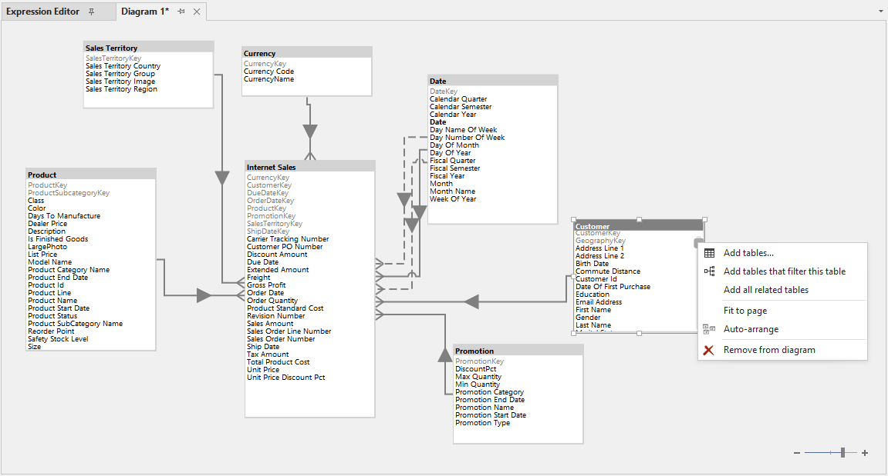

# Tabular Editor 2.xからの移行

この記事は、Power BI DatasetまたはAnalysis Services Tabular開発でTabular Editor 2.xの使用経験がある開発者を対象としています。この記事では、Tabular Editor 3の類似点と重要な機能追加をハイライトし、迅速にスピードアップできるようにします。

## インストールのサイドバイサイド

Tabular Editor 3はTabular Editor 2.xと異なる製品コードを持っています。これは、両方のツールを問題なく並べてインストールできることを意味します。実際、両ツールは別々のプログラムフォルダーにインストールされ、その設定も別々のフォルダーに保存されます。つまり、Tabular Editor 2.xとTabular Editor 3間の「アップグレード」「ダウングレード」という言葉は当てはまりません。Tabular Editor 3はまったく別の製品であると考えた方がよいでしょう。

## 機能比較

機能面では、Tabular Editor 3はいくつかの例外を除き、基本的にTabular Editor 2.xのスーパーセットです。下の表は2つのツールのすべての主要機能を比較したものです。

||Tabular Editor 2.x|Tabular Editor 3|
|---|---|---|
|すべてのTOMオブジェクトとプロパティを編集する|&#10004;|&#10004;|
|一括編集とリネーム|&#10004;|&#10004;|
|コピー＆ペースト、ドラッグ＆ドロップに対応|&#10004;|&#10004;|
|データモデリング操作のアンドゥ／リドゥ|&#10004;|&#10004;|
|モデルメタデータのディスクへのロード/セーブ|&#10004;|&#10004;*|
|フォルダに保存|&#10004;|&#10004;*|
|[daxformatter.com](https://daxformatter.com) integration|&#10004;|&#10004;|
|高度なデータモデリング（OLS、Perspectives、Calculation Groups、Metadata Translations、など）|&#10004;|&#10004;*|
|シンタックスハイライトと数式の自動修正|&#10004;|&#10004;|
|オブジェクト間のDAX依存関係を表示|&#10004;|&#10004;|
|テーブルのインポートウィザード|&#10004;|&#10004;|
|デプロイメントウィザード|&#10004;|&#10004;*|
|ベストプラクティス・アナライザー|&#10004;|&#10004;|
|C#スクリプトと自動化|&#10004;|&#10004;|
|Power BI Desktopの外部ツールとしての利用|&#10004;|&#10004;|
|SSAS/Azure AS/Power BI Premiumに接続する。|&#10004;|&#10004;*|
|コマンドラインインターフェース|&#10004;|*[Coming soon](xref:roadmap)*|
|高DPI、マルチモニター、テーマ設定に対応したカスタマイズ可能なプレミアム・ユーザー・インターフェイス||&#10004;|
|IntelliSenseTM ライクな機能を備えたワールドクラスのDAXエディター||&#10004;|
|オフラインでのDAX構文チェックとカラム/データ型推論||&#10004;|
|テーブルインポートウィザードとテーブルスキーマの更新チェックを改良し、Power Queryに対応しました。||&#10004;|
|DAXクエリ、テーブルプレビュー、ピボットグリッド||&#10004;|
|テーブルの関係を視覚化し、編集するためのダイアグラムを作成||&#10004;|
|バックグラウンドでのデータリフレッシュ操作の実行||&#10004;*|
|C#マクロレコーダー||&#10004;|
|DAXスクリプトを使用して、1つのドキュメントで複数のDAX式を編集する。||&#10004;|
|[VertiPaq Analyzer](https://www.sqlbi.com/tools/vertipaq-analyzer/)の統合。||&#10004;|

**Note:** Tabular Editor 3のどの[エディション](xref:editions)を使用しているかによって制限があります。

## 機能の違い

以下は、重要な機能の違いの概要です。

### ユーザーインターフェイス

Tabular Editor 3を起動して最初に気づくのは、新しいVisual Studio Shellのようなインターフェイスでしょう。このインターフェイスは完全にカスタマイズ可能で、高DPI、マルチモニターをサポートし、テーマの変更も可能です。すべてのインターフェイス要素は別の場所に移動できますので、もしTabular Editor 2.xのインターフェイスレイアウトがお好みでしたら、すぐに**Window**メニューから**Classic layout**を選択してください。

しかし、一般的にTabular Editor 2.xに存在するインターフェイス要素はTabular Editor 3でも同じ名前なので、新しいインターフェイスをナビゲートするのは比較的簡単でしょう。いくつかの重要な違いを以下に挙げます。

- Tabular Editor 2.xの**Advanced Scripting**タブはなくなりました。Tabular Editor 3では、代わりに**File > New**メニューを使用して*C# Scripts**を作成します。一度に1つのスクリプトで作業できるように制限されていません。また、**Custom Action** は **Macros** に名称が変更されました。
- **ダイナミックLINQフィルタリング** は、現在TOM Explorer内では使用できません。代わりに、[Dynamic LINQ](https://dynamic-linq.net/expression-language) を使用してオブジェクトを検索する場合は、CTRL+Fキーを押して**検索と置換**ダイアログを表示させる必要があります。
- **Expression Editor**を閉じた場合は、**TOM Explorer** 内のオブジェクトのアイコンをダブルクリックするか、**View > Expression Editor** メニューオプションを選択することで、元に戻すことができます。
- Tabular Editor 3のデフォルトレイアウトを使用している場合、**Best Practice Analyzer**は**TOM Explorer**の隣にタブとして配置されます。ここでは、新しい**Data Refresh**ビュー（バックグラウンド更新操作のキューを表示可能）と**Macros**ビュー（以前にC#スクリプトから保存したマクロを管理可能）も表示されます。
- Tabular Editor 3は新しい**Messages View**にすべてのDAXシンタックスとセマンティックエラーを表示します。デフォルトのレイアウトでは、これはインターフェイスの左下に配置されています。
- さらに、Tabular Editor 3には**VertiPaq Analyzer**（[DAX Studio](https://daxstudio.org/)でお馴染みのもの）が含まれています。
- 最後に、Tabular Editor 3は**ドキュメント**という概念を導入しており、これはC#スクリプト、DAXスクリプト、DAXクエリー、ダイアグラム、データプレビュー、ピボットグリッドの単なる総称に過ぎません。

詳細は、<xref:user-interface>を参照してください。

### 新しい DAX エディターとセマンティック機能

Tabular Editor 3は独自のDAX解析エンジン（別名「セマンティックアナライザー」）を備えており、モデル内のあらゆるDAXコードのセマンティクスを理解することができるようになったことを意味します。このエンジンは、DAXエディター（コードネーム「Daxscilla」）にも使用されており、構文の強調表示、自動フォーマット、コード補完、コールチップ、リファクタリングなどの機能を実現しています。もちろん、このエディターは高度に設定可能であり、好みのDAXコーディングスタイルに合わせて微調整できます。

新しいDAXエディターの詳細については、<xref:dax-editor> を参照してください。

さらに、セマンティック アナライザーは、モデル内のすべてのオブジェクトでDAX構文またはセマンティック エラーを継続的に報告します。これは、Analysis Servicesに接続されていない場合でも動作し、非常に高速です。セマンティックアナライザーはまた、Tabular Editor 3がDAX式からデータ型を自動的に推論することを可能にしました。言い換えれば、Tabular Editor 3は計算されたテーブル式からどのカラムが得られるかを自動的に検出するのです。これは、計算テーブルのカラムを手動でマッピングするか、カラムのメタデータを返すためにAnalysis Services依存しなければならなかったTabular Editor 2.xに比べて大きな改善点です。

### Power Queryをサポートするテーブルインポートとスキーマアップデート

Tabular Editor 2.xに対するTabular Editor 3のもう1つの大きな利点は、構造化データソースとPower Query（M）パーティションをサポートすることです。具体的には、「スキーマアップデート」機能がこれらのタイプのデータソースやパーティションに対して機能するようになり、テーブルインポートウィザードでは新しいテーブルをインポートする際に必要なMコードを生成することができるようになったのです。

スキーマ比較ダイアログ自体にも多くの改良が加えられており、たとえば、列削除＋列挿入の操作を単一列の名前変更操作に簡単にマッピングできます（逆も同様）。また、浮動小数点データ型と小数点のデータ型をどのように扱うかを制御するオプションもあります（たとえば、データソースが浮動小数点データ型を使っていても、常に小数点のデータ型としてインポートしたい場合があります）。

詳しくは、<xref:importing-tables>を参照してください。

### ワークスペース・モード

このモードではモデルのメタデータはディスク（Model.bimまたはDatabase.json）から読み込まれ、選択したAnalysis Servicesインスタンスにデプロイされます。保存(CTRL+S)を押すたびに、ワークスペース・データベースが同期され、更新されたモデル・メタデータがディスクに保存し直されます。この方法の利点は、Tabular EditorがAnalysis Servicesに接続されているため、以下の[接続された機能](#connected-features)が利用でき、またディスク上のソースファイルを簡単に更新することができる点です。Tabular Editor 2.xでは、データベースからモデルを開き、たまに手動でディスクに保存することを忘れないようにしなければなりませんでした。

このアプローチは[並行開発](xref:parallel-development)やバージョン管理システムとのモデルメタデータの統合を可能にするために理想的なものです。

詳しくは<xref:workspace-mode>を参照してください。

### 接続された機能

Tabular Editor 3には新しい接続機能が多数含まれており、Analysis Servicesのクライアントツールとして使用することができます。これらの機能は、Tabular Editor 3が直接または[ワークスペース・モード](#workspace-mode)機能を使用してAnalysis Servicesに接続されたときに有効になります。

新たに接続された機能は以下の通りです。

- テーブルデータのプレビュー
- ピボットグリッド
- DAXクエリ
- データリフレッシュ操作
- VertiPaq Analyzer

### ダイアグラム

Tabular Editor 2.xで要望の多かった機能の1つは、テーブル間のリレーションシップをより良く可視化することでした。Tabular Editor 3 では、モデル図を作成できるようになりました。各ダイアグラムは、ダイアグラムに含まれるテーブルの名前と座標を保持するシンプルなJSONファイルです。そして、Tabular Editor 3はテーブルとリレーションシップをレンダリングし、リレーションシップの編集や既存のリレーションシップに基づくテーブルの追加などを簡単に行う機能を提供します。

詳しくは、[ダイアグラムを使った作業](xref:importing-tables-data-modeling#working-with-diagrams)を参照してください。

### C# スクリプトとマクロレコーダー

Tabular Editor 2.xの**Advanced Scripting**機能は、**C# Scripts**としてTabular Editor 3に引き継がれました。Tabular Editor 3での重要な違いの1つは、1つのスクリプトでの作業に制限されなくなったことです。その代わり、**File > New > C# Script** オプションを使用すると、必要な数のC#スクリプトを作成し、作業できます。Tabular Editor 2.xと同様に、これらのスクリプトは再利用可能なアクションとして保存でき、TOM Explorerの右クリックのコンテキストメニューに直接統合されます。Tabular Editor 3ではこれらのアクションを **Macros** と呼び、マクロを追加できる独自のメニューやツールバーを作成することも可能です。

もっとも重要なのは、Tabular Editor 3には**マクロレコーダー**があり、ユーザーのインタラクションからC#コードを自動的に生成するために使用することができることです。

> [!注意]。
> この記事の執筆時点では、Tabular Editor 3のC#スクリプトエディターにはIntelliSenseのような機能は含まれていません。これは後日リリースされる予定です。

詳しくは@cs-scripts-and-macrosを参照してください。

### DAX スクリプト

Tabular Editor 2.xから来た人が知っておくべき最後の重要な機能は**DAX Scripting**です。この機能により、複数の計算オブジェクトのDAX式と基本プロパティを一度に編集できるドキュメントを作成できます。計算オブジェクトとは、メジャー、計算カラム、計算テーブルなどです。

これは、複数のオブジェクトにまたがる複雑なビジネスロジックをオーサリングする際に非常に便利です。TOM Explorerでオブジェクトを（複数）選択し、右クリックして**Script DAX**オプションを選択すると、選択されたすべてのオブジェクトの定義を含む新しいDAXスクリプトが得られます。DAXスクリプトエディターは、エクスプレッションエディターやDAXクエリエディターと同じDAX機能をもちろん持っています。

DAXスクリプトは、**コネクテッド**モードまたは**ワークスペース**モードで作業する場合、更新されたビジネスロジックをすばやく修正およびテストするための非常に強力なツールです（たとえば、下のスクリーンショットに示すようにピボットグリッドと組み合わせて使用する場合など）。SHIFT+F5を押すだけで、スクリプト内のDAX式に基づいてデータベースが更新され、その後、ピボット・グリッドが即座に更新されます。

詳しくは、@dax-script-introductionをご覧ください。
