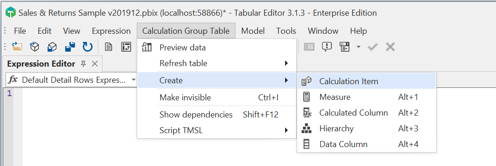

# Migrating from Power BI Desktop

If you are already familiar with data modeling concepts in Power BI Desktop, this article is intended to help you migrate your data modeling over to Tabular Editor. Thus, we assume you have a solid understanding of concepts such as the Power Query Editor, imported vs. calculated tables, calculated columns, measures, etc.

## Power BI and Tabular Editor

Historically, Tabular Editor was designed as a tool for SQL Server Analysis Services (Tabular) and Azure Analysis Services developer. When Power BI first launched, there was no supported way for third party tools to access the Analysis Services instance hosting the Power BI data model, and so the only way to create and edit a Power BI dataset, was through Power BI Desktop.

This changed in March 2020, when [Microsoft announced the read/write XMLA endpoint in Power BI Premium](https://powerbi.microsoft.com/en-us/blog/announcing-read-write-xmla-endpoints-in-power-bi-premium-public-preview/). A few months later, it even became possible to use third party tools in conjunction with Power BI Desktop, with the [announcement of the External Tools feature](https://powerbi.microsoft.com/en-us/blog/announcing-public-preview-of-external-tools-in-power-bi-desktop/).

The availability of the XMLA endpoint in Power BI Premium allows data model developers to leverage their existing skills and tools, and it is not a secret that Microsoft is investing heavily in making [Power BI Premium a superset of Analysis Services](https://community.powerbi.com/t5/Webinars-and-Video-Gallery/Power-BI-Premium-as-a-superset-of-Analysis-Services-the-XMLA/m-p/1434121). In other words, the integration of third party tools, community as well as commercial, with Power BI is something that is here to stay. In fact, Amir Netz, CTO of Microsoft Analytics, made a [joint statement](https://powerbi.microsoft.com/en-us/blog/community-tools-for-enterprise-powerbi-and-analysisservices/) with Marco Russo, founder of SQLBI, to affirm this point.

Here at Tabular Editor ApS, we firmly believe that Tabular Editor 3 is the best tabular data modeling tool available right now, and thanks to the integrations mentioned above, the tool is no longer reserved for SQL Server or Azure Analysis Services developers. 

Before proceeding, it is important to understand that Tabular Editor can be used in conjunction with Power BI in two very different scenarios:

- **Scenario 1:** Tabular Editor as an External Tool for Power BI Desktop.
- **Scenario 2:** Tabular Editor with the Power BI Premium XMLA Endpoint.

> [!IMPORTANT]
> You cannot use Tabular Editor to directly load a .pbix file. For more information, see <xref:desktop-limitations#power-bi-file-types>.

### Scenario 1: Tabular Editor as an External Tool for Power BI Desktop

Generally, this scenario is intended for self-service analysts and Power BI Desktop users without access to Power BI Premium, to make certain data modeling operations easier (for example, adding and editing measures), and to unlock advanced modeling options not otherwise available (calculation groups, perspectives and metadata translations).

External tools connect to the Analysis Services model hosted by Power BI Desktop. This allows the tool to make certain changes to the data model. Currently, however, not all types of data modeling operations are supported by Power BI Desktop. It is important to understand this limitation and how Tabular Editor behaves when used as an external tool for Power BI Desktop. See <xref:desktop-limitations> for more information about this.

The typical workflow in this scenario, is the following:

1. Open a .pbit or .pbix file in Power BI Desktop
2. Launch Tabular Editor through the External Tools ribbon
3. Switch back and forth between Tabular Editor and Power BI Desktop, depending on what type of change you need to make. For example, you can add and edit measures through Tabular Editor, but you must use Power BI Desktop if you need to add a new table to the model.
4. Whenever you make a change in Tabular Editor, use **File > Save** (CTRL+S) to write the changes back to Power BI Desktop.
5. When you are done making changes, close Tabular Editor. Then, publish or save the report as usual from within Power BI Desktop.

> [!NOTE]
> As of October 2021, there is a bug in Power BI Desktop that sometimes prevents Desktop from automatically refreshing the field list and visuals to reflect changes made through external tools. When this happens, saving the .pbix file and reopening it, or manually refreshing a table within the model, usually causes the field list and all visuals to update correctly.

The [modeling limitations](xref:desktop-limitations) that apply to External Tools are only relevant regarding write operations/model modifications. You can still use Tabular Editor 3's connected features to browse the data within the model through table data previews, Pivot Grids or DAX queries, as described later in this guide.

### Scenario 2: Tabular Editor with the Power BI Premium XMLA Endpoint

This scenario is for BI professionals in organizations that use Power BI Premium Capacity or Power BI Premium-Per-User workspaces, who intend to replace Power BI Desktop altogether for purposes of dataset development.

Essentially, the Power BI Premium XMLA Endpoint exposes an instance of Analysis Services (Tabular). In this scenario, Tabular Editor behaves no different than it would when connected to Azure Analysis Services or SQL Server Analysis Services (Tabular).

The typical workflow in this scenario, is the following:

1. When first migrating to Tabular Editor, use the XMLA endpoint to open a Power BI dataset in Tabular Editor, then save the model metadata as a file (Model.bim) or folder (Database.json). See @parallel-development for more information.
2. Going forward, open the model metadata in Tabular Editor from the file or folder you saved in step 1. Optionally use [workspace mode](xref:workspace-mode).
3. Apply changes using Tabular Editor.
4. If using workspace mode, changes should be immediately visible in the Power BI service every time you hit Save (CTRL+S) in Tabular Editor.
5. If not using workspace mode or when done making changes, use Tabular Editor's **Model > Deploy...** option to publish the changes to the Power BI service.

As the model metadata "source of truth" in this scenario, is the file or folder structure stored on disk, this scenario not only enables parallel development with version control integration, but also continuous integration/continuous deployment (CI/CD) using an automated build server such as Azure DevOps. See <xref:powerbi-cicd> for more information.

> [!WARNING]
> As soon as you apply changes to a Power BI dataset through the Power BI service XMLA endpoint, that dataset can no longer be downloaded as a .pbix file. See [Dataset connectivity with the XMLA endpoint](https://docs.microsoft.com/en-us/power-bi/admin/service-premium-connect-tools#power-bi-desktop-authored-datasets) for more information.

When using Tabular Editor to connect to the dataset through the XMLA endpoint, there are no limitations to the types of write operations/model modifications that can be made.

The remainder of this article focuses on differences between Power BI Desktop and Tabular Editor for data model development. Some sections only apply to scenario 2, due to the [modeling limitations](xref:desktop-limitations) that apply when using Tabular Editor as an external tool for Power BI Desktop (scenario 1).

## Tabular Editor 3 user interface

If you are new to Tabular Editor, we recommend reading through the following resources to understand Tabular Editor 3's user interface:

- [Getting to know Tabular Editor 3's User Interface](xref:user-interface)
- [TOM Explorer view](xref:tom-explorer-view)
- [Properties grid](xref:properties-view)
- [DAX editor](xref:dax-editor)

## Tabular Editor 3 how-tos

What follows is a quick walkthrough of how to achieve common tasks in Tabular Editor 3.

### How to add a measure

To add a new measure to your model, right-click on the table in the **TOM Explorer** on which you want the new measure to reside, then choose **Create > Measure** (shortcut ALT+1). After the measure is added, you can immediately type the name of the measure.

### How to rename a measure

If you need to edit the name of the measure (or any other object), simply select the measure and hit F2 (or double-click the measure name). If multiple objects are selected, you will see the Batch rename dialog, that makes it easy to rename multiple objects in one go.

> [!WARNING]
> Changing object names in the data model may cause report visuals to stop working, if the visuals relies on one or more of the objects being renamed. External tools cannot access information about Power BI visuals, so Tabular Editor is not able to warn you before an object that is used in a visual is renamed or deleted.

### How to create a copy of a measure

In Tabular Editor 3, you can use the familiar Cut (CTRL+X), Copy (CTRL+C) and Paste (CTRL+V) operations to quickly move around and make copies of objects. You can also drag objects between tables and display folders using the **TOM Explorer**. If you make a mistake along the way, you can use the Undo (CTRL+Z) and Redo (CTRL+Y) options (repeatedly) to navigate back and forth through the history of changes applied.

### How to modify the DAX expression of a measure

Locate the measure you want to modify in the **TOM Explorer** and select it. You can toggle the display of hidden objects (CTRL+6) and display folders (CTRL+5) using the toolbar buttons near the top of the TOM Explorer. You may also type the partial name of the measure in the search box, to filter the **TOM explorer**.

Once the measure is selected, you should see the DAX expression of the measure in the **Expression Editor** and various properties such as `Description`, `Format String`, `Hidden`, etc. in the **Properties** grid.

To modify the DAX expression, simply place the cursor in the **Expression Editor** and update the DAX code. Hit F6 to automatically format the code. If you select a different object in the TOM Explorer or click the green checkmark button **Expression > Accept** (F5), the expression change is stored locally in Tabular Editor. You can also cancel the modification you made by hitting the red "X", **Expression > Cancel**. If you accidentally hit **Accept**, you can always undo the change by using the **Edit > Undo** (CTRL+Z) option.

To save your changes back to Power BI Desktop, the Power BI XMLA endpoint, or the file on disk from which the model was loaded, hit **File > Save** (CTRL+S).

To learn more about the capabilities of the Expression Editor, when writing DAX code, see <xref:dax-editor>.

### How to visualize dependencies between measures

While a measure is selected in the **TOM Explorer** use the **Measure > Show dependencies** (SHIFT+F12) option. This causes a new window to pop up, visualizing the dependency tree of the DAX expression for that measure. You can switch between viewing both upstream and downstream dependencies.

Double-clicking on an item in the dependencies view navigate to that object in the **TOM Explorer**.

### How to change the format string of a measure

Locate the measure you want to modify in the **TOM Explorer** and select it. You can toggle the display of hidden objects (CTRL+6) and display folders (CTRL+5) using the toolbar buttons near the top of the TOM Explorer. You may also type the partial name of the measure in the search box, to filter the **TOM explorer**.

Once the measure is selected, locate the `Format String` property in the **Properties** grid, expand it, and set the format string properties according to your preferences. Note the dropdown button at the right of the `Format` property. You may also freely enter a format string in the `Format String` property itself.

### How to modify the DAX expression of multiple measures

Tabular Editor 3 allows you to select multiple measures in order to create a **DAX Script**, which lets you modify the DAX expression and various properties of all selected measures at once.

To create a DAX script based on existing measures, simply select the measures in the **TOM Explorer** (hold down the CTLR key to select multiple objects or hold down the SHIFT key to select a range of objects). Then, right click and hit **Script DAX**.

You can add or modify properties such as `Description`, `FormatString`, `Visible`, `DetailRows` and more directly in the script.

Hit F5 to apply the script to the data model. Note that unlike the **Expression Editor**, navigating to a different object will not automatically apply any changes made to the script. You can still use the **Edit > Undo** (CTRL+Z) option to roll back any changes applied by a DAX script.

See @dax-script-introduction for more information.

### How to preview data in a table

To view the contents of a table (similar to the Data Tab in Power BI Desktop), simply right-click on a table and choose "Preview data". This will open a new tab containing a preview of the table content. You can scroll through all rows of the table, as well as apply sorting or filtering to columns. Unlike Power BI Desktop, you can open as many of these preview tabs as you like and arrange them next to each other in the user interface. The preview also works for tables in [DirectQuery mode](https://docs.microsoft.com/en-us/power-bi/connect-data/desktop-use-directquery) (although the preview will be limited to the first 100 records).

> [!NOTE]
> The **Preview data** feature is only available when Tabular Editor is connected to Power BI Desktop or a dataset in the Power BI XMLA endpoint.

See @refresh-preview-query for more information.

### How to add a calculation group

[Calculation Groups](https://docs.microsoft.com/en-us/analysis-services/tabular-models/calculation-groups?view=asallproducts-allversions) are useful for defining and reusing a modified DAX filter context or other type of business logic across all model measures. To add a calculation group using Tabular Editor, simply use the **Model > New Calculation Group** (ALT+7) option.

Give the calculation group a name, then, while the Calculation Group is selected in the **TOM Explorer**, add new Calculation Items by using the **Calculation Group Table > Create > Calculation Item** option. You can copy (CTRL+C) and paste (CTRL+V) calculation items to speed up this process for additional items.

### How to add a new table

To add a new table to a model, use the **Model > Import tables...** option. Tabular Editor's [Import Table Wizard](xref:importing-tables) will guide you through the process.

> [!NOTE]
> Tabular Editor 3 does not support every data source otherwise supported by Power BI. If your model uses a data source not supported by Tabular Editor, the easiest way to import a new table from the same source is to copy an existing table in Tabular Editor (CTRL+C / CTRL+V), and then modify the partition expression and update the table schema as shown below. For this to work, make sure that the **Tools > Preferences > Schema Compare > Use Analysis Services for change detection** option is enabled. See <xref:importing-tables#updating-table-schema-through-analysis-services> for more information.

> [!IMPORTANT]
> This option is not available by default when using Tabular Editor as an external tool, since adding/editing tables through external tools is [not supported by Power BI Desktop](xref:desktop-limitations).

See @importing-tables-data-modeling for more information.

### How to modify a Power Query expression on a table

Power Query (M) expressions that define what is loaded into each table reside in the corresponding table's **Partition**. The partitions can be located in the **TOM Explorer**. When selecting a partition, Tabular Editor displays the M expression for that partition in the **Expression Editor**, allowing you to edit it. After editing and accepting the expression change, you can right-click on the partition in the **TOM Explorer** and choose the **Update table schema...** option in order to detect if the columns imported on the table should be changed, based on the updated Power Query expression.

> [!NOTE]
> Currently, Tabular Editor 3 does not perform any validation of the partition expression. For Power Query (M) expressions, this is planned for a later update of Tabular Editor 3.

> [!IMPORTANT]
> Partition expressions are read-only by default when using Tabular Editor as an external tool, since editing partitions through external tools is [not supported by Power BI Desktop](xref:desktop-limitations).

If the Power Query expression changes gives rise to any changes on the imported table columns, a dialog that lets you review these changes will show:

### How to modify a shared Power Query expression

Shared Expressions are M queries that are not directly used to load data into a table. For example, when you create a Power Query parameter in Power BI Desktop, the M expression for this parameter is stored as a Shared Expression. In Tabular Editor, These can be accessed through the Shared Expressions folder of the **TOM Explorer** and edited just like M queries on partitions.

> [!IMPORTANT]
> Shared expressions are read-only by default when using Tabular Editor as an external tool, since editing partitions through external tools is [not supported by Power BI Desktop](xref:desktop-limitations).

### How to add relationships between tables

The easiest way to add relationships between two tables is to create a new diagram, add the two tables to the diagram, and then visually dragging a column from one table to another, to indicate the columns that should participate in the relationship. This is similar to how you would create a relationship in Power BI Desktop.

1. To create a new diagram use the **File > New > Diagram** option.
2. To add tables to the diagram, either drag and drop the tables from the **TOM Explorer** or use the **Diagram > Add tables...** option.
3. Once the tables are added, locate the column on the (many-side) fact table, and drag it over to the corresponding column on the (one-side) dimension table.
4. Confirm the relationship settings and hit "OK".

See [Working with diagrams](xref:importing-tables-data-modeling#working-with-diagrams) for more information.

> [!IMPORTANT]
> Relationships cannot be modified when using Tabular Editor as an external tool, since editing relationships through external tools is [not supported by Power BI Desktop](xref:desktop-limitations).

### How to publish to the Power BI Service

To publish or update a dataset in the Power BI Service, use the **Model > Deploy...** option and use the XMLA endpoint of the workspace, in which you want to publish the dataset.

If you loaded the model metadata directly from the XMLA Endpoint, you only need to hit **File > Save** (CTRL+S), to update the dataset that was loaded in Tabular Editor.

> [!NOTE]
> The **Model > Deploy...** option is **not** available in Tabular Editor 3 Desktop Edition, as this edition is only intended to be used as an External Tool for Power BI Desktop. [More information](xref:editions).

## Next steps

- <xref:user-interface>
- @parallel-development
- @boosting-productivity-te3
- <xref:new-pbi-model>