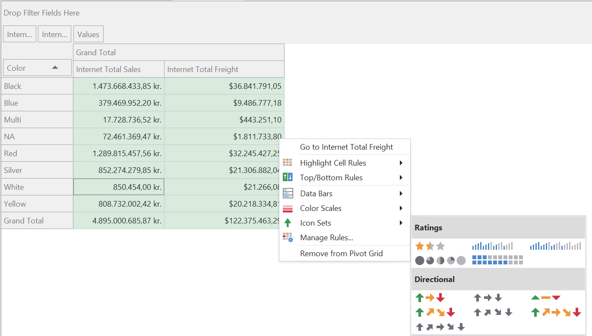

# Refreshing, previewing and querying data

When Tabular Editor 3 is connected to an instance of Analysis Services, a number of additional **connected features** are available, allowing you to use Tabular Editor 3 as a client tool for Analysis Services.

> [!NOTE]
> The phrase "connected to an instance of Analysis Services" means any one of the following:
> 
> - Loading a model in [**workspace mode**](xref:workspace-mode)
> - Loading a model directly from SQL Server Analysis Services, Azure Analysis Services or the Power BI XMLA endpoint
> - Using Tabular Editor 3 as an external tool for Power BI Desktop

In summary, these connected features are:

- Data refresh operations
- Table data previewing
- PivotGrids
- DAX Querying
- VertiPaq Analyzer

# Refreshing data

Tabular Editor does not automatically trigger refresh operations in Analysis Services when changes are made to the data model. This is by design, to ensure that saving metadata changes to Analysis Services does not take too long. Potentially, a refresh operation can take a long time to complete, during which no additional metadata may be updated on the server. Of course, the drawback of this, is that you can make changes using Tabular Editor, which causes the model to enter a state where it is only partly queryable or not queryable at all. Depending on what type of data model change was made, different levels of refresh may be needed.

In general, the following changes require a full refresh, before the mentioned object can be queried (that is, a data refresh followed by a calculate refresh):

- Adding a new table to the model
- Adding a new column to a table

In general, the following changes require a calculate refresh:

- Changing the DAX expression of a calculated table or calculated column
- Adding or modifying a relationship
- Adding, renaming or removing a calculation item from a calculation group

Notably, adding, modifying or removing measures from a model does not require any type of refresh (unless the measure is referenced by a calculated column, in which case the table in which that column resides has to be recalculated).

To initiate a refresh using Tabular Editor, simply right click on the Table or Partition you wish to refresh, navigate to **Refresh table** or **Refresh partition**, and then choose the type of refresh you want to perform.

You may also initiate a refresh at the model level through the **Model > Refresh model** menu. Once the refresh operation starts, you will see the text "Data refresh started... <ins>View refresh queue</ins>". Click on the link or locate the **Data refresh** view through the **View > Data refresh** menu option. This will display a list of all refresh operations (both present and current), displaying the status message returned from Analysis Services including progress counters and duration, and allowing you to cancel an unintended refresh.

While a refresh is in progress you can continue work on your data model, querying and previewing data or queueing new data refresh operations according to this article. However, you will not be able to save model changes to Analysis Services until the all data refresh operations complete.

> [!NOTE]
> Currently, [Power BI Desktop does not support refresh operations triggered from external tools](https://docs.microsoft.com/en-us/power-bi/transform-model/desktop-external-tools#data-modeling-operations). For this reason, Tabular Editor 3 hides these options when connected to an instance of Power BI Desktop. You can override this behavior by enabling **Tools > Preferences > Allow unsupported modeling operations**.

# Previewing table data

At certain points during DAX authoring and data model development, you may need to inspect the contents of your tables on a row-by-row basis. Of course, you could write a DAX query to achieve this, but Tabular Editor 3 makes that even easier by allowing you to preview table data directly. To do this, right-click on a table and choose the **Preview data** option.

You can open multiple such table previews and arrange them anyway you like in the user interface. In addition, you can sort or filter individual columns. There is no practical limit to the number of rows that can be previewed. Tabular Editor simply executes a [`TOPNSKIP`](https://dax.guide/topnskip) DAX query against the model, to return just a small number of records suitable to fill the current view.

If one or more calculated columns are in an invalid state, those columns contain the text *(Calculation needed)*. You can recalculate the table by right-clicking on the column and choosing the **Recalculate table...** option.

# Pivot Grids

After adding or editing DAX measures in a model, it is common for model developers to test these measures. Traditionally, this was typically done using client tools such as Excel or Power BI. With Tabular Editor 3, you can now use **Pivot Grids** which behave much like the famous PivotTables of Excel. To create a new Pivot Grid, use the **File > New > Pivot Grid** option. From here, you can either drag measures, columns and hierarchies from the TOM Explorer into the grid, or you can use the **Pivot Grid > Show fields** menu option to display a popup list of all fields that can be dragged into the Pivot Grid (see screenshot below).

As fields are dragged into the Pivot Grid, Tabular Editor generates MDX queries that are sent to Analysis Services, to display the resulting data. In this regard, the behavior is very similar to Pivot Tables in Excel. You can rearrange fields in the Pivot Grid by dragging and dropping, and there are various right-click menu options available for customizing how the data is displayed.

The Pivot Grid is automatically refreshed when a change is made to the model or a refresh operation finishes. You can toggle this auto-refresh capability within the **Pivot Grid** menu.

# DAX Queries

(WIP)

# VertiPaq Analyzer

(WIP)

# Next steps

(WIP)