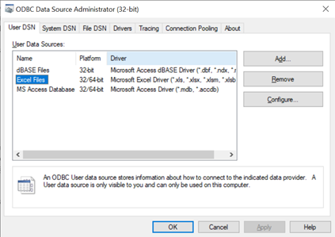

# Excelからテーブルをインポートする

Excelワークシートをテーブルとして表形式モデルに追加する必要がある場合、Tabular Editor 2.xとExcel ODBCドライバーを使用すれば可能です。

## 前提条件

Tabular Editor 2.xは32ビットのアプリケーションで、多くの人は通常64ビット版のOffice（64ビット版Excel ODBCドライバーを含む）をインストールしています。残念ながら、Tabular Editor 2.xは64ビットドライバーを使用することができず、32ビットドライバーをダウンロードしてインストールしようとすると、すでに64ビット版のOfficeがインストールされている場合はエラーになります。しかし、この回避策を用いることで、64ビット版Officeの隣に32ビット版Excel ODBCドライバーをインストールすることは可能です。

1. 32ビット版のドライバーはこちらからダウンロードしてください。https://www.microsoft.com/en-us/download/details.aspx?id=54920
2. AccessDatabaseEngine.exeを解凍する
3. 中にaceredist.msiファイルがあります。このファイルはコマンドラインで /passiveスイッチを使って実行する必要があります。

  ```shell
  aceredist.msi /passive
  ```

4. ODBCデータソース（32ビット）の設定（Windowsのスタートボタンから「ODBC」を検索し、下のスクリーンショットのようにプラットフォームに「32/64ビット」と表示されているはず）を見て、インストールを確認します。

  

## ODBCデータソースのセットアップ

上記のように32ビットODBC Excelドライバーがインストールされていることを確認した後、Tabular Editor 2.xでExcelファイルからテーブルを追加するには、以下の手順が必要です。

1. Tabular Editorで、モデルを右クリックし、"Import tables... "を選択、"Next "をクリックする
2. 接続のプロパティ "ダイアログで、"変更... "をクリックします。Microsoft ODBCデータソース "を選択し、"OK "をクリックする。
3. 接続文字列を使用する」を選択し、「ビルド...」をクリックします。Excel Files "を選び、"OK "を押します。
  

4. テーブルをロードしたいExcelファイルを探し、"OK "をクリックします。すると、次のような接続文字列が生成されるはずです。

  ```connectionstring
  Dsn=Excel Files;dbq=C:\Users\DanielOtykier\Documents\A Beer Dataset Calculation.xlsx;defaultdir=C:\Users\DanielOtykier\Documents;driverid=1046;maxbuffersize=2048;pagetimeout=5
  ```

5. "OK"を押すと、Tabular EditorにExcelファイルのワークシートとデータ領域のリストが表示されるはずです。残念ながら、テーブルのインポートウィザードは無効なSQL文を生成するため、現在データをプレビューすることはできません。

  

6. しかし、インポートしたいテーブルにチェックマークを付けることはできます。エラーメッセージを無視して、「インポート」をクリックしてください。
7. 新しく追加されたテーブルで、パーティションを見つけ、SQLを修正して、空のブラケットとワークシート名の前にあるドットを削除します。変更を適用する(F5を押す)。

  

8. 次に、パーティション上で右クリックし、"Refresh Table Metadata... "を選択します。これでTabular EditorはODBCドライバを通じてExcelファイルから列のメタデータを読み込むようになりました。

  

9. (オプション）テーブルへのデータ更新にODBCを使用しない場合は、パーティションを入れ替えて、同じワークシートデータをロードするMベースの式を使用する必要があります。これを行うには、テーブルに新しいPowerQueryパーティションを追加します（「パーティション」を右クリックし、「新しいパーティション（Power Query）」を選択します）。レガシー・パーティションを削除します。そして、新しいパーティションM式を次のように設定します。

  ```M
  let
      Source = Excel.Workbook(File.Contents("<excel file path>"), null, true),
      Customer_Sheet = Source{[Item="<sheet name>",Kind="Sheet"]}[Data],
      #"Promoted Headers" = Table.PromoteHeaders(Customer_Sheet, [PromoteAllScalars=true])
  in
      #"Promoted Headers"
  ```

  Replace the `<excel file path>` and `<sheet name>` placeholders with their actual values.

## 結論

ExcelファイルからのテーブルのインポートはTabular Editor 2.xでも可能ですが、上記のようにODBC Excelドライバーを使用する必要があり、若干複雑になっています。
