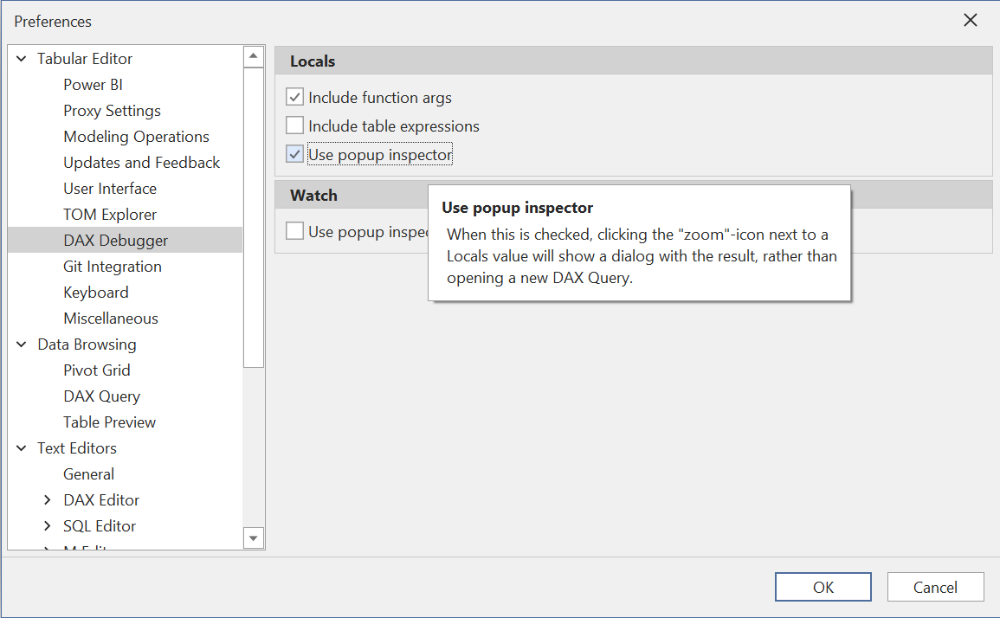

# DAX debugger

> [!NOTE]
> The DAX debugger was introduced in version 3.2.0. Information in this article is subject to change as we add more capabilities to the debugger.

<iframe width="560" height="315" src="https://www.youtube.com/embed/m4g9BxcUf4U" title="YouTube video player" frameborder="0" allow="accelerometer; autoplay; clipboard-write; encrypted-media; gyroscope; picture-in-picture" allowfullscreen></iframe>

It is no secret that DAX is a relatively complex language which is difficult to master. Most data model developers have probably experienced a situation, where the DAX code did not return the expected result. In this situation, it is helpful to break down the code, variable by variable and function call by function call, to better understand what is going on.

Until now, this "breakdown" of the code was a tedious and time consuming task, which often involved capturing DAX queries executed by client tools, in order to break them down and execute smaller pieces of the queries in [DAX Studio](https://daxstudio.org/) or [SQL Server Management Studio](https://docs.microsoft.com/en-us/sql/ssms/download-sql-server-management-studio-ssms?view=sql-server-ver15).

Tabular Editor 3 introduces the concept of the **DAX debugger**, which is a tool that makes the process of stepping into the DAX code of your model, much, much easier. At a conceptual level, the debugger is similar to traditional IDE debuggers, such as the one found in Visual Studio when developing C# applications.

## Prerequisites
The DAX debugger analyses the DAX code in your model and generates suitable DAX queries for evaluating sub expressions, row contexts, etc., allowing you to step through the code in an interactive fashion.

In order for this to work, Tabular Editor 3 must operate in **connected** or **workspace mode**, such as when loading model metadata directly from Power BI Desktop or any other instance of Analysis Services.

# Getting started

While Tabular Editor 3 is connected to an instance of Analysis Services, the debugger can be started in one of two different ways:

- Through a Pivot Grid
- Through a DAX query

Once the debugger is started, you are presented with a number of new views that provide contextual information about the code being debugged, as well as a DAX script view that highlights the portion of code currently debugged.

> [!TIP]
> Before starting a debugging session, consider formatting your DAX code to make the code easier to read.

# Debugging through a Pivot Grid

1. Create a new Pivot Grid (**File > New > Pivot Grid**)
2. Add the measure you wish to debug to the Pivot Grid. You can either:
  - Drag a measure from the TOM Explorer, or
  - Right-click on a measure in the TOM Explorer and choose **Add to pivot grid**, or
  - Select the measure from the Pivot Grid field list (**Pivot Grid > Show fields**)
3. (Optional) Add one or more columns to the Pivot Grid in the Filter area, Columns area or Row area.
4. Right-click on the value cell within the Pivot Grid and choose **Debug this value**.

# Debugging through a DAX Query

1. Create a new DAX query (**File > New > DAX Query**).
2. Type in or paste the DAX query. This should typically be a query made up of a `SUMMARIZECOLUMNS` call with one or more (explicit) measures, such as the one generated by visuals in Power BI.

> [!TIP]
> You can use the [Performance Analyzer](https://docs.microsoft.com/en-us/power-bi/create-reports/desktop-performance-analyzer) in Power BI Desktop to capture the query generated by visuals.

3. Hit F5 to execute the query within Tabular Editor 3. Locate the value you want to debug, right-click the cell and choose **Debug**.

# Debug views

The debugger provides the following views (if they are hidden, they can be accessed through the **Debug > Windows** menu).

- Locals
- Watch
- Evaluation Context
- Call Tree

## Locals
This view lists the columns, measures and variables within the current scope of execution and displays their values. It also displays the value of the current subexpression being debugged. Values in this list are updated automatically when stepping to a different subexpression, or when the evaluation context is changed. **Local values are always evaluated at the currently selected item of the call tree**.

You can inspect a locals value by clicking on the magnifying glass button within the **Value** column. This will bring up a popup dialog showing the value in more details. This is especially useful if the inspected value is a table.

If you prefer to inspect the locals value in a separate DAX query window, you can toggle off the **Use popup inspector** option under **Tools > Preferences > DAX Debugger > Locals**.

## Watch
This view allows you to enter any DAX expression, which will be calculated within the current evaluation context. You can enter scalar as well as table expressions and you can use all DAX functions available and refer to variables within the current evaluation scope. Watch values are automatically updated when stepping to a different subexpression, or when the evaluation context is changed. **Watch values are always evaluated at the scope of the currently selected item in the evaluation context stack**.

To quickly add a variable, measure or subexpression to the Watch view, simply highlight a portion of code and drag it into the Watch view. You can also place the cursor over the expression you want to add, then right-click and choose **Watch this expression**:

To add, duplicate or delete Watch expressions, use the right-click context menu of the Watch view:

The **Generate query** option is identical to the magnifying glass button within the **Value** column, highlighted in the screenshot below. By clicking this, the debugger will open a new DAX query document, that defines the context of the calculation as well as the calculation itself, allowing you to inspect the results in more details. This is particularly useful when the watch expression is a table expression, as shown below:

> [!TIP]
> What's the difference between the **Locals** view and the **Watch** view?
> - **Locals** shows the values of columns, measures, variables and other relevant sub-expressions, within the current scope of execution, including the value of the currently selected subexpression in the call tree.
> - **Watch** allows you to enter any DAX expression, which will be calculated within the current evaluation context.

## Evaluation Context
This view provides information about the DAX evaluation context of the current subexpression. For example, a `CALCULATE` expression might perform a context transition or add a filter to the evaluation context, or a `SUMX` iterator might add a row context.

You can double-click on an item in the Evaluation Context stack, to bring the focus to that item. This will cause all **Watch** expressions to be reevaluated in the new context (that is, all contexts from the bottom of the stack up to and including the currently focused item). This is illustrated in the animation below. Notice also how you can inspect the value of individual columns in the active row context by paging through rows within any active iterations:

You can also toggle individual filters from the outer filter context (for example, grouping columns on the [`SUMMARIZECOLUMNS`](https://dax.guide/summarizecolumns) call that generated the query or filters specified in a Pivot Grid). This is illustrated in the animation below. Filters toggled this way will apply to both Watch and Locals.

Lastly, you can browse the first 1000 rows of any iterator, setting the current row context to a specific row within those first 1000, by clicking on the Zoom button within the **Row** column.

## Call Tree
This view provides an outline of the entire calculation and lets you easily navigate between subexpressions by double-clicking (you can also use shortcut keys for navigation). The tree also provides information about context transitions, iterations and row contexts. Branches of code that will not be executed (for example in an `IF` or `SWITCH` call, or when an iterator is empty) are striked out.

As you navigate between items in the call tree, the debug DAX script will highlight the code corresponding to the call tree item, while also indicating (with a gray background) the path taken to reach the highlighted code, as shown below:

Notice how the values in the **Locals** view are updated as the tree is navigated. You can also navigate to a subexpression by placing the cursor over the expression, right-click and choose the **Step into selection** option (Ctrl+B).

## Keyboard shortcuts

Use the following keyboard shortcuts to quickly navigate the call tree:

- **Step in (F11)** - steps into the first child of the current item in the call tree. If there are no more children, jumps to the next sibling.
- **Step out (Shift-F11)** - steps out to the parent of the current item in the call tree.
- **Step over (F10)** - jumps to the next function parameter, the next subexpression of an arithmetic operation, or steps into the current function call (if it is a non-trivial function).
- **Step back (Shift-F10)** - jumps to the previous function parameter, the previous subexpression of an arithmetic operation, or steps out to the parent of the current item if there are no parameters or subexpressions before the current item.
- **Step into selection (Ctrl-B)** - jumps to the expression under the cursor. If multiple paths lead to the same expression (for example, when a measure is referenced by multiple measures and these measures), a dialog will prompt you to choose the path.
- **Next row (F9)** - shifts the row context of the innermost iteration to the next row of the iterator.
- **Previous row (Shift-F9)** - shifts the row context of the innermost iteration to the previous row of the iterator.

# Limitations and known issues

The DAX debugger currently has the following limitations:

- Only a subset of DAX table expressions are supported when debugging a DAX query (for example, queries that rely on [SUMMARIZECOLUMNS](https://dax.guide/summarizecolumns) can be debugged, while other table functions are currently not supported). Queries that have been generated by Power BI (which can be captured through the Power BI Desktop Performance Analyzer) are generally supported.
- Queries that contain implicit measures or query-scoped calculations are currently not supported.
- When browsing the first 1000 rows of an iterator that arises out of a filtered table expression, the selected row in the browse window may not always correspond to the current row context in the evaluation context stack (type `CALCULATETABLE('<table name>')` in the **Watch** window to inspect the current row context).
- The debugger currently only allows debugging DAX expressions on measures.
- [Visual calculations](https://learn.microsoft.com/en-us/power-bi/transform-model/desktop-visual-calculations-overview) cannot be debugged as they are defined using query-scoped columns. The debugger does not currently support query-scoped objects.
- If a measure is modified by a calculation item in the filter context, partial results shown in the Watch / Locals view of the debugger may be incorrect.

If you encounter an issue with the debugger, other than those listed above, please post it to our [issue tracker](https://github.com/TabularEditor/TabularEditor3/issues) on the TE3 Community Support GitHub site.

# Roadmap

We plan to add many additional features to the DAX debugger over time, to address the issues above, and to make the tool even more capable. As always, feedback is more than welcome. Please use the [Discussions area](https://github.com/TabularEditor/TabularEditor3/discussion) for feature requests and general discussions.

**Happy debugging!**
