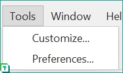

# Tabular Editor 3 のユーザーインターフェイスを知る

この記事では、Tabular Editor 3のユーザーインターフェイスについて説明します。

## ユーザーインターフェイスの基本要素

Tabular Editor 3をはじめて起動し、データモデルをロードすると、以下のスクリーンショットのようなインターフェイスが表示されます。

1. **Title bar**: 現在読み込まれているファイル名、Analysis ServicesデータベースまたはPower BIデータセットが接続されている場合は、その名前が表示されます。
2. **Menu bar**: メニューバーからTabular Editor 3のさまざまな機能にアクセスできます。すべてのメニュー項目の詳細な説明は[メニュー](#menus)を参照してください。
3. **Toolbars**: ツールバーからは、よく使う機能に素早くアクセスできます。ツールバーからアクセスできるすべての機能は、メニューからもアクセスできます。ツールバーとそのボタンは、以下の項目でカスタマイズできます。**Tools > Customize...**
4. **TOM Explorer view**: データモデルを表す[Tabular Object Model (TOM)](https://docs.microsoft.com/en-us/analysis-services/tom/introduction-to-the-tabular-object-model-tom-in-analysis-services-amo?view=asallproducts-allversions) メタデータの階層的な表示です。上部のトグルボタンで、表示するオブジェクトをフィルタリングできます。検索ボックスでは、名前でオブジェクトをフィルタリングできます。
5. **Expression Editor**: エクスプレッションエディターは、TOM Explorerで現在選択されているオブジェクトのDAX、SQL、M式を素早く編集する方法を提供します。エクスプレッションエディターを閉じても、TOM Explorerのオブジェクトをダブルクリックすることで再び表示させることができます。現在選択されているオブジェクトが複数のプロパティを持つ場合、上部のドロップダウンで異なる式プロパティを切り替えることができます（たとえば、KPIにはTarget式、Status式、Trend式があり、これらは同じKPIオブジェクトに属する3つの異なるDAX式です）。
6. **Properties view**: TOM Explorerで現在選択されているオブジェクト（複数可）で利用可能なすべてのTOMプロパティの詳細表示です。複数のオブジェクトが選択されている場合でも、ほとんどのプロパティはグリッドを通して編集することができる。いくつかのプロパティ（"Format String", "Connection String", "Role Members" など）は、プロパティ値セル内の省略記号ボタンをクリックすると、ポップアップダイアログやコレクションエディターを表示させることができるようになっています。
7. **Messages view**: Tabular Editor 3は、モデル上のDAX式にセマンティックエラーがないか継続的に分析します。そのようなエラーはすべてここに出力されます。さらに、このビューに表示されるメッセージは、C#スクリプトまたはAnalysis Servicesで報告されたエラーメッセージから発生する可能性があります。
8. **Status bar**: ステータスバーには、現在の選択項目やベストプラクティス・アナライザーの所見など、さまざまな文脈情報が表示されます。

さまざまな用途に対応する、追加のビューが多数用意されています。詳しくは、VIEWメニューのセクションを参照してください。

## ユーザーインターフェイスのカスタマイズ

すべてのUI要素は、必要に応じてサイズや配置を変更できます。メインビューから個々のビューをドラッグして、Tabular Editor 3のインスタンスを複数のモニターに分割することも可能です。Tabular Editor 3はアプリケーションを閉じたときにカスタマイズを保存し、次回起動時に自動的に再読み込みします。

### 別のレイアウトを選択する

アプリケーションをデフォルトのレイアウトにリセットするには、**ウィンドウ > デフォルトレイアウト** オプションを選択します。Tabular Editor 2.xのユーザーは、TOM Explorerを画面の左側に配置し、PropertiesビューをExpression Editorの下に配置する**Window > Classic layout**オプションを選択することをオススメします。

「ウィンドウ > 現在のレイアウトをキャプチャ...」オプションを使用すると、カスタマイズしたレイアウトを保存して、ウィンドウメニュー内の新しいレイアウトオプションとして利用できるようになり、異なるレイアウト間ですばやく切り替えられるようになります。Window > Manage layouts...**" オプションを使用すると、利用可能なすべてのレイアウトのリストが表示され、レイアウトの名称変更、保存、削除などを行うことができます。レイアウトをディスクに保存する場合、.xmlファイルが作成され、Tabular Editor 3の他のユーザーと共有できます。

### テーマとパレットの変更

Tabular Editor 3の外観は、異なるテーマやパレットを選択することにより変更できます。Tabular Editor 3には5種類のテーマ（「スキン」とも呼ばれる）が同梱されており、**Window > Themes** メニューから利用できます。

- ベーシックとベジェ（ベクターベース、高DPIディスプレイで効果的）
- ブルー、ダーク、ライト（ラスターベース、高ディップディスプレイには非推奨）

ベクターベースのテーマ（BasicとBezier）については、**Window > Palette** メニューでテーマに使用する色を変更します。

## メニュー

以下では、Tabular Editor 3のメニューについて詳しく説明します（WIP）。

以下では、カーソルがExpression Editorや以下のスクリーンショットの「DAX Script 1」タブなどのドキュメント内に置かれていることを意味する**アクティブドキュメント**という用語を使用します。アクティブなドキュメントの有無や種類によって、キーボードショートカットやメニュー項目の動作が異なります。

## ファイル

**ファイル**メニューには、主にモデルのメタデータやサポートファイル、ドキュメントの読み込みや保存を行うためのメニュー項目が含まれています。

- **New**: サブメニューを開き、空のデータモデルを新規作成したり（Ctrl+N）、新しいDAXクエリーやDAXスクリプト（テキストファイル）、データモデル図（JSONファイル）など、さまざまな [サポートファイル](supported-files.md#supporting-files)を作成できます。サポートファイル（C#スクリプトを除く）は、モデルがすでにTabular Editorにロードされている場合にのみ作成できます。

> [!IMPORTANT]
> Tabular Editor 3 Desktop Editionは、Poewr BI DesktopのExternal Toolとしてのみ使用できるため、**New > Model...**オプションは使用できません。[詳細](xref:editions)を参照してください。

- **Open**: さまざまなソースからデータモデルを読み込むためのオプションと、その他のタイプのファイルを読み込むためのオプションを含むサブメニューを開きます。サブメニューの項目は次のとおりです。

- **Model from file...** .bimや.pbitファイルなどのファイルからモデルのメタデータを開くことができます。
- **Model from DB...** デプロイ済みの表形式モデルからモデルメタデータをロードするために、Analysis ServicesまたはPower BI XMLA接続の詳細を指定するか、Analysis Servicesのローカルインスタンス（Visual StudioのIntegrated WorkspaceサーバーまたはPower BI Desktopなど）に接続します。
- **Model from folder...** Tabular Editorのいずれかのバージョンを使って保存したフォルダー構造からモデルのメタデータを開く - **File...** は、ファイル名の拡張子に基づいてTabular Editor 3がサポートするあらゆるタイプのファイルを開くことができるダイアログを表示します。詳しくは、[サポートされているファイルの種類](TabularEditorDocs\te3\features\ja-jp\ja-supported-files.md)を参照してください。

> [!IMPORTANT]
> Tabular Editor 3 Desktop Edition では、**Open > Model from file...** と **Open > Model from folder...** オプションは使用できず、**Open > File...** ダイアログでは [supporting files] (supported-files.md#supporting-files) のみ開き、メタデータを含むファイルでは開くことができません。

- **Revert**: このオプションでは、モデルのメタデータをソースから再ロードし、Tabular Editorで行われた変更のうち、まだ保存されていないものを破棄できます。このオプションは、Tabular Editor 3がPower BI DesktopのExternal Toolとして使用されており、Tabular Editor 3が接続されている間にPower BI Desktopで変更が行われた場合に便利です。逆戻り**を選択すると、Tabular Editor 3は再接続することなくPower BI Desktopからモデルのメタデータを再読み込みできます。
- **Close**: これにより、アクティブなドキュメント（DAXクエリ、C#スクリプト、データモデル図など）が閉じられます。ドキュメントに未保存の変更がある場合、Tabular Editorは閉じる前に変更を保存するよう促します。
- **Close model**: これは、現在ロードされているモデルのメタデータをTabular Editorからアンロードします。メタデータに変更を加えた場合、Tabular Editorは閉じる前に変更を保存するよう促します。
- **Save**: これは、アクティブなドキュメントをソースファイルに戻して保存します。ドキュメントがアクティブでない場合、モデル メタデータをソースに保存します。ソースは、Model.bimファイル、Database.json（フォルダー構造）、接続されているAnalysis Servicesのインスタンス（Power BI Desktopを含む）またはPower BI XMLAエンドポイントである可能性があります。
- **Save as...** アクティブなドキュメントを新規ファイルとして保存できます。アクティブなドキュメントがない場合、.bim（JSONベース）ファイルを使用してモデルのメタデータを新規ファイルとして保存できます。
- **Save to folder...** これにより、モデルのメタデータを[フォルダ構造](xref:save-to-folder)として保存できます。
- **Save all**: 未保存のドキュメントとモデルのメタデータを一括で保存します。
- **Recent files**: 最近使用したサポートファイルの一覧が表示され、すぐに再オープンできます。
- **Recent tabular models**: 最近使用したモデルメタデータのファイルまたはフォルダのリストを表示し、これらの中からモデルメタデータを素早く再読み込みすることができます。

> [!IMPORTANT]
> Tabular Editor 3 Desktop Editionでは、**Save to folder** と **Recent tabular models** オプションは無効になっています。また、**名前を付けて保存** オプションは、[サポートファイル](supported-files.md#supporting-files)に対してのみ有効です。

- **Exit**: Tabular Editor 3アプリケーションをシャットダウンします。アプリケーションをシャットダウンする前に、未保存のファイルやモデルのメタデータを保存するよう促されます。

## Edit

**Edit** メニューには、ドキュメントの編集や、現在読み込まれているモデルのメタデータを変更するためのWindows標準のアプリケーションメニュー項目が含まれています。

- **Undo**: このオプションは、モデルのメタデータに加えられた最後の変更を取り消します。アクティブなドキュメントがない場合、おなじみのCTRL+Zショートカットがこのオプションに対応します。
- **Redo**: このオプションは、モデルメタデータに対する最後のアンドゥを取り消します。アクティブなドキュメントがない場合、おなじみのCTRL+Yショートカットがこのオプションに対応します。
- **Undo typing**: 現在アクティブな文書で最後に行ったテキストの変更を取り消します。アクティブな文書がない場合、このオプションは使用できません。
- **Redo typing**: 現在アクティブなドキュメント内で最後に取り消した操作を元に戻す。アクティブな文書がない場合、このオプションは使用できません。
- **Find**: 検索と置換」ダイアログを「検索」タブが選択された状態で表示します。[詳細情報](xref:find-replace#find)を表示します。
- **Replace**: 検索と置換」ダイアログを「置換」タブが選択された状態で表示します。[詳細情報](xref:find-replace#replace)を表示します。
- **Cut / Copy / Paste**: これらは、Windowsでおなじみの編集操作です。アクティブなドキュメントがある場合、これらはそのドキュメント内のテキスト選択に適用されます。それ以外の場合、これらのオプションはTOM Explorerのオブジェクトを操作するために使用されることがあります。たとえば、SHIFTキーまたはCTRLキーを押しながらTOM Explorerで小節を選択し、CTRL+CとCTRL+Vを同時に押すと、複数のメジャーを複製できます。
- **Delete**: アクティブな文書で選択されているテキストを削除し、アクティブな文書がない場合は、TOM Explorer で現在選択されているオブジェクトを削除します。

> [!NOTE]
> Tabular Editorは通常、複数のオブジェクトが選択されている場合、または削除されるオブジェクトに依存関係がある場合にのみ、オブジェクト削除のプロンプトを表示します。オブジェクトの削除は、**Undo** オプション (CTRL+Z) を使用することで取り消すことができます。

- **Select all**: 現在アクティブなドキュメント内のすべてのテキスト、またはTOM Exporer内の同じ親に属するすべてのオブジェクトを選択します。
- **Code assist**: このオプションは、DAXコードの編集時に利用可能です。DAXコードの編集に関連するさまざまなコードアシスト機能へのショートカットを提供します。詳細については、[DAXエディタ](dax-editor.md#code-assist-features)を参照してください。

## View

ビュー**メニューは、Tabular Editor 3 UIの異なるビュー間を移動できます。ビューが非表示になっている場合、このメニューでビューのタイトルをクリックすると、ビューの非表示が解除され、フォーカスされるようになります。ビューメニューにはドキュメントが表示されないことに注意してください。ドキュメント間を移動するには、[ウィンドウメニュー](#window)を使用します。

- **TOM Explorer**: TOM Explorer は、現在ロードされているモデルのメタデータの [Tabular Object Model (TOM)](https://docs.microsoft.com/en-us/analysis-services/tom/introduction-to-the-tabular-object-model-tom-in-analysis-services-amo?view=asallproducts-allversions) 全体の階層的なビューを提示します。詳しくは @tom-explorer-viewを参照してください。
- **Best Practice Analyzer**: Best Practice Analyzerは、ベストプラクティス検証のルールを指定することで、モデルの品質を向上させることができます。詳しくは @bpa-view をご覧ください。
- **Messages**: メッセージビューは、Tabular Editor 3 Semantic Analyzer などの様々なソースからのエラー、警告、情報メッセージを表示します。詳細は @messages-view を参照してください。
- **Data Refresh**: データリフレッシュ］ビューを使用すると、バックグラウンドで実行されているデータリフレッシュ処理を追跡できます。詳しくは、@data-refresh-viewを参照してください。
- **Macros**: Macrosビューでは、作成したマクロを管理できます。マクロは、@csharp-scriptsから作成できます。詳しくは、@creating-macrosを参照してください。
- **VertiPaq Analyzer**: VertiPaq Analyzerビューでは、モデル内のデータに関する詳細な統計情報を収集、インポート、およびエクスポートして、DAXパフォーマンスの向上とデバッグに役立てることができます。VertiPaq AnalyzerはMITライセンスの下、[SQLBI](https://sqlbi.com) の [Marco Russo](https://twitter.com/marcorus) によって作成および保守されています。詳細については、[GitHub プロジェクトページ](https://github.com/sql-bi/VertiPaq-Analyzer) を参照してください。
- **Expression Editor**: TOM Explorerで現在選択されているオブジェクトのDAX、M、SQL式を編集するための「クイックエディター」です。詳細は @dax-editorを参照してください。

## Model

**モデル**メニューには、モデルオブジェクト（TOM Explorerのルートオブジェクト）のレベルで実行可能なアクションが表示されます。

- **Deploy...**: Tabular Editor Deploymentウィザードを起動します。詳しくは、@deploymentを参照してください。

> [!IMPORTANT]
> Tabular Editor 3 Desktop Editionでは、**Deploy**オプションは使用できません。詳しくは@editionsをご覧ください。

- **Import tables...** Tabular Editor 3インポートテーブルウィザードを起動します。詳しくは、@importing-tablesを参照してください。
- **Update table schema...** 現在選択されているテーブルまたはパーティションについて、現在インポートされているカラムと比較して、データソースにおけるスキーマの変更を検出する。詳細は @importing-tables#updating-table-schemaを参照してください。
- **Script DAX**: 現在選択されているオブジェクト（または、何も選択されていない場合は、モデル内のすべてのDAXオブジェクト）のDAXスクリプトを生成します。詳細については、@dax-scriptsを参照してください。
- **Refresh model**: Tabular EditorがAnalysis Servicesのインスタンスに接続されている場合、このサブメニューにはモデルレベルでバックグラウンド更新操作を開始するためのオプションが含まれています。このサブメニューには以下のオプションがあります。詳細は、[Refresh command (TMSL)](https://docs.microsoft.com/en-us/analysis-services/tmsl/refresh-command-tmsl?view=asallproducts-allversions#request)を参照してください。
  - **Automatic (model)**: Analysis Servicesは、リフレッシュするオブジェクトを決定します（「準備完了」状態でないオブジェクトのみ）。
  - **Full refresh (model)**: Analysis Servicesは、モデルのフルリフレッシュを実行します。
  - **Calculate (model)**: Analysis Servicesは、すべての計算テーブル、計算カラム、計算グループ、およびリレーションシップの再計算を実行します。データソースからのデータの読み込みは行われません。
- **Create [object type]**: モデル**」メニューの残りのショートカットでは、新しいタイプのモデル子オブジェクト（テーブル、データソース、パースペクティブなど）を作成できます。

## Tools

**ツール**メニューには、Tabular Editor 3のプリファレンスやカスタマイズを制御するためのオプションが含まれています。

- **Customize...** Tabular Editor3のユーザーインターフェイスレイアウトのカスタマイズダイアログを起動し、ツールバーの新規作成、メニューやツールバーボタンの再配置や編集などを行うことができます。
- **Preferences...** Tabular Editor 3 Preferencesダイアログを起動します。これはTabular Editorとその機能（アップデートチェック、プロキシ設定、クエリー行数制限、リクエストタイムアウトなど）の他のすべての側面を管理するための中心的なハブです。詳細は @preferencesを参照してください。

## Window

**ウィンドウ**メニューには、アプリケーションのさまざまなビューやドキュメント（総称して*ウィンドウ*）を管理および移動するためのショートカットが用意されています。また、テーマとカラーパレットを制御するための[メニュー項目もあります](#changing-themes-and-palettes)。

- **New...** このサブメニューは、新しい [サポートファイル](supported-files.md#supporting-files) を作成するためのショートカットを提供するものです。ここでのオプションは、**ファイル > 新規作成**と同じです。
- **Float** 現在のビューまたはドキュメントをフローティングウィンドウにする。
- **Pin tab** は、タブをピン留めします。タブをピン留めすると、文書タブの一番左側に表示され、右クリックでピン留めしていないタブだけを閉じるショートカットが利用できます。
  
  

- **New Horizontal/Vertical Tab Group（新しい横型/縦型タブグループ）**: このオプションは、メイン文書領域を複数のセクション（タブグループ）に分割し、複数の文書を同時に横並びまたは上下に並べて表示するためのものです。
- **Close All Documents**: Closes all document tabs. You are prompted to save unsaved changes, if any.
- **Reset Window Layout**: Resets all customization applied to the main document area.
- **1..N [document]**: The first 10 open documents are listed here, allowing you to navigate between them. You can also use the CTLR+Tab shortcut to quickly switch between open documents and views, such as shown in the screenshot below:

  

- **Windows...**: Opens a dialog listing ALL open documents, allowing you to switch between them or close them individually.

  

- **Capture current layout** / **Manage layouts...** / **Default layout** / **Classic layout**: These menu items were discussed [earlier in this article](#choosing-a-different-layout).
- **Theme** / **Default palette**: These menu items were discussed [earlier in this article](#changing-themes-and-palettes).

## Help

The **Help** menu provides shortcuts for online resources and more.

- **Getting Started**: This menu item links to [this article](xref:getting-started).
- **Tabular Editor 3 Docs**: This menu item links to [docs.tabulareditor.com](https://docs.tabulareditor.com/te3).
- **Community Support**: This menu item links to our [public community support site](https://github.com/TabularEditor/TabularEditor3).
- **Dedicated Support**: This menu item lets you send an e-mail directly to our dedicated support hotline.

> [!NOTE]
> Dedicated support is reserved for Tabular Editor 3 Enterprise Edition customers. All other customers should reach out on the [public community support site](https://github.com/TabularEditor/TabularEditor3) for any technical issues, questions or other product-specific questions.

- **About Tabular Editor**: Launches a dialog that shows detailed information about the version of Tabular Editor being used as well installation and licensing details. The dialog also lets you change your license key.
 
## Dynamic menus (context dependent)

In addition to the menus mentioned above, other menus may appear at certain times, depending on which UI element currently has focus and which object is currently selected in the TOM Explorer. For example, if you select a Table-object, a **Table** menu will appear, holding the same context-specific shortcut items as when you right-click on that object in the TOM Explorer.

If you switch the input focus between different types of documents (i.e. DAX queries, Pivot Grids, diagrams, etc.), you should also see a menu representing the type of document currently in focus. That menu will hold items relevant for the current document. For example, when a diagram currently has focus, there will be a **Diagram** menu which has an item for adding tables to the diagram, among others.

You can change the behavior of these dynamic menus under **Tools > Preferences > User interface**.

# Next steps

- [Using the TOM Explorer in Tabular Editor 3](xref:tom-explorer-view)
- @supported-files
- @preferences
