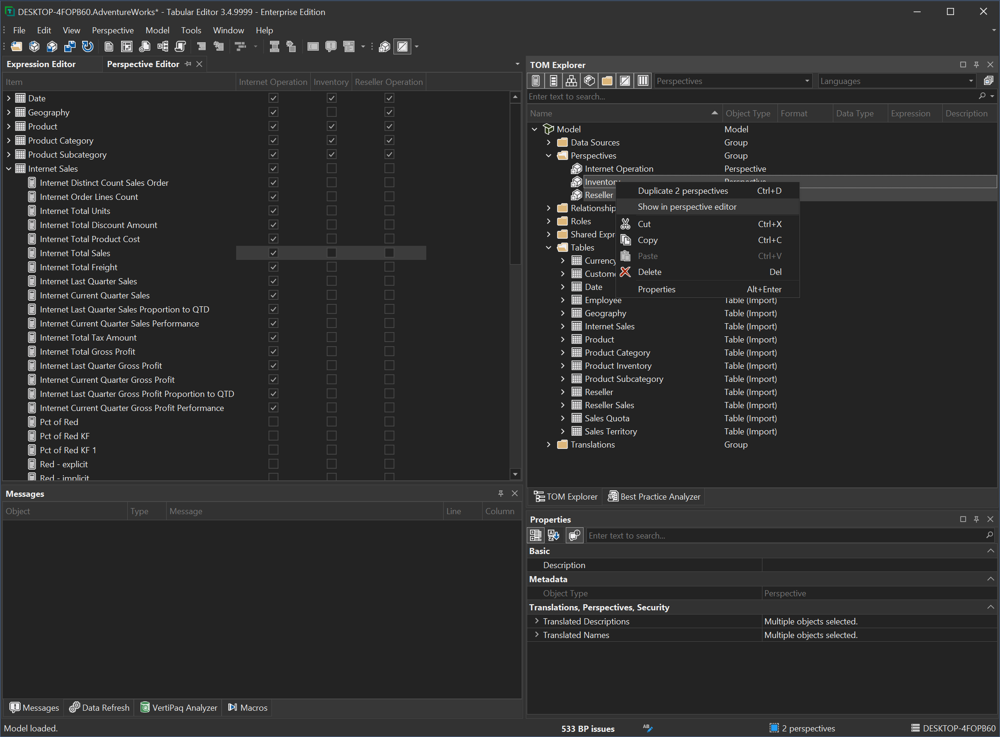

---
uid: perspective-editor
title: Perspective Editor
author: Šarūnas Jučius
updated: 2022-03-16
applies_to:
  editions:
    - edition: Desktop
    - edition: Business
    - edition: Enterprise
---
# Perspective Editor

> [!NOTE]
> In order to add perspectives to models running on SSAS or Azure AS, you will need a Tabular Editor 3 Enterprise Edition license.

The **Perspective Editor** provides a quick overview of the perspective assignment of objects in the model (tables, columns, hierarchies and measures). You can launch the Perspective Editor through the **View** menu. Alternatively, if you only need to edit certain perspectives, select them in the **TOM Explorer** (hold down CTRL or SHIFT to multi-select), then right-click and choose **Show in Perspective Editor**.

Use the checkboxes in the perspective editor to quickly add/remove multiple objects from a perspective. You can use Undo (Ctrl+Z) and Redo (Ctrl+Y) the usual way. Note that the changes made through the perspective editor are immediately applied to the TOM, although you will still have to save (Ctrl+S) or deploy your model for the changes to apply in Analysis Services / Power BI.

## Perspective Editor toolbar

While the Perspective Editor is active, the accompanying toolbar provides the following options:

-  **New perspective**: This button adds a new perspective to the model. The perspective will be displayed in the Perspective Editor.
-  **Show/Hide hidden options**: Enable this option if you want to see all objects in the Perspective Editor, including hidden objects.
-  **Show/Hide display folders**: Enable this toggle button if you want the Perspective Editor to group table objects (measures, hierarchies, columns) by Display Folders.

## Working with many perspectives

If you're working on a model with many perspectives, it may be impractical to display all of them at once. You can rearrange the display order of perspectives in the Perspective Editor, by dragging the column headers around, making it easier to compare perspectives side-by-side. Moreover, you can add/remove perspectives from the editor at any time, through the right-click context menu:

