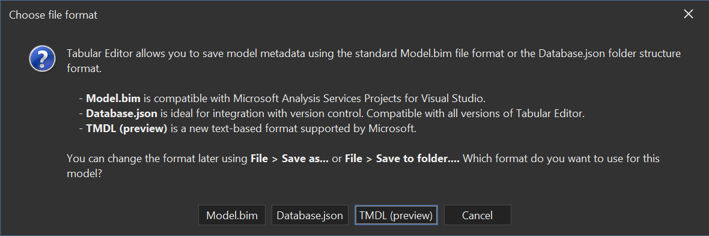

---
uid: tmdl
title: Tabular Model Definition Language (TMDL)
author: Daniel Otykier
updated: 2023-05-22
applies_to:
  editions:
    - edition: Desktop
      none: x
    - edition: Business
    - edition: Enterprise
---
# Tabular Model Definition Language (TMDL)

**TMDL** is a model metadata file format [announced by Microsoft in April 2023](https://powerbi.microsoft.com/en-ie/blog/announcing-public-preview-of-the-tabular-model-definition-language-tmdl/). It aims to provide a human-readable, text-based alternative to the JSON-based model.bim file format. TMDL is inspired by YAML, and as such, is easy to read and write, with minimal use of string quotes and escape characters. It also serializes a model as several smaller files in a folder structure, and is therefore also better suited for version control integration.

> [!IMPORTANT]
> As of February 2024, TMDL is still a preview feature. It is currently only supported by community tools such as Tabular Editor and [pbi-tools](https://pbi.tools/). However, the format is fully documented and available through [Microsoft-provided nuget packages](https://www.nuget.org/packages/Microsoft.AnalysisServices.Tabular.Tmdl.retail.amd64/19.64.0-TmdlPreview).

> [!TIP]
> Since TMDL is a preview feature, breaking changes could be introduced between new releases of Tabular Editor. If you face any issues deserializing a model after upgrading Tabular Editor, rollback to the latest version of Tabular Editor, then temporarily save the model as a regular .bim file, before serializing it to TMDL again using the latest version of Tabular Editor.

## Enabling TMDL (Preview) in Tabular Editor 3

TMDL is only available as a preview feature in Tabular Editor 3. To enable TMDL (Preview) in Tabular Editor 3, go to **Tools > Preferences > File Formats > Save-to-folder**, and select "TMDL (preview)" in the **Serialization mode** dropdown. The legacy "save-to-folder" functionally will continue to exists side by side with TMDL, but is not a Microsoft supported format.

After doing so, Tabular Editor 3 will use the TMDL format when saving a model as a folder (**File > Save to folder...**).

> [!NOTE]
> When you load a model from a legacy Tabular Editor folder structure, it will still get saved into that same format when using **File > Save** (Ctrl+S). Only when you explicitly use the **File > Save to folder...** command, will the model be saved in the new TMDL format.

## New models

When saving a new model for the first time, Tabular Editor (since v. 3.7.0), will now provide an option for saving the model as TMDL, even when the default serialization mode is not set to TMDL, as described in the previous section.

# Next steps

- [TMDL overview (Microsoft Learn)](https://learn.microsoft.com/en-us/analysis-services/tmdl/tmdl-overview?view=asallproducts-allversions).
- [Get started with TMDL (Microsoft Learn)](https://learn.microsoft.com/en-us/analysis-services/tmdl/tmdl-how-to?view=asallproducts-allversions)
