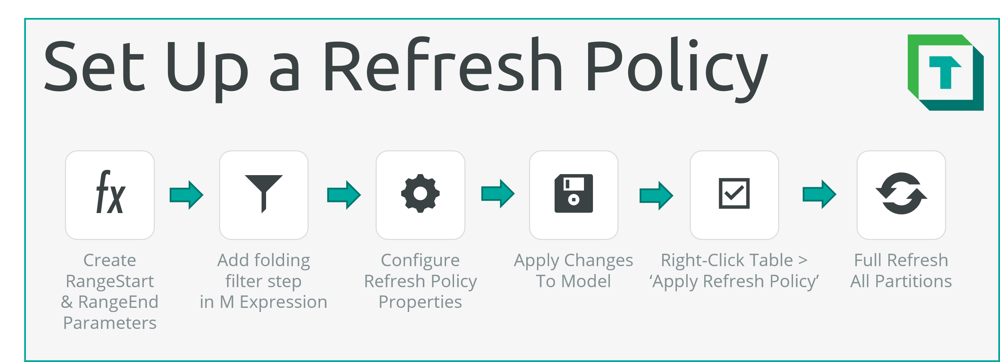
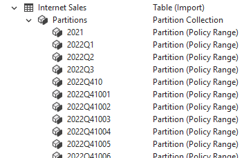
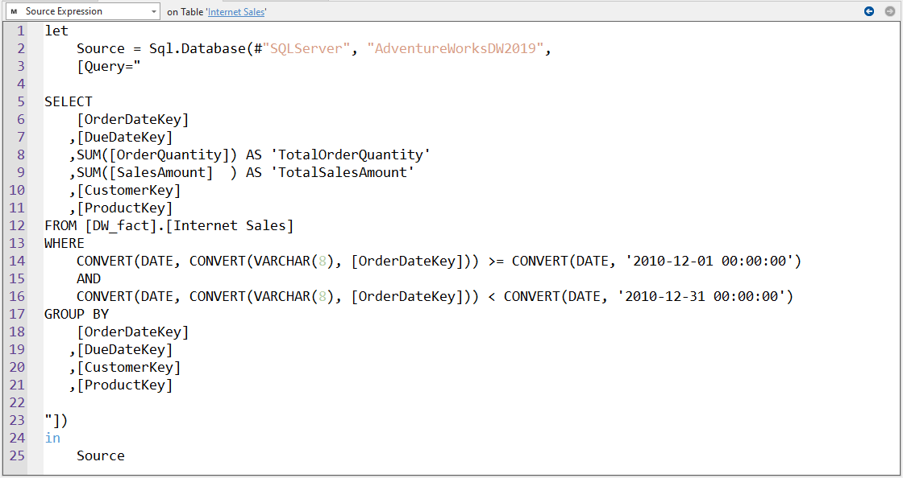

# Setting up Incremental Refresh



To set up Incremental Refresh, you must configure a new Refresh Policy for the table. This is easily done by configuring the Refresh Policy properties once _EnableRefreshPolicy_ is set to `True`:

> [!IMPORTANT]
> Setting up Incremental Refresh with Tabular Editor 3 is limited to dataset hosted in the Power BI Datasets service. For Analysis Services custom [partitioning](https://learn.microsoft.com/en-us/analysis-services/tabular-models/partitions-ssas-tabular?view=asallproducts-allversions) is required.

### Configure a New Refresh Policy

1. __Connect to the model:__ Connect to the Power BI XMLA endpoint of your workspace, and open the dataset upon which you want to configure Incremental Refresh.
2. __Create the `RangeStart` and `RangeEnd` Parameters:__ Incremental refresh requires the `RangeStart` and `RangeEnd` parameters to be created ([more information](https://docs.microsoft.com/en-us/power-bi/connect-data/incremental-refresh-configure#create-parameters)). Add two new Shared Expressions in Tabular Editor:

   

3. __Configure the `RangeStart` and `RangeEnd` Parameters:__ Name them `RangeStart` and `RangeEnd` respectively, set their `Kind` property to "M" and set their expression to the following (the actual date/time value you specify doesn't matter, as it will be set by Power BI Service when starting the data refresh):

   ```M
   #datetime(2021, 6, 9, 0, 0, 0) 
       meta 
       [
           IsParameterQuery=true, 
           Type="DateTime", 
           IsParameterQueryRequired=true
       ]
   ```

   
  
4. __Copy Partition M Code__: Navigate to the table for which you want to configure incremental refresh. Fold it out and select your partition containing your Power Query M Expression. Copy your code to Notepad, you will need it in step 6.

5. __Enable the Table Refresh Policy:__ In the _'Properties'_ window, set the `EnableRefreshPolicy` property on the table to `True`:

   

6. __Configure the Table Refresh:__ Next, select the table for which you want to configure incremental refresh. In the **Expression Editor** window, Select __'Source Expression'__ from the dropdown, insert your Power Query M Expression from step 4 and alter the Power Query M Expression such that there is a filter step on the date column for which you will enable incremental refresh. 

   _An example of one such valid filter step is below:_
  
   ```M
   // The filter step must be able to fold back to the data source
   // No steps before this should break query folding
   #"Incremental Refresh Filter Step" = 
       Table.SelectRows(
           Navigation,
           each 
               [OrderDate] >= #"RangeStart" and 
               [OrderDate] < #"RangeEnd"
       )
   ```

   Columns that are of date, string or integer types can still be filtered while maintaining query folding using functions that convert `RangeStart` or `RangeEnd` to the appropriate data type. For more information about this, see [here](https://learn.microsoft.com/en-us/power-bi/connect-data/incremental-refresh-overview#supported-data-sources)

7. __Configure Refresh Policy:__ Configure the remaining properties according to the incremental refresh policy you need. Remember to specify an M expression for the `SourceExpression` property (this is the expression that will be added to partititions created by the incremental refresh policy, which should use the `RangeStart` and `RangeEnd` parameters to filter the data in the source). The = operator should only be applied to either RangeStart or RangeEnd, but not both, as data may be duplicated.

   - __Source Expression:__ The M Expression that be added to partitions created by the Refresh Policy.
   - __IncrementalWindowGranularity:__ The granularity of the incremental (refresh) window.
   - __IncrementalWindowPeriods:__ # periods (of granularity specified above) wherein data should be refreshed.
   - __IncrementalWindowPeriodsOffset:__ Set to `-1` to set _'Only Refresh Complete Periods'_
   - __RollingWindowGranularity:__ The granularity of the rolling (archive) window.
   - __RollingWindowPeriods:__ # periods (of granularity specified above) wherein data should be archived.
   - __Mode:__ Whether it is standard `Import` Refresh Policy or `Hybrid`, where the last partition is DirectQuery.
   - __PollingExpression:__ A valid M Expression configured to detect data changes. For more information about _Polling Expression_ or other Refresh Policy properties, see [here](xref:incremental-refresh-about#overview-of-all-properties).
  
8. __Apply Model Changes:__ Save your model (Ctrl+S).
9. __Apply Refresh Policy:__ Right-click on the table and choose "Apply Refresh Policy".
  
   

   __That's it!__ At this point, you should see that the Power BI service has automatically generated the partitions on your table, based on the policy you specified. All that's left is to refresh all the partitions.

   

10. __Refresh all partitions:__ Shift-click to select all partitions. Right-click and select _Refresh > Full refresh (partition)_. You can right-click the table and select _'Preview data'_ to see the result.

   

Finally, you can configure the scheduled refresh in Power BI Service. Power BI will automatically handle the partitioning of your table. You can always connect to the remote model to view and validate the partitions, i.e. using the VertiPaq Analyzer. When continuing to develop this model, ensure you are careful when using _Workspace Mode_ that you don't accidentally overwrite partitions created by the Power BI Service, as described in [this article.](xref:incremental-refresh-about#overview-of-all-properties) To avoid this situation, it's recommended that you develop from the model metadata, deploying changes without partitions managed by incremental refresh policies. 

-------------

### Incremental Refresh with Integer Date Keys

If your date column is Integer data type, use the below in the place of the filter Step 4, above:

1. __Create the custom function:__ Create a Shared Expression named `ConvertDatetimeToInt`:

   ```M
   // A custom M function which will return a DateTime value as a YYYYMMDD integer
   (DateValue as datetime) => 
        Date.Year(DateValue) * 10000 + Date.Month(DateValue) * 100 + Date.Day(DateValue)
   ```

2. __Create the filter step:__ Use the custom function to convert `RangeStart` and `RangeEnd` in-line to Integer. The filter step is otherwise identical to if the Date column would be a DateTime column:

   ```M
   // The filter step must be able to fold back to the data source
   // No steps before this should break query folding
   #"IncrementalRefresh" = 
     Table.SelectRows(
       #"dbo_Sales",
         each [OrderDateKey] >= ConvertDatetimeToInt(#"RangeStart") 
         and [OrderDateKey] < ConvertDatetimeToInt(#"RangeEnd")
     )
   ```

3. __Proceed as normal with the next steps:__ You can then proceed with configuring and applying the refresh policy with _'Apply refresh policy'_ and finally refreshing all partitions. Preview the data of the table after the refresh operations complete to see the result.

-------------

### Incremental Refresh with String Date Keys

If your date column is of String data type, you should configure your filter step to parse the Date column without breaking query folding. This will vary depending on your source and how the date is formatted. Below is a hypothetical example for an Order Date formatted 'YYYY-MM-DD':

   ```M
   // The filter step must be able to fold back to the data source
   // No steps before this should break query folding
   #"IncrementalRefresh" = 
     Table.SelectRows(
       #"dbo_Sales",
       each 
        
       // Converts "2022-01-09" to DateTime, for example
       DateTime.From(
         Date.FromText(
           [OrderDate], 
           [Format="yyyy-MM-dd"]
         )
       ) >= #"RangeStart"

       and 
      
       DateTime.From(
         Date.FromText(
           [OrderDate], 
           [Format="yyyy-MM-dd"]
         )
       ) < IntToDateTime(#"RangeEnd")      
     )
   ```

See also the documentation for the `Date.FromText` function in Power Query [here](https://learn.microsoft.com/en-us/powerquery-m/date-fromtext). Should it not be possible to convert the Date column in-line while preserving query folding, it is also possible to configure incremental refresh with a native query, as described in the section, below.

-------------

### Incremental Refresh with Native Queries

If you have configured a native query, it may still be possible to configure and use incremental refresh, depending on your data source. To try this for yourself, you need to follow the following steps in the place of Step 4, above:

1. __Author and Save the Native Query:__ Write your native query in SQL Server Management Studio or Azure Data Studio. Include a placeholder `WHERE` clause which filters >= a DateTime parameter, and < another DateTime parameter.

   

2. __Replace the Native Query String in the Source Expression:__ Copy the query and replace the existing query, which will be full of characters like (lf) (line feed), (cr) (carraige return) and (n) (new line). Doing this makes the query actually readable and editable without resorting to the Native Query user interface of Power BI Desktop.

   

   Replace the above text in the `Query` parameter to the below, for example:

   

3. __Add `RangeStart` and `RangeEnd`:__ Concatenate "RangeStart" and "RangeEnd" inside of the `WHERE` clause, replacing the placeholder fields and converting the parameters to date with `Date.From` and to string data types using `Date.ToText` with the `Format` option set to `"yyyy-MM-dd`. Don't forget to include single quotes `'` on either side of the concatenation. Below is an example of what the final query would look like:

   ```M
   // Example of a full native query that folds and works with Incremental Refresh
   let
       Source = Sql.Database("yoursql.database.windows.net", "YourDatabaseName", 
       [Query="
   
   SELECT
       [OrderDateKey]
      ,[DueDateKey]
      ,SUM([OrderQuantity]) AS 'TotalOrderQuantity'
      ,SUM([SalesAmount]  ) AS 'TotalSalesAmount'
      ,[CustomerKey]
      ,[ProductKey]
   FROM [DW_fact].[Internet Sales]
   WHERE
       CONVERT(DATE, CONVERT(VARCHAR(8), [OrderDateKey])) 
       >= CONVERT(DATE, '" & Date.ToText(Date.From(#"RangeStart"), [Format="yyyy-MM-dd"]) & "')
       AND
       CONVERT(DATE, CONVERT(VARCHAR(8), [OrderDateKey])) 
       < CONVERT(DATE, '" & Date.ToText(Date.From(#"RangeEnd"), [Format="yyyy-MM-dd"]) & "')
   GROUP BY
       [OrderDateKey]
      ,[DueDateKey]
      ,[CustomerKey]
      ,[ProductKey]
   
   "])
   in
       Source
   ```

4. __Validate the new M Expression:__ You can attempt to save the changes to the table M Expression prior to enabling the refresh policy, to see if you get the expected results when setting the `RangeStart` and `RangeEnd` to specific values. If so, you can proceed as normal; Power BI will be able to handle the partitioning as expected if you configured the steps in Power Query.

   It may not be necessary, but depending on the transformations in the native query, you may also try adding the parameter `[EnableFolding = True]` as described in [this article by Chris Webb](https://blog.crossjoin.co.uk/2021/02/21/query-folding-on-sql-queries-in-power-query-using-value-nativequery-and-enablefoldingtrue/).

5. __Proceed as normal with the next steps:__ You can then proceed with configuring and applying the refresh policy with _'Apply refresh policy'_ and finally refreshing all partitions. Preview the data of the table after the refresh operations complete to see the result.
