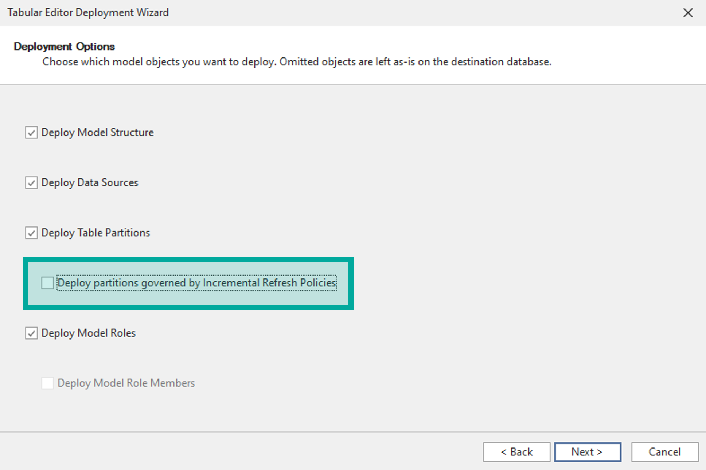

# Avoid Workspace Mode with Incremental Refresh

    
  
  
  
    

Incremental Refresh creates new partitions upon the first scheduled refresh in a day. As a result, any local metadata (i.e. `.bim` or `database.json`) will be out-of-sync with the remote model metadata after the refresh. As a result, __when working with a model that has tables configured with Incremental Refresh, _Workspace Mode_ is not recommended__. 

### Workspace Mode is not Recommended
The reason is because _Workspace Mode_ will overwrite the remote model metadata with local metadata files; any out-of-sync changes (like to Policy Range partitions) will be lost. When working with _Workspace Mode_ on these models, you would need to _Apply refresh policy_ for tables using incremental refresh before saving changes every day.

    

  

    

### Recommendation: Develop & Deploy from Local Metadata
__Instead, it is recommended to develop the model from the local metadata files.__ Changes can be deployed excluding partitions governed by a Refresh Policy, so there is no risk of overwriting the policies created by Power BI. A second read/refresh instance of Tabular Editor can be connected to the remote model for testing purposes.

To deploy the model, go _Model > Deploy..._ which opens the Deployment Wizard. Here you can select whether you want to include partitions governed by Incremental Refresh policies:

    

  

    