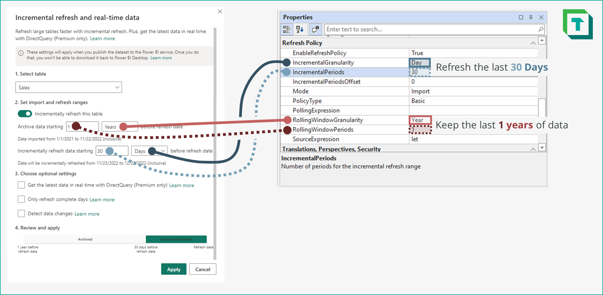

# What is a Refresh Policy?


---

Datasets hosted in the Power BI service can have [Incremental Refresh](https://learn.microsoft.com/en-us/power-bi/connect-data/incremental-refresh-overview) configured for one or more data tables. __The purpose of Incremental Refresh is to achieve faster, more efficient refreshes by only retrieving recent/changing data, _incrementally refreshing_ the table.__ To do this, the table is automatically divided into partitions, such that only recent or changing data is <span style="color:#01a99d">refreshed ("hot" partitions)</span> or even <span style="color:#8d7bae">retrieved in real-time (["Direct Query" partitions in "Hybrid Tables"](https://learn.microsoft.com/en-us/power-bi/connect-data/service-dataset-modes-understand#hybrid-tables))</span> while <span style="color:#939799">older, static data is archived ("cold" partitions).</span>

_Incremental refresh can be easily configured and modified from within Tabular Editor._

> [!NOTE]
> Configuring incremental refresh can be beneficial for your data model:  
> - Reduce refresh time & resource consumption
> - Experience shorter and more dependable scheduled refreshes

> [!IMPORTANT]
> Setting up Incremental Refresh with Tabular Editor 3 is limited to dataset hosted in the Power BI Datasets service. For Analysis Services custom [partitioning](https://learn.microsoft.com/en-us/analysis-services/tabular-models/partitions-ssas-tabular?view=asallproducts-allversions) is required.

---

### How does it work?

To create the partitions, Power BI uses the `RangeStart` and `RangeEnd` _datetime_ parameters in Power Query. These parameters are used in a filter step of the table partition M Expression, filtering a table datetime column. Columns that are of date, string or integer types can still be filtered while maintaining query folding using functions that convert `RangeStart`, `RangeEnd` or the date column to the appropriate data type. For more information about this, see [here](https://learn.microsoft.com/en-us/power-bi/connect-data/incremental-refresh-overview#supported-data-sources)

An example is given below. Incremental Refresh is applied to a table _'Orders'_ upon the _[Order Date]_ column:


# [Filter Step Only](#tab/filterstep)
```M
// The filter step should ideally be able to fold back to the data source
// No steps before this should break query folding
#"Incremental Refresh Filter Step" = 
    Table.SelectRows(
        Navigation,
        each 
            [OrderDate] >= #"RangeStart" and 
            [OrderDate] < #"RangeEnd"
    )
```

# [Full M Expression](#tab/fullexp)
```M
let
    // The data source should ideally support Query Folding
    Source = Sql.Database(#"ServerParameter", #"DatabaseParameter"),

    Navigation = 
        Source{ 
            [ Schema="DW_fact", Item="Internet Sales" ] 
        } [Data],

    // The filter step should ideally be able to fold back to the data source
    // No steps before this should break query folding
    #"Incremental Refresh Filter Step" = 
        Table.SelectRows(
            Navigation,
            each 
                [OrderDate] >= #"RangeStart" and 
                [OrderDate] < #"RangeEnd"
        )
in
    #"Incremental Refresh Filter Step"
```

# [RangeStart](#tab/rangestart)
```M
// It does not matter what the initial value is for the RangeStart parameter
// The parameter must be of data type "datetime"
#datetime(2022, 12, 01, 0, 0, 0) 
    meta 
        [
            IsParameterQuery = true, 
            IsParameterQueryRequired = true, 
            Type = type datetime
        ]
```

# [RangeEnd](#tab/rangend)
```M
// It does not matter what the initial value is for the RangeEnd parameter
// The parameter must be of data type "datetime"
#datetime(2022, 12, 31, 0, 0, 0) 
    meta 
        [
            IsParameterQuery = true, 
            IsParameterQueryRequired = true, 
            Type = type datetime
        ]
```
***

> [!WARNING]
> Incremental refresh is designed for data sources that support [Power Query query folding](https://learn.microsoft.com/en-us/power-bi/connect-data/incremental-refresh-overview#:~:text=Incremental%20refresh%20is%20designed%20for%20data%20sources%20that%20support%20query%20folding). Ideally, [query folding shouldn't be broken](https://learn.microsoft.com/en-us/power-query/step-folding-indicators) before the filter step is applied.
> There's no explicit requirement for the final query to fold, except when implementing [Hybrid Tables](https://learn.microsoft.com/en-us/power-bi/connect-data/incremental-refresh-overview#:~:text=However%2C%20if%20the%20incremental%20refresh%20policy%20includes%20getting%20real%2Dtime%20data%20with%20DirectQuery%2C%20non%2Dfolding%20transformations%20can%27t%20be%20used.).


---

### What is a Refresh Policy?

A _Refresh Policy_ determines how the data is partitioned, and which of these Policy Range Partitions will be updated upon refresh. It consists of a set of table TOM properties which can be setup or changed.

> [!WARNING]
> __Power BI Desktop limitations:__ Configuring incremental refresh when connected to a local Power BI Desktop model is not supported. To configure incremental refresh for a local Power BI Desktop model, use the Power BI Desktop user interface.

---

### Refresh Policy properties


Four different kinds of properties make up a basic Refresh Policy:
1. <span style="color:#455C86">__Incremental window__</span> __properties__: The period window wherein data is <span style="color:#455C86">_kept up-to-date_</span>.
2. <span style="color:#BC4A47">__Rolling window__</span> __properties__: The period window wherein data is <span style="color:#BC4A47">_archived_</span>.
3. __Source expressions__: Define table schema and Power Query transformations of the table.
4. __Mode__: Whether `Import` or `Hybrid` tables are used.


---

#### Comparing to Power BI Desktop

In Power BI Desktop, these properties are named differently. Below is an overview of how the properties match the Power BI Desktop user interface.



---

#### Advanced Properties

Depending on the configured properties, Incremental Refresh may function differently. Below is an overview of the different Incremental Refresh configurations:

# [Standard (Import)](#tab/import)
In the standard configuration of Incremental Refresh, all partitions are imported in-memory. Partitions in the <span style="color:#BC4A47">rolling window</span> are archived, while those in the <span style="color:#455C86">incremental window</span> are refreshed. 

# [Hybrid](#tab/hybrid)
In the <span style="color:#01a99d">__*[hybrid](https://learn.microsoft.com/en-us/power-bi/connect-data/service-dataset-modes-understand#hybrid-tables)*__</span> configuration of Incremental Refresh, the latest policy range partition in the <span style="color:#455C86">incremental window</span> is queried in real time using DirectQuery.

This is configured with the <em>Mode</em> property when set to <code>Hybrid</code>. 


# [Only Refresh Complete Periods](#tab/completeperiods)
In this configuration, the policy range will not include the current period in the <span style="color:#BC4A47">rolling window</span>. 

In the standard configuration of Incremental Refresh, the current period is always in the <span style="color:#455C86">incremental window</span>. This might not be the desired behavior, as the data will change with each refresh. If the users do not expect to see partial data for a partial day, you can configure 'Only Refresh Complete Periods'.

This is configured with the <em>IncrementalPeriodsOffset</em> property. In the above example, a value of <code>-1</code> for an <em>IncrementalGranularity</em> of <code>Day</code> will exclude the current date from the <span style="color:#455C86">incremental window</span> and thus the data scope; only complete days will be refreshed.


# [Detect Data Changes](#tab/datachanges)
In this configuration, not all records are refreshed in the <span style="color:#455C86">incremental window</span>. Instead, records are only refreshed if they change. Detect data changes can further optimize refresh performance when using incremental refresh. To identify data changes you use a _Polling Expression_. A Polling Expression is a separate property that expects a valid M Expression to identify a maximum date from a list of dates.

Typically, you use the Polling Expression on a DateTime column of a table to identify the latest date. If any records match that date, they'll be refreshed. A common example is using a column like [LastUpdateDt] to label records that were updated or added with the current DateTime value. Any records that have values equal to the latest [LastUpdateDt] are refreshed.

An example of a valid `Polling Expression` property is below. You can use this as a template when configuring _Detect Data Changes_ in your model from Tabular Editor:

```M
// Retrieves the maximum value of the column [LastUpdateDt]
let
    #"maxDateOfLastUpdate" =
        List.max(
            Orders[LastUpdateDt]
        ),

    accountForNu11 =
        if #"maxDateOfLastUpdate" = null
        then #datetime(1901, 01, 01, 00, 00, 00)
        else #"maxDateOfLastUpdate"
in
    accountForNu11
```


***

#### Overview of all properties

_Below is an overview of the TOM Properties in a data model used to configure Incremental Refresh:_

<!-- Specific styling for the below table -->
<style>
    th.formatting {
        text-align: center; 
        vertical-align: middle!important;
        border-left: none!important; 
        border-right: none!important;
    }
    td.formatting {
        height:120px;
        vertical-align: middle!important;
        border-left: none!important;
        border-right: none!important;
    }
</style>

<!-- Refresh Policy TOM Properties table -->
<div class="table-responsive" id="RefreshPolicyPropertiesOverview">
    <table class="table table-bordered table-striped table-condensed">
        <thead>
            <tr>
                <th class="formatting">Property Name</th>
                <th class="formatting">Power BI Desktop Equivalent</th>
                <th class="formatting">Description</th>
                <th class="formatting">Expected Value</th>
            </tr>
        </thead>
        <tbody style="font-size:80%;">
            <tr>
                <td class="formatting"><span id="enablerefreshpolicy"><em><b>EnableRefreshPolicy</b></em></a></span></td>
                <td class="formatting">Incrementally refresh this table</td>
                <td class="formatting">Whether a refresh policy is enabled for the table.<br /><br>In Tabular Editor, other Refresh Policy properties will only be visible if this value is set to <code>True</code>.</td>
                <td class="formatting"><code>True</code> or <code>False</code>.</td>
            </tr>
            <tr>
                <td class="formatting"><span style="color:#455C86" id="incrementalgranularity"><em><b>IncrementalGranularity</b></em></span></td>
                <td class="formatting">Incremental Refresh Period</td>
                <td class="formatting">The granularity of the incremental window.<br /><br>Example:<br /><em>"Refresh data in the last 30 <strong><em>days</em></strong> before refresh date."</em></td>
                <td class="formatting"><code>Day</code>, <code>Month</code>, <code>Quarter</code> or <code>Year</code>. Must be smaller than or equal to the IncrementalGranularity.</td>
            </tr>
            <tr>
                <td class="formatting"><span style="color:#455C86" id="incrementalperiods"><em><b>IncrementalPeriods</b></em></span></td>
                <td class="formatting">Number of Incremental Refresh Periods</td>
                <td class="formatting">The number of periods for the incremental window.<br /><br>Example:<br /><em>"Refresh data in the last <strong><em>30</em></strong> days before refresh date."</em></td>
                <td class="formatting">An integer of the number of <em>IncrementalGranularity</em> periods. Must define a total period smaller than the <em>RollingWindowPeriods</em></td>
            </tr>
            <tr>
                <td class="formatting"><span style="color:#455C86" id="incrementaloffset"><b><em>IncrementalPeriodsOffset</b></em></span></td>
                <td class="formatting">Only refresh complete days</td>
                <td class="formatting">The offset to be applied to <em>IncrementalPeriods</em>.<br /><br>Example for:<br /><em>IncrementalPeriodsOffset</em>=<code>-1</code>; <br /><em>IncrementalPeriods</em> = <code>30</code>;<br /><em>IncrementalGranularity</em> = <code>Day</code>: <br /><em>"Only refresh data in the last 30 days, from the day before refresh date.</em></td>
                <td class="formatting">An integer of the number of <em>IncrementalGranularity</em> periods to shift the Incremental window.</td>
            </tr>
            <tr>
                <td class="formatting"><span id="refreshpolicymode"><b><em>Mode</b></em></span></td>
                <td class="formatting">Get the latest data in real time with DirectQuery</td>
                <td class="formatting">Specifies whether Incremental Refresh is configured with only import partitions or also a DirectQuery partition, to result in a <a href="https://learn.microsoft.com/en-us/power-bi/connect-data/service-dataset-modes-understand#hybrid-tables">"Hybrid Table"</a>.</td>
                <td class="formatting"><code>Import</code> or <code>Hybrid</code>.</td>
            </tr>
            <tr>
                <td class="formatting"><b><em>PolicyType</b></em></td>
                <td class="formatting">N/A</td>
                <td class="formatting">Specifies the type of refresh policy.</td>
                <td class="formatting">Can only contain a single value: <code>Basic</code>.</td>
            </tr>
            <tr>
                <td class="formatting"><span id="pollingexpression"><b><em>PollingExpression</b><br />(Optional)</em></span></td>
                <td class="formatting">Detect Data Changes</td>
                <td class="formatting">The M Expression used to detect changes in a specific column such as <em>LastUpdateDate</em><br /><br>In Tabular Editor, <strong>the <em>Polling Expression</em> can be viewed and modified from the <em>Expression Editor</em> window</strong> by selecting it from the dropdown menu in the top-left.</td>.
                <td class="formatting">A valid M Expression that returns a scalar value of the latest date in a column. All records in archive partitions containing that value for the column will be refreshed.</td>
            </tr>
            <tr>
                <td class="formatting"><span style="color:#BC4A47" id="rollinggranularity"><b><em>RollingWindowGranularity</b></em></span></td>
                <td class="formatting">Archive Data Period</td>
                <td class="formatting">The granularity of the rolling window.<br /><br>Example:<br /><em>"Archive data starting 3 <strong><em>years</em></strong> before refresh date."</em></td>
                <td class="formatting"><code>Day</code>, <code>Month</code>, <code>Quarter</code> or <code>Year</code>. Must be larger than or equal to the IncrementalGranularity.</td>
            </tr>
            <tr>
                <td class="formatting"><span style="color:#BC4A47" id="rollingperiods"><b><em>RollingWindowPeriods</b></em></span></td>
                <td class="formatting">Number of Archive Data Periods</td>
                <td class="formatting">The number of periods for the rolling window.<br /><br>Example:<br /><em>"Archive data starting <strong><em>3</em></strong> years before refresh date."</em></td>
                <td class="formatting">An integer of the number of <em>RollingWindowGranularity</em> periods. Must define a total period larger than the   <em>IncrementalPeriods</em></td>
            </tr>
            <tr>
                <td class="formatting"><b><em>SourceExpression</b></em></td>
                <td class="formatting">Power Query Source Expression</td>
                <td class="formatting">The M Expression for the table data source. This is where the original table M Expression is, and where any existing Power Query transformations would be modified.<br /><br>In Tabular Editor, <strong>the <em>Source Expression</em> can be viewed and modified from the <em>Expression Editor</em></strong> by selecting it from the dropdown menu in the top-left.</td>
                <td class="formatting">A valid M Expression containing a filter step appropriately using <code>RangeStart</code> and <code>RangeEnd</code>.</td>
            </tr>
        </tbody>
    </table>
</div>